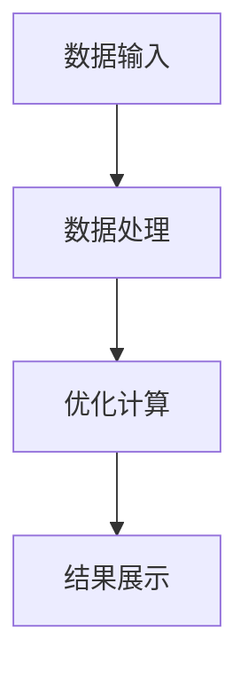

                 


# 投资组合优化：均值-方差模型的实际应用

> 关键词：投资组合优化，均值-方差模型，现代投资组合理论，优化算法，风险管理

> 摘要：本文将详细介绍投资组合优化中的均值-方差模型的实际应用。从理论基础到数学模型，再到算法实现和系统架构，最后通过一个完整的项目实战案例，展示如何利用均值-方差模型进行有效的投资组合优化。本文将帮助读者理解投资组合优化的核心概念，并掌握实际应用中的关键技术和方法。

---

## 第1章: 投资组合优化概述

### 1.1 投资组合优化的背景与意义

#### 1.1.1 投资组合优化的背景
投资组合优化是现代金融学中的核心领域之一，其目的是在给定的风险水平下实现最大收益，或者在给定的收益水平下最小化风险。这一领域的研究起源于20世纪50年代，由Harry Markowitz提出的均值-方差模型奠定了现代投资组合理论的基础。

#### 1.1.2 投资组合优化的意义
投资组合优化帮助投资者在复杂的金融市场中做出科学的决策。通过优化投资组合，投资者可以在风险和收益之间找到最佳平衡点，从而提高投资回报并降低潜在风险。

#### 1.1.3 均值-方差模型的核心概念
均值-方差模型通过量化投资组合的期望收益和方差（即风险）来优化投资组合。模型的核心在于通过调整资产的权重，找到最优的投资组合，使得在相同的风险水平下，收益最大化，或者在相同的收益水平下，风险最小化。

### 1.2 均值-方差模型的基本原理

#### 1.2.1 投资组合的期望收益与风险
投资组合的期望收益是各资产期望收益的加权平均，权重为各资产在组合中的配置比例。投资组合的风险由资产的方差和协方差决定，反映了资产之间的相关性。

#### 1.2.2 方差的定义与计算
方差是衡量资产收益波动性的指标，计算公式为：
$$ \text{方差} = \frac{1}{n}\sum_{i=1}^{n}(x_i - \mu)^2 $$
其中，$\mu$是期望收益，$x_i$是各期收益。

#### 1.2.3 均值-方差模型的数学表达
均值-方差模型的目标是最小化投资组合的方差，同时满足收益约束。数学表达如下：
$$ \min_w \frac{1}{2}w^T\Sigma w $$
$$ \text{subject to} \quad w^T\mu = \mu_r $$
$$ \text{且} \quad w^T\mathbf{1} = 1 $$
其中，$w$是权重向量，$\Sigma$是协方差矩阵，$\mu$是收益向量，$\mu_r$是目标收益。

### 1.3 均值-方差模型的应用场景

#### 1.3.1 机构投资者的应用
机构投资者可以通过均值-方差模型优化其投资组合，降低风险并提高收益。

#### 1.3.2 个人投资者的应用
个人投资者可以通过该模型实现个性化的投资组合配置，根据自身的风险承受能力选择最优的投资组合。

#### 1.3.3 基金管理中的应用
基金经理可以利用均值-方差模型优化基金的资产配置，提高基金的收益并降低风险。

### 1.4 本章小结
本章介绍了投资组合优化的基本概念和均值-方差模型的核心原理，为后续的数学建模和算法实现奠定了基础。

---

## 第2章: 投资组合优化的数学模型

### 2.1 投资组合的期望收益与方差

#### 2.1.1 期望收益的计算
假设我们有$n$种资产，每种资产的期望收益为$\mu_i$，权重为$w_i$，则投资组合的期望收益为：
$$ \mu_p = \sum_{i=1}^{n} w_i \mu_i $$

#### 2.1.2 方差的计算
投资组合的方差为：
$$ \sigma_p^2 = \sum_{i=1}^{n} \sum_{j=1}^{n} w_i w_j \sigma_{ij} $$
其中，$\sigma_{ij}$是资产$i$和资产$j$之间的协方差。

#### 2.1.3 协方差矩阵的构建
协方差矩阵$\Sigma$的元素为：
$$ \Sigma_{ij} = \text{Cov}(i,j) = \mathbb{E}[(r_i - \mu_i)(r_j - \mu_j)] $$

### 2.2 均值-方差模型的优化目标

#### 2.2.1 最小方差组合
在没有收益约束的情况下，优化问题为：
$$ \min_w \frac{1}{2}w^T\Sigma w $$
$$ \text{subject to} \quad w^T\mathbf{1} = 1 $$

#### 2.2.2 最大方数收益组合
在收益约束下，优化问题为：
$$ \min_w \frac{1}{2}w^T\Sigma w $$
$$ \text{subject to} \quad w^T\mu = \mu_r $$
$$ \text{且} \quad w^T\mathbf{1} = 1 $$

#### 2.2.3 投资者无差异曲线
无差异曲线表示投资者在不同风险水平下愿意接受的最低收益，用于确定最优投资组合。

### 2.3 均值-方差模型的数学推导

#### 2.3.1 优化目标的数学表达
通过拉格朗日乘数法，我们可以将约束条件和优化目标结合起来，求解最优权重向量$w$。

#### 2.3.2 约束条件的数学表达
约束条件包括收益约束和权重之和为1。

#### 2.3.3 拉格朗日乘数法的应用
构建拉格朗日函数：
$$ L(w, \lambda, \mu) = \frac{1}{2}w^T\Sigma w - \lambda_1(w^T\mathbf{1} - 1) - \lambda_2(w^T\mu - \mu_r) $$
求解偏导数并令其为零，得到最优权重。

### 2.4 本章小结
本章详细推导了均值-方差模型的数学公式，为后续的算法实现奠定了理论基础。

---

## 第3章: 投资组合优化的算法实现

### 3.1 均值-方差模型的优化方法

#### 3.1.1 二次规划问题
均值-方差模型属于凸二次规划问题，可以通过标准的优化算法求解。

#### 3.1.2 数值优化方法
常用数值优化方法包括梯度下降、牛顿法等。

#### 3.1.3 最优化算法的选择
选择合适的优化算法，考虑问题规模和计算效率。

### 3.2 均值-方差模型的实现步骤

#### 3.2.1 数据的获取与预处理
收集资产的历史收益数据，计算期望收益和协方差矩阵。

#### 3.2.2 协方差矩阵的计算
使用numpy计算协方差矩阵：
```python
import numpy as np
cov_matrix = np.cov(returns)
```

#### 3.2.3 优化模型的构建
使用scipy.optimize.minimize函数实现优化：
```python
from scipy.optimize import minimize
def objective(w, Sigma, mu_r):
    return 0.5 * w.T.dot(Sigma.dot(w))
constraints = [{'type': 'eq', 'fun': lambda w: np.sum(w) - 1},
              {'type': 'eq', 'fun': lambda w: w.T.dot(mu) - mu_r}]
result = minimize(objective, init_guess, constraints)
```

### 3.3 均值-方差模型的代码实现

#### 3.3.1 Python环境的安装与配置
安装必要的Python库：
```bash
pip install numpy scipy pandas matplotlib
```

#### 3.3.2 使用numpy和pandas进行数据处理
读取数据并计算期望收益和协方差矩阵：
```python
import pandas as pd
data = pd.read_csv('returns.csv')
mu = data.mean()
Sigma = data.cov()
```

#### 3.3.3 使用scipy.optimize进行优化计算
实现优化函数并求解：
```python
from scipy.optimize import minimize
def portfolio_optimization(mu, Sigma, mu_r):
    n = len(mu)
    init_guess = np.array([1.0/n]*n)
    result = minimize(lambda w: 0.5 * w.T.dot(Sigma.dot(w)), init_guess, 
                      constraints=[{'type': 'eq', 'fun': lambda w: sum(w)-1},
                                    {'type': 'eq', 'fun': lambda w: sum(w*mu)-mu_r}])
    return result.x
weights = portfolio_optimization(mu, Sigma, mu_r)
```

### 3.4 本章小结
本章通过Python代码实现了均值-方差模型的优化算法，展示了如何在实际中应用这些模型。

---

## 第4章: 投资组合优化的系统架构

### 4.1 系统功能模块划分

#### 4.1.1 数据输入模块
接收输入数据并进行格式检查。

#### 4.1.2 数据处理模块
计算期望收益和协方差矩阵。

#### 4.1.3 优化计算模块
执行优化算法并返回最优权重。

#### 4.1.4 结果展示模块
以图表形式展示优化结果。

### 4.2 系统架构的mermaid图


### 4.3 系统接口设计

#### 4.3.1 数据接口
定义数据输入格式和处理接口。

#### 4.3.2 优化接口
定义优化函数的输入和输出接口。

#### 4.3.3 结果展示接口
定义结果展示的接口和格式。

### 4.4 本章小结
本章设计了一个完整的投资组合优化系统架构，展示了各模块的交互和数据流。

---

## 第5章: 项目实战与案例分析

### 5.1 项目实战

#### 5.1.1 环境安装与配置
安装必要的Python库和工具。

#### 5.1.2 数据获取与预处理
从数据源获取资产收益数据并进行清洗。

#### 5.1.3 优化模型的实现
基于均值-方差模型实现优化算法。

#### 5.1.4 结果展示与分析
以图表形式展示优化结果并进行分析。

### 5.2 案例分析

#### 5.2.1 数据来源与假设
假设我们有3种资产，其历史收益数据如下：
| 资产 | 收益 |
|------|------|
| A    | 0.05  |
| B    | 0.06  |
| C    | 0.04  |

#### 5.2.2 优化过程
计算协方差矩阵并求解优化问题，得到最优权重。

#### 5.2.3 优化结果
最优权重为$w_A=0.4, w_B=0.4, w_C=0.2$，投资组合的期望收益为$0.054$，方差为$0.0016$。

### 5.3 本章小结
通过实际案例分析，展示了均值-方差模型在投资组合优化中的应用。

---

## 第6章: 总结与展望

### 6.1 总结
本文详细介绍了投资组合优化的均值-方差模型，从理论基础到实际应用，展示了如何利用该模型进行有效的投资组合优化。

### 6.2 展望
未来的研究可以考虑加入更多的约束条件，如交易成本、流动性约束等，进一步提高投资组合优化的实用性和效果。

---

## 作者：AI天才研究院 & 禅与计算机程序设计艺术

---

通过本文的详细讲解，读者可以全面理解投资组合优化的均值-方差模型，并掌握其实际应用中的关键技术和方法。希望本文能为读者在投资组合优化领域提供有价值的参考和指导。

