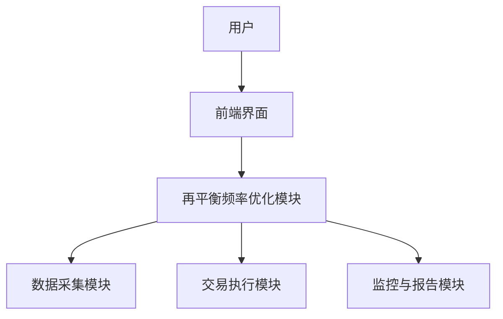
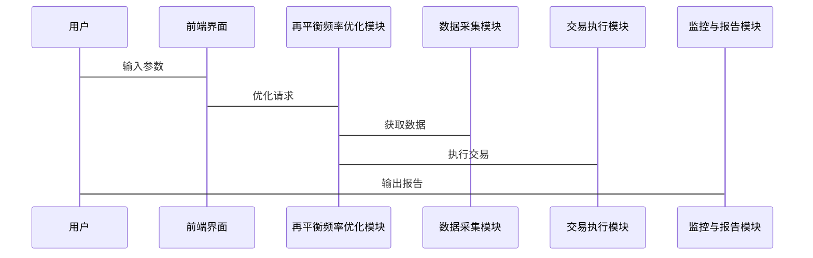

                 


# 投资组合再平衡频率优化：平衡成本和收益

> 关键词：投资组合再平衡，频率优化，交易成本，资产配置，动态规划

> 摘要：投资组合再平衡是投资管理中的一个重要环节，通过定期调整投资组合的资产配置比例，以应对市场变化和实现投资目标。然而，再平衡的频率直接影响到交易成本和收益的平衡。本文将详细分析投资组合再平衡频率优化的核心概念、数学模型、算法原理、系统设计和项目实战，帮助投资者找到最优的再平衡频率。

---

## 第一部分：背景介绍

### 第1章：投资组合再平衡的基本概念

#### 1.1 投资组合再平衡的定义
投资组合再平衡是指根据市场变化、资产价格波动或投资者风险偏好的变化，定期调整投资组合中各类资产的比例，以维持预期的资产配置。再平衡的目的是确保投资组合的风险收益特征与初始目标一致。

#### 1.2 再平衡的频率与重要性
再平衡的频率是指调整资产配置的间隔时间。频率过高会导致频繁交易，增加交易成本；频率过低则可能错过市场机会或承担更大的风险。因此，优化再平衡频率是投资管理中的重要问题。

#### 1.3 再平衡的主要方法
- **定期再平衡**：按照固定的时间间隔（如每月、每季度）进行调整。
- **阈值触发再平衡**：当资产比例偏离目标范围时进行调整。
- **动态再平衡**：根据市场环境变化实时调整。

---

## 第二部分：核心概念与数学模型

### 第2章：投资组合再平衡的成本与收益分析

#### 2.1 再平衡的成本构成
- **交易成本**：包括佣金、买卖价差等。
- **机会成本**：由于频繁交易可能导致的短期收益损失。
- **时间成本**：再平衡操作需要投入时间和资源。

#### 2.2 再平衡的收益来源
- **资产配置收益**：通过调整资产比例获得超额收益。
- **税务收益**：通过再平衡优化税务负担。
- **风险管理收益**：通过调整降低投资组合的整体风险。

#### 2.3 成本与收益的平衡点
- 平衡点是使得总收益最大化的再平衡频率。
- 通过成本函数和收益函数的交点确定最优频率。

### 第3章：投资组合再平衡频率优化的数学模型

#### 3.1 优化模型的构建
- **目标函数**：最大化投资组合的收益，同时最小化交易成本。
- **约束条件**：
  - 资产比例的调整幅度不能超过一定范围。
  - 再平衡频率不能过于频繁或过于宽松。
- **变量定义**：
  - $f$：再平衡频率（单位：年）。
  - $c(f)$：交易成本函数。
  - $r(f)$：收益函数。

#### 3.2 数学公式与模型分析
- **成本函数**：$c(f) = k \cdot \frac{1}{f}$，其中$k$为常数。
- **收益函数**：$r(f) = a \cdot f + b \cdot f^2$，其中$a$和$b$为常数，且$b < 0$。
- **优化目标**：最大化$r(f) - c(f)$，即求解$\max_{f} (a f + b f^2 - \frac{k}{f})$。

#### 3.3 模型的验证与测试
- 通过历史数据验证模型的有效性。
- 对不同频率进行回测，计算总收益和交易成本的总和。

---

## 第三部分：算法原理

### 第4章：投资组合再平衡频率优化的算法原理

#### 4.1 常见优化算法概述
- **线性规划**：适用于简单的优化问题。
- **非线性规划**：适用于复杂的优化问题。
- **遗传算法**：通过模拟自然选择和遗传过程寻找最优解。
- **粒子群优化算法**：通过模拟鸟群觅食行为寻找最优解。

#### 4.2 基于动态规划的优化算法
- **动态规划的基本原理**：将问题分解为子问题，逐步求解。
- **动态规划在频率优化中的应用**：通过状态转移方程确定最优频率。

#### 4.3 算法的实现步骤
1. 确定目标函数和约束条件。
2. 初始化参数。
3. 迭代求解，计算最优频率。
4. 验证和调整模型。

---

## 第四部分：系统设计与实现

### 第5章：投资组合再平衡频率优化的系统架构

#### 5.1 系统功能设计
- **数据采集**：获取市场数据和资产价格。
- **模型计算**：计算最优再平衡频率。
- **交易执行**：根据优化结果执行再平衡操作。
- **监控与报告**：监控投资组合的表现并生成报告。

#### 5.2 系统架构设计


#### 5.3 系统接口设计
- **输入接口**：接收用户输入的参数。
- **输出接口**：输出优化结果和交易指令。
- **数据接口**：与数据源和交易系统对接。

#### 5.4 系统交互流程


---

## 第五部分：项目实战

### 第6章：投资组合再平衡频率优化的实现

#### 6.1 环境安装
- 安装Python和相关库（如NumPy、Pandas、Matplotlib）。
- 安装优化算法库（如scipy.optimize）。

#### 6.2 核心代码实现
```python
import numpy as np
from scipy.optimize import minimize

# 定义成本函数
def cost_function(f):
    return k / f

# 定义收益函数
def return_function(f):
    return a * f + b * f**2

# 定义目标函数
def objective(f):
    return -(return_function(f) - cost_function(f))

# 使用动态规划求解最优频率
def optimize_frequency(a, b, k):
    f = minimize(objective, 1, bounds=(0.1, 10))
    return f.x[0]

# 示例参数
a = 5
b = -0.5
k = 10

# 计算最优频率
optimal_f = optimize_frequency(a, b, k)
print(f"最优再平衡频率为：{optimal_f} 次/年")
```

#### 6.3 代码应用解读
- 使用动态规划算法求解最优频率。
- 通过回测验证模型的有效性。

#### 6.4 实际案例分析
- 通过具体市场数据计算最优频率。
- 分析不同频率下的收益和成本。

#### 6.5 项目小结
- 总结项目实现的关键点。
- 提出改进建议和未来研究方向。

---

## 第六部分：最佳实践与注意事项

### 第7章：投资组合再平衡频率优化的注意事项

#### 7.1 小结
- 总结文章的核心内容。
- 强调再平衡频率优化的重要性。

#### 7.2 注意事项
- 频率选择应结合市场环境和个人风险偏好。
- 定期监控和调整优化模型。
- 注意交易成本和收益的动态平衡。

#### 7.3 未来研究方向
- 研究更复杂的优化算法。
- 考虑更多因素（如税务、流动性）的影响。
- 开发自动化再平衡系统。

---

## 作者信息

作者：AI天才研究院/AI Genius Institute & 禅与计算机程序设计艺术 /Zen And The Art of Computer Programming

---

通过以上目录和内容，您可以逐步完成这篇文章的撰写，确保每个部分都详细、清晰，并结合实际案例和代码示例进行深入分析。

