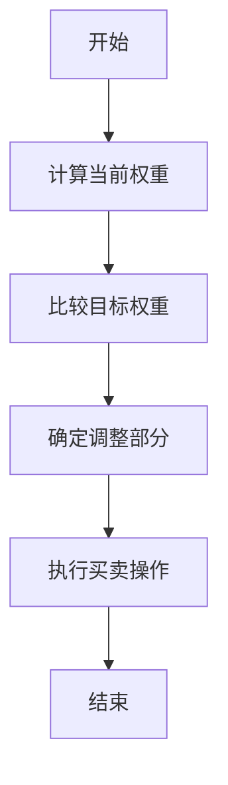
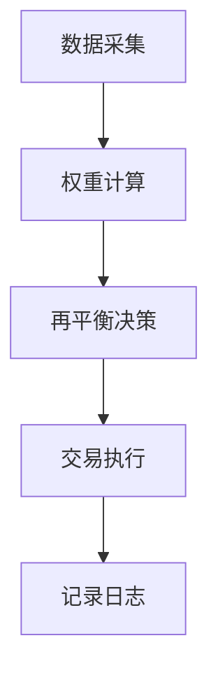

                 


# 投资组合再平衡：维持风险收益目标的关键

> 关键词：投资组合再平衡、风险管理、资产配置、组合优化、动态调整

> 摘要：投资组合再平衡是维持风险收益目标的关键策略。本文详细探讨了投资组合再平衡的核心概念、算法原理、系统设计与实现，以及实际案例分析，帮助读者全面理解并有效应用这一策略。

---

## 第1章：投资组合再平衡概述

### 1.1 投资组合再平衡的基本概念

#### 1.1.1 投资组合的基本概念
投资组合是指将资金分配到不同资产（如股票、债券、房地产等）上的配置方式。通过多样化投资，投资者可以降低风险，同时追求更高的收益。

#### 1.1.2 再平衡的定义与作用
再平衡是指定期调整投资组合的资产配置，使其回到预定的目标资产分配比例。其作用包括：
1. **风险控制**：防止某类资产的过度暴露。
2. **收益优化**：捕捉不同资产的收益机会。
3. **应对市场变化**：适应市场波动，保持组合稳定性。

#### 1.1.3 再平衡的必要性与重要性
市场波动、资产表现差异以及投资者风险偏好的变化，都需要通过再平衡来动态调整资产配置，确保投资目标的实现。

### 1.2 投资组合再平衡的历史发展

#### 1.2.1 传统投资组合管理的演变
早期的投资组合管理注重单一资产配置，随着市场的发展，逐渐引入多资产配置和动态调整的概念。

#### 1.2.2 再平衡策略的起源与发展
再平衡策略起源于20世纪70年代，随着金融理论的发展不断完善，成为现代投资组合管理的重要组成部分。

#### 1.2.3 现代投资组合理论的贡献
现代投资组合理论（MPT）为再平衡提供了坚实的理论基础，强调通过优化资产配置来实现风险与收益的最佳平衡。

### 1.3 投资组合再平衡的应用场景

#### 1.3.1 个人投资中的再平衡
个人投资者可以根据自身风险偏好和财务状况，定期调整资产配置。

#### 1.3.2 机构投资中的再平衡
机构投资者通常采用系统化的再平衡策略，以应对市场的波动和风险。

#### 1.3.3 不同市场环境下的再平衡策略
在牛市、熊市等不同市场环境下，再平衡策略需要灵活调整，以适应市场变化。

### 1.4 投资组合再平衡的边界与外延

#### 1.4.1 再平衡的适用范围
再平衡适用于多种资产配置，但需考虑市场流动性、交易成本等因素。

#### 1.4.2 再平衡的限制与不足
频繁的再平衡可能导致较高的交易成本和税务负担，需权衡利弊。

#### 1.4.3 相关概念的区分与联系
再平衡与资产配置、风险管理等概念密切相关，需区分其应用场景和作用。

### 1.5 本章小结
本章介绍了投资组合再平衡的基本概念、历史发展、应用场景及其边界，为后续内容奠定了基础。

---

## 第2章：投资组合再平衡的理论基础

### 2.1 现代投资组合理论（MPT）

#### 2.1.1 MPT的核心思想
MPT强调通过资产多样化来降低风险，投资组合的收益与风险可以通过优化资产配置来实现最佳平衡。

#### 2.1.2 有效前沿的概念
有效前沿是指在给定风险水平下，能够提供最高收益的所有投资组合的集合。

#### 2.1.3 风险与收益的优化
通过数学模型优化资产权重，使投资组合的风险最小化或收益最大化。

### 2.2 马科维茨投资组合理论

#### 2.2.1 均值-方差模型
马科维茨的均值-方差模型通过优化资产的期望收益和方差，找到最优投资组合。

#### 2.2.2 优化问题的数学表达
目标函数：$$\min_w \sigma^2(w)$$
约束条件：$$w^T \mathbf{1} = 1$$
其中，$$w$$ 是资产权重向量，$$\sigma^2(w)$$ 是组合的方差。

#### 2.2.3 理论与实际的结合
理论模型需要结合实际情况，考虑交易成本、税收等因素。

### 2.3 资产配置与再平衡的关系

#### 2.3.1 资产配置的定义与作用
资产配置是确定各资产在组合中的比例，再平衡则是定期调整以维持这一比例。

#### 2.3.2 再平衡在资产配置中的地位
再平衡是实现长期资产配置目标的重要手段，确保组合始终符合预定策略。

#### 2.3.3 动态资产配置策略
根据市场变化和投资者目标调整资产配置，动态再平衡是其核心方法。

### 2.4 本章小结
本章通过理论分析，阐述了投资组合再平衡的理论基础及其在资产配置中的应用。

---

## 第3章：投资组合再平衡的算法原理

### 3.1 动态再平衡算法

#### 3.1.1 动态再平衡的触发条件
根据预设的时间间隔（如季度）或资产偏离目标比例（如超过5%）触发再平衡。

#### 3.1.2 优化目标的数学模型
目标：$$\min_w \sum_{i=1}^n |w_i - w_i^0|$$
其中，$$w_i^0$$ 是目标权重。

#### 3.1.3 算法步骤
1. 计算当前各资产权重。
2. 比较当前权重与目标权重，确定需要调整的部分。
3. 通过买卖操作调整资产权重，使其接近目标。

#### 3.1.4 mermaid流程图


#### 3.1.5 Python代码示例
```python
def rebalance(weights_current, weights_target):
    # 计算调整后的权重
    diff = weights_target - weights_current
    return weights_target
```

### 3.2 事件驱动再平衡算法

#### 3.2.1 事件驱动的触发机制
根据特定事件（如资产价格大幅波动、市场崩盘）触发再平衡。

#### 3.2.2 事件处理的逻辑流程
1. 检测触发事件。
2. 计算调整后的权重。
3. 执行交易操作。
4. 记录调整日志。

#### 3.2.3 算法实现的代码示例
```python
def event_driven_rebalance(event, weights_current):
    if event == 'market_down':
        weights_target = [0.6, 0.3, 0.1]
    else:
        weights_target = [0.4, 0.5, 0.1]
    return weights_target
```

### 3.3 基于风险指标的再平衡算法

#### 3.3.1 风险指标的选择与计算
使用波动率、VaR、CVaR等指标来衡量风险。

#### 3.3.2 优化问题的数学模型
目标：$$\min_w \text{VaR}(w)$$
约束：$$w^T \mathbf{1} = 1$$

#### 3.3.3 算法步骤
1. 计算各资产的风险指标。
2. 确定需要调整的资产。
3. 调整权重以降低整体风险。

#### 3.3.4 代码实现
```python
def risk_based_rebalance(risk_scores, weights_current):
    # 找出风险最高的资产
    high_risk_asset = np.argmax(risk_scores)
    # 调整权重，降低高风险资产的比例
    weights_target = weights_current.copy()
    weights_target[high_risk_asset] -= 0.1
    return weights_target
```

### 3.4 本章小结
本章详细介绍了动态再平衡、事件驱动再平衡和基于风险指标的再平衡算法，并提供了代码示例。

---

## 第4章：投资组合再平衡的系统设计与实现

### 4.1 问题场景介绍

#### 4.1.1 投资组合管理系统的功能需求
- 计算当前资产权重。
- 比较与目标权重的偏差。
- 执行再平衡交易。

#### 4.1.2 系统的输入与输出
- 输入：当前市场数据、目标权重。
- 输出：调整后的资产配置、交易指令。

### 4.2 系统功能设计

#### 4.2.1 系统功能模块
- 数据采集模块：获取市场数据。
- 权重计算模块：计算当前和目标权重。
- 再平衡决策模块：确定是否需要调整。
- 交易执行模块：执行买卖操作。

#### 4.2.2 系统架构设计


#### 4.2.3 系统接口设计
- 数据接口：获取资产价格、市场数据。
- 交易接口：发送买卖指令。

### 4.3 本章小结
本章从系统设计的角度，详细描述了投资组合再平衡系统的架构和实现。

---

## 第5章：投资组合再平衡的项目实战

### 5.1 环境安装

#### 5.1.1 安装Python环境
安装Python和必要的库（如numpy、pandas、scipy）。

#### 5.1.2 安装金融数据分析库
安装`pandas_datareader`和`pyfolio`等库。

### 5.2 核心代码实现

#### 5.2.1 数据采集
```python
from pandas_datareader import data as pdr
import pandas as pd

def get_market_data(tickers, start, end):
    data = pdr(data_source='yahoo', tickers=tickers, start=start, end=end)
    return data
```

#### 5.2.2 计算当前权重
```python
def calculate_current_weights(prices, initial_investment):
    portfolio_value = initial_investment * prices.iloc[-1]
    current_weights = (prices.iloc[-1] / prices.iloc[-1].sum()) * portfolio_value
    return current_weights
```

#### 5.2.3 再平衡策略
```python
def rebalance_strategy(current_weights, target_weights, tolerance=0.05):
    rebalanced_weights = current_weights.copy()
    for i in range(len(current_weights)):
        if abs(current_weights[i] - target_weights[i]) > tolerance:
            rebalanced_weights[i] = target_weights[i]
    return rebalanced_weights
```

#### 5.2.4 交易执行
```python
def execute Trades(rebalanced_weights, current_weights, account_value):
    trades = {}
    for i in range(len(rebalanced_weights)):
        target = rebalanced_weights[i]
        current = current_weights[i]
        if target > current:
            buys = target - current
            trades[i] = buys
        elif target < current:
            sells = current - target
            trades[i] = -sells
    return trades
```

### 5.3 案例分析

#### 5.3.1 案例背景
假设目标权重为股票60%、债券30%、现金10%。

#### 5.3.2 数据准备
```python
tickers = ['AAPL', 'MSFT', 'GOOGL']
prices = get_market_data(tickers, '2023-01-01', '2023-12-31')
```

#### 5.3.3 计算当前权重
```python
current_weights = calculate_current_weights(prices, 10000)
```

#### 5.3.4 再平衡策略
```python
target_weights = [0.6, 0.3, 0.1]
rebalanced_weights = rebalance_strategy(current_weights, target_weights)
```

#### 5.3.5 执行交易
```python
trades = execute Trades(rebalanced_weights, current_weights, 10000)
```

#### 5.3.6 结果分析
通过比较当前权重和目标权重，执行必要的买卖操作，使组合回到目标配置。

### 5.4 本章小结
本章通过实际案例，展示了投资组合再平衡的完整实现过程。

---

## 第6章：总结与展望

### 6.1 本章总结
投资组合再平衡是维持风险收益目标的关键策略，本文从理论到实践，详细介绍了其核心概念、算法原理和系统实现。

### 6.2 未来展望
随着人工智能和大数据技术的发展，再平衡策略将更加智能化和自动化，投资者需要不断学习和适应新的变化。

### 6.3 最佳实践 tips
1. 定期审视和调整投资组合。
2. 根据市场变化灵活调整策略。
3. 考虑交易成本和税务影响。

### 6.4 小结
投资组合再平衡是投资管理中的重要环节，理解和应用这一策略，能够帮助投资者实现长期稳健的投资回报。

---

## 作者：AI天才研究院/AI Genius Institute & 禅与计算机程序设计艺术 /Zen And The Art of Computer Programming

---

### 总结
本文通过系统性的分析和实践，深入探讨了投资组合再平衡的各个方面，为读者提供了全面而深入的理解和应用指南。无论是个人投资者还是机构投资者，都可以从中获得宝贵的经验和策略。

