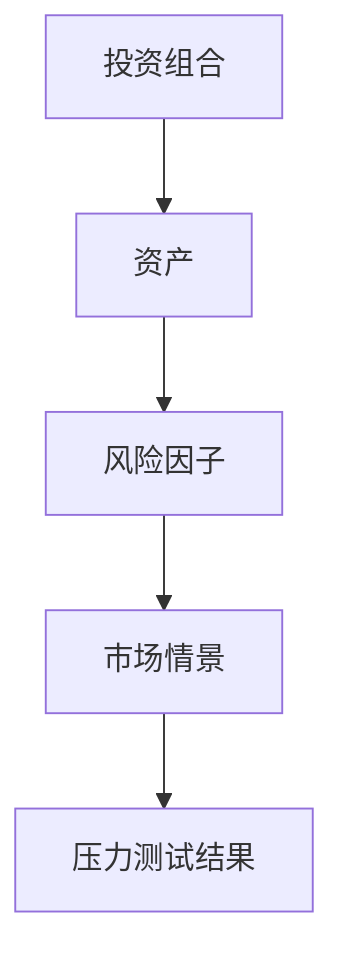
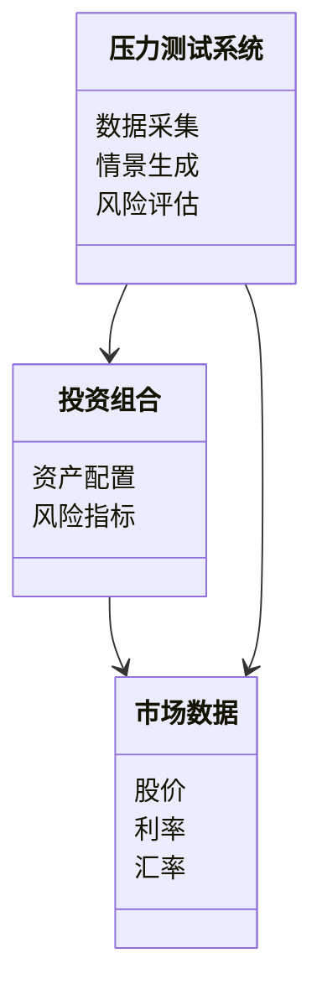

                 


# 投资组合压力测试：评估极端市场情况下的风险

> 关键词：投资组合、压力测试、风险管理、VaR、CVaR、极端市场情况

> 摘要：投资组合压力测试是评估投资组合在极端市场情况下风险的重要工具。本文系统地介绍了压力测试的基本概念、核心算法、系统架构和实际应用。通过详细讲解VaR和CVaR等关键指标，结合实际案例和系统设计，展示了如何构建高效的压力测试系统，并提供了最佳实践建议。

---

## 第一部分: 投资组合压力测试基础

### 第1章: 投资组合压力测试概述

#### 1.1 压力测试的基本概念

##### 1.1.1 什么是压力测试
压力测试是一种评估投资组合在极端市场条件下可能面临的风险的技术方法。它通过模拟极端市场情景，分析投资组合在这些情景下的表现，以识别潜在风险并制定应对策略。

##### 1.1.2 投资组合压力测试的定义
投资组合压力测试是通过设计和实施多种极端市场情景，评估投资组合在这些情景下的损失程度和波动性，以确保投资组合在极端情况下的稳健性。

##### 1.1.3 压力测试的重要性和必要性
压力测试在金融风险管理中至关重要，特别是在金融危机频发的背景下。它帮助投资者和机构识别和量化投资组合在极端情况下的潜在损失，从而制定有效的风险缓解策略。

#### 1.2 压力测试的背景与应用

##### 1.2.1 金融危机与压力测试的起源
2008年金融危机后，压力测试成为金融机构评估和管理风险的重要工具。监管机构要求银行等金融机构定期进行压力测试，确保其在极端市场条件下的稳健性。

##### 1.2.2 投资组合压力测试的场景
- 市场崩盘：如2008年金融危机。
- 利率上升：长期债券价格大幅下跌。
- 汇率波动：外汇投资组合面临汇率风险。
- 黑天鹅事件：如新冠疫情对市场的冲击。

##### 1.2.3 压力测试的边界与外延
压力测试的边界包括市场情景的极端程度、测试的时间范围、测试对象的范围等。外延则涉及压力测试与其他风险管理工具的结合，如VaR、CVaR等。

#### 1.3 投资组合压力测试的核心要素

##### 1.3.1 投资组合的构成与风险特征
投资组合由多种资产构成，每种资产的风险特征（如波动性、相关性）会影响整体组合的风险。

##### 1.3.2 压力测试的指标与目标
- VaR：在特定置信水平下，投资组合的最大可能损失。
- CVaR：在VaR的基础上，考虑超出VaR的平均损失。
- 其他指标：如最大回撤、 Sharpe比率等。

##### 1.3.3 压力测试的流程与方法
压力测试的流程通常包括数据收集、情景设计、模型计算、结果分析和策略制定。

---

### 第2章: 压力测试的核心概念与联系

#### 2.1 压力测试的原理与机制

##### 2.1.1 压力测试的基本原理
压力测试通过模拟极端市场情景，分析投资组合在这些情景下的表现，以评估其风险承受能力。

##### 2.1.2 投资组合风险的传播机制
投资组合中的资产可能受相同风险因素影响，导致风险在资产之间传播，放大整体风险。

##### 2.1.3 压力测试的数学模型
压力测试通常基于统计模型（如蒙特卡洛模拟）和历史数据分析，模拟极端市场情景。

#### 2.2 核心概念对比分析

##### 2.2.1 VaR与CVaR对比
| 特性       | VaR             | CVaR           |
|------------|-----------------|----------------|
| 定义       | 置信水平下的最大损失 | 超出VaR的平均损失 |
| 优点       | 易计算           | 更全面           |
| 缺点       | 未考虑尾部风险    | 计算复杂         |

##### 2.2.2 压力测试与情景分析的联系
压力测试基于情景分析，通过设计极端情景来评估投资组合风险。

##### 2.2.3 压力测试与其他风险管理工具的对比
压力测试与风险价值（VaR）、信用风险评估等工具结合使用，提供更全面的风险管理。

#### 2.3 压力测试的ER实体关系图



---

### 第3章: 压力测试的算法原理

#### 3.1 VaR计算方法

##### 3.1.1 VaR的定义
VaR是在一定置信水平下，投资组合可能遭受的最大损失。例如，95%置信水平下的VaR表示在95%的情况下，投资组合的最大损失不会超过该值。

##### 3.1.2 VaR的计算公式
$$ VaR = \text{quantile}(p) \times \text{标准差} $$

##### 3.1.3 VaR的计算步骤
1. 收集投资组合的历史收益率数据。
2. 计算收益率的分布特征（如均值、标准差）。
3. 确定置信水平（如95%）。
4. 计算对应置信水平下的分位数，得到VaR值。

##### 3.1.4 VaR的示例
假设投资组合收益率的分布符合正态分布，标准差为10%，置信水平为95%。根据正态分布，95%的分位数为1.645标准差，因此VaR为：
$$ VaR = 1.645 \times 10\% = 16.45\% $$

---

## 第二部分: 系统架构与算法实现

### 第4章: 压力测试的系统架构

#### 4.1 问题场景介绍
在极端市场条件下，投资组合可能面临重大损失。压力测试系统需要实时监控市场变化，评估投资组合的风险。

#### 4.2 系统功能设计

##### 4.2.1 领域模型


##### 4.2.2 系统架构设计


##### 4.2.3 系统接口设计
- 输入接口：市场数据输入、投资组合配置。
- 输出接口：压力测试结果、风险报告。

##### 4.2.4 系统交互设计
```mermaid
sequenceDiagram
    participant 客户端
    participant 服务器
    participant 数据库
    客户端 -> 服务器: 请求压力测试
    服务器 -> 数据库: 查询市场数据
    服务器 -> 情景生成模块
    情景生成模块 -> 计算引擎
    计算引擎 -> 结果分析模块
    服务器 -> 客户端: 返回结果
```

#### 4.3 算法实现

##### 4.3.1 数据预处理
```python
import pandas as pd

# 加载市场数据
market_data = pd.read_csv('market.csv')
```

##### 4.3.2 情景生成
```python
import numpy as np

# 生成极端市场情景
def generate_extreme_scenario(data):
    return data.mean() + 3 * data.std()
```

##### 4.3.3 模型计算
```python
import scipy.stats as stats

# 计算VaR
def calculate VaR(data, confidence_level=0.95):
    return stats.norm.ppf(confidence_level) * data.std()
```

##### 4.3.4 结果分析
```python
# 分析压力测试结果
def analyze_results(results):
    print("VaR:", results['VaR'])
    print("CVaR:", results['CVaR'])
```

---

## 第三部分: 项目实战与案例分析

### 第5章: 项目实战

#### 5.1 环境安装
安装必要的Python库：
```bash
pip install numpy pandas scipy matplotlib
```

#### 5.2 系统核心实现

##### 5.2.1 数据采集
```python
import pandas as pd
import numpy as np

market_data = pd.read_csv('market.csv')
market_data.head()
```

##### 5.2.2 情景生成
```python
def generate_extreme_scenario(data):
    return data.mean() + 3 * data.std()
extreme_scenario = generate_extreme_scenario(market_data)
```

##### 5.2.3 模型计算
```python
from scipy.stats import norm

def calculate VaR(data, confidence_level=0.95):
    return norm.ppf(confidence_level) * data.std()

VaR_value = calculate VaR(market_data['returns'])
```

##### 5.2.4 结果分析
```python
print("VaR at 95% confidence level:", VaR_value)
```

#### 5.3 案例分析

##### 5.3.1 案例背景
假设我们有一个包含股票、债券和 commodities的投资组合，需要评估其在市场崩盘情况下的风险。

##### 5.3.2 数据分析
```python
returns = market_data['returns']
print("VaR:", VaR_value)
print("CVaR:", CVaR_value)
```

##### 5.3.3 结果解读
- VaR表示在95%的置信水平下，投资组合的最大损失。
- CVaR表示在超过VaR的情况下的平均损失。

---

## 第四部分: 总结与展望

### 第6章: 总结与展望

#### 6.1 总结
投资组合压力测试是评估极端市场条件下风险的重要工具。本文详细介绍了压力测试的基本概念、算法原理、系统架构和实际应用，提供了完整的压力测试系统设计方案。

#### 6.2 展望
未来，压力测试将在以下几个方面继续发展：
- 更加复杂和动态的市场情景模拟。
- 结合人工智能技术，提高压力测试的智能化水平。
- 针对不同类型的投资组合开发更个性化的压力测试方法。

---

## 第五部分: 最佳实践与注意事项

### 第7章: 最佳实践

#### 7.1 小结
压力测试是风险管理的重要工具，但需要结合实际情况，选择合适的模型和情景。

#### 7.2 注意事项
- 数据质量：确保数据的准确性和完整性。
- 模型选择：根据具体情况选择合适的压力测试模型。
- 情景设计：合理设计极端市场情景，避免过于乐观或悲观。

#### 7.3 拓展阅读
建议读者阅读以下文献，深入了解压力测试的最新发展：
1.《Stress Testing Methods》
2.《Risk Management and Financial Institutions》

---

## 作者：AI天才研究院/AI Genius Institute & 禅与计算机程序设计艺术 /Zen And The Art of Computer Programming

---

感谢您的阅读，希望本文对您理解投资组合压力测试有所帮助！

