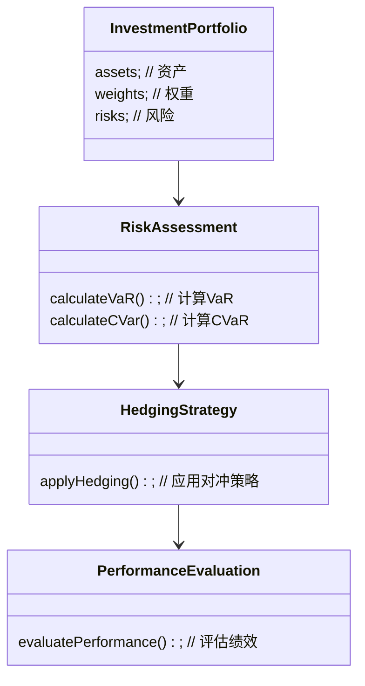
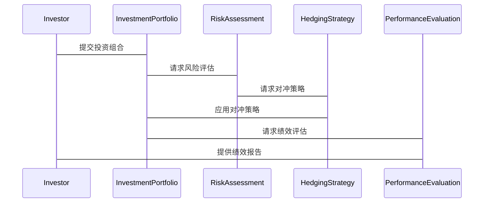

                 


# 投资组合尾部对冲：保护策略在极端市场中的作用

> 关键词：投资组合管理，尾部对冲，风险管理，极端市场，VaR，CVaR

> 摘要：本文探讨了投资组合尾部对冲在极端市场条件下的重要性。通过分析尾部风险的定义、原理和策略，结合数学模型和实际案例，本文详细阐述了如何通过尾部对冲来保护投资组合免受极端市场波动的影响。从理论到实践，本文为投资者提供了一套完整的解决方案。

---

## 第一部分：背景介绍

### 第1章：投资组合尾部对冲的背景与重要性

#### 1.1 问题背景与问题描述
- 1.1.1 投资组合风险管理的重要性  
- 1.1.2 尾部风险的定义与特征  
- 1.1.3 极端市场条件下的投资组合风险  

#### 1.2 尾部对冲的定义与目标
- 1.2.1 尾部对冲的基本概念  
- 1.2.2 尾部对冲的目标与作用  
- 1.2.3 尾部对冲与传统风险管理的对比  

#### 1.3 尾部对冲的边界与外延
- 1.3.1 尾部对冲的适用范围  
- 1.3.2 尾部对冲的局限性  
- 1.3.3 尾部对冲与其他风险管理策略的关系  

#### 1.4 尾部对冲的核心要素与概念结构
- 1.4.1 核心要素的定义  
- 1.4.2 概念结构的分解  
- 1.4.3 核心要素之间的关系  

#### 1.5 本章小结

---

## 第二部分：核心概念与联系

### 第2章：尾部对冲的核心概念与联系

#### 2.1 尾部对冲的原理与机制
- 2.1.1 尾部对冲的基本原理  
- 2.1.2 尾部对冲的实现机制  
- 2.1.3 尾部对冲的数学模型  

#### 2.2 尾部对冲的核心策略
- 2.2.1 保险策略（Insurance Strategies）  
- 2.2.2 对冲策略（Hedging Strategies）  
- 2.2.3 分散策略（Diversification Strategies）  

#### 2.3 尾部对冲的策略对比
- 2.3.1 不同尾部对冲策略的对比  
- 2.3.2 策略选择的依据与标准  
- 2.3.3 策略组合的优化与调整  

#### 2.4 尾部对冲的ER实体关系图
- 2.4.1 实体关系图的定义  
- 2.4.2 实体关系图的构建  
- 2.4.3 实体关系图的分析  

#### 2.5 本章小结

---

## 第三部分：算法原理与数学模型

### 第3章：尾部对冲的算法原理与数学模型

#### 3.1 VaR（在险价值）与CVaR（条件在险价值）模型
- 3.1.1 VaR的定义与计算  
- 3.1.2 CVaR的定义与计算  
- 3.1.3 VaR与CVaR的对比  

#### 3.2 尾部对冲的数学模型
- 3.2.1 投资组合损失的分布模型  
- 3.2.2 尾部对冲的优化模型  
- 3.2.3 基于VaR和CVaR的对冲策略  

#### 3.3 算法流程图与代码实现
- 3.3.1 VaR和CVaR的计算流程图（Mermaid）  
- 3.3.2 Python代码实现  
  ```python
  import numpy as np
  def calculate_var(data, confidence_level):
      sorted_data = np.sort(data)
      var_index = int(len(sorted_data) * (1 - confidence_level))
      return sorted_data[var_index]
  ```

#### 3.4 数学公式解析
- 3.4.1 VaR的计算公式  
- 3.4.2 CVaR的计算公式  

#### 3.5 本章小结

---

## 第四部分：系统分析与架构设计

### 第4章：尾部对冲系统的分析与设计

#### 4.1 问题场景介绍
- 4.1.1 极端市场条件下的投资组合风险  
- 4.1.2 尾部对冲系统的目标  

#### 4.2 系统功能设计
- 4.2.1 风险评估模块  
- 4.2.2 对冲策略选择模块  
- 4.2.3 绩效评估模块  

#### 4.3 领域模型类图（Mermaid）


#### 4.4 系统架构设计
- 4.4.1 分层架构设计  
- 4.4.2 模块间交互关系  

#### 4.5 系统接口设计
- 4.5.1 输入接口  
- 4.5.2 输出接口  

#### 4.6 系统交互序列图（Mermaid）


#### 4.7 本章小结

---

## 第五部分：项目实战

### 第5章：尾部对冲的项目实战

#### 5.1 实际案例分析
- 5.1.1 案例背景  
- 5.1.2 案例分析与对冲策略选择  
- 5.1.3 案例结果与总结  

#### 5.2 环境安装与代码实现
- 5.2.1 环境安装说明  
- 5.2.2 核心代码实现  
  ```python
  import numpy as np
  def calculate_var(data, confidence_level):
      sorted_data = np.sort(data)
      var_index = int(len(sorted_data) * (1 - confidence_level))
      return sorted_data[var_index]
  ```

#### 5.3 代码应用解读与分析
- 5.3.1 代码功能解读  
- 5.3.2 代码运行结果分析  

#### 5.4 案例详细解读与剖析
- 5.4.1 案例中的尾部风险识别  
- 5.4.2 尾部对冲策略的实施效果  
- 5.4.3 对冲策略的调整与优化  

#### 5.5 本章小结

---

## 第六部分：最佳实践与总结

### 第6章：尾部对冲的最佳实践与注意事项

#### 6.1 最佳实践
- 6.1.1 理解尾部风险的本质  
- 6.1.2 选择合适的对冲策略  
- 6.1.3 定期评估与调整  

#### 6.2 小结与总结
- 6.2.1 本文的主要内容回顾  
- 6.2.2 尾部对冲在投资组合管理中的重要性  

#### 6.3 注意事项
- 6.3.1 尾部对冲的局限性  
- 6.3.2 实施尾部对冲的注意事项  

#### 6.4 拓展阅读
- 6.4.1 推荐阅读的相关书籍与论文  
- 6.4.2 未来的研究方向  

---

## 作者：AI天才研究院 & 禅与计算机程序设计艺术

