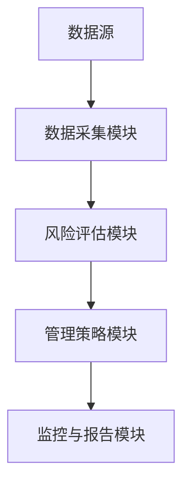

                 

# 投资组合流动性管理：在市场压力下保持灵活性

> 关键词：投资组合流动性管理，市场压力，流动性风险，量化方法，系统架构

> 摘要：本文深入探讨了投资组合流动性管理的核心概念、风险识别与评估方法、管理策略，以及在市场压力下的应对措施。通过结合数学模型和系统架构设计，本文为投资组合管理者提供了全面的理论指导和实践方案。

---

## 第1章: 投资组合流动性管理的基本概念

### 1.1 流动性管理的定义与重要性

#### 1.1.1 流动性管理的定义
流动性管理是指在金融市场中，通过合理配置资产和资金，确保在不同市场条件下能够及时满足资金需求，同时保持资产的流动性和安全性。其核心目标是在市场波动和不确定性中，平衡收益与风险。

#### 1.1.2 流动性管理的重要性
- **市场稳定性**：流动性管理有助于维持市场的稳定运行，防止资产价格的剧烈波动。
- **风险管理**：通过有效的流动性管理，可以降低投资组合在市场压力下的风险暴露。
- **投资收益**：合理的流动性管理能够在市场机会出现时，迅速调整资产配置，抓住潜在收益。

#### 1.1.3 流动性管理的核心目标
- 确保投资组合在需要时能够快速变现。
- 维持资产的市场价值，避免因流动性不足导致的损失。
- 在市场压力下，保持投资组合的灵活性和稳定性。

---

### 1.2 投资组合流动性管理的背景

#### 1.2.1 金融市场的发展与流动性需求
随着金融市场的快速发展，投资者对流动性的需求日益增加。尤其是在全球化的背景下，资本市场的波动性和复杂性显著增加，流动性管理成为投资者关注的核心问题。

#### 1.2.2 投资组合流动性管理的演变
- **传统方法**：基于历史数据和简单比率分析的流动性管理。
- **现代方法**：结合数学模型和实时数据的动态流动性管理。

#### 1.2.3 当前市场环境下的流动性挑战
- **低利率环境**：低利率可能导致资产流动性下降。
- **市场波动**：全球金融危机和地缘政治风险加剧了流动性管理的难度。
- **复杂资产类别**：包括衍生品和另类资产的多样化投资组合增加了流动性管理的复杂性。

---

## 第2章: 流动性风险的识别与评估

### 2.1 流动性风险的来源

#### 2.1.1 市场风险
市场风险是指由于市场价格波动导致资产流动性下降的风险。例如，市场恐慌可能导致资产难以变现。

#### 2.1.2 信用风险
信用风险是指交易对手或发行人违约导致的流动性风险。例如，债券发行人违约可能影响债券的流动性。

#### 2.1.3 结构性风险
结构性风险是指金融体系中的结构性问题导致的系统性流动性风险。例如，影子银行体系的流动性问题可能影响整个金融市场的稳定性。

---

### 2.2 流动性风险的评估方法

#### 2.2.1 流动性比率分析
流动性比率是衡量资产流动性的重要指标，常用的比率包括：
- **流动比率（Current Ratio）**：流动资产与流动负债的比率。
- **速动比率（Quick Ratio）**：流动资产减去存货与流动负债的比率。
- **现金比率（Cash Ratio）**：现金与流动负债的比率。

#### 2.2.2 资金缺口分析
资金缺口分析是通过预测未来资金需求和可用资金，评估流动性风险的方法。公式如下：

$$
\text{资金缺口} = \text{未来资金需求} - \text{可用资金}
$$

#### 2.2.3 压力测试
压力测试是一种模拟极端市场条件下的流动性风险评估方法。例如，假设市场下跌20%，评估投资组合的变现能力。

---

### 2.3 流动性风险的案例分析

#### 2.3.1 历史案例回顾
例如，2008年全球金融危机中，许多金融机构因流动性不足而陷入困境。

#### 2.3.2 案例分析方法
通过具体案例分析，总结流动性风险的来源、影响和应对策略。

#### 2.3.3 案例启示
从历史案例中吸取教训，优化流动性管理策略，提高抗风险能力。

---

## 第3章: 主动流动性管理策略

### 3.1 主动流动性管理的定义

#### 3.1.1 主动管理的核心理念
主动流动性管理是指根据市场变化和投资组合的需求，主动调整资产配置和资金分配，以优化流动性。

#### 3.1.2 主动管理与被动管理的区别
- **主动管理**：积极调整资产配置，应对市场变化。
- **被动管理**：维持固定资产配置，较少调整。

#### 3.1.3 主动管理的优势与挑战
- **优势**：能够快速响应市场变化，捕捉市场机会。
- **挑战**：需要高度的专业知识和实时市场数据支持。

---

### 3.2 主动流动性管理的实施步骤

#### 3.2.1 确定流动性目标
根据投资组合的目标和市场环境，确定流动性管理的具体目标，例如：
- 确保投资组合在特定时间内的流动性需求。
- 最小化流动性管理成本。

#### 3.2.2 制定流动性管理计划
制定详细的流动性管理计划，包括：
- 资产配置策略。
- 资金分配计划。
- 监控和调整机制。

#### 3.2.3 实施与监控
- 实施流动性管理计划。
- 定期监控市场变化和投资组合的流动性状况。
- 根据需要调整管理策略。

---

## 第4章: 被动流动性管理策略

### 4.1 被动流动性管理的定义

#### 4.1.1 被动管理的核心理念
被动流动性管理是指维持固定的资产配置和资金分配，较少调整以应对市场变化。

#### 4.1.2 被动管理的适用场景
- **稳定市场环境**：市场波动较小，流动性需求稳定。
- **长期投资策略**：投资期限较长，流动性需求较低。

#### 4.1.3 被动管理的优缺点
- **优点**：简单易行，管理成本低。
- **缺点**：灵活性差，难以应对市场波动。

---

### 4.2 被动流动性管理的实施步骤

#### 4.2.1 确定被动管理的范围
根据投资组合的目标和市场环境，确定被动管理的范围和资产类别。

#### 4.2.2 制定被动管理计划
制定详细的被动管理计划，包括：
- 固定的资产配置比例。
- 定期的资产再平衡机制。

#### 4.2.3 实施与监控
- 实施被动管理计划。
- 定期监控市场变化和投资组合的流动性状况。
- 根据需要调整管理策略。

---

## 第5章: 数学模型与量化方法

### 5.1 流动性风险的量化指标

#### 5.1.1 流动性比率分析
通过流动性比率分析，量化投资组合的流动性状况。

#### 5.1.2 资金缺口分析
通过资金缺口分析，量化流动性风险的具体数值。

#### 5.1.3 压力测试
通过压力测试，量化投资组合在极端市场条件下的流动性风险。

---

### 5.2 流动性管理的数学模型

#### 5.2.1 流动性风险模型
流动性风险模型用于量化投资组合在不同市场条件下的流动性风险。例如：

$$
\text{流动性风险} = \text{市场波动性} \times \text{资产流动性}
$$

#### 5.2.2 资金分配模型
资金分配模型用于优化资金在不同资产类别之间的分配。例如：

$$
\text{最优资金分配} = \argmin_{w} \left( \text{流动性风险} + \text{收益波动性} \right)
$$

---

### 5.3 流动性管理的案例分析

#### 5.3.1 案例介绍
通过具体案例，展示数学模型在流动性管理中的应用。

#### 5.3.2 数据处理与分析
通过数据处理与分析，验证数学模型的有效性。

#### 5.3.3 模型优化
根据实际应用结果，优化数学模型，提高其准确性和实用性。

---

## 第6章: 系统架构与实施方案

### 6.1 系统架构设计

#### 6.1.1 系统功能模块
- 数据采集模块。
- 风险评估模块。
- 管理策略模块。
- 监控与报告模块。

#### 6.1.2 系统架构图
使用Mermaid图展示系统架构设计。

---

### 6.2 系统实施步骤

#### 6.2.1 环境配置
- 安装必要的软件和工具。
- 配置数据源和接口。

#### 6.2.2 数据处理
- 数据清洗与预处理。
- 数据存储与管理。

#### 6.2.3 模型实现
- 实现流动性风险模型。
- 实现资金分配模型。

---

### 6.3 系统监控与优化

#### 6.3.1 监控机制
- 实时监控市场变化。
- 定期评估模型性能。

#### 6.3.2 优化策略
- 根据监控结果优化模型参数。
- 根据市场变化调整管理策略。

---

## 第7章: 项目实战与总结

### 7.1 项目实战

#### 7.1.1 环境配置
- 安装Python和相关库。
- 数据源获取与处理。

#### 7.1.2 核心实现
- 实现流动性风险模型。
- 实现资金分配模型。

#### 7.1.3 结果分析
- 分析模型输出结果。
- 总结经验与教训。

---

### 7.2 总结与展望

#### 7.2.1 总结
- 回顾全文内容。
- 总结主要观点和方法。

#### 7.2.2 展望
- 未来的研究方向。
- 流动性管理的未来发展。

---

## 作者：AI天才研究院 & 禅与计算机程序设计艺术

---

通过以上目录结构，文章将详细探讨投资组合流动性管理的核心概念、风险识别与评估方法、管理策略，以及在市场压力下的应对措施。通过结合数学模型和系统架构设计，文章为投资组合管理者提供了全面的理论指导和实践方案。

