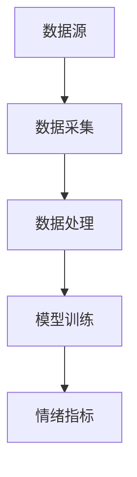
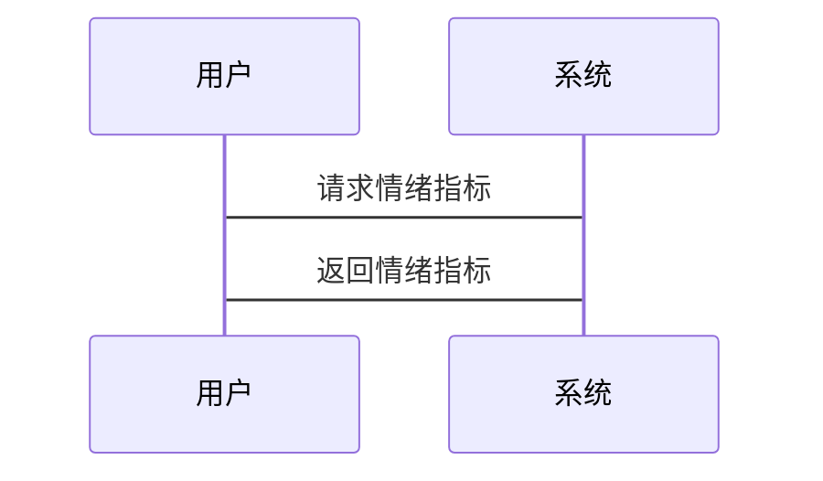

                 


# 投资者情绪指标：市场心理学的量化应用

> 关键词：投资者情绪，情绪指标，市场心理学，量化分析，机器学习，金融数据

> 摘要：本文探讨了投资者情绪指标在金融市场中的应用，通过量化分析投资者情绪，结合市场心理学理论，构建情绪指标模型，并通过实际案例分析展示了其在投资决策中的价值。文章从情绪指标的构建、算法原理、系统设计到项目实战，详细阐述了投资者情绪指标的量化应用过程。

---

## 第一部分: 投资者情绪指标的基础

### 第1章: 投资者情绪概述

#### 1.1 投资者情绪的定义与背景

投资者情绪（Investor Sentiment）是指市场参与者在特定市场环境下的心理状态，反映了他们对市场的看法和预期。情绪指标通过量化这些情绪，帮助投资者和分析师更好地理解市场行为。

**1.1.1 投资者情绪的定义**  
投资者情绪是投资者对市场前景的心理评估，通常表现为乐观或悲观。情绪指标通过量化这些情绪，提供了一个衡量市场情绪的工具。

**1.1.2 投资者情绪的背景与重要性**  
市场情绪是影响金融市场波动的重要因素。投资者情绪的变化会导致市场行为的改变，进而影响资产价格的波动。

**1.1.3 投资者情绪与市场波动的关系**  
乐观情绪通常会导致资产价格上涨，而悲观情绪则会导致价格下跌。情绪指标可以帮助投资者预测市场的短期波动。

---

#### 1.2 投资者情绪指标的核心概念

**1.2.1 情绪指标的分类**  
情绪指标可以分为文本情绪指标、交易情绪指标和混合情绪指标。文本情绪指标基于新闻和社交媒体数据，交易情绪指标基于交易行为数据，混合情绪指标结合了文本和交易数据。

**1.2.2 情绪指标的量化方法**  
情绪指标可以通过标准化的方法进行量化，例如将情绪分为正面、中性和负面三种，并计算每种情绪的比例。

**1.2.3 情绪指标的市场应用**  
情绪指标可以用于市场预测、风险管理等领域。投资者可以通过情绪指标来辅助决策，避免情绪化交易。

---

## 第二部分: 投资者情绪指标的构建与量化

### 第3章: 投资者情绪数据的采集与预处理

#### 3.1 数据来源与采集方法

**3.1.1 市场新闻与媒体数据**  
新闻媒体是情绪指标的重要数据来源。通过分析新闻标题和内容，可以提取市场情绪信息。

**3.1.2 社交媒体数据**  
社交媒体上的用户评论和帖子反映了市场参与者的实时情绪。通过爬取和分析这些数据，可以构建情绪指标。

**3.1.3 交易数据与市场情绪**  
交易数据，如成交量和价格波动，也可以反映市场情绪。例如，成交量的突然增加可能表明市场情绪高涨。

---

#### 3.2 数据预处理与清洗

**3.2.1 数据清洗方法**  
数据清洗包括去除噪声数据、处理缺失值和异常值。例如，社交媒体数据中可能包含大量无关信息，需要进行清洗。

**3.2.2 数据标准化与归一化**  
标准化和归一化处理是为了消除数据量纲的影响，使数据具有可比性。例如，将情绪评分从0-100标准化为0-1。

**3.2.3 数据特征提取**  
特征提取是将原始数据转化为有用的特征，例如从文本中提取情感关键词。

---

### 第4章: 投资者情绪特征的提取与分析

#### 4.1 情绪特征提取方法

**4.1.1 文本挖掘与情感分析**  
文本挖掘技术可以提取文本中的情感信息，例如使用自然语言处理（NLP）技术对新闻标题进行情感分类。

**4.1.2 市场情绪的统计分析**  
通过统计分析，可以计算市场情绪的平均值、标准差等指标，反映市场的整体情绪状态。

**4.1.3 时间序列分析**  
时间序列分析可以揭示市场情绪的变化趋势，例如使用ARIMA模型预测未来的情绪状态。

---

#### 4.2 情绪指标的构建与计算

**4.2.1 情绪指数的构建方法**  
情绪指数可以通过加权平均的方法，将不同来源的情绪指标结合起来，形成一个综合的情绪指数。

**4.2.2 情绪指标的计算公式**  
例如，情绪指数可以表示为：  
$$ E = \sum_{i=1}^{n} w_i \times S_i $$  
其中，\( w_i \) 是第 \( i \) 个情绪指标的权重，\( S_i \) 是第 \( i \) 个情绪指标的值。

**4.2.3 情绪指标的验证与评估**  
验证情绪指标的有效性，可以通过回测分析，评估其在预测市场波动中的表现。

---

### 第5章: 投资者情绪模型的建立与优化

#### 5.1 情绪模型的构建原理

**5.1.1 情绪模型的基本框架**  
情绪模型通常包括数据输入、特征提取、模型训练和结果输出四个部分。

**5.1.2 情绪模型的输入与输出**  
输入可以是文本数据或交易数据，输出是市场情绪指标或预测结果。

**5.1.3 情绪模型的训练与优化**  
通过机器学习算法，如支持向量机（SVM）和随机森林（Random Forest），可以训练情绪模型，并通过交叉验证优化模型性能。

---

#### 5.2 常见的情绪分析算法

**5.2.1 基于机器学习的情绪分类**  
使用SVM和随机森林等算法，对文本数据进行情绪分类，例如将文本分为正面、中性和负面。

**5.2.2 基于深度学习的情绪分析**  
使用LSTM和Transformer等深度学习模型，可以更准确地捕捉文本中的情感信息。

**5.2.3 情感网络与注意力机制**  
通过情感网络和注意力机制，可以更好地理解文本中的情感信息，例如在情感分类任务中，注意力机制可以聚焦于关键词。

---

### 第6章: 投资者情绪指标的系统架构与实现

#### 6.1 系统架构设计

**6.1.1 系统功能模块划分**  
系统通常包括数据采集、数据处理、模型训练、结果输出等功能模块。

**6.1.2 系统数据流设计**  
数据从数据源输入，经过预处理和特征提取后，进入模型训练模块，最后输出情绪指标。

**6.1.3 系统架构图（Mermaid）**  


---

#### 6.2 系统接口设计

**6.2.1 数据接口规范**  
定义数据接口的输入和输出格式，例如使用JSON格式传输数据。

**6.2.2 API设计与实现**  
设计API接口，例如提供获取情绪指标的API，接口地址为`/api/sentiment`。

**6.2.3 接口测试与验证**  
通过单元测试和集成测试，验证接口的正确性和稳定性。

---

#### 6.3 系统交互流程设计

**6.3.1 系统交互流程图（Mermaid）**  


---

## 第三部分: 投资者情绪指标的实战与应用

### 第7章: 投资者情绪指标的项目实战

#### 7.1 项目背景与目标

**7.1.1 项目背景**  
本项目旨在构建一个投资者情绪指标系统，帮助投资者和分析师更好地理解市场情绪。

**7.1.2 项目目标**  
通过量化分析投资者情绪，构建情绪指标模型，并验证其在实际投资中的应用价值。

---

#### 7.2 项目环境与工具安装

**7.2.1 项目环境**  
推荐使用Python编程语言，安装必要的库，例如Numpy、Pandas、Scikit-learn和TensorFlow。

**7.2.2 工具安装**  
安装Python和相关库，例如：
```bash
pip install numpy pandas scikit-learn tensorflow
```

---

#### 7.3 核心实现代码

**7.3.1 数据采集与预处理代码**  
```python
import pandas as pd
from sklearn.model_selection import train_test_split

# 数据采集
data = pd.read_csv('market_news.csv')
# 数据预处理
data_cleaned = data.dropna()
```

**7.3.2 情绪模型训练代码**  
```python
from sklearn.svm import SVC
from sklearn.metrics import accuracy_score

X_train, X_test, y_train, y_test = train_test_split(data_cleaned.drop('sentiment', axis=1), data_cleaned['sentiment'])
model = SVC()
model.fit(X_train, y_train)
y_pred = model.predict(X_test)
print('准确率:', accuracy_score(y_test, y_pred))
```

---

#### 7.4 案例分析与结果解读

**7.4.1 案例分析**  
以股票市场为例，分析情绪指标对股价波动的预测能力。

**7.4.2 结果解读**  
通过回测分析，验证情绪指标在实际投资中的表现，例如计算情绪指标与实际股价波动的相关性。

---

## 第四部分: 总结与展望

### 第8章: 总结与展望

#### 8.1 投资者情绪指标的总结

**8.1.1 最佳实践 tips**  
- 数据采集要全面，尽量覆盖多种数据源。
- 模型选择要根据具体任务需求，尝试不同的算法。
- 定期更新模型，以适应市场环境的变化。

**8.1.2 小结**  
投资者情绪指标是一种有效的市场工具，通过量化分析投资者情绪，可以帮助投资者和分析师更好地理解市场行为。

**8.1.3 注意事项**  
情绪指标只是辅助工具，不能完全依赖它进行投资决策。

---

#### 8.2 投资者情绪指标的展望

**8.2.1 情绪指标的未来发展**  
随着人工智能技术的进步，情绪指标将更加智能化和精准化。

**8.2.2 情绪指标的应用拓展**  
情绪指标可以应用于更多领域，例如企业舆情分析和风险管理。

---

## 作者信息

作者：AI天才研究院/AI Genius Institute & 禅与计算机程序设计艺术 /Zen And The Art of Computer Programming

