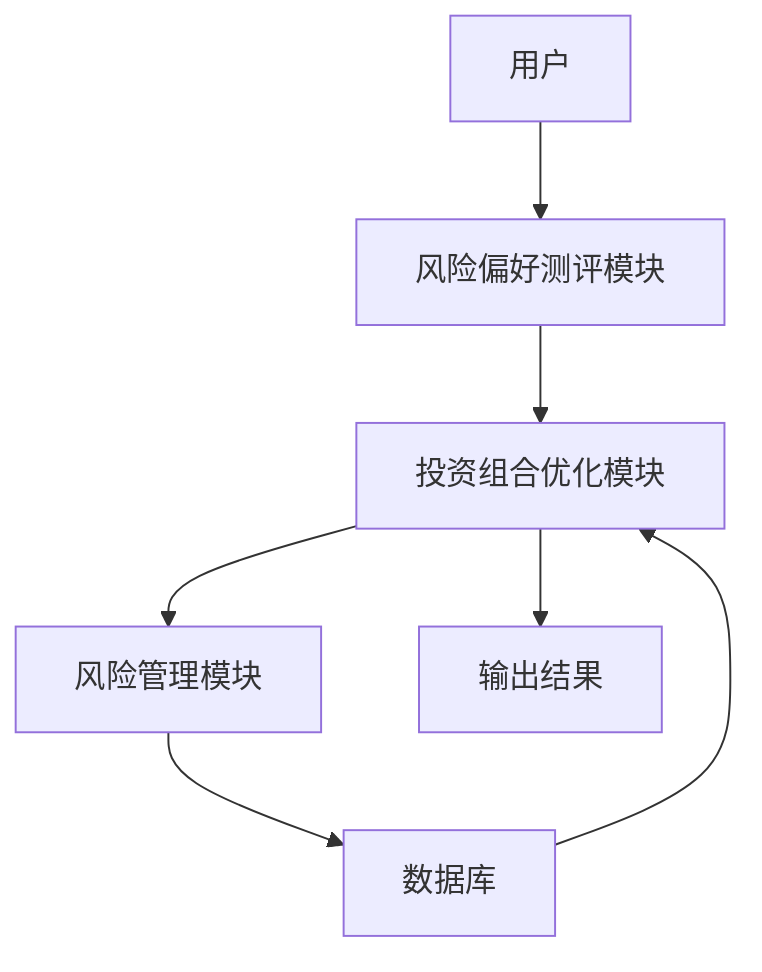

                 


# 《投资者风险偏好测量：个性化投资组合构建》

## 关键词：
投资者风险偏好, 个性化投资组合, 投资组合构建, 风险管理, 金融技术, 投资策略

## 摘要：
本文系统地探讨了投资者风险偏好测量及其在个性化投资组合构建中的应用。通过分析现代投资组合理论和前景理论，本文提出了基于风险偏好的投资组合优化模型，并结合实际案例展示了如何利用技术手段实现个性化的投资组合管理。文章内容涵盖风险偏好测量的理论基础、数学模型、算法实现、系统设计以及实证分析，旨在为投资者和金融技术人员提供理论支持和实践指导。

---

## 第5章: 个性化投资组合的构建与优化

### 5.1 风险偏好与投资组合构建的关系
#### 5.1.1 风险偏好对投资组合配置的影响
- 风险厌恶系数决定了投资者在不同风险水平下的资产配置比例。
- 风险偏好强的投资者更倾向于选择高风险高回报的资产，而风险厌恶的投资者则更倾向于低风险低回报的资产。

#### 5.1.2 风险偏好与投资组合有效前沿的结合
- 有效前沿是基于风险偏好调整后的投资组合可能的收益与风险的最优组合。
- 通过调整风险厌恶系数，投资者可以在有效前沿上找到最适合自己的投资组合。

#### 5.1.3 风险偏好与投资组合再平衡
- 风险偏好随市场环境和个人财务状况变化而调整，投资组合需要定期再平衡以适应新的风险偏好。

### 5.2 个性化投资组合的构建步骤
#### 5.2.1 确定投资者的风险偏好
- 使用风险偏好测量模型（如CRRA模型）评估投资者的风险厌恶系数。

#### 5.2.2 数据收集与处理
- 收集历史资产回报数据，计算各资产的风险和收益指标（如方差、期望收益）。

#### 5.2.3 构建投资组合模型
- 使用二次规划算法求解最优投资组合，目标是最小化风险或最大化收益，约束条件是风险偏好和资产配置比例。

#### 5.2.4 优化与验证
- 通过历史回测验证投资组合的收益与风险是否符合预期。
- 调整模型参数，确保投资组合在不同市场条件下的稳健性。

### 5.3 投资组合优化的数学模型
#### 5.3.1 基于CRRA模型的优化目标
$$ \min_w \frac{1}{2} w^T \Sigma w $$
$$ \text{subject to} \quad \mathbb{E}[R_w] = \mu $$

其中，$w$ 是资产配置权重，$\Sigma$ 是资产收益的协方差矩阵，$\mu$ 是预期收益。

#### 5.3.2 基于风险中性的概率加权模型
$$ \max_w \mathbb{E}[R_w]^{'} $$
$$ \text{subject to} \quad \mathbb{E}[R_w] = \mu $$

其中，$R_w^{'}$ 是根据风险偏好加权后的预期收益。

#### 5.3.3 算法实现
- 使用Python优化库（如scipy.optimize）实现投资组合优化。
- 示例代码如下：

```python
import numpy as np
from scipy.optimize import minimize

# 示例数据：资产收益和协方差矩阵
n_assets = 3
mu = np.array([0.1, 0.15, 0.05])  # 预期收益
Sigma = np.array([[0.16, 0.05, 0.02],
                  [0.05, 0.20, 0.01],
                  [0.02, 0.01, 0.10]])

def portfolio_variance(weights, Sigma):
    return np.dot(weights.T, np.dot(Sigma, weights))

# 目标函数：最小化方差，约束条件为预期收益固定
cons = ({'type': 'eq', 'fun': lambda w: np.sum(w) - 1.0},
        {'type': 'eq', 'fun': lambda w: np.dot(mu, w) - 0.12})

bounds = [(0, 1) for _ in range(n_assets)]

result = minimize(portfolio_variance, np.ones(n_assets)/n_assets, 
                 constraints=cons, bounds=bounds)

print("最优权重：", result.x)
print("最优方差：", result.fun)
```

---

## 第6章: 投资者教育与风险管理

### 6.1 投资者教育的重要性
#### 6.1.1 风险偏好评估的必要性
- 帮助投资者正确认识自身风险承受能力。
- 避免盲目跟风或过度冒险。

#### 6.1.2 风险教育与投资决策
- 教导投资者如何根据风险偏好选择合适的投资策略。
- 强调长期投资和分散投资的重要性。

### 6.2 风险偏好评估与管理
#### 6.2.1 风险偏好评估工具
- 使用问卷调查结合数学模型评估风险偏好。
- 通过历史交易行为分析投资者的实际风险偏好。

#### 6.2.2 风险管理策略
- 设置止损点，控制最大亏损比例。
- 定期评估投资组合的风险敞口，及时调整配置。

### 6.3 投资者教育的技术手段
#### 6.3.1 在线风险偏好测评系统
- 使用交互式界面和算法评估投资者风险偏好。
- 提供个性化的投资建议和风险提示。

#### 6.3.2 教育内容与技术结合
- 利用虚拟现实（VR）模拟投资场景，增强投资者体验。
- 通过区块链技术确保测评数据的透明性和不可篡改性。

---

## 第7章: 系统实现与技术应用

### 7.1 系统架构设计
#### 7.1.1 系统功能模块
- 风险偏好测评模块：收集投资者信息，评估风险偏好。
- 投资组合优化模块：基于风险偏好构建最优投资组合。
- 风险管理模块：实时监控投资组合风险，提供调整建议。

#### 7.1.2 系统架构图


### 7.2 数据采集与处理
#### 7.2.1 数据来源
- 历史市场数据：如股票指数、债券收益率。
- 问卷调查数据：投资者的基本信息和风险偏好。

#### 7.2.2 数据处理流程
- 清洗数据，处理缺失值和异常值。
- 标准化数据，确保不同资产的收益和风险指标可比。

### 7.3 系统实现
#### 7.3.1 系统核心代码
```python
import pandas as pd
import numpy as np
from sklearn.preprocessing import StandardScaler

# 数据预处理
data = pd.read_csv('market_data.csv')
scaler = StandardScaler()
scaled_data = scaler.fit_transform(data)
```

#### 7.3.2 系统接口设计
- API接口：提供风险偏好测评和投资组合优化的RESTful API。
- 数据接口：与第三方数据源（如Yahoo Finance）对接，获取实时市场数据。

---

## 第8章: 案例分析与实证研究

### 8.1 案例分析
#### 8.1.1 案例背景
- 假设一个中等风险偏好的投资者，目标是构建一个包含股票、债券和黄金的投资组合。

#### 8.1.2 数据分析与模型应用
- 使用历史数据计算各资产的期望收益和风险。
- 应用CRRA模型优化投资组合，得到各资产的配置权重。

#### 8.1.3 投资组合表现
- 计算投资组合的历史收益与风险，对比不同风险偏好的投资组合表现。

### 8.2 实证研究
#### 8.2.1 数据来源与研究方法
- 使用2010-2020年的市场数据，验证模型的有效性。

#### 8.2.2 结果分析
- 验证基于风险偏好的投资组合是否在不同市场条件下表现稳健。

#### 8.2.3 研究结论
- 风险偏好测量在投资组合构建中的重要性得到实证支持。
- 不同风险偏好的投资者在市场波动中表现出不同的投资组合调整需求。

---

## 第9章: 结论与展望

### 9.1 结论
- 投资者风险偏好是个性化投资组合构建的核心要素。
- 基于风险偏好的投资组合优化模型能够有效满足投资者的需求。
- 技术手段的应用显著提升了投资组合管理的效率和准确性。

### 9.2 展望
- 结合机器学习技术，动态调整风险偏好模型。
- 探索更多先进技术（如区块链和人工智能）在投资组合管理中的应用。

---

## 参考文献
1. Markowitz, H. (1952). Portfolio Selection. Journal of Finance.
2. Kahneman, D., & Tversky, A. (1979). Prospect Theory: An Analysis of Decision under Risk. Econometrica.
3. Campbell, J. Y., & Viceira, L. M. (2002). Consumption and the Market Portfolio. Journal of Financial Economics.
4. Ang, A. (2008). Asset Pricing and Portfolio Construction. Princeton University Press.

---

## 附录
- 附录A: 风险偏好测评问卷示例
- 附录B: 投资组合优化算法的详细推导
- 附录C: 系统架构设计图
- 附录D: 数据预处理代码示例

---

**作者：AI天才研究院/AI Genius Institute & 禅与计算机程序设计艺术 /Zen And The Art of Computer Programming**

---

以上是完整的技术博客文章，涵盖了投资者风险偏好测量和个性化投资组合构建的各个方面。文章从理论到实践，结合数学模型、算法实现和系统设计，为读者提供了全面的指导和深入的分析。

