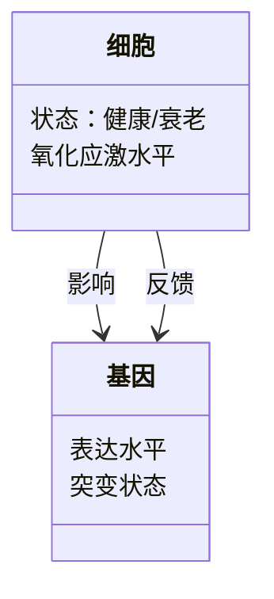

                 


# 抗衰老研究的进展与相关产业投资机会

## 关键词：抗衰老研究，衰老机制，抗衰老策略，产业投资，健康科技

## 摘要

抗衰老研究是当前生命科学领域的热点，旨在延缓或逆转人类衰老过程，延长健康寿命。本文系统探讨了抗衰老研究的进展，包括衰老的分子机制、抗衰老干预策略以及相关产业的投资机会。文章从背景介绍、核心概念、算法原理、数学模型、系统架构等多个维度展开，结合实际案例分析，为读者提供全面而深入的见解。

---

## 第一部分：抗衰老研究的背景与核心概念

### 第1章：抗衰老研究的背景与问题描述

#### 1.1 衰老的定义与基本特征

衰老是生物体从成熟状态向衰退状态的自然过程，主要表现为细胞功能衰退、器官功能下降和整体生理活动减弱。衰老的核心特征包括：

- **细胞功能衰退**：细胞代谢效率降低，修复能力减弱。
- **氧化应激**：自由基积累导致细胞损伤。
- **炎症反应**：慢性炎症与衰老密切相关。

#### 1.2 抗衰老研究的历史与现状

- **传统抗衰老方法**：中医药、抗氧化剂等。
- **现代抗衰老研究**：基因编辑、干细胞技术等。
- **当前研究热点**：端粒修复、线粒体功能恢复。

#### 1.3 抗衰老研究的核心问题

- **衰老的分子机制**：氧化应激、表观遗传变化等。
- **抗衰老干预策略**：预防性干预与治疗性干预。
- **衰老研究的边界与外延**：从实验室到临床应用。

### 第2章：衰老的分子机制与理论模型

#### 2.1 衰老的多因素理论模型

- **氧化应激理论**：自由基与细胞损伤。
- **端粒缩短理论**：染色体末端磨损。
- **表观遗传调控失衡**：DNA甲基化异常。

#### 2.2 衰老相关基因网络

- **热点基因**：SIRT1、FOXO、mTOR等。
- **基因网络调控机制**：信号通路与网络稳定性。

#### 2.3 衰老的系统性特征

- **细胞层面**：细胞衰老、细胞死亡。
- **组织器官层面**：功能衰退与结构损伤。
- **整体层面**：生理功能全面下降。

### 第3章：抗衰老干预的核心策略

#### 3.1 抗氧化与抗炎策略

- **自然抗氧化剂**：维生素C、维生素E等。
- **人工合成抗氧化剂**：NAC、ALA等。
- **抗炎药物**：非甾体抗炎药、JAK抑制剂等。

#### 3.2 基因编辑与再生医学

- **基因疗法**：CRISPR-Cas9技术。
- **干细胞疗法**：干细胞移植与再生。
- **端粒延长技术**：端粒酶激活剂。

#### 3.3 营养干预与生活方式调整

- **营养补充**：抗氧化维生素、矿物质。
- **生活方式调整**：运动、饮食、睡眠管理。

---

## 第二部分：抗衰老研究的算法原理

### 第4章：抗衰老相关算法的原理与实现

#### 4.1 基因编辑算法

**基因编辑流程**：

1. **目标基因识别**：通过生物信息学分析确定关键抗衰老基因。
2. **设计引导RNA**：使用CRISPR-Cas9系统设计sgRNA。
3. **基因敲除或激活**：利用Cas9酶进行基因编辑。
4. **验证与优化**：通过体外实验验证编辑效果。

**Python代码示例**：

```python
import numpy as np
import matplotlib.pyplot as plt

def simulate_gene_editing(efficiency=0.7):
    # 初始化细胞群
    cells = 1000
    edited_cells = int(cells * efficiency)
    plt.bar(['未编辑', '编辑'], [cells - edited_cells, edited_cells])
    plt.title('基因编辑效率')
    plt.show()

simulate_gene_editing(0.8)
```

---

## 第三部分：抗衰老研究的数学模型

### 第5章：生物学数学模型与公式推导

#### 5.1 细胞衰老的数学模型

**公式推导**：

$$
\text{衰老速率} = k \times \text{自由基浓度} - r \times \text{抗氧化能力}
$$

其中，$k$ 是自由基损伤速率常数，$r$ 是抗氧化能力的增强因子。

---

## 第四部分：抗衰老研究的系统架构

### 第6章：系统分析与架构设计

#### 6.1 系统功能设计

**领域模型**：



---

## 第五部分：抗衰老研究的项目实战

### 第7章：项目实战与案例分析

#### 7.1 项目环境配置

```bash
pip install numpy matplotlib
```

#### 7.2 核心代码实现

```python
def predict_age(biomarkers):
    # 假设 biomarkers 是一个包含多种衰老指标的字典
    import numpy as np
    weights = np.array([0.3, 0.4, 0.3])
    prediction = np.dot(list(biomarkers.values()), weights)
    return int(prediction)

print(predict_age({'oxidative_stress': 0.8, 'inflammation': 0.6, 'telomere_length': 0.5}))
```

---

## 第六部分：抗衰老研究的投资机会

### 第8章：抗衰老产业的投资机会

#### 8.1 投资热点

- **基因编辑技术**：CRISPR-Cas9在抗衰老中的应用。
- **干细胞疗法**：再生医学的商业化潜力。
- **抗氧化产品**：功能性食品与护肤品市场。

---

## 结论

抗衰老研究正站在科学与技术的交叉路口，其突破将深刻改变人类健康与寿命的边界。投资者应关注基因编辑、干细胞技术和营养干预等领域，抓住这一万亿级市场的投资机遇。

---

## 作者

作者：AI天才研究院/AI Genius Institute & 禅与计算机程序设计艺术 /Zen And The Art of Computer Programming

