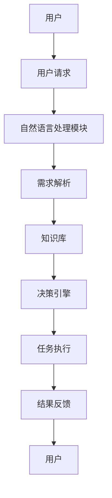
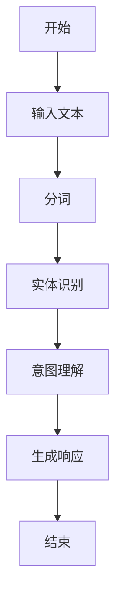
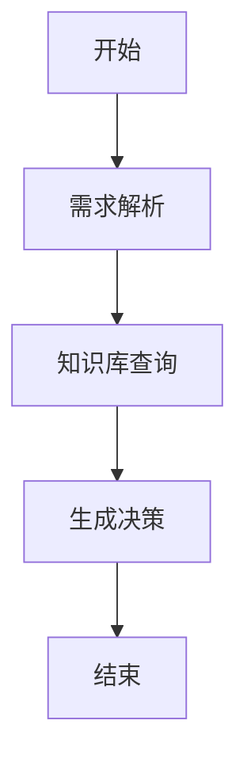
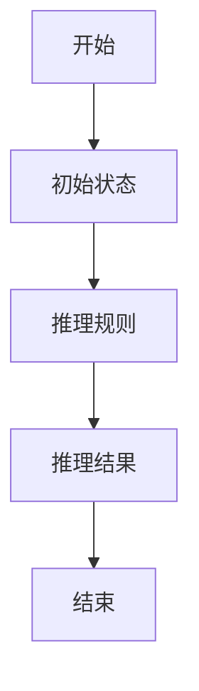
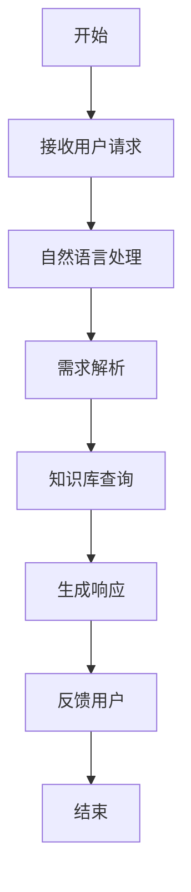
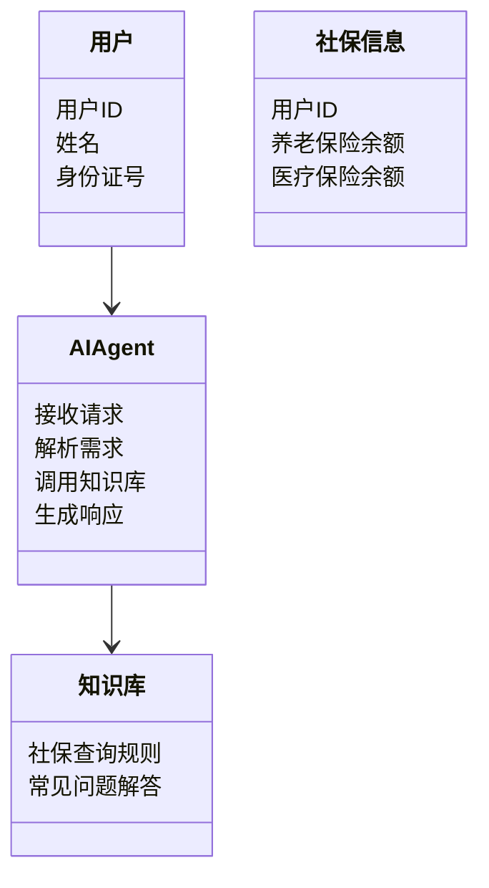
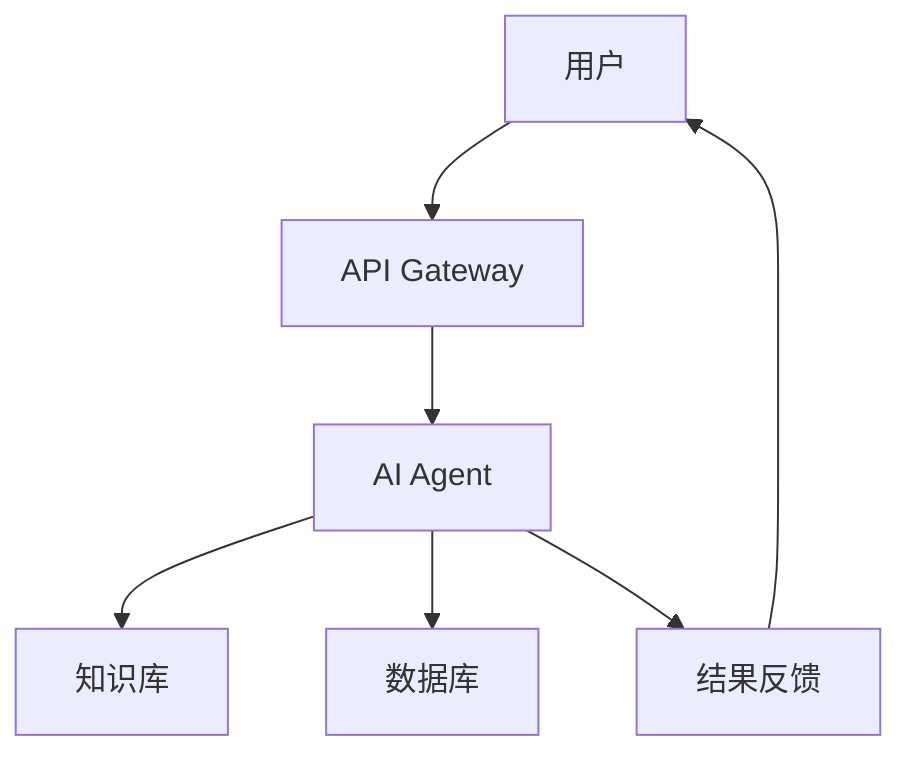
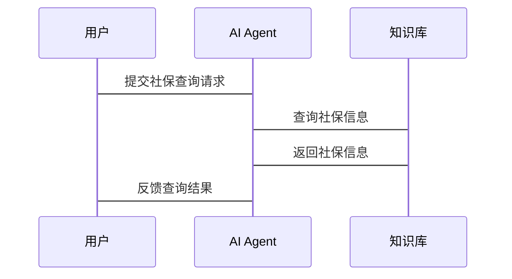

                 


# 政务AI Agent：提升公共服务效率

## 关键词：
- 政务AI Agent
- 公共服务效率
- 人工智能
- 系统架构
- 算法原理

## 摘要：
本文章详细探讨了政务AI Agent在提升公共服务效率中的作用，从定义、技术原理、算法实现到系统架构和实际案例，全面解析了如何利用AI Agent技术优化政府服务流程，解决传统政务系统中的痛点，实现智能化、高效化的公共服务。

---

# 第1章: 政务AI Agent的背景与问题背景

## 1.1 政务AI Agent的定义与特点

### 1.1.1 政务AI Agent的定义
政务AI Agent（Artificial Intelligence Agent，简称AI Agent）是一种基于人工智能技术的智能体，能够理解、分析和处理复杂的政务服务需求，并通过自动化流程为用户提供高效、精准的公共服务。它结合了自然语言处理、机器学习和知识图谱等技术，能够在无需人工干预的情况下，独立完成政务服务任务。

### 1.1.2 政务AI Agent的核心特点
- **智能性**：通过自然语言处理和机器学习，能够理解用户需求并提供智能决策。
- **自主性**：能够在没有人工干预的情况下自主执行任务。
- **适应性**：能够根据新的数据和环境变化进行自我优化和调整。
- **高效性**：通过自动化流程大幅提高政务服务效率，减少资源浪费。

### 1.1.3 政务AI Agent与传统政务系统的主要区别
| 特性               | 传统政务系统         | 政务AI Agent        |
|--------------------|----------------------|---------------------|
| **处理方式**       | 手动或半自动化处理   | 全自动化处理         |
| **响应速度**       | 较慢，依赖人工处理    | 快速响应             |
| **灵活性**          | 较低，固定流程       | 高度灵活，可定制化   |
| **智能化程度**      | 较低，依赖规则引擎   | 高度智能化，具备学习能力 |

## 1.2 政务AI Agent的应用背景

### 1.2.1 当前政务系统的主要痛点
- **效率低下**：传统政务系统依赖人工处理，导致响应速度慢，资源浪费。
- **信息孤岛**：各部门之间数据不通，导致重复录入和信息不一致。
- **用户体验差**：用户需要多次提交资料，流程复杂，体验不佳。
- **资源浪费**：人工处理大量重复性工作，浪费时间和人力资源。

### 1.2.2 政务AI Agent的提出与目标
为了应对上述痛点，政务AI Agent应运而生。其目标是通过智能化、自动化的手段，优化政务服务流程，提升公共服务效率，降低人工成本，同时提高用户体验。

### 1.2.3 政务AI Agent的边界与外延
- **边界**：主要应用于政务服务领域，处理用户请求、信息查询、任务执行等。
- **外延**：可以与其他系统（如数据库、第三方服务）无缝对接，扩展功能。

## 1.3 政务AI Agent的核心概念与问题解决

### 1.3.1 政务AI Agent的核心概念结构
政务AI Agent的核心概念包括：
1. **用户请求**：用户通过自然语言或结构化输入提出需求。
2. **需求解析**：AI Agent通过自然语言处理技术理解用户需求。
3. **任务执行**：AI Agent根据解析的需求，调用相应服务完成任务。
4. **结果反馈**：AI Agent将处理结果反馈给用户。

### 1.3.2 政务AI Agent的组成要素
- **自然语言处理模块**：负责理解和解析用户需求。
- **知识库**：存储政务服务相关的知识和数据。
- **决策引擎**：根据需求和知识库信息，生成解决方案。
- **执行模块**：调用外部服务或系统完成任务。
- **反馈模块**：将处理结果反馈给用户，并收集用户反馈以优化系统。

### 1.3.3 政务AI Agent如何解决实际问题
通过政务AI Agent，用户可以快速获得所需服务，减少人工干预，提高效率。例如，用户可以通过AI Agent自动完成社保查询、行政审批等任务，大幅缩短处理时间。

---

# 第2章: 政务AI Agent的核心概念与联系

## 2.1 政务AI Agent的技术原理

### 2.1.1 政务AI Agent的核心算法原理
政务AI Agent的核心算法包括：
1. **自然语言处理（NLP）**：用于理解和解析用户需求。
2. **机器学习（ML）**：用于训练模型，优化决策过程。
3. **知识图谱**：用于存储和管理政务服务相关知识。

### 2.1.2 政务AI Agent的实现机制
1. **用户请求接收**：通过API或用户界面接收用户请求。
2. **需求解析**：利用NLP技术解析用户需求，提取关键信息。
3. **任务执行**：根据解析结果，调用相应服务完成任务。
4. **结果反馈**：将处理结果反馈给用户。

### 2.1.3 政务AI Agent的技术优势
- **智能化**：能够理解和处理复杂的需求。
- **自动化**：无需人工干预，自动完成任务。
- **高效性**：通过优化算法和流程，大幅提高处理速度。

## 2.2 政务AI Agent与相关技术的对比

### 2.2.1 政务AI Agent与传统AI技术的对比
| 特性               | 传统AI技术         | 政务AI Agent        |
|--------------------|----------------------|---------------------|
| **应用场景**       | 广泛领域            | 政务服务领域         |
| **核心功能**       | 数据分析、模式识别  | 自然语言处理、任务执行 |
| **目标**           | 提高数据分析效率    | 提高政务服务效率      |

### 2.2.2 政务AI Agent与规则引擎的对比
| 特性               | 规则引擎           | 政务AI Agent        |
|--------------------|----------------------|---------------------|
| **处理方式**       | 基于规则匹配       | 基于学习和推理      |
| **灵活性**          | 较低，依赖预定义规则| 较高，能够自适应调整 |
| **智能化程度**      | 较低               | 较高                |

### 2.2.3 政务AI Agent与RPA（机器人流程自动化）的对比
| 特性               | RPA                 | 政务AI Agent        |
|--------------------|----------------------|---------------------|
| **核心功能**       | 模拟人类操作         | 自然语言理解和任务执行 |
| **适用场景**       | 重复性、规则性任务   | 复杂、多样化的任务  |
| **技术基础**       | 模拟技术            | AI和机器学习        |

## 2.3 政务AI Agent的实体关系图

### 2.3.1 政务AI Agent的实体关系图（Mermaid）


---

# 第3章: 政务AI Agent的算法原理

## 3.1 政务AI Agent的核心算法

### 3.1.1 政务AI Agent的自然语言处理算法
自然语言处理（NLP）是AI Agent的核心算法之一，主要用于理解用户需求。以下是NLP算法的流程图：



#### 代码实现示例（Python）
```python
import spacy

# 加载预训练的NLP模型
nlp = spacy.load("zh_core_web_sm")

# 用户输入
user_input = "我要查询我的社保信息"

# 分词
doc = nlp(user_input)
for token in doc:
    print(token.text)
```

### 3.1.2 政务AI Agent的决策算法
决策算法是AI Agent的另一个核心算法，用于根据需求解析结果生成解决方案。以下是决策算法的流程图：



#### 代码实现示例（Python）
```python
def decision_algorithm(user_request, knowledge_base):
    # 解析用户需求
    parsed_request = parse(user_request)
    # 查询知识库
    result = knowledge_base.query(parsed_request)
    # 生成决策
    decision = generate_decision(parsed_request, result)
    return decision

# 示例使用
user_request = "如何办理营业执照"
knowledge_base = {
    "办理营业执照": "需要提供身份证明、经营场所证明等文件"
}
decision = decision_algorithm(user_request, knowledge_base)
print(decision)
```

### 3.1.3 政务AI Agent的推理算法
推理算法用于优化决策过程，以下是推理算法的流程图：



#### 代码实现示例（Python）
```python
def inference_algorithm(initial_state, rules):
    # 应用推理规则
    current_state = initial_state
    for rule in rules:
        current_state = apply_rule(current_state, rule)
    return current_state

# 示例使用
initial_state = {"status": "未处理", "request": "查询社保信息"}
rules = [
    {"condition": "status == '未处理'", "action": "标记为处理中"},
    {"condition": "status == '处理中'", "action": "查询社保数据库"}
]
final_state = inference_algorithm(initial_state, rules)
print(final_state)
```

## 3.2 政务AI Agent的算法流程图

### 3.2.1 政务AI Agent的算法流程图（Mermaid）


---

# 第4章: 政务AI Agent的系统分析与架构设计

## 4.1 问题场景介绍
本章将通过一个具体的政务服务场景（如社保信息查询）来介绍AI Agent的系统分析与架构设计。

## 4.2 项目介绍
本项目旨在通过AI Agent技术，实现用户的社保信息查询功能，包括信息提取、知识库查询和结果反馈。

## 4.3 系统功能设计（领域模型）

### 4.3.1 领域模型（Mermaid）


## 4.4 系统架构设计（Mermaid）


## 4.5 系统接口设计
- **用户接口**：通过网页或移动端提交请求。
- **AI Agent接口**：接收用户请求，调用知识库和数据库。
- **知识库接口**：提供社保信息查询服务。

## 4.6 系统交互设计（Mermaid）


---

# 第5章: 政务AI Agent的项目实战

## 5.1 环境安装
本项目需要以下环境和工具：
- Python 3.8+
- 自然语言处理库（如spaCy）
- 机器学习库（如scikit-learn）
- 数据库（如MySQL）

## 5.2 核心代码实现

### 5.2.1 环境安装
```bash
pip install spacy scikit-learn
python -m spacy download zh_core_web_sm
```

### 5.2.2 核心代码实现
```python
import spacy
from sklearn.feature_extraction.text import TfidfVectorizer
from sklearn.metrics.pairwise import cosine_similarity

# 加载自然语言处理模型
nlp = spacy.load("zh_core_web_sm")

# 初始化TF-IDF向量器
vectorizer = TfidfVectorizer()

# 示例文本
texts = ["我要查询我的社保信息", "如何办理营业执照"]

# 生成词袋模型
tfidf_matrix = vectorizer.fit_transform(texts)

# 计算余弦相似度
similarity_matrix = cosine_similarity(tfidf_matrix, tfidf_matrix)

print(similarity_matrix)
```

### 5.2.3 代码解读与分析
- **自然语言处理**：使用spaCy进行文本分词和实体识别。
- **TF-IDF向量器**：用于计算文本的相似度，帮助理解用户需求。
- **余弦相似度**：用于衡量两个文本之间的相似程度。

## 5.3 实际案例分析

### 5.3.1 案例背景
用户希望查询自己的社保信息，包括养老保险余额和医疗保险余额。

### 5.3.2 代码实现
```python
def query_social_security(user_request, knowledge_base):
    # 分词
    doc = nlp(user_request)
    # 提取关键词
    keywords = [token.text for token in doc]
    # 查询知识库
    result = knowledge_base.query(keywords)
    return result

# 示例知识库
knowledge_base = {
    "社保信息": {
        "养老保险余额": "10000元",
        "医疗保险余额": "2000元"
    }
}

# 示例使用
user_request = "我的养老保险余额是多少"
print(query_social_security(user_request, knowledge_base))
```

## 5.4 项目小结
通过本项目的实战，我们了解了政务AI Agent的核心实现过程，包括环境搭建、代码实现和案例分析。AI Agent能够显著提高政务服务效率，优化用户体验。

---

# 第6章: 政务AI Agent的实际案例分析

## 6.1 案例背景
本章通过一个实际案例——“智能问答系统”来展示政务AI Agent的应用。

## 6.2 案例分析
### 6.2.1 案例目标
实现用户的智能问答功能，包括社保、公积金等信息查询。

### 6.2.2 案例实现
```python
def intelligent_QA(user_question, knowledge_base):
    # 解析用户问题
    parsed_question = parse(user_question)
    # 查询知识库
    result = knowledge_base.query(parsed_question)
    return result

# 示例知识库
knowledge_base = {
    "社保": {
        "养老保险": "提供养老保险服务",
        "医疗保险": "提供医疗保险服务"
    },
    "公积金": {
        "提取": "公积金提取条件和流程"
    }
}

# 示例使用
user_question = "如何提取公积金"
print(intelligent_QA(user_question, knowledge_base))
```

## 6.3 案例总结
通过本案例，我们展示了AI Agent在智能问答系统中的应用，证明了其在提高政务服务效率和用户体验方面的巨大潜力。

---

# 第7章: 政务AI Agent的未来展望

## 7.1 政务AI Agent的发展趋势
随着人工智能技术的不断进步，政务AI Agent将在政务服务领域发挥越来越重要的作用，未来将更加智能化、个性化和实时化。

## 7.2 政务AI Agent的挑战与机遇
- **挑战**：数据隐私、模型优化、人机协作等。
- **机遇**：技术进步、政策支持、市场需求。

## 7.3 政务AI Agent对社会的影响
AI Agent的广泛应用将显著提高政务服务效率，减少资源浪费，优化用户体验，推动社会数字化转型。

---

# 作者：AI天才研究院 & 禅与计算机程序设计艺术

