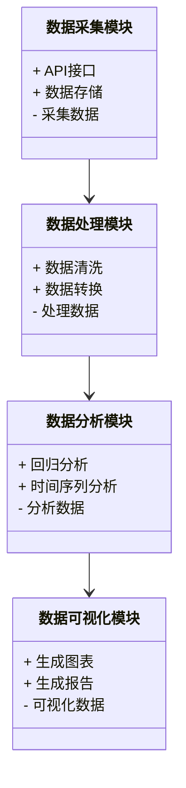
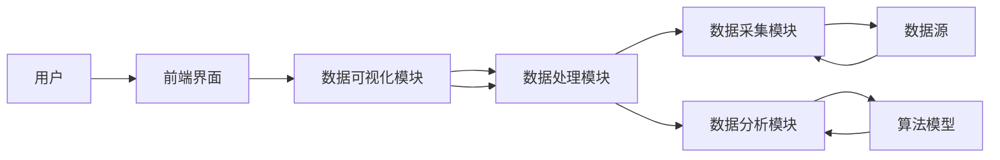
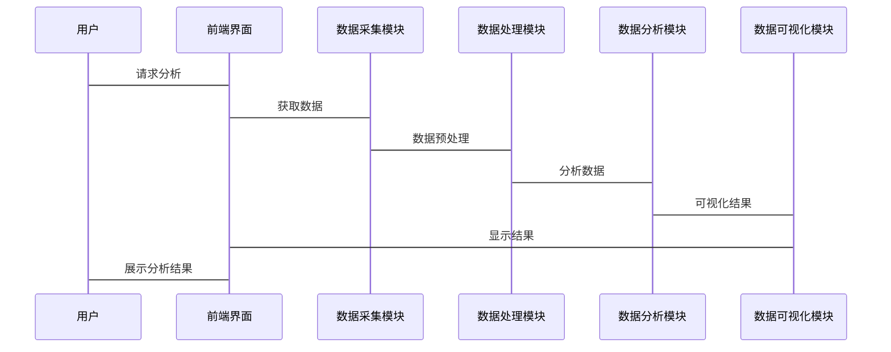

                 


---

# 新兴市场vs发达市场:股市估值比较

> 关键词：新兴市场，发达市场，股市估值，市盈率，市净率，经济指标，投资者行为，回归分析，时间序列分析，系统架构设计，Python代码

> 摘要：本文系统地比较了新兴市场和发达市场的股市估值差异，分析了影响估值的主要因素，探讨了不同市场环境下投资者的行为差异，并通过数学模型和算法对估值差异进行量化分析。同时，本文结合实际案例，提供了基于Python的股市估值比较工具，帮助读者深入理解新兴市场和发达市场之间的差异，并为投资者提供实践指导。

---

## 目录

---

### 第一部分: 背景介绍

#### 第1章: 新兴市场与发达市场的股市估值概述

##### 1.1 新兴市场与发达市场的定义与特点

- 1.1.1 新兴市场的定义与特征
  - 新兴市场的经济规模与结构
  - 新兴市场的典型国家（如中国、印度、巴西等）
  - 新兴市场的特点：高增长潜力、高波动性、市场不完善

- 1.1.2 发达市场的定义与特征
  - 发达市场的经济规模与结构
  - 发达市场的典型国家（如美国、英国、日本等）
  - 发达市场的特点：市场成熟、低波动性、监管完善

- 1.1.3 新兴市场与发达市场的主要差异与联系
  - 经济发展阶段的差异
  - 市场成熟度的差异
  - 投资者结构的差异

##### 1.2 股市估值的基本概念与方法

- 1.2.1 市盈率（P/E）的定义与计算
  - 市盈率的公式：$$P/E = \frac{\text{股价}}{\text{每股收益}}$$
  - 市盈率的计算方法与应用场景

- 1.2.2 市净率（P/B）的定义与计算
  - 市净率的公式：$$P/B = \frac{\text{股价}}{\text{每股净资产}}$$
  - 市净率的计算方法与应用场景

- 1.2.3 市盈率与市净率的比较
  - 适用场景的差异：市盈率适用于高增长企业，市净率适用于资产密集型企业

##### 1.3 股市估值的影响因素

- 1.3.1 经济指标对股市估值的影响
  - GDP增长率、失业率、通货膨胀率等对股市估值的影响

- 1.3.2 政治环境对股市估值的影响
  - 政治稳定性、政策变化对股市估值的影响

- 1.3.3 公司基本面与股市估值的关系
  - 收益能力、盈利能力、成长能力对股市估值的影响

##### 1.4 本章小结

---

### 第二部分: 核心概念与联系

#### 第2章: 新兴市场与发达市场股市估值的核心概念

##### 2.1 股市估值的核心要素对比

- 2.1.1 市盈率与市净率的对比分析
  - 新兴市场 vs 发达市场：市盈率与市净率的平均值对比
  - 行业差异对估值指标的影响

- 2.1.2 市场流动性对估值的影响
  - 新兴市场流动性不足的问题
  - 发达市场流动性充裕的优势

- 2.1.3 利率水平对估值的影响
  - 利率上升对市盈率的影响
  - 利率下降对市净率的影响

##### 2.2 新兴市场与发达市场估值差异的成因分析

- 2.2.1 经济发展阶段的差异
  - 新兴市场的高增长与发达市场的稳定增长

- 2.2.2 市场成熟度的差异
  - 新兴市场的波动性与发达市场的稳定性

- 2.2.3 投资者结构的差异
  - 新兴市场以散户为主 vs 发达市场以机构投资者为主

##### 2.3 股市估值的动态变化与趋势

- 2.3.1 经济周期对估值的影响
  - 衰退期、复苏期、增长期、过热期的估值变化

- 2.3.2 全球化对估值的影响
  - 全球资本流动对新兴市场估值的推动

- 2.3.3 技术进步对估值的影响
  - 科技创新对高成长企业估值的提升

##### 2.4 本章小结

---

### 第三部分: 数学模型与算法原理

#### 第3章: 股市估值的数学模型与算法

##### 3.1 常用估值模型介绍

- 3.1.1 市盈率模型
  - 市盈率模型的优缺点
  - 适用场景：高增长企业

- 3.1.2 市净率模型
  - 市净率模型的优缺点
  - 适用场景：资产密集型企业

- 3.1.3 现金流折现模型（DCF）
  - DCF模型的基本原理
  - 现金流折现的公式：$$DCF = \sum_{t=1}^{n} \frac{CF_t}{(1 + r)^t}$$

##### 3.2 新兴市场与发达市场估值差异的量化分析

- 3.2.1 回归分析模型
  - 回归分析模型的公式：$$y = \beta x + \epsilon$$
  - 回归分析流程图：
  ```mermaid
  graph TD
      A[开始] --> B[数据预处理]
      B --> C[选择模型]
      C --> D[训练模型]
      D --> E[验证模型]
      E --> F[结果分析]
      F --> G[结束]
  ```

- 3.2.2 方差分析模型
  - 方差分析的基本原理
  - 方差分析的应用场景

- 3.2.3 时间序列分析模型
  - 时间序列分析的基本原理
  - 时间序列分析的应用场景

##### 3.3 算法实现与流程图

- 3.3.1 回归分析算法流程图
  ```mermaid
  graph TD
      A[开始] --> B[数据预处理]
      B --> C[选择模型]
      C --> D[训练模型]
      D --> E[验证模型]
      E --> F[结果分析]
      F --> G[结束]
  ```

---

### 第四部分: 系统分析与架构设计方案

#### 第4章: 系统架构与数据处理流程

##### 4.1 问题场景介绍

- 问题场景：如何量化新兴市场与发达市场的估值差异？

##### 4.2 项目介绍

- 项目目标：构建一个股市估值比较系统
- 项目范围：新兴市场与发达市场的股市数据采集、处理与分析

##### 4.3 系统功能设计

- 系统功能模块：
  - 数据采集模块：从API获取新兴市场与发达市场的股市数据
  - 数据处理模块：清洗数据、计算估值指标
  - 数据分析模块：应用回归分析与时间序列分析模型
  - 数据可视化模块：生成图表与报告

- 领域模型（mermaid类图）：


##### 4.4 系统架构设计（mermaid架构图）



##### 4.5 系统接口设计

- 数据采集模块接口：从API获取数据
- 数据处理模块接口：数据清洗与转换
- 数据分析模块接口：回归分析与时间序列分析
- 数据可视化模块接口：生成图表与报告

##### 4.6 系统交互设计（mermaid序列图）



##### 4.7 本章小结

---

### 第五部分: 项目实战

#### 第5章: 基于Python的股市估值比较工具实现

##### 5.1 环境安装与配置

- 安装Python与必要的库：
  - pandas、numpy、scipy、matplotlib、seaborn
  - 使用命令：`pip install pandas numpy scipy matplotlib seaborn`

##### 5.2 系统核心实现源代码

```python
import pandas as pd
import numpy as np
from sklearn.linear_model import LinearRegression
import matplotlib.pyplot as plt
import seaborn as sns

# 数据采集模块
def fetch_data(api_key, market_type):
    # 从API获取数据
    pass

# 数据处理模块
def preprocess_data(dataframe):
    # 数据清洗与转换
    dataframe.dropna(inplace=True)
    dataframe['PE'] = dataframe['Price'] / dataframe['Earnings Per Share']
    dataframe['PB'] = dataframe['Price'] / dataframe['Book Value Per Share']
    return dataframe

# 数据分析模块
def perform_regression(dataframe):
    model = LinearRegression()
    X = dataframe[['GDP Growth', 'Inflation Rate']]
    y = dataframe['PE']
    model.fit(X, y)
    return model

# 数据可视化模块
def visualize_results(dataframe, model):
    plt.figure(figsize=(12, 6))
    plt.subplot(1, 2, 1)
    sns.regplot(x='GDP Growth', y='PE', data=dataframe)
    plt.title('GDP Growth vs PE')
    plt.subplot(1, 2, 2)
    sns.regplot(x='Inflation Rate', y='PE', data=dataframe)
    plt.title('Inflation Rate vs PE')
    plt.show()

# 主函数
def main():
    dataframe = fetch_data(api_key='your_api_key', market_type='emerging')
    dataframe = preprocess_data(dataframe)
    model = perform_regression(dataframe)
    visualize_results(dataframe, model)

if __name__ == '__main__':
    main()
```

##### 5.3 代码应用解读与分析

- 代码功能：
  - 数据采集：从API获取新兴市场与发达市场的股市数据
  - 数据处理：计算市盈率与市净率
  - 数据分析：应用线性回归模型分析经济指标对估值的影响
  - 数据可视化：生成回归分析图表

##### 5.4 实际案例分析

- 案例分析：比较中国与美国股市的估值差异
  - 数据来源：获取中国与美国的PE与PB数据
  - 数据分析：应用回归模型分析GDP增长率与通胀率对PE的影响
  - 数据可视化：生成回归分析图表

##### 5.5 本章小结

---

### 第六部分: 投资策略与最佳实践

#### 第6章: 投资策略与注意事项

##### 6.1 投资策略

- 6.1.1 新兴市场的投资机会
  - 高增长行业的投资机会
  - 创新驱动企业的投资机会

- 6.1.2 发达市场的投资机会
  - 蓝筹股的投资机会
  - 防御性行业的投资机会

- 6.1.3 跨市场投资策略
  - 资产配置策略
  - 风险对冲策略

##### 6.2 注意事项

- 6.2.1 风险管理
  - 设置止损点
  - 分散投资

- 6.2.2 数据来源的可靠性
  - 数据清洗与验证

- 6.2.3 模型的有效性
  - 模型的验证与调整

##### 6.3 最佳实践 tips

- 定期复盘与调整投资组合
- 关注宏观经济指标与政策变化
- 利用技术工具辅助投资决策

##### 6.4 本章小结

---

### 第七部分: 案例分析

#### 第7章: 案例分析与经验总结

##### 7.1 案例分析

- 7.1.1 新兴市场的实际案例
  - 某新兴市场的股市估值变化
  - 影响估值变化的因素分析

- 7.1.2 发达市场的实际案例
  - 某发达市场的股市估值变化
  - 影响估值变化的因素分析

##### 7.2 经验总结

- 新兴市场与发达市场的估值差异总结
- 投资策略的总结与反思

##### 7.3 本章小结

---

### 第八部分: 结论与展望

#### 第8章: 结论与未来研究方向

##### 8.1 研究结论

- 新兴市场与发达市场在股市估值上的主要差异
- 影响估值差异的主要因素

##### 8.2 未来研究方向

- 更多市场与行业的比较研究
- 新型估值模型的开发与应用
- 人工智能在股市估值中的应用

##### 8.3 本章小结

---

### 附录

#### 附录A: 常用术语解释

- 市盈率（P/E）
- 市净率（P/B）
- 回归分析
- 时间序列分析

#### 附录B: 数据来源与处理代码

#### 附录C: 参考文献

---

### 作者

作者：AI天才研究院/AI Genius Institute & 禅与计算机程序设计艺术/Zen And The Art of Computer Programming

---

通过以上目录结构，我们可以系统地从背景介绍、核心概念、数学模型、系统架构设计、项目实战、投资策略、案例分析等多个方面深入探讨新兴市场与发达市场的股市估值比较问题。

