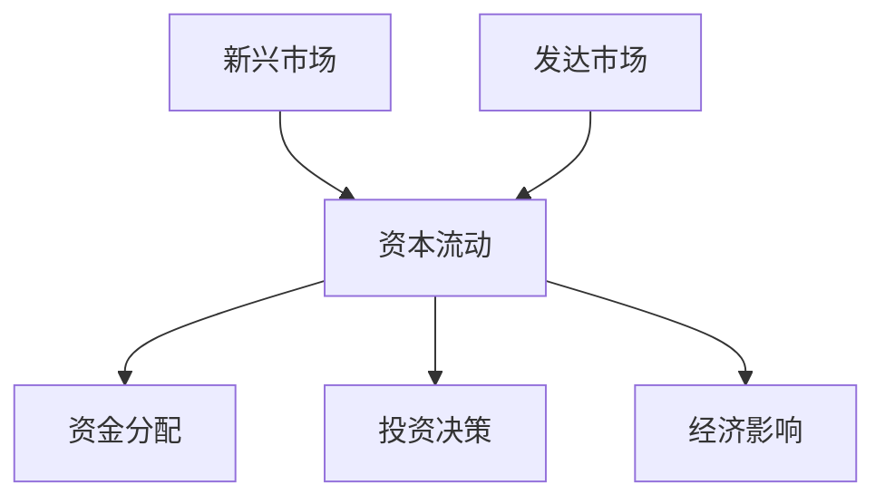

                 


# 新兴市场 vs 发达市场：资本流动分析

## 关键词
- 新兴市场
- 发达市场
- 资本流动
- 经济分析
- 金融模型

## 摘要
本文旨在分析新兴市场与发达市场之间的资本流动差异及其影响。通过背景介绍、核心概念解析、算法原理讲解、系统架构设计和项目实战分析，深入探讨资本流动的驱动因素、数学模型和实际应用。文章结合理论与实践，提供全面的分析框架，帮助读者理解资本流动的复杂性及其对经济发展的深远影响。

---

# 第一部分: 背景介绍

## 第1章: 新兴市场与发达市场的资本流动背景

### 1.1 问题背景
#### 1.1.1 新兴市场与发达市场的定义与特点
- **新兴市场**：指经济发展迅速但尚未完全工业化的国家，如中国、印度等。
- **发达市场**：指经济高度发达、工业化程度高的国家，如美国、日本等。

#### 1.1.2 资本流动的现状与问题
- 资本从新兴市场流向发达市场的趋势及其原因。
- 新兴市场资本外流的问题及其影响。

#### 1.1.3 研究资本流动的意义
- 优化资本配置，促进经济增长。
- 理解国际经济关系，制定有效的经济政策。

### 1.2 问题描述
#### 1.2.1 资本流动的驱动因素
- 利率差异、汇率波动、投资机会等。

#### 1.2.2 新兴市场与发达市场的差异
- 经济结构、金融监管、市场成熟度等。

#### 1.2.3 资本流动对经济的影响
- 对新兴市场和发达市场的双重影响。

### 1.3 问题解决
#### 1.3.1 资本流动分析的方法
- 定量分析与定性分析的结合。

#### 1.3.2 新兴市场与发达市场的比较分析
- 通过数据对比分析资本流动的差异。

#### 1.3.3 资本流动的优化策略
- 政策建议、市场机制设计等。

### 1.4 边界与外延
#### 1.4.1 资本流动的边界条件
- 资本流动的规模、速度和方向。

#### 1.4.2 新兴市场与发达市场的外延
- 区域性市场和全球性市场的联系。

#### 1.4.3 资本流动的限制与例外
- 资本管制、地缘政治因素等。

### 1.5 核心要素组成
#### 1.5.1 资本流动的核心要素
- 资金、利率、汇率等。

#### 1.5.2 新兴市场与发达市场的比较维度
- 经济指标、金融指标、社会指标等。

#### 1.5.3 资本流动的系统结构
- 资本流动的闭环系统、反馈机制等。

---

# 第二部分: 核心概念与联系

## 第2章: 资本流动的核心概念与联系

### 2.1 资本流动的定义与原理
#### 2.1.1 资本流动的定义
- 资本从一个市场流向另一个市场的过程。

#### 2.1.2 资本流动的驱动机制
- 利率差异、投资机会、风险偏好等。

#### 2.1.3 资本流动的分类
- 短期资本流动、长期资本流动等。

### 2.2 新兴市场与发达市场的特征对比
#### 2.2.1 新兴市场的特征
- 经济增长快、市场潜力大、但风险较高。

#### 2.2.2 发达市场的特征
- 经济稳定、市场成熟、风险较低。

#### 2.2.3 两者的主要差异
- 经济结构、金融监管、市场成熟度等。

### 2.3 资本流动的ER实体关系图



---

# 第三部分: 算法原理讲解

## 第3章: 资本流动的算法原理

### 3.1 资本流动的算法原理
#### 3.1.1 马可夫链模型
- 描述资本流动的状态转移。

#### 3.1.2 回归分析模型
- 分析资本流动的驱动因素。

#### 3.1.3 时间序列分析
- 预测未来资本流动的趋势。

### 3.2 算法流程图

```

--- 

## 第4章: 系统分析与架构设计

### 4.1 问题场景介绍
- 新兴市场与发达市场资本流动的动态关系。

### 4.2 系统功能设计
- 数据采集、模型构建、结果分析。

### 4.3 系统架构设计
- 采用分层架构，包括数据层、业务逻辑层和表现层。

### 4.4 系统接口设计
- API接口定义，数据输入输出格式。

### 4.5 系统交互设计
- 用户与系统之间的交互流程。

---

## 第5章: 项目实战

### 5.1 环境安装
- 安装必要的工具和库，如Python、NumPy、Pandas等。

### 5.2 核心代码实现
- 使用Python编写资本流动分析的代码。

### 5.3 案例分析
- 以具体国家为例，分析资本流动的模式和影响。

### 5.4 项目总结
- 总结项目成果，提出改进建议。

---

## 第6章: 结论与展望

### 6.1 研究成果总结
- 资本流动的核心发现。

### 6.2 研究局限性
- 数据限制、模型假设等。

### 6.3 未来研究方向
- 更复杂模型的开发、更多市场的分析。

---

## 附录

### 附录A: 数据来源与处理方法
- 数据收集来源和处理步骤。

### 附录B: 工具安装指南
- 如何安装和配置开发环境。

### 附录C: 参考文献
- 列出相关书籍和文献。

---

## 作者
作者：AI天才研究院 & 禅与计算机程序设计艺术

