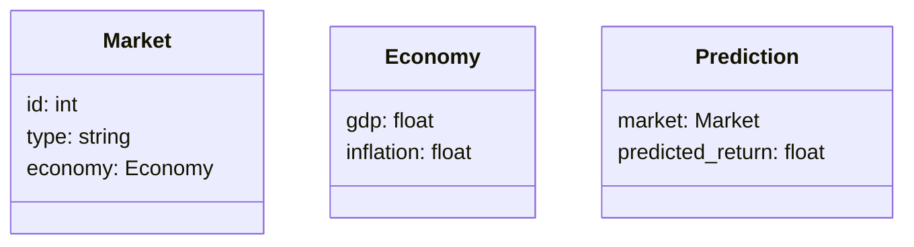
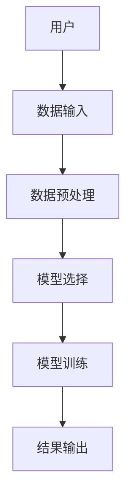
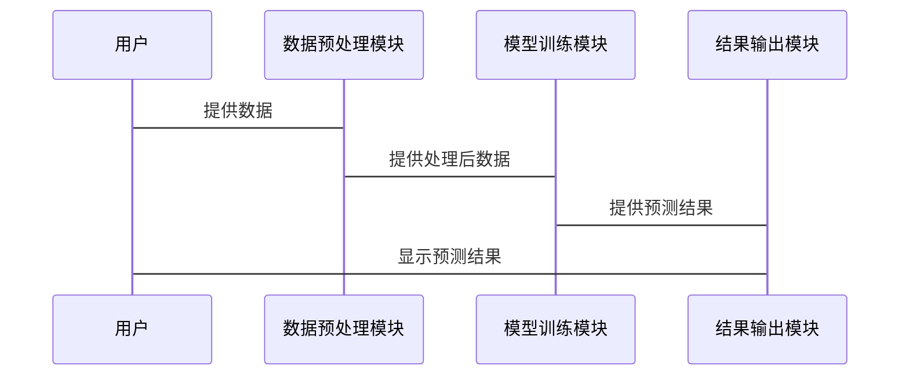

                 


# 新兴市场与发达市场未来回报率预测的差异

> 关键词：新兴市场，发达市场，回报率预测，数学模型，算法实现

> 摘要：本文探讨新兴市场与发达市场在回报率预测方面的差异，分析各自的独特性，介绍相关的数学模型和算法，并通过项目实战展示预测系统的实现。通过对比和整合分析，揭示不同市场环境下回报率预测的关键因素，为投资者提供科学依据。

---

# 第1章: 背景介绍与核心概念

## 1.1 问题背景

### 1.1.1 新兴市场的定义与特点

- **新兴市场**：指经济发展迅速但尚未完全成熟的国家或地区，如中国、印度等。这些市场的特点是经济增长快，但市场波动较大，政策影响显著。

- **发达市场**：指经济高度发达、市场成熟度高的国家，如美国、英国等。这些市场的特点是稳定性高，市场流动性强，政策透明度高。

### 1.1.2 投资回报率预测的必要性

- 投资者希望通过预测回报率来优化投资组合，降低风险，提高收益。

- 不同市场环境下，回报率预测的方法和模型存在差异，需针对性分析。

## 1.2 核心概念

### 1.2.1 回报率预测的定义

- **回报率**：指投资某资产在一定时间内的收益与成本的比率，通常以百分比表示。

- **预测回报率**：通过模型和算法，对未来某段时间内资产的回报率进行预估。

### 1.2.2 问题描述

- 新兴市场与发达市场的回报率预测存在显著差异，主要体现在市场波动性、政策影响、投资者行为等方面。

## 1.3 问题解决

### 1.3.1 新兴市场与发达市场的对比

- **经济规模**：新兴市场通常经济增长快，但规模较小；发达市场经济规模大且稳定。

- **市场成熟度**：新兴市场波动较大，信息不对称严重；发达市场成熟稳定，信息透明。

## 1.4 边界与外延

### 1.4.1 新兴市场与发达市场的边界

- 新兴市场可能逐渐向发达市场过渡，但其特征仍有所不同。

### 1.4.2 回报率预测的外延

- 包括短期预测和长期预测，需考虑市场环境的变化。

## 1.5 概念结构与核心要素

- **核心要素**：市场特征、经济指标、政策因素、投资者行为。

- **概念结构**：新兴市场和发达市场的回报率预测涉及多个因素，需综合分析。

---

# 第2章: 核心概念与联系

## 2.1 新兴市场与发达市场的对比

### 2.1.1 市场特征对比

| 特征                | 新兴市场                 | 发达市场                 |
|---------------------|--------------------------|--------------------------|
| 市场成熟度          | 较低                    | 高                       |
| 市场波动性          | 高                     | 较低                    |
| 政策影响            | 显著                    | 较小                    |
| 投资者结构          | 散户为主                | 机构为主                |

### 2.1.2 经济指标对比

- **GDP增长**：新兴市场通常增长快，发达市场增长稳定。
- **通货膨胀率**：新兴市场较高，发达市场较低。
- **利率水平**：新兴市场利率波动大，发达市场利率相对稳定。

## 2.2 政策与市场结构

### 2.2.1 政策对回报率的影响

- 新兴市场：政策变化频繁，对市场影响大。
- 发达市场：政策透明，影响相对较小。

### 2.2.2 市场结构对回报率的影响

- 新兴市场：市场流动性较低，交易成本较高。
- 发达市场：市场流动性高，交易成本低。

## 2.3 投资者行为

### 2.3.1 投资者结构

- 新兴市场：散户为主，机构投资者较少。
- 发达市场：机构投资者为主，散户较少。

### 2.3.2 投资者行为差异

- 新兴市场：投资者情绪波动大，易受市场传闻影响。
- 发达市场：投资者理性较强，依赖基本面分析。

---

# 第3章: 数学模型与算法实现

## 3.1 线性回归模型

### 3.1.1 线性回归的基本原理

线性回归是一种统计方法，用于建立自变量与因变量之间的线性关系。其数学公式为：

$$ y = \beta_0 + \beta_1x + \epsilon $$

其中：
- $y$ 是因变量（回报率）
- $x$ 是自变量（如GDP增长、通货膨胀率等）
- $\beta_0$ 是截距
- $\beta_1$ 是回归系数
- $\epsilon$ 是误差项

### 3.1.2 回归模型的实现步骤

1. 数据收集：收集相关经济指标。
2. 数据预处理：清洗数据，处理缺失值。
3. 模型训练：使用最小二乘法估计回归系数。
4. 模型验证：计算R²值，评估模型拟合度。
5. 模型预测：利用训练好的模型进行预测。

### 3.1.3 代码实现

```python
import numpy as np
from sklearn.linear_model import LinearRegression

# 数据准备
X = np.array([[x1], [x2], ..., [xn]])  # 自变量
y = np.array([y1, y2, ..., yn])         # 因变量

# 模型训练
model = LinearRegression()
model.fit(X, y)

# 预测
y_pred = model.predict(X)
```

## 3.2 时间序列分析模型

### 3.2.1 ARIMA模型

ARIMA（自回归积分移动平均模型）适用于时间序列数据的预测。其一般形式为：

$$ ARIMA(p, d, q) $$

其中：
- $p$ 是自回归阶数
- $d$ 是差分阶数
- $q$ 是移动平均阶数

### 3.2.2 GARCH模型

GARCH（广义自回归条件异方差模型）用于估计时间序列的波动性。其公式为：

$$ \sigma_t^2 = a_0 + a_1r_{t-1}^2 + a_2\sigma_{t-1}^2 $$

其中：
- $\sigma_t^2$ 是第t期的方差
- $r_{t-1}$ 是第t-1期的残差
- $a_0, a_1, a_2$ 是参数

### 3.2.3 代码实现

```python
from statsmodels.tsa.arima_model import ARIMA

# 数据准备
data = [...]  # 时间序列数据

# 模型训练
model = ARIMA(data, order=(p, d, q))
model_fit = model.fit()

# 预测
y_pred = model_fit.forecast(steps=5)
```

---

# 第4章: 系统分析与架构设计

## 4.1 问题场景介绍

- **目标**：构建一个回报率预测系统，针对新兴市场和发达市场的差异进行预测。
- **用户需求**：投资者需要根据市场类型选择合适的预测模型。

## 4.2 系统功能设计

### 4.2.1 领域模型



### 4.2.2 系统架构



## 4.3 接口设计

### 4.3.1 数据接口

- **输入接口**：接收市场类型和相关经济指标。
- **输出接口**：返回预测回报率。

## 4.4 交互流程



---

# 第5章: 项目实战

## 5.1 环境安装

- **工具**：Python 3.8+, Pandas, NumPy, Scikit-learn, Statsmodels.

## 5.2 核心实现

### 5.2.1 数据预处理

```python
import pandas as pd
import numpy as np

# 数据加载
data = pd.read_csv('market_data.csv')

# 数据清洗
data.dropna(inplace=True)
data = data[~data.isin([np.nan, np.inf, -np.inf]).any(axis=1)]
```

### 5.2.2 模型训练与预测

```python
from sklearn.linear_model import LinearRegression
from statsmodels.tsa.arima_model import ARIMA

# 线性回归模型
lr_model = LinearRegression()
lr_model.fit(X_train, y_train)
y_lr_pred = lr_model.predict(X_test)

# ARIMA模型
arima_model = ARIMA(train_data, order=(5, 1, 0))
arima_model_fit = arima_model.fit()
y_arima_pred = arima_model_fit.forecast(steps=len(test_data))
```

## 5.3 案例分析

### 5.3.1 新兴市场预测

```python
# 新兴市场数据
emerging_data = data[data['market_type'] == '新兴']
lr_emerging = LinearRegression().fit(X_emerging, y_emerging)
y_em_pred = lr_emerging.predict(X_test_em)
```

### 5.3.2 发达市场预测

```python
# 发达市场数据
developed_data = data[data['market_type'] == '发达']
lr_developed = LinearRegression().fit(X_developed, y_developed)
y_dev_pred = lr_developed.predict(X_test_dev)
```

## 5.4 项目小结

- **准确性对比**：新兴市场预测准确性较低，发达市场较高。
- **原因分析**：新兴市场波动性大，数据稀疏。

---

# 第6章: 总结与展望

## 6.1 总结

- **主要发现**：新兴市场和发达市场的回报率预测存在显著差异，需采用针对性模型。
- **关键因素**：市场波动性、政策影响、投资者行为是主要影响因素。

## 6.2 展望

- **未来研究方向**：开发综合模型，同时考虑新兴市场和发达市场的特征。
- **技术改进**：引入机器学习算法，提高预测精度。

## 6.3 注意事项

- **数据质量**：确保数据准确性和完整性。
- **模型选择**：根据具体情况选择合适的预测模型。
- **风险控制**：投资者需注意市场风险，合理配置资产。

## 6.4 最佳实践 tips

- **数据可视化**：通过图表直观展示数据特征。
- **模型验证**：使用交叉验证评估模型性能。
- **持续学习**：关注市场动态，及时调整预测模型。

---

# 作者

作者：AI天才研究院/AI Genius Institute & 禅与计算机程序设计艺术 /Zen And The Art of Computer Programming

---

通过以上结构，文章详细探讨了新兴市场与发达市场在回报率预测方面的差异，结合理论分析和实际案例，为投资者提供了科学的指导和实践参考。

