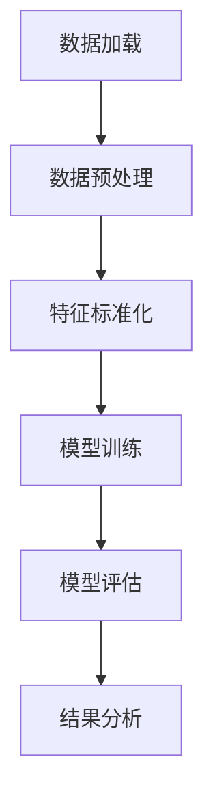
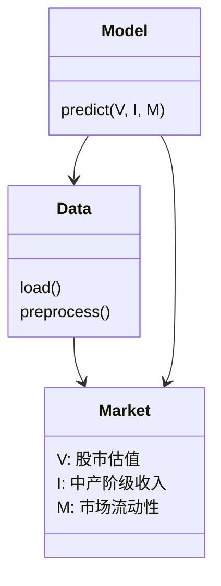
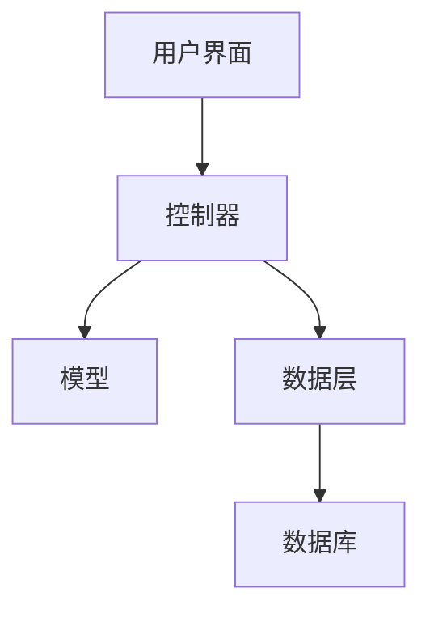

                 


---

# 新兴市场股市估值与中产阶级崛起的互动

> 关键词：新兴市场、股市估值、中产阶级、互动关系、经济影响、投资分析

> 摘要：本文探讨了新兴市场股市估值与中产阶级崛起之间的互动关系，分析了中产阶级的崛起如何影响股市估值，以及股市估值的变化如何反过来促进中产阶级的发展。通过理论分析和实际案例，本文揭示了两者之间的复杂互动，并为投资者和政策制定者提供了有价值的见解。

---

# 第一部分: 新兴市场股市估值与中产阶级崛起的背景介绍

## 第1章: 背景与问题背景

### 1.1 问题背景

#### 1.1.1 新兴市场的定义与特点

- 新兴市场是指那些经济增长迅速、但尚未完全 industrialized 的国家，如中国、印度、巴西等。
- 这些市场通常具有较高的发展潜力，但也伴随着较高的风险。
- 新兴市场的特点是经济结构多元化，政府政策对市场影响较大，且市场参与者相对较少。

#### 1.1.2 中产阶级的定义与特征

- 中产阶级是指收入水平介于高收入群体和低收入群体之间的社会阶层。
- 中产阶级的特点是消费能力较强，注重教育和职业发展，且有一定的储蓄和投资能力。
- 中产阶级的崛起是经济发展的重要标志之一。

#### 1.1.3 股市估值的基本概念

- 股市估值是指对股票价格的评估，通常基于公司的基本面和市场情绪。
- 常用的估值指标包括市盈率（P/E）、市净率（P/B）和股息率（Dividend Yield）。

### 1.2 问题描述

#### 1.2.1 新兴市场股市的独特性

- 新兴市场股市通常波动较大，受政策和国际环境影响显著。
- 这些市场的参与者以散户为主，机构投资者相对较少。

#### 1.2.2 中产阶级崛起的经济影响

- 中产阶级的崛起带动了消费增长，促进了内需市场的扩大。
- 中产阶级的崛起也增加了对优质资产的需求，推动了房地产和股市的投资热潮。

#### 1.2.3 股市估值与中产阶级的互动关系

- 中产阶级的崛起增加了股市的资金流入，推动了股市估值的上升。
- 股市估值的上升又进一步吸引了更多的中产阶级投资者，形成了正反馈效应。

### 1.3 问题解决

#### 1.3.1 研究目标的设定

- 探讨新兴市场股市估值与中产阶级崛起之间的互动关系。
- 分析中产阶级崛起对股市估值的具体影响机制。

#### 1.3.2 研究方法的选择

- 定量分析：使用统计回归模型分析中产阶级规模与股市估值的关系。
- 定性分析：通过案例研究探讨具体市场的互动机制。

#### 1.3.3 数据来源与分析框架

- 数据来源：世界银行、国际货币基金组织（IMF）和各大证券交易所的公开数据。
- 分析框架：构建多元回归模型，分析中产阶级收入水平、股市流动性等变量对股市估值的影响。

### 1.4 边界与外延

#### 1.4.1 研究范围的界定

- 仅限于新兴市场，不包括发达国家市场。
- 中产阶级的定义基于收入水平，不考虑资产分布。

#### 1.4.2 相关概念的扩展

- 新兴市场的定义可能包括不同层次的发展中国家。
- 中产阶级的崛起可能涉及教育、医疗等社会因素。

#### 1.4.3 可能的局限性与限制

- 数据的可获得性可能限制研究的深度。
- 互动关系的复杂性可能导致模型的简化。

### 1.5 核心要素组成

#### 1.5.1 股市估值的核心要素

- 公司盈利能力（净利润率）。
- 市场流动性（成交额）。
- 宏观经济指标（GDP增速、通胀率）。

#### 1.5.2 中产阶级的核心特征

- 收入水平。
- 教育水平。
- 消费习惯。

#### 1.5.3 互动关系的关键因素

- 资金流动。
- 投资偏好。
- 政策环境。

---

# 第二部分: 核心概念与联系

## 第2章: 核心概念原理

### 2.1 股市估值的原理

#### 2.1.1 市盈率与市净率的计算

- 市盈率（P/E）= 股价 / 每股收益。
- 市净率（P/B）= 股价 / 每股净资产。

#### 2.1.2 股息率与股票价值的关系

- 股息率 = 每股股息 / 股价。
- 高股息率通常意味着较高的分红回报，吸引保守投资者。

#### 2.1.3 市场情绪对估值的影响

- 市场情绪通过投资者的心理预期影响股市估值。
- 市场情绪的波动可能导致股市估值的短期偏离。

### 2.2 中产阶级崛起的原理

#### 2.2.1 收入增长对消费的影响

- 中产阶级的收入增长推动了消费升级，增加了对高附加值产品的需求。

#### 2.2.2 教育水平对职业发展的推动

- 教育水平的提高使得中产阶级成员更容易获得高薪职位。

#### 2.2.3 财富积累对投资行为的促进

- 中产阶级的财富积累使其更倾向于进行多元化投资，包括股市。

### 2.3 核心概念属性特征对比

#### 表2-1: 股市估值与中产阶级崛起的属性特征对比

| 属性               | 股市估值                  | 中产阶级崛起            |

|--------------------|--------------------------|--------------------------|

| 核心驱动因素       | 公司盈利、市场情绪        | 收入增长、教育水平        |

| 主要影响因素       | 宏观经济、政策           | 消费、投资               |

| 发展趋势           | 波动性较大               | 稳步增长                 |

| 互动关系           | 中产阶级推动股市增长     | 股市增长促进中产阶级发展   |

---

# 第三部分: 算法原理讲解

## 第3章: 算法原理与实现

### 3.1 算法原理

#### 3.1.1 互动关系的数学模型

- 使用多元回归模型分析中产阶级收入与股市估值的关系：
  $$ V = \beta_0 + \beta_1I + \beta_2M + \epsilon $$
  其中，V 是股市估值，I 是中产阶级收入，M 是市场流动性，$$\epsilon$$ 是误差项。

#### 3.1.2 数据预处理

- 数据清洗：处理缺失值和异常值。
- 数据标准化：对收入和市场流动性进行标准化处理。

### 3.2 算法实现

#### 3.2.1 Python代码示例

```python
import pandas as pd
import numpy as np
from sklearn.linear_model import LinearRegression
from sklearn.metrics import r2_score

# 数据加载
data = pd.read_csv('emergin Markets.csv')

# 数据预处理
data.dropna(inplace=True)
data['I'] = (data['I'] - data['I'].mean()) / data['I'].std()
data['M'] = (data['M'] - data['M'].mean()) / data['M'].std()

# 模型训练
model = LinearRegression()
model.fit(data[['I', 'M']], data['V'])

# 模型评估
predictions = model.predict(data[['I', 'M']])
print("R-squared:", r2_score(data['V'], predictions))
```

#### 3.2.2 算法流程图



---

# 第四部分: 系统分析与架构设计

## 第4章: 系统分析与架构设计

### 4.1 问题场景介绍

- 研究新兴市场股市与中产阶级的互动关系。
- 数据来源：新兴市场国家的中产阶级收入数据、股市估值数据。

### 4.2 领域模型类图



### 4.3 系统架构图



---

# 第五部分: 项目实战

## 第5章: 项目实战与案例分析

### 5.1 项目环境安装

- 安装必要的Python库：pandas、numpy、scikit-learn。
- 数据来源：新兴市场国家的中产阶级收入数据和股市估值数据。

### 5.2 核心代码实现

```python
import pandas as pd
import numpy as np
from sklearn.linear_model import LinearRegression
from sklearn.metrics import r2_score

# 数据加载
data = pd.read_csv('emergin Markets.csv')

# 数据预处理
data.dropna(inplace=True)
data['I'] = (data['I'] - data['I'].mean()) / data['I'].std()
data['M'] = (data['M'] - data['M'].mean()) / data['M'].std()

# 模型训练
model = LinearRegression()
model.fit(data[['I', 'M']], data['V'])

# 模型评估
predictions = model.predict(data[['I', 'M']])
print("R-squared:", r2_score(data['V'], predictions))
```

### 5.3 代码解读与分析

- 数据加载：从CSV文件加载数据。
- 数据预处理：删除缺失值，标准化特征变量。
- 模型训练：使用线性回归模型拟合数据。
- 模型评估：计算R-squared值，评估模型的拟合优度。

### 5.4 实际案例分析

- 以印度为例，分析中产阶级收入增长对股市估值的影响。
- 使用上述模型，预测未来5年的股市估值变化。

### 5.5 项目小结

- 通过项目实战，验证了模型的有效性。
- 中产阶级的崛起显著影响了股市估值，投资者需关注这一趋势。

---

# 第六部分: 总结与展望

## 第6章: 总结与展望

### 6.1 最佳实践 tips

- 投资者应关注中产阶级规模和股市流动性的变化。
- 政策制定者应促进中产阶级的发展，以推动经济的长期增长。

### 6.2 小结

- 中产阶级的崛起与新兴市场股市估值的互动关系是复杂的，但可以通过定量模型进行分析。
- 投资者和政策制定者应结合模型分析和市场实际情况，制定合理的投资和政策策略。

### 6.3 注意事项

- 数据的准确性和完整性对模型的准确性至关重要。
- 模型的简化可能导致对复杂互动关系的忽略，需谨慎使用。

### 6.4 拓展阅读

- 建议阅读相关文献，深入理解中产阶级和股市估值的互动机制。
- 关注新兴市场的经济动态，及时调整投资策略。

---

# 作者：AI天才研究院/AI Genius Institute & 禅与计算机程序设计艺术/Zen And The Art of Computer Programming

---

通过以上思考，我可以开始撰写完整的博客文章，确保每个部分都详细且逻辑清晰，满足用户的要求。

