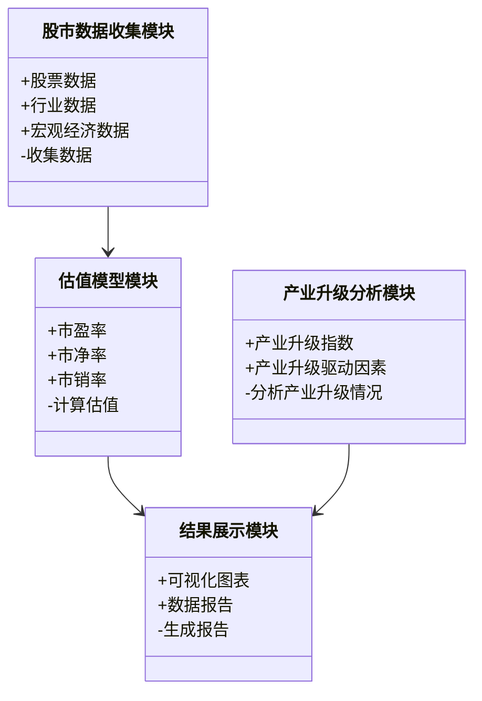
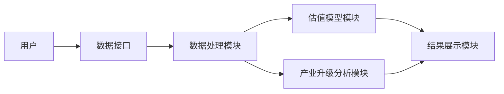
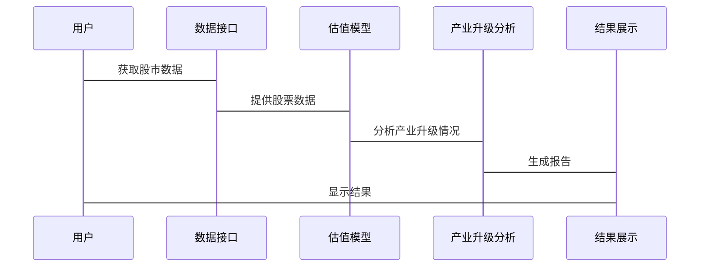

                 


# 新兴市场股市估值与产业升级的互动

## 关键词：
新兴市场、股市估值、产业升级、互动关系、经济分析

## 摘要：
本文深入探讨新兴市场股市估值与产业升级之间的互动关系，从理论到实践分析其相互影响，利用数学模型和系统架构设计优化估值和产业升级。

---

## 第一部分: 新兴市场股市估值与产业升级的背景与基础

### 第1章: 新兴市场的概念与发展

#### 1.1 新兴市场的定义与特征

- **新兴市场的定义**：经济快速增长、市场规模逐步扩大的发展中国家市场。
- **新兴市场的核心特征**：
  - 经济快速增长
  - 市场规模扩大
  - 产业升级需求强烈

#### 1.2 股市估值的基本理论

- **股市估值的定义**：评估公司股票的内在价值，判断其合理价格。
- **股市估值的意义**：帮助投资者做出决策，反映市场状况。

#### 1.3 产业升级的背景与内涵

- **产业升级的定义**：通过技术创新和管理优化提升产业竞争力。
- **产业升级的驱动因素**：
  - 技术进步
  - 市场需求变化
  - 政策支持

#### 1.4 新兴市场股市估值与产业升级的互动关系

- **互动关系的定义**：股市估值为产业升级提供资金支持，产业升级推动股市增长。

---

## 第二部分: 新兴市场股市估值的核心概念与方法

### 第2章: 新兴市场股市估值的核心概念与方法

#### 2.1 股市估值的核心概念

- **市盈率（P/E）**：股价与每股收益的比率，反映市场对公司的盈利预期。
- **市净率（P/B）**：股价与每股净资产的比率，适用于评估资产密集型行业。
- **市销率（P/S）**：股价与每股收入的比率，适用于成长型企业。

#### 2.2 股市估值的主要方法

- **基本分析法**：分析宏观经济、行业状况和公司财务数据。
- **技术分析法**：通过价格和成交量预测未来走势。
- **行业比较法**：与同行业公司进行对比分析。

#### 2.3 新兴市场的特殊性与估值挑战

- **数据特征**：数据波动大、不完整。
- **波动性**：市场波动剧烈，影响估值稳定性。
- **政策影响**：政策变化对股市估值有显著影响。

---

## 第三部分: 产业升级的核心概念与驱动因素

### 第3章: 产业升级的核心概念与驱动因素

#### 3.1 产业升级的核心概念

- **产业升级的定义**：通过技术创新和管理优化提升产业竞争力。
- **产业升级的分类**：
  - 技术驱动型
  - 市场需求型
  - 政策推动型

#### 3.2 产业升级的主要驱动因素

- **技术进步**：技术创新是产业升级的核心动力。
- **市场需求变化**：消费者需求变化推动产业升级。
- **政策支持**：政府政策为产业升级提供支持。

---

## 第四部分: 新兴市场股市估值与产业升级的互动分析

### 第4章: 新兴市场股市估值与产业升级的互动机制

#### 4.1 股市估值对产业升级的支持作用

- **资金支持**：股市为产业升级提供资金。
- **市场信号**：股市估值反映市场对产业升级的认可。

#### 4.2 产业升级对股市估值的反向影响

- **提升企业价值**：产业升级提升企业盈利能力和市场地位。
- **增加市场信心**：产业升级增强投资者信心，推高股价。

#### 4.3 互动关系的数学模型

- **模型定义**：建立产业升级对股市估值的数学模型。
- **公式推导**：通过回归分析模型，量化两者关系。
- **案例分析**：以某新兴市场为例，分析互动关系。

---

## 第五部分: 数学模型与算法原理

### 第5章: 数学模型与算法原理

#### 5.1 股市估值的数学模型

- **市盈率模型**：$$ P = E \times PE $$
- **市净率模型**：$$ P = B \times PB $$
- **市销率模型**：$$ P = S \times PS $$

#### 5.2 产业升级的数学模型

- **经济增长模型**：$$ GDP = A \times K^{α} \times L^{1-α} $$
- **产业升级指数**：$$ UI = \sum_{i=1}^{n} (R_i \times W_i) $$

#### 5.3 互动关系的回归分析模型

- **回归模型**：$$ Y = \beta X + \epsilon $$
- **案例分析**：通过具体案例验证模型的准确性。

---

## 第六部分: 系统分析与架构设计

### 第6章: 系统分析与架构设计

#### 6.1 问题场景介绍

- **问题描述**：新兴市场中，如何通过系统化的方法优化股市估值与产业升级的互动关系。
- **项目介绍**：构建一个分析系统，整合股市数据和产业升级数据，优化估值模型。

#### 6.2 系统功能设计

- **领域模型**：使用Mermaid绘制类图，展示系统各模块及其关系。



#### 6.3 系统架构设计

- **系统架构**：使用Mermaid绘制系统架构图，展示各模块之间的关系。



#### 6.4 系统接口设计

- **数据接口**：定义API接口，用于数据获取和模型调用。

#### 6.5 系统交互设计

- **交互流程**：使用Mermaid绘制交互序列图。



---

## 第七部分: 项目实战

### 第7章: 项目实战

#### 7.1 环境安装

- **安装Python**：确保安装了Python 3.8以上版本。
- **安装库**：使用pip安装pandas、numpy、matplotlib等库。

#### 7.2 核心实现源代码

- **数据收集代码**：读取CSV文件中的股市数据。

```python
import pandas as pd

# 读取数据
data = pd.read_csv('stock_data.csv')
print(data.head())
```

- **估值模型代码**：计算市盈率。

```python
# 计算市盈率
data['PE'] = data['Price'] / data['Earnings']
print(data['PE'].describe())
```

- **产业升级分析代码**：分析产业升级指数。

```python
import numpy as np

# 计算产业升级指数
factors = data[['Technology', 'Market Demand', 'Policy Support']]
UI = np.dot(factors, np.array([0.4, 0.3, 0.3]))
print(UI)
```

#### 7.3 案例分析与结果解读

- **案例分析**：以某新兴市场为例，分析股市估值与产业升级的互动关系。
- **结果解读**：解释分析结果，提出改进建议。

---

## 第八部分: 总结与展望

### 第8章: 总结与展望

#### 8.1 全文总结

- **总结内容**：回顾全文，强调股市估值与产业升级互动的重要性。

#### 8.2 研究展望

- **未来方向**：探讨更复杂模型的应用，如机器学习在互动关系中的应用。

#### 8.3 最佳实践 tips

- **数据来源**：建议使用高质量数据源。
- **模型选择**：根据实际情况选择合适的模型。
- **风险控制**：在投资中注意风险控制。

---

## 作者信息

作者：AI天才研究院/AI Genius Institute & 禅与计算机程序设计艺术 /Zen And The Art of Computer Programming

---

这篇文章系统地探讨了新兴市场股市估值与产业升级的互动关系，从理论到实践进行了详细分析，提供了丰富的案例和代码示例，帮助读者深入理解并应用相关知识。

