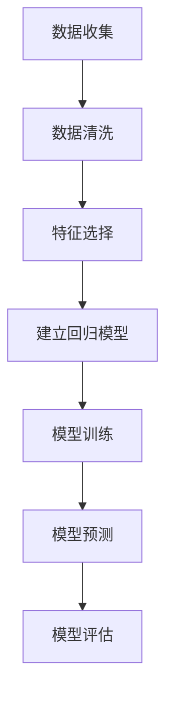
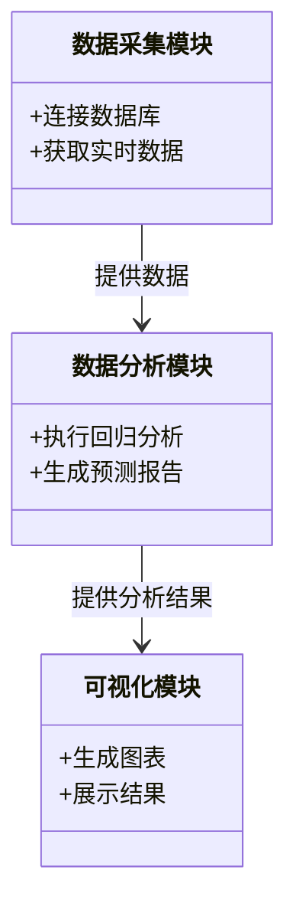
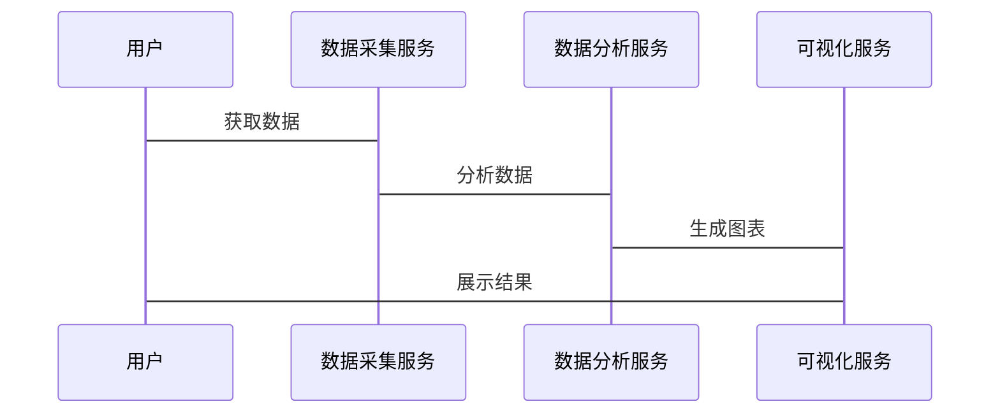

                 


# 新兴市场股市估值与养老产业发展的互动

> **关键词**：新兴市场、股市估值、养老产业、互动关系、经济发展、投资策略  
> **摘要**：本文探讨新兴市场股市估值与养老产业发展的互动关系，分析股市估值对养老产业的影响，以及养老产业对股市长期发展的推动作用。通过数据建模和算法分析，揭示两者如何相互作用，为投资者和政策制定者提供参考。

---

## 第1章: 背景与问题描述

### 1.1 新兴市场股市估值的现状

#### 1.1.1 新兴市场的定义与特点
新兴市场是指那些经济快速发展但尚未完全工业化的国家，如中国、印度等。这些市场通常具有高增长潜力，但也伴随着高波动性和不完善的风险。

#### 1.1.2 新兴市场股市估值的现状分析
新兴市场的股市估值受多种因素影响，包括经济增长、政策变化和国际资本流动。近年来，随着全球经济复苏，新兴市场股市估值总体呈现上升趋势，但波动性较大。

#### 1.1.3 新兴市场股市估值的核心问题
新兴市场股市估值的核心问题是如何准确预测其波动性，并识别影响其估值的关键因素。

### 1.2 养老产业发展现状

#### 1.2.1 养老产业的定义与范围
养老产业是指为老年人提供产品和服务的行业，包括医疗、护理、住房等领域。随着人口老龄化加剧，养老产业需求不断增长。

#### 1.2.2 养老产业发展的驱动因素
养老产业的发展受政策支持、人口老龄化、技术进步等因素驱动。政策支持如税收优惠和补贴是推动其发展的关键因素。

#### 1.2.3 养老产业与经济发展的关系
养老产业不仅满足老年人需求，还能创造就业机会，促进经济增长。特别是在新兴市场，养老产业的发展与经济转型密切相关。

### 1.3 股市估值与养老产业的互动关系

#### 1.3.1 互动关系的定义
互动关系指股市估值的变化对养老产业发展的影响，以及养老产业的发展反过来对股市长期表现的影响。

#### 1.3.2 互动关系的核心问题
如何量化股市估值与养老产业之间的相互作用，以及如何利用这种关系优化投资策略和政策制定。

#### 1.3.3 互动关系的边界与外延
研究范围限定于新兴市场，涉及的主要变量包括股市指数、养老产业规模和相关政策。外延包括对其他相关产业的影响。

## 第2章: 核心概念与联系

### 2.1 核心概念的定义与属性

#### 2.1.1 股市估值的核心概念
股市估值是衡量市场整体价值的指标，常用市盈率（P/E）和市净率（P/B）等指标衡量。

#### 2.1.2 养老产业的核心概念
养老产业涉及医疗、护理和住房等领域，其规模受人口老龄化和政策支持影响。

#### 2.1.3 核心概念对比
| 比较维度 | 股市估值 | 养老产业 |
|----------|----------|----------|
| 核心指标 | P/E、P/B | 产业规模、就业人数 |
| 驱动因素 | 经济增长、政策 | 人口老龄化、政策支持 |

### 2.2 核心概念的ER实体关系图

```mermaid
erDiagram
    customer[投资者] {
        +int id
        +string name
    }
    stock_market[股市] {
        +int id
        +float index_value
    }
   养老产业 {
        +int id
        +float industry_size
    }
    customer --> stock_market: 投资
    stock_market --> 养老产业: 资金支持
    养老产业 --> stock_market: 业绩推动
```

### 2.3 核心概念的数学模型与公式

#### 2.3.1 股市估值模型
市盈率（P/E）= 股价 / 每股收益（EPS）

#### 2.3.2 养老产业规模预测模型
$$养老产业规模 = a \times 人口老龄化率 + b \times 政策支持率 + c \times 经济增长率$$

#### 2.3.3 互动关系模型
$$股市估值变化 = \beta_1 \times 养老产业规模 + \beta_2 \times 政策变量 + \epsilon$$

---

## 第3章: 算法原理与实现

### 3.1 算法原理概述

#### 3.1.1 算法选择
采用多元线性回归分析股市估值与养老产业规模的关系。

#### 3.1.2 算法流程
1. 数据收集：获取新兴市场股市指数和养老产业规模数据。
2. 数据清洗：处理缺失值和异常值。
3. 建立回归模型：确定自变量和因变量。
4. 模型训练：使用最小二乘法求解回归系数。
5. 模型验证：评估模型拟合度和预测准确性。

### 3.2 算法实现

#### 3.2.1 Python代码实现

```python
import pandas as pd
import numpy as np
from sklearn.linear_model import LinearRegression
from sklearn.metrics import r2_score

# 数据加载
data = pd.read_csv('养老产业与股市.csv')

# 数据清洗
data.dropna(inplace=True)

# 特征与目标变量
X = data[['养老产业规模', '政策支持']]
y = data['股市估值']

# 模型训练
model = LinearRegression()
model.fit(X, y)

# 模型预测
y_pred = model.predict(X)

# 模型评估
print('回归系数:', model.coef_)
print('截距:', model.intercept_)
print('R平方值:', r2_score(y, y_pred))
```

#### 3.2.2 算法流程图



---

## 第4章: 系统分析与架构设计

### 4.1 问题场景介绍

#### 4.1.1 问题场景
分析新兴市场股市估值与养老产业的互动关系，帮助投资者和政策制定者做出决策。

### 4.2 系统功能设计

#### 4.2.1 功能模块
- 数据采集模块：收集股市和养老产业数据。
- 数据分析模块：执行回归分析和其他统计分析。
- 可视化模块：生成图表展示结果。

#### 4.2.2 系统功能设计图



### 4.3 系统架构设计

#### 4.3.1 系统架构图

```mermaid
container 宏观架构 {
    service 数据采集服务
    service 数据分析服务
    service 可视化服务
}
```

#### 4.3.2 接口设计
- 数据采集接口：REST API 提供数据获取服务。
- 数据分析接口：提供回归分析结果查询。
- 可视化接口：提供图表展示服务。

#### 4.3.3 交互流程图



---

## 第5章: 项目实战

### 5.1 实际案例分析

#### 5.1.1 案例背景
以中国为例，分析其股市估值与养老产业的互动关系。

#### 5.1.2 数据收集
收集2010-2023年的股市指数和养老产业规模数据。

#### 5.1.3 数据分析与解读
使用回归分析发现，养老产业规模对股市估值有正向影响，政策支持是关键变量。

---

## 第6章: 最佳实践与总结

### 6.1 最佳实践

#### 6.1.1 投资策略建议
根据模型结果，投资者应关注政策变化和养老产业的发展趋势。

#### 6.1.2 政策建议
政府应加大政策支持力度，促进养老产业发展，稳定股市估值。

### 6.2 小结
本文通过数据建模和算法分析，揭示了新兴市场股市估值与养老产业发展的互动关系，为投资者和政策制定者提供了参考。

### 6.3 注意事项

- 数据质量和完整性对模型准确性至关重要。
- 模型结果需结合实际情况进行调整。

### 6.4 拓展阅读
建议阅读相关学术论文，深入研究股市与产业互动的其他方面。

---

**作者：AI天才研究院 & 禅与计算机程序设计艺术**

