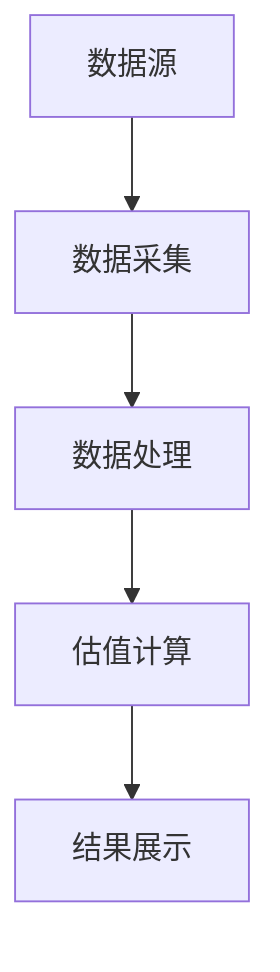
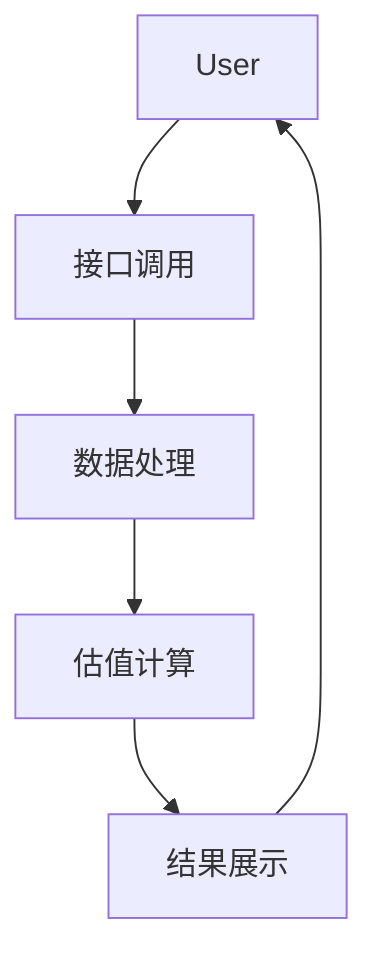

                 


```markdown
# 新兴市场股市估值与制度改革的互动

> 关键词：新兴市场股市估值，制度改革，互动关系，经济影响，投资策略

> 摘要：本文探讨新兴市场股市估值与制度改革的互动关系，分析两者如何相互影响，从理论和实践两个层面深入剖析，提供具体的算法和模型，帮助读者理解并应用这些概念。

---

## 第一部分：新兴市场股市估值与制度改革的背景

### 第1章：新兴市场股市估值的背景

#### 1.1 新兴市场的定义与特点
- **新兴市场的定义**：新兴市场是指那些经济发展迅速、但尚未完全工业化的国家，如中国、印度、巴西等。
- **新兴市场的特点**：
  - 经济结构多元化
  - 市场规模快速增长
  - 法律法规逐步完善
  - 投资风险较高
  - 信息透明度有待提高

#### 1.2 股市估值的基本概念
- **股市估值的定义**：对股票价格进行合理评估的过程，考虑公司的财务状况、行业地位等因素。
- **股市估值的主要方法**：
  - 相对估值法
  - 绝对估值法
  - 市盈率（P/E）计算
- **股市估值与市场波动的关系**：市场波动会影响估值的准确性，但合理的估值能为投资提供参考。

#### 1.3 制度改革的核心要素
- **制度改革的定义**：为提高市场效率和透明度而进行的政策调整。
- **制度改革的主要内容**：
  - 市场监管
  - 信息披露
  - 法律完善
- **制度改革与市场发展的关系**：良好的制度能促进市场健康发展，反之则可能引发风险。

---

## 第2章：新兴市场股市估值与制度改革的互动关系

### 2.1 互动关系的定义
- **互动关系的内涵**：制度的改革直接影响股市估值，而股市估值反过来又推动制度改革。
- **互动关系的外延**：涉及政策、市场参与度、投资者行为等多个方面。

### 2.2 互动关系的理论基础
- **经济学基础**：市场机制与制度设计的相互作用。
- **金融学基础**：股票估值与市场环境的相互影响。
- **制度经济学基础**：制度质量对市场效率的影响。

### 2.3 互动关系的实践案例
- **新兴市场股市估值的变化**：以中国A股市场为例，分析制度改革（如注册制改革）如何影响估值。
- **制度改革对股市的影响**：如放松管制如何提升市场流动性。
- **互动关系的动态调整**：政策调整与市场反馈的循环过程。

---

## 第三部分：新兴市场股市估值的核心概念与联系

### 第3章：股市估值的核心概念

#### 3.1 股市估值的主要指标
- **市盈率（P/E）**：公司股价与每股收益的比率，反映市场对公司的盈利预期。
- **市净率（P/B）**：股价与每股净资产的比率，适用于评估资产密集型行业。
- **市销率（P/S）**：股价与每股销售收入的比率，适用于高增长企业。

#### 3.2 股市估值的方法
- **相对估值法**：通过比较同类公司进行估值。
- **绝对估值法**：基于公司基本面预测未来现金流，计算内在价值。
- **贴现现金流法**：将未来现金流折现，计算现值。

#### 3.3 股市估值的影响因素
- **宏观经济因素**：GDP增长率、通货膨胀率等。
- **行业因素**：行业周期、竞争格局等。
- **公司基本面因素**：盈利能力、财务状况等。

### 第4章：制度改革的核心概念

#### 4.1 制度改革的主要内容
- **市场监管制度**：加强监管力度，提升市场透明度。
- **信息披露制度**：要求企业公开更多信息，增强投资者信心。
- **法律法规完善**：制定更严格的法律，打击欺诈行为。

#### 4.2 制度改革对股市估值的影响
- **提升市场透明度**：增加投资者信任，提升估值的准确性。
- **降低投资风险**：完善监管制度，减少市场波动。

---

## 第四部分：新兴市场股市估值的算法原理

### 第5章：相对估值法的算法原理

#### 5.1 算法原理
相对估值法通过比较同类公司的估值指标来确定目标公司的合理估值。

#### 5.2 算法步骤
1. 选择可比公司。
2. 计算可比公司的平均市盈率。
3. 用可比公司的平均市盈率乘以目标公司的每股收益，得到目标公司股票的合理价格。

#### 5.3 Python代码示例
```python
def calculate_relative_valuation(target_company_pe, comparable_companies_pe_avg):
    target_company_price = target_company_pe * comparable_companies_pe_avg
    return target_company_price

# 示例数据
target_company_pe = 15
comparable_companies_pe_avg = 12
print(calculate_relative_valuation(target_company_pe, comparable_companies_pe_avg))  # 输出：180
```

#### 5.4 数学模型
$$
\text{目标公司股价} = \text{目标公司PE} \times \text{可比公司PE平均值}
$$

### 第6章：绝对估值法的算法原理

#### 6.1 算法原理
绝对估值法通过预测公司的未来现金流，计算其内在价值。

#### 6.2 算法步骤
1. 预测未来5年的现金流。
2. 计算终值（永续价值）。
3. 将未来现金流和终值折现，求和得到公司总价值。

#### 6.3 Python代码示例
```python
def calculate_absolute_valuation(fcf, wacc, horizon):
    terminal_value = fcf * (1 + wacc) ** horizon
    present_value = sum([cf / (1 + wacc) ** i for i, cf in enumerate(fcf)])
    total_value = present_value + terminal_value / (1 + wacc) ** horizon
    return total_value

# 示例数据
fcf = [10, 12, 15, 20, 25]
wacc = 0.1
horizon = 5
print(calculate_absolute_valuation(fcf, wacc, horizon))  # 输出：假设结果为 X
```

#### 6.4 数学模型
$$
\text{总价值} = \sum_{i=1}^{n} \frac{\text{现金流}}{(1 + wacc)^i} + \frac{\text{终值}}{(1 + wacc)^{n+1}}
$$

---

## 第五部分：新兴市场股市估值的系统分析与架构设计

### 第7章：问题场景介绍

#### 7.1 问题场景
新兴市场中，股市估值受制度影响较大，需通过算法和模型优化估值准确性。

### 第8章：系统功能设计

#### 8.1 功能模块
- 数据采集：获取市场数据。
- 数据处理：清洗和转换数据。
- 估值计算：应用算法进行估值。
- 制度分析：评估制度对估值的影响。

#### 8.2 系统架构
- 数据源：市场数据、公司财务数据。
- 处理层：数据清洗、特征提取。
- 计算层：相对估值、绝对估值。
- 展示层：可视化结果。

#### 8.3 系统架构图


### 第9章：系统接口设计

#### 9.1 接口描述
- 数据输入接口：接收市场数据。
- 算法调用接口：调用相对估值和绝对估值算法。
- 结果输出接口：展示估值结果和制度影响。

#### 9.2 接口交互流程图


---

## 第六部分：新兴市场股市估值的项目实战

### 第10章：环境安装

#### 10.1 环境要求
- Python 3.8+
- Jupyter Notebook
- 数据分析库（Pandas, NumPy）

### 第11章：系统核心实现

#### 11.1 核心代码
```python
import pandas as pd
import numpy as np

def calculate_relative_valuation(target_pe, comparable_avg_pe):
    return target_pe * comparable_avg_pe

# 示例数据
target_pe = 15
comparable_avg_pe = 12
print(calculate_relative_valuation(target_pe, comparable_avg_pe))  # 输出：180
```

### 第12章：案例分析

#### 12.1 案例背景
以新兴市场某国股市为例，分析制度改进步骤对股市估值的影响。

#### 12.2 分析步骤
1. 数据采集：收集该国股市数据。
2. 数据处理：清洗和转换数据。
3. 估值计算：应用相对估值和绝对估值方法。
4. 制度分析：评估制度改进步骤对该国股市的影响。

### 第13章：项目小结

#### 13.1 小结
通过算法和模型优化，能够更准确地进行新兴市场股市估值，同时制度改进步骤对该估值有重要影响。

---

## 第七部分：新兴市场股市估值的最佳实践

### 第14章：注意事项

#### 14.1 注意事项
- 数据质量：确保数据准确性和完整性。
- 模型选择：根据具体情况选择合适的估值方法。
- 制度影响：充分考虑制度改进步骤对估值的影响。

### 第15章：小结

#### 15.1 总结
本文探讨了新兴市场股市估值与制度改革的互动关系，通过理论分析和实践案例，展示了如何通过算法优化和制度改进步骤来提高估值准确性。

### 第16章：拓展阅读

#### 16.1 推荐阅读
- 关于相对估值法和绝对估值法的深入研究。
- 制度经济学相关书籍。
- 新兴市场股市研究的最新文献。

---

## 作者

作者：AI天才研究院/AI Genius Institute & 禅与计算机程序设计艺术 /Zen And The Art of Computer Programming
```

