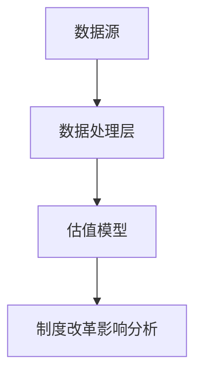

                 


# 新兴市场股市估值与制度改革的相关性

## 关键词：新兴市场、股市估值、制度改革、相关性、经济分析、数学模型

## 摘要：本文探讨新兴市场股市估值与制度改革之间的相关性，分析制度改革对股市估值的影响，构建数学模型进行实证分析，为优化市场提供理论依据和实践指导。

---

# 第1章 新兴市场的定义与特点

## 1.1 新兴市场的概念与范围

### 1.1.1 新兴市场的定义

新兴市场是指经济快速发展但尚未完全工业化的国家，具有较大的市场潜力和发展空间。这类市场通常包括巴西、印度、中国等国家。

### 1.1.2 新兴市场的经济特征

新兴市场具有人口基数大、经济增长快、基础设施逐步完善等特点。这些市场的经济结构多元化，涵盖制造业、服务业等多个领域。

### 1.1.3 新兴市场与发达市场的对比

与发达市场相比，新兴市场具有较高的增长潜力，但同时也面临更多的不确定性，如政策风险、市场波动等。

---

# 第2章 股市估值的基本原理

## 2.1 股市估值的核心概念

### 2.1.1 股票估值的定义

股票估值是对公司股票价值的评估，旨在确定其在市场上的合理价格。

### 2.1.2 估值的主要方法

- 市盈率（P/E）：市盈率=股价/每股收益。
- 市净率（P/B）：市净率=股价/每股净资产。
- 现金流折现模型（DCF）：基于未来现金流的现值计算股票价值。

### 2.1.3 估值的关键影响因素

影响股票估值的主要因素包括公司财务状况、行业竞争格局、宏观经济环境等。

---

# 第3章 制度改革的必要性与目标

## 3.1 制度改革的背景

### 3.1.1 新兴市场股市的现状

新兴市场股市通常存在流动性不足、信息不透明等问题，影响市场的稳定性和吸引力。

### 3.1.2 制度缺陷的表现

制度缺陷可能导致市场波动加剧、投资者信心不足等问题。

### 3.1.3 改革的必要性

通过制度改革，可以提升市场效率、增强投资者信心，促进股市的健康发展。

---

# 第4章 股市估值与制度改革的内在联系

## 4.1 制度改革对股市估值的影响

### 4.1.1 制度改革如何影响市场流动性

制度改革可以改善市场流动性，例如通过引入更多投资者或优化交易机制。

### 4.1.2 制度改革如何影响市场透明度

提高市场透明度可以增强投资者信心，进而影响股票估值。

### 4.1.3 制度改革如何影响市场参与者行为

制度改革可以规范市场行为，减少操纵和欺诈，提升市场整体估值水平。

---

# 第5章 核心概念的原理与特征对比

## 5.1 股市估值与制度改革的对比分析

### 5.1.1 股市估值的属性特征

- 数量化：股票价格可以通过具体数值衡量。
- 动态性：股票估值会随着市场变化而波动。
- 主观性：估值结果受投资者情绪和预期影响。

### 5.1.2 制度改革的属性特征

- 系统性：涉及多个方面的制度调整。
- 长期性：改革效果通常需要较长时间体现。
- 规范性：强调法律和规则的完善。

### 5.1.3 两者特征对比表格

| 特性    | 股市估值 | 制度改革 |
|---------|----------|----------|
| 数量化  | 是       | 否       |
| 动态性  | 是       | 否       |
| 主观性  | 是       | 否       |
| 系统性  | 否       | 是       |
| 长期性  | 否       | 是       |

---

# 第6章 实体关系与架构分析

## 6.1 ER实体关系图

```mermaid
er
    entity 股票估值 {
        key 股票代码
        属性 股票价格, 市盈率, 市净率
    }
    entity 制度改革 {
        key 改革措施
        属性 流动性提升, 透明度提高, 行为规范
    }
    股票估值 -- 改革措施: 影响关系
```

---

# 第7章 股市估值的数学模型

## 7.1 股票估值的核心公式

### 7.1.1 市盈率模型

市盈率（P/E）= 股价 / 每股收益

### 7.1.2 市净率模型

市净率（P/B）= 股价 / 每股净资产

### 7.1.3 现金流折现模型

股票价值 = 现金流的现值

---

# 第8章 制度改革的数学模型

## 8.1 制度改革效果的量化分析

### 8.1.1 制度改革对市场流动性的数学表达

流动性提升 = 改革措施 × 市场参与者增加率

### 8.1.2 制度改革对市场透明度的数学表达

透明度提高 = 改革措施 × 信息公幂数

### 8.1.3 制度改革对市场参与者行为的数学表达

行为规范 = 改革措施 × 规范程度

---

# 第9章 算法原理与流程图

## 9.1 算法原理

### 9.1.1 算法核心步骤

1. 收集新兴市场股市数据。
2. 构建估值模型。
3. 分析制度改革对估值的影响。
4. 得出结论。

### 9.1.2 算法的数学推导

$$ 股票价值 = \sum_{t=1}^{n} \frac{CF_t}{(1 + r)^t} $$

---

# 第10章 算法实现与代码分析

## 10.1 环境安装与配置

### 10.1.1 开发环境的选择

推荐使用Python和相关数据处理库。

### 10.1.2 必要库的安装与配置

安装Pandas、NumPy、Matplotlib等库。

---

# 第11章 系统分析与架构设计方案

## 11.1 问题场景介绍

### 11.1.1 项目介绍

构建一个新兴市场股市估值与制度改革的相关性分析系统。

### 11.1.2 系统功能设计

- 数据收集与处理。
- 估值模型构建。
- 制度改革影响分析。

### 11.1.3 系统架构设计



---

# 第12章 项目实战

## 12.1 环境安装与配置

### 12.1.1 开发环境的选择

推荐使用Jupyter Notebook进行分析。

### 12.1.2 必要库的安装与配置

安装Pandas、NumPy、Matplotlib等库。

---

# 第13章 最佳实践 tips、小结、注意事项、拓展阅读

## 13.1 小结

本文通过构建数学模型，分析了新兴市场股市估值与制度改革的相关性，为优化市场提供了理论依据。

## 13.2 注意事项

在实际操作中，需注意数据的准确性和模型的适用性。

## 13.3 拓展阅读

建议阅读相关领域的文献，深入理解制度改革对股市的影响。

---

作者：AI天才研究院/AI Genius Institute & 禅与计算机程序设计艺术 /Zen And The Art of Computer Programming

