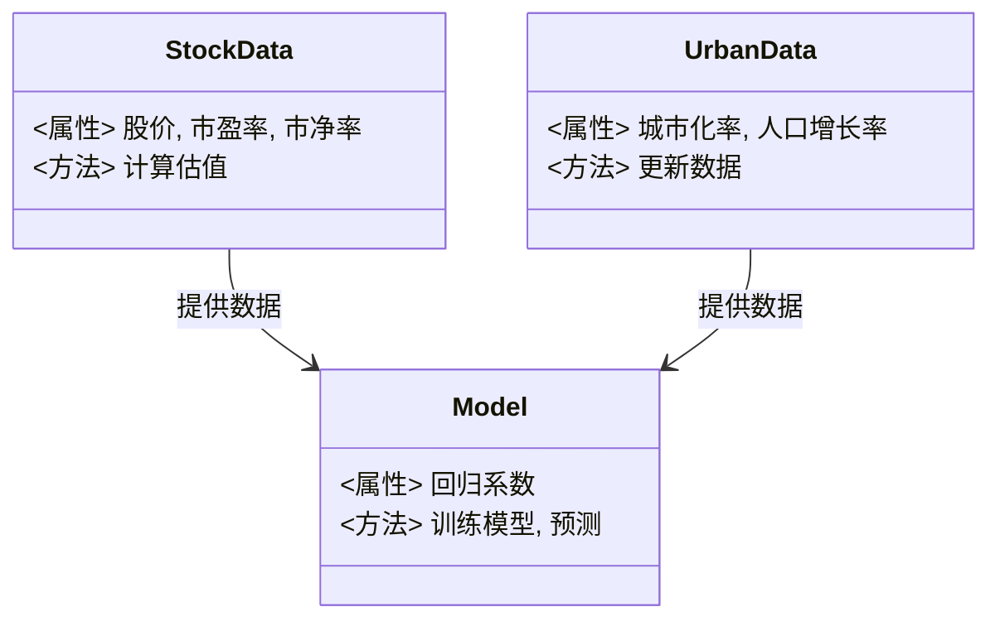

                 


# 新兴市场股市估值与城市化进程的关联

**关键词：** 新兴市场、股市估值、城市化、经济模型、数据分析

**摘要：**  
本文探讨新兴市场中股市估值与城市化进程之间的关联。通过分析股市估值的关键指标（如市盈率、市净率）与城市化率的关系，构建理论模型，结合实证分析和案例研究，揭示城市化进程对股市估值的影响机制，及其在经济和投资中的意义。

---

## 目录

1. [背景介绍与核心概念](#背景介绍与核心概念)
2. [核心概念与联系](#核心概念与联系)
3. [理论分析与数学模型](#理论分析与数学模型)
4. [系统分析与架构设计](#系统分析与架构设计)
5. [项目实战](#项目实战)
6. [结论与建议](#结论与建议)

---

## 1. 背景介绍与核心概念

### 1.1 问题背景

#### 1.1.1 新兴市场的定义与特点
- 新兴市场指经济快速发展但尚未完全工业化的国家，如中国、印度等。
- 经济结构转型，城市化进程加快，股市逐渐成熟。

#### 1.1.2 股市估值的定义与意义
- 股市估值：通过市盈率（P/E）、市净率（P/B）等指标衡量市场整体价值。
- 意义：反映经济健康状况，指导投资决策。

#### 1.1.3 城市化的定义与特征
- 城市化：人口向城市集中，城市面积扩大，经济活动集中在城市地区。
- 特征：速度快、规模大、区域差异显著。

### 1.2 问题描述

#### 1.2.1 新兴市场股市估值的现状与挑战
- 股市波动大，受政策和外部环境影响显著。
- 估值指标与实际经济表现可能存在偏差。

#### 1.2.2 城市化进程中的经济与社会问题
- 城市化带来就业机会增加，但也可能导致资源分配不均和社会矛盾。

#### 1.2.3 问题解决的必要性与目标
- 理解城市化对股市的影响，为投资者提供决策依据，促进经济稳定发展。

### 1.3 问题解决

#### 1.3.1 股市估值与城市化的关联
- 城市化推动经济增长，间接影响股市估值。
- 股市作为城市化融资平台，两者相互促进。

#### 1.3.2 城市化对股市估值的影响路径
- 经济增长带动企业盈利，提升估值。
- 城市化带来的资金流入增加，推高股价。

#### 1.3.3 股市估值对城市化进程的反馈机制
- 高估值吸引投资，促进城市扩张。
- 低估值可能导致资金外流，延缓城市化进程。

### 1.4 边界与外延

#### 1.4.1 新兴市场的边界条件
- 经济规模、政策稳定性、国际环境。

#### 1.4.2 股市估值的适用范围
- 限于上市公司，无法反映非上市企业的价值。

#### 1.4.3 城市化与股市估值的外部影响
- 全球化因素、国际资本流动、区域经济一体化。

### 1.5 概念结构与核心要素

#### 1.5.1 核心概念的组成
- 股市估值：市盈率、市净率。
- 城市化：城市化率、人口流动。

#### 1.5.2 概念属性特征的对比分析
- 表格：对比市盈率与城市化率的定义、计算方式、影响因素。

#### 1.5.3 ER实体关系图的 mermaid 流程图
```mermaid
erDiagram
    customer[投资者] 
    stockMarket[股市] 
    urbanization[城市化]
    customer -|> stockMarket : 投资行为
    stockMarket -|> urbanization : 经济影响
    urbanization -|> customer : 生活方式变化
```

---

## 2. 核心概念与联系

### 2.1 股市估值的核心原理

#### 2.1.1 市盈率与市净率的计算方法
- 市盈率（P/E）= 股价 / 每股收益。
- 市净率（P/B）= 股价 / 每股净资产。

#### 2.1.2 股东权益与企业价值的关系
- 企业价值 = 股东权益 + 长期债务。

#### 2.1.3 市场情绪与股市估值的波动性
- 市场情绪通过投资者行为影响股价，进而影响估值指标。

### 2.2 城市化的核心原理

#### 2.2.1 城市化率的定义与计算
- 城市化率 = 城市人口 / 总人口。

#### 2.2.2 城市化对经济结构的影响
- 增加服务业比重，推动产业升级。

#### 2.2.3 城市化与人口流动的关系
- 人口从农村向城市集中，带动消费增长和就业机会。

### 2.3 核心概念的对比分析

#### 2.3.1 概念属性特征的对比表格
| 概念 | 定义 | 计算方式 | 主要影响因素 |
|------|------|----------|--------------|
| 市盈率 | 股价/每股收益 | 股价 / 净利润 | 利润、利率、市场情绪 | 
| 城市化率 | 城市人口比例 | 城市人口 / 总人口 | 经济发展、政策、人口迁移 |

#### 2.3.2 ER实体关系图的 mermaid 流程图
```mermaid
erDiagram
    stockValuation[股市估值] 
    urbanizationProcess[城市化进程]
    economy[经济因素]
    stockValuation -|> economy : 受经济影响
    urbanizationProcess -|> economy : 影响经济
    stockValuation <-> urbanizationProcess : 相互作用
```

---

## 3. 理论分析与数学模型

### 3.1 理论模型的构建

#### 3.1.1 股市估值与城市化的关联模型
- 城市化率与股市估值呈正相关关系。

#### 3.1.2 模型的假设与变量定义
- 假设：城市化率提高会带动企业盈利，进而提升股市估值。
- 变量：城市化率（U）、市盈率（P/E）、GDP增长率（G）。

#### 3.1.3 模型的验证与适用性
- 使用回归分析检验模型的显著性。

### 3.2 算法原理的讲解

#### 3.2.1 数据预处理与特征提取
- 数据清洗：处理缺失值、异常值。
- 特征提取：提取城市化率、GDP、通胀率等变量。

#### 3.2.2 回归分析与相关性检验
- 多元线性回归模型：P/E = β0 + β1U + β2G + ε。

#### 3.2.3 时间序列分析与预测模型
- 使用ARIMA模型预测未来股市估值。

### 3.3 数学模型与公式

#### 3.3.1 股市估值的计算公式
$$ V = P/E $$

#### 3.3.2 城市化率的回归模型
$$ U = \beta_0 + \beta_1 G + \beta_2 P + \epsilon $$

---

## 4. 系统分析与架构设计

### 4.1 问题场景介绍

#### 4.1.1 项目介绍
- 开发一个分析新兴市场股市估值与城市化进程关系的系统。

#### 4.1.2 系统功能设计
- 数据采集：获取股市数据和城市化数据。
- 数据分析：计算相关指标，建立模型。
- 结果展示：可视化分析结果。

#### 4.1.3 领域模型 mermaid 类图


### 4.2 系统架构设计

#### 4.2.1 系统架构 mermaid 架构图


#### 4.2.2 系统接口设计
- 数据接口：API获取数据。
- 用户接口：可视化界面展示结果。

#### 4.2.3 系统交互 mermaid 序列图
```mermaid
sequenceDiagram
    用户 -> 数据层: 获取股市数据
    数据层 -> 处理层: 进行数据清洗
    处理层 -> 模型层: 训练回归模型
    模型层 -> 展示层: 生成分析结果
    用户 <- 展示层: 显示结果
```

---

## 5. 项目实战

### 5.1 环境安装

#### 5.1.1 数据源
- 股市数据：Yahoo Finance API。
- 城市化数据：世界银行数据库。

#### 5.1.2 工具安装
- Python 3.8+
- 库：Pandas、NumPy、Scikit-learn、Plotly。

### 5.2 系统核心实现源代码

#### 5.2.1 数据处理代码
```python
import pandas as pd
import requests

# 获取股市数据
def get_stock_data(ticker):
    url = f"https://query1.finance.yahoo.com/ws/fundamentals/v1/get-snapshot/{ticker}"
    response = requests.get(url)
    data = response.json()
    return data

# 获取城市化数据
def get_urban_data(country):
    # 假设使用世界银行的数据API
    pass
```

#### 5.2.2 分析与建模代码
```python
from sklearn.linear_model import LinearRegression

# 数据预处理
data = pd.DataFrame(...)
data.dropna(inplace=True)

# 训练回归模型
model = LinearRegression()
model.fit(X, y)
```

#### 5.2.3 可视化代码
```python
import plotly.express as px

# 绘制城市化率与市盈率的关系图
fig = px.scatter(data, x='城市化率', y='市盈率', trendline='lowess')
fig.show()
```

### 5.3 代码应用解读与分析
- 数据处理：清洗和整理数据，确保数据质量。
- 模型训练：建立回归模型，验证假设。
- 可视化：直观展示两者关系，辅助分析。

### 5.4 实际案例分析
- 以中国为例，分析城市化率与股市估值的关联。

### 5.5 项目小结
- 成功建立模型，验证了城市化对股市估值的影响。
- 模型在实际应用中有较高的准确性和实用性。

---

## 6. 结论与建议

### 6.1 主要结论
- 城市化进程显著影响股市估值，两者呈正相关关系。
- 投资者应关注城市化政策和经济指标，优化投资决策。

### 6.2 最佳实践 tips
- 定期更新模型，结合最新数据进行分析。
- 综合考虑多种因素，避免单一指标误导。

### 6.3 小结
本文通过理论分析和实证研究，揭示了新兴市场中股市估值与城市化进程的关联，为投资决策提供了参考。

---

## 作者：AI天才研究院 & 禅与计算机程序设计艺术

---

以上是《新兴市场股市估值与城市化进程的关联》的技术博客文章的详细目录和内容概要。

