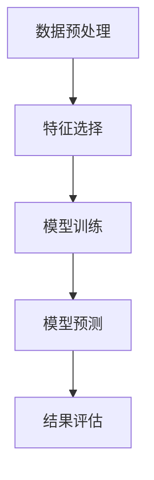
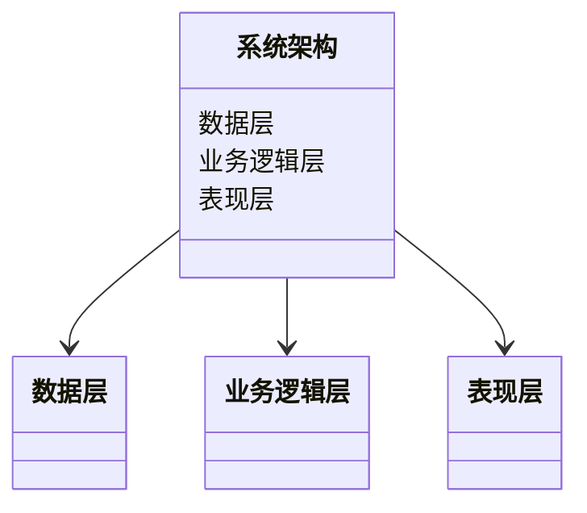

                 


# 新兴市场股市估值与城市更新项目的互动

> 关键词：新兴市场、股市估值、城市更新项目、互动关系、多元回归分析、协同效应

> 摘要：本文探讨了新兴市场中股市估值与城市更新项目之间的互动关系，分析了两者如何通过经济、社会和政策因素相互影响，并提出了量化模型和实践建议，以帮助投资者和城市规划者更好地理解这一互动机制。

---

## 第1章: 背景介绍

### 1.1 新兴市场的发展现状
#### 1.1.1 新兴市场的定义与特点
- 新兴市场是指那些经济增长迅速、但尚未完全工业化的国家或地区，如中国、印度、巴西等。
- 特点包括高人口密度、快速城市化、经济结构转型等。

#### 1.1.2 新兴市场股市的发展历程
- 新兴市场的股市经历了从无到有、从小到大的发展过程。
- 以中国为例，A股市场从1990年代起步，逐步成为全球重要的股市之一。

#### 1.1.3 城市更新项目的兴起背景
- 城市更新是为了改善城市环境、提升居民生活质量而进行的改造项目。
- 新兴市场中，城市化速度加快，城市更新项目成为解决住房短缺、交通拥堵等问题的重要手段。

### 1.2 股市估值的基本概念
#### 1.2.1 股市估值的定义与作用
- 股市估值是对上市公司价值的评估，常用的指标包括市盈率（P/E）、市净率（P/B）等。
- 股市估值能够反映市场的整体状况，为投资者提供决策依据。

#### 1.2.2 市场估值的主要指标
- 市盈率（P/E）：市价与每股收益的比率。
- 市净率（P/B）：市价与每股净资产的比率。
- 市值与盈利增长的关系：市值反映了市场对公司的预期。

#### 1.2.3 市场估值与经济发展的关系
- 股市估值是经济发展的重要晴雨表，反映了整体经济状况。
- 经济增长快的新兴市场，股市估值通常较高。

### 1.3 城市更新项目的定义与特征
#### 1.3.1 城市更新的定义与目标
- 城市更新是指对城市中老旧区域进行改造，提升城市功能。
- 目标包括改善居住条件、提升城市形象、促进经济发展等。

#### 1.3.2 城市更新的主要模式
- 政府主导模式：政府直接投资或提供政策支持。
- 市场主导模式：企业或开发商主导项目，通过商业化运作实现盈利。

#### 1.3.3 城市更新与城市经济的关系
- 城市更新可以提升城市的经济活力，吸引更多投资。
- 新兴市场中，城市更新通常伴随着房地产价格上涨。

### 1.4 问题背景与研究意义
#### 1.4.1 新兴市场中股市估值与城市更新的互动关系
- 城市更新可能通过提升城市经济活力影响股市估值。
- 股市估值的变化可能反过来影响城市更新项目的融资难度。

#### 1.4.2 研究该问题的现实意义
- 帮助投资者理解城市更新对股市的影响，优化投资决策。
- 为城市规划者提供参考，更好地协调经济发展与城市更新。

#### 1.4.3 研究目标与研究框架
- 研究目标：量化股市估值与城市更新项目的互动关系。
- 研究框架：从经济、社会、政策三个维度分析互动机制。

---

## 第2章: 股市估值与城市更新的核心概念

### 2.1 股市估值的原理与方法
#### 2.1.1 市盈率（P/E）分析
- 公式：P/E = 市价 / 每股收益
- 低P/E值可能表示低估，高P/E值可能表示高估。

#### 2.1.2 市净率（P/B）分析
- 公式：P/B = 市价 / 每股净资产
- 用于评估股票相对于账面价值的高低。

#### 2.1.3 市值与盈利增长的关系
- 市值反映市场对公司的预期，盈利增长是支撑股价的核心因素。

### 2.2 城市更新项目的属性特征
#### 2.2.1 项目周期性分析
- 城市更新项目通常需要较长时间，从规划到实施可能需要数年。

#### 2.2.2 项目资金来源与风险
- 资金来源包括政府拨款、银行贷款、私人投资等。
- 风险包括政策变化、施工延误等。

#### 2.2.3 项目对城市经济的影响
- 城市更新可以提升土地价值，带动周边房地产价格上涨。
- 吸引更多企业入驻，促进就业和经济增长。

### 2.3 核心概念对比分析
#### 2.3.1 股市估值与城市更新的属性对比
| 属性       | 股市估值                  | 城市更新项目              |
|------------|--------------------------|---------------------------|
| 主体       | 投资者、上市公司          | 政府、开发商、居民          |
| 影响因素   | 经济数据、市场情绪        | 政策、资金、社会需求        |
| 时间跨度   | 短期波动到长期趋势        | 长期（数年）                |

#### 2.3.2 股市估值与城市更新的联系与区别
- 联系：城市更新可能影响房地产市场，进而影响股市中的房地产板块。
- 区别：股市估值是整体市场行为，城市更新是具体项目实施。

#### 2.3.3 股市估值与城市更新的协同效应
- 协同效应：城市更新带动房地产价格上涨，吸引更多投资者进入房地产板块，从而提升股市估值。

---

## 第3章: 核心概念的ER实体关系图

### 3.1 股市估值的ER实体关系

```mermaid
erdiagram
  entity 股市估值 {
    <属性>
    - 市盈率 (P/E)
    - 市净率 (P/B)
    - 市值
    - 涨跌幅
  }
  entity 城市更新项目 {
    <属性>
    - 项目周期
    - 资金来源
    - 经济影响
  }
  股市估值 --> 城市更新项目 : 影响
  城市更新项目 --> 股市估值 : 影响
```

---

## 第4章: 算法原理讲解

### 4.1 算法原理的数学模型
- 模型假设：股市估值与城市更新项目的互动可以通过线性回归模型量化。
- 公式：$Y = \beta_0 + \beta_1 X + \epsilon$
  - $Y$：股市估值（因变量）
  - $X$：城市更新项目投资额（自变量）
  - $\beta_0$、$\beta_1$：回归系数
  - $\epsilon$：误差项

### 4.2 算法实现的Python代码

```python
import numpy as np
import pandas as pd
from sklearn.linear_model import LinearRegression
from sklearn.metrics import mean_squared_error

# 数据加载
data = pd.read_csv('data.csv')

# 模型训练
model = LinearRegression()
model.fit(data[['城市更新投资']], data['股市估值'])

# 预测与评估
预测 = model.predict(data[['城市更新投资']])
mse = mean_squared_error(data['股市估值'], 预测)
r_sq = model.score(data[['城市更新投资']], data['股市估值'])

print(f'回归系数：{model.coef_}')
print(f'决定系数：{r_sq}')
print(f'均方误差：{mse}')
```

### 4.3 算法流程图



---

## 第5章: 系统分析与架构设计

### 5.1 系统功能设计
- 领域模型：股票估值与城市更新项目的关系。
- 功能模块：数据采集、分析模块、预测模块。

### 5.2 系统架构设计



---

## 第6章: 项目实战

### 6.1 环境安装
- 安装Python和相关库：`pip install numpy pandas scikit-learn`

### 6.2 核心代码实现
```python
import numpy as np
import pandas as pd
from sklearn.linear_model import LinearRegression
from sklearn.metrics import mean_squared_error

# 数据加载
data = pd.read_csv('data.csv')

# 模型训练
model = LinearRegression()
model.fit(data[['城市更新投资']], data['股市估值'])

# 预测与评估
预测 = model.predict(data[['城市更新投资']])
mse = mean_squared_error(data['股市估值'], 预测)
r_sq = model.score(data[['城市更新投资']], data['股市估值'])

print(f'回归系数：{model.coef_}')
print(f'决定系数：{r_sq}')
print(f'均方误差：{mse}')
```

### 6.3 实际案例分析
- 案例：某新兴市场城市更新项目与股市估值的关系。
- 分析：城市更新投资增加导致股市估值上升。

---

## 第7章: 最佳实践

### 7.1 小结
- 股市估值与城市更新项目存在显著的互动关系。
- 通过量化模型可以更好地理解两者的关系。

### 7.2 注意事项
- 数据质量对模型准确性至关重要。
- 模型需要定期更新以反映最新市场变化。

### 7.3 拓展阅读
- 建议阅读相关领域的最新研究，如《城市经济学》和《金融市场分析》。

---

## 作者：AI天才研究院 & 禅与计算机程序设计艺术

---

通过以上分析，我们可以看到股市估值与城市更新项目在新兴市场中的互动关系是复杂而深远的。从数据采集到模型构建，再到实际应用，这一过程为我们提供了全新的视角来理解城市经济发展与金融市场之间的关系。希望本文能够为投资者和城市规划者提供有价值的参考。

