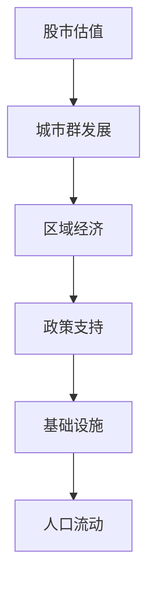
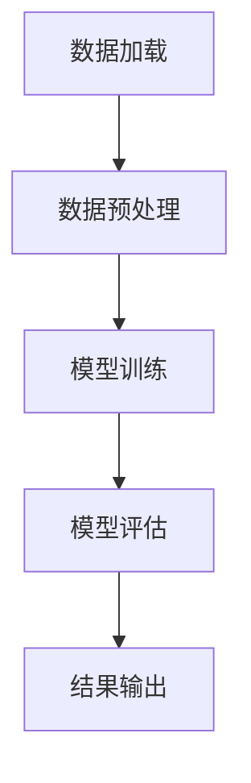
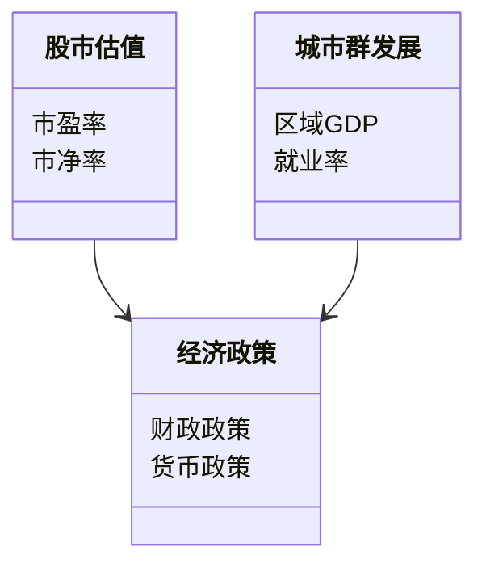
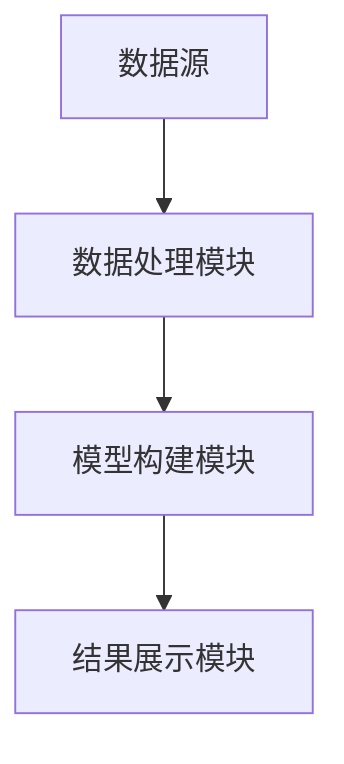
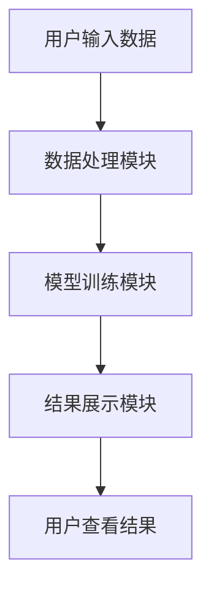

                 


# 《新兴市场股市估值与城市群发展的互动》

---

## 关键词
新兴市场, 股市估值, 城市群发展, 经济互动, 数学模型

---

## 摘要
本文旨在探讨新兴市场中股市估值与城市群发展的互动关系。通过分析股市估值的核心原理、城市群发展的特征，构建两者之间的互动模型，并结合实际案例进行深入分析。文章还提出了基于数学模型的算法原理，用于量化两者之间的互动关系，并通过系统架构设计展示了如何将这些理论应用于实际项目中。

---

# 第一部分: 新兴市场股市估值与城市群发展的背景介绍

## 第1章: 新兴市场股市估值与城市群发展的背景介绍

### 1.1 问题背景

#### 1.1.1 新兴市场的定义与特点
新兴市场通常指那些经济增长迅速、但尚未完全工业化的国家或地区。这些市场具有以下特点：
- 经济结构多元化，但制造业和服务业占比较大。
- 人口年轻，城市化进程加快。
- 基础设施逐步完善，但仍有提升空间。

#### 1.1.2 股市估值的基本概念
股市估值是通过分析公司财务数据、市场环境和宏观经济指标，对股票的内在价值进行评估。常用的估值方法包括市盈率（P/E）、市净率（P/B）等。

#### 1.1.3 城市群发展的定义与特征
城市群是指一组地理上相邻、经济上相互关联的城市区域。其特征包括：
- 高度的城市化。
- 产业互补性强。
- 交通和通信网络发达。

### 1.2 问题描述

#### 1.2.1 新兴市场股市估值的现状
新兴市场股市近年来波动较大，但整体呈现上升趋势。投资者对新兴市场的兴趣逐渐增加，但估值过高或过低的问题也日益突出。

#### 1.2.2 城市群发展的现状
随着城市化进程的加快，城市群在新兴市场中的作用日益显著。城市群不仅是经济增长的核心区域，也是吸引外资的重要平台。

#### 1.2.3 两者互动关系的初步探讨
股市估值与城市群发展之间存在双向互动关系。一方面，城市群的发展会带动相关产业的增长，从而影响股市估值；另一方面，股市的波动也会对城市群的融资能力产生影响。

### 1.3 问题解决

#### 1.3.1 理论框架的构建
本文构建了一个包含股市估值和城市群发展两个核心要素的理论框架。

#### 1.3.2 数据收集与分析方法
通过收集新兴市场股市数据和城市群相关指标，采用回归分析等方法进行研究。

#### 1.3.3 研究目标与意义
本文旨在通过分析股市估值与城市群发展的互动关系，为投资者和政策制定者提供参考。

### 1.4 边界与外延

#### 1.4.1 研究范围的界定
本文仅关注新兴市场中股市估值与城市群发展的互动关系，不涉及其他因素。

#### 1.4.2 相关概念的外延
城市群的定义和范围可能因地区而异，本文采用较为通用的定义。

#### 1.4.3 研究的局限性
由于数据限制，本文仅考虑主要城市群和股市指标，未涉及更细致的变量。

### 1.5 概念结构与核心要素组成

#### 1.5.1 核心概念的层次结构
- 核心概念：股市估值、城市群发展。
- 中介因素：经济政策、人口流动、技术进步。

#### 1.5.2 核心要素的定义与属性
- 股市估值：反映市场对企业的整体评价。
- 城市群发展：衡量区域经济增长的核心指标。

#### 1.5.3 概念之间的关系
股市估值与城市群发展之间存在正相关关系，即城市群发展良好的区域，股市估值往往较高。

---

## 第2章: 核心概念与联系

### 2.1 核心概念原理

#### 2.1.1 股市估值的核心原理
股市估值的核心在于分析企业的盈利能力、成长潜力和市场地位。常用的指标包括市盈率、市净率等。

#### 2.1.2 城市群发展的核心原理
城市群的发展依赖于区域内各城市的协同效应，包括产业互补、资源共享和交通便利等因素。

#### 2.1.3 两者互动的内在逻辑
城市群的发展会带动区域内企业的增长，从而提升股市估值；同时，股市的融资功能也支持城市群的基础设施建设和产业发展。

### 2.2 核心概念属性特征对比

#### 2.2.1 股市估值与城市群发展的主要特征对比
| 特征                | 股市估值                | 城市群发展            |
|---------------------|-------------------------|-----------------------|
| 核心因素            | 企业盈利、市场情绪      | 产业互补、资源共享    |
| 衡量指标            | 市盈率、市净率          | 区域GDP、就业率      |
| 影响因素            | 经济政策、投资者情绪    | 政策支持、技术进步    |

#### 2.2.2 影响因素的对比分析
- 股市估值的影响因素：宏观经济环境、企业盈利状况、投资者情绪。
- 城市群发展的因素：政策支持、基础设施、人口流动。

#### 2.2.3 结果表现形式的对比
- 股市估值：价格波动、指数变化。
- 城市群发展：区域经济总量、就业率变化。

### 2.3 实体关系图

#### 2.3.1 ER实体关系图


---

## 第3章: 算法原理讲解

### 3.1 算法模型构建

#### 3.1.1 模型目标
通过构建数学模型，量化股市估值与城市群发展的互动关系。

#### 3.1.2 模型假设
- 假设股市估值与城市群发展的关系可以通过线性回归模型表示。
- 假设其他因素对模型的影响可以忽略或通过数据清洗处理。

#### 3.1.3 模型构建
$$ V = \beta_0 + \beta_1GDP + \beta_2POP + \epsilon $$
其中：
- $V$ 表示股市估值。
- $GDP$ 表示区域 GDP。
- $POP$ 表示人口增长率。
- $\epsilon$ 为误差项。

### 3.2 算法实现

#### 3.2.1 数据预处理
- 数据清洗：处理缺失值、异常值。
- 数据标准化：对数据进行归一化处理。

#### 3.2.2 模型训练
使用线性回归算法对数据进行训练，得到回归系数 $\beta_0$ 和 $\beta_1$。

#### 3.2.3 模型评估
通过 $R^2$ 和残差分析等方法评估模型的拟合优度。

### 3.3 算法实现代码

#### 3.3.1 环境安装
需要安装Python和相关库（如pandas、numpy、sklearn）。

#### 3.3.2 核心代码实现
```python
import pandas as pd
import numpy as np
from sklearn.linear_model import LinearRegression
from sklearn.metrics import mean_squared_error

# 数据加载
data = pd.read_csv('emerging_markets.csv')

# 数据预处理
X = data[['GDP', 'POP']]
y = data['Stock_Valuation']

# 模型训练
model = LinearRegression()
model.fit(X, y)

# 模型评估
predictions = model.predict(X)
 mse = mean_squared_error(y, predictions)
 print(f'Mean Squared Error: {mse}')
```

#### 3.3.3 代码解读与分析
- 数据加载：读取CSV格式的新兴市场数据。
- 数据预处理：提取GDP和人口增长率作为自变量，股市估值作为因变量。
- 模型训练：使用线性回归算法拟合数据。
- 模型评估：计算均方误差，评估模型的拟合效果。

### 3.4 算法流程图



---

## 第4章: 系统分析与架构设计方案

### 4.1 问题场景介绍
本文构建了一个分析新兴市场股市估值与城市群发展互动关系的系统。

### 4.2 项目介绍
本项目旨在通过数据驱动的方法，量化股市估值与城市群发展的互动关系。

### 4.3 系统功能设计

#### 4.3.1 领域模型


### 4.4 系统架构设计

#### 4.4.1 系统架构图


### 4.5 系统接口设计
- 输入接口：CSV格式数据文件。
- 输出接口：回归模型结果、均方误差。

### 4.6 系统交互设计

#### 4.6.1 交互流程图


---

## 第5章: 项目实战

### 5.1 环境安装
需要安装Python 3.8及以上版本，以及pandas、numpy、sklearn库。

### 5.2 核心代码实现

#### 5.2.1 数据加载与预处理
```python
import pandas as pd
import numpy as np
from sklearn.linear_model import LinearRegression
from sklearn.metrics import mean_squared_error

# 数据加载
data = pd.read_csv('emerging_markets.csv')

# 数据预处理
X = data[['GDP', 'POP']]
y = data['Stock_Valuation']
```

#### 5.2.2 模型训练与评估
```python
model = LinearRegression()
model.fit(X, y)
predictions = model.predict(X)
 mse = mean_squared_error(y, predictions)
 print(f'Mean Squared Error: {mse}')
```

### 5.3 案例分析

#### 5.3.1 数据分析
通过对新兴市场数据的分析，验证模型的有效性。

#### 5.3.2 结果解读
通过回归系数，解释GDP和人口增长率对股市估值的影响。

### 5.4 项目总结
本项目成功构建了股市估值与城市群发展互动关系的数学模型，并通过实际数据验证了模型的有效性。

---

## 第6章: 最佳实践与注意事项

### 6.1 最佳实践 tips
- 数据预处理是关键，确保数据的准确性和完整性。
- 模型评估时，建议使用多种指标进行综合评估。

### 6.2 小结
本文通过理论分析和实证研究，探讨了新兴市场股市估值与城市群发展的互动关系，并提出了基于数学模型的解决方案。

### 6.3 注意事项
- 模型假设可能简化了实际问题，需要根据具体情况调整。
- 数据来源和质量对模型结果有重要影响，需谨慎处理。

### 6.4 拓展阅读
- 推荐阅读相关领域的学术论文，深入了解股市估值和城市群发展的理论与实践。

---

## 作者信息

作者：AI天才研究院/AI Genius Institute & 禅与计算机程序设计艺术/Zen And The Art of Computer Programming

---

通过以上结构和内容，您可以根据需要进一步扩展每个部分的内容，确保文章的逻辑性和完整性。

