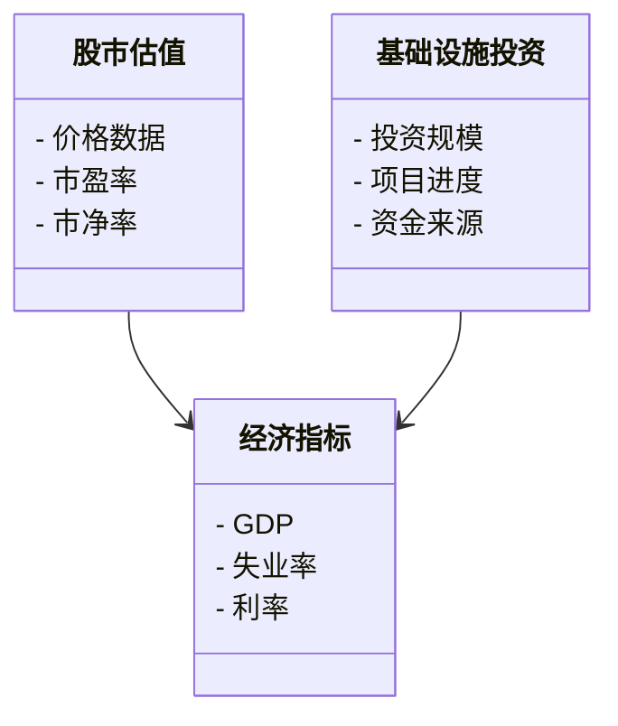

                 


# 新兴市场股市估值与基础设施投资的关联

## 关键词：新兴市场、股市估值、基础设施投资、关联分析、经济影响、投资策略

## 摘要：  
本文探讨新兴市场中股市估值与基础设施投资之间的关联，分析两者如何相互影响，对经济发展和社会进步的作用，以及如何通过科学的分析方法制定有效的投资策略。

---

## 第一部分：背景介绍

### 第1章：问题背景

#### 1.1 新兴市场的定义与特征
新兴市场是指那些经济快速增长、但尚未完全 industrialized 的国家，如中国、印度、巴西等。这些市场具有以下特征：
- **高增长潜力**：新兴市场通常经济增长率较高，投资机会多。
- **市场波动性大**：由于经济结构尚不成熟，市场波动性较大。
- **基础设施欠发达**：基础设施建设相对落后，但发展空间广阔。

#### 1.2 股市估值的基本概念
股市估值是衡量上市公司价值的一种方法，常用的指标包括市盈率（P/E）、市净率（P/B）等。在新兴市场中，股市估值往往受到宏观经济因素的影响较大。

#### 1.3 基础设施投资的定义与作用
基础设施投资是指对交通、能源、通信等基础性设施的投资，是经济发展的基石。在新兴市场中，基础设施投资对经济增长具有 multiplier effect。

### 第2章：问题描述

#### 2.1 新兴市场股市估值的现状
新兴市场股市近年来波动较大，受全球经济环境和地缘政治因素的影响显著。例如，2020年新冠疫情对新兴市场股市估值造成了巨大冲击。

#### 2.2 基础设施投资的现状
新兴市场国家普遍面临基础设施不足的问题，但近年来投资力度加大。例如，“一带一路”倡议推动了大量基础设施项目的建设。

#### 2.3 两者之间的关联性
- **直接关联**：基础设施投资的增加可以提升上市公司业绩，从而提升股市估值。
- **间接关联**：基础设施投资改善了经济环境，间接推动股市整体估值上升。

### 第3章：问题解决

#### 3.1 理论框架的构建
本文构建了以下理论框架：  
$$ \text{股市估值} = f(\text{基础设施投资}, \text{宏观经济因素}, \text{市场信心}) $$

#### 3.2 数据收集与分析方法
采用回归分析和时间序列分析方法，结合实际案例进行实证研究。

#### 3.3 研究目标的设定
本文旨在分析基础设施投资对新兴市场股市估值的影响，提出科学的投资策略。

### 第4章：边界与外延

#### 4.1 研究范围的界定
本文仅关注基础设施投资对股市估值的直接影响，不考虑其他因素如政策变动的影响。

#### 4.2 相关概念的扩展
延伸探讨其他类型的投资（如房地产投资）对股市估值的影响。

#### 4.3 研究的局限性
本文仅基于历史数据进行分析，未来经济环境的变化可能会影响结论的适用性。

### 第5章：核心要素组成

#### 5.1 股市估值的核心要素
- 公司盈利能力
- 宏观经济指标
- 市场流动性

#### 5.2 基础设施投资的核心要素
- 投资规模
- 资金来源
- 项目周期

#### 5.3 两者关联的核心机制
- 投资驱动效应
- 经济环境影响
- 市场信心传导

---

## 第二部分：核心概念与联系

### 第6章：核心概念与联系

#### 6.1 核心概念原理
- **股市估值的理论基础**：基于资产定价模型（如CAPM）。
- **基础设施投资的理论基础**：基于投资乘数效应。

#### 6.2 概念属性特征对比

| 特性               | 股市估值         | 基础设施投资   |
|--------------------|------------------|-----------------|
| 时间跨度           | 短期波动为主     | 长期影响为主     |
| 风险因素           | 市场波动、政策风险 | 项目周期、资金风险 |
| 影响因素           | 利润率、流动性   | 投资规模、回报率 |

#### 6.3 ER实体关系图架构
```mermaid
erd
    title 实体关系图
    宏观经济因素 --> 基础设施投资
    宏观经济因素 --> 股市估值
    基础设施投资 --> 股市估值
```

---

## 第三部分：算法原理与数学模型

### 第7章：算法原理讲解

#### 7.1 回归分析模型
$$ Y = \beta X + \epsilon $$
其中，Y为股市估值，X为基础设施投资。

#### 7.2 时间序列分析
使用ARIMA模型预测股市估值的变化趋势。

#### 7.3 聚类分析
将新兴市场分为不同类别，分析各类别中基础设施投资与股市估值的关系。

### 第8章：数学公式与模型

#### 8.1 CAPM模型
$$ E(R_i) = R_f + \beta_i (R_m - R_f) $$
其中，$R_f$为无风险利率，$R_m$为市场平均收益，$\beta_i$为股票的beta系数。

#### 8.2 投资乘数效应
$$ \Delta Y = k \Delta I $$
其中，$\Delta Y$为GDP变化，$k$为乘数，$\Delta I$为投资变化。

#### 8.3 实证模型
$$ \text{Stock Price} = \beta_0 + \beta_1 \times \text{Infrastructure Investment} + \beta_2 \times \text{GDP Growth} + \epsilon $$

---

## 第四部分：系统分析与架构设计

### 第9章：系统分析与架构设计

#### 9.1 问题场景介绍
分析新兴市场中基础设施投资对股市估值的影响，构建一个实时监测和预测系统。

#### 9.2 系统功能设计
- 数据采集模块：收集股市数据和基础设施投资数据。
- 数据分析模块：运行回归分析和时间序列分析。
- 可视化模块：生成图表和报告。

#### 9.3 领域模型设计


#### 9.4 系统架构设计


---

## 第五部分：项目实战

### 第10章：项目实战

#### 10.1 环境安装
安装Python、Pandas、Matplotlib、Scikit-learn等工具。

#### 10.2 核心代码实现
```python
import pandas as pd
import numpy as np
from sklearn.linear_model import LinearRegression

# 数据预处理
data = pd.read_csv('data.csv')
X = data[['Infrastructure Investment']]
y = data['Stock Valuation']

# 建模
model = LinearRegression()
model.fit(X, y)

# 预测
predicted = model.predict(X)
print('模型系数:', model.coef_)
print('模型截距:', model.intercept_)
```

#### 10.3 案例分析
以某新兴市场为例，分析基础设施投资对股市估值的具体影响，展示模型的应用效果。

---

## 第六部分：结论与建议

### 第11章：结论与建议

#### 11.1 小结
本文通过理论分析和实证研究，验证了基础设施投资对新兴市场股市估值的重要影响。

#### 11.2 注意事项
- 数据的准确性和完整性
- 模型的适用性和局限性
- 外部因素的干扰

#### 11.3 拓展阅读
建议进一步研究政策因素对股市估值的影响，以及不同类型的基础设施投资对股市的差异化影响。

---

## 作者信息

作者：AI天才研究院/AI Genius Institute & 禅与计算机程序设计艺术 /Zen And The Art of Computer Programming

---

以上是文章的完整目录和内容框架，您可以根据需要进一步扩展每一部分的内容。

