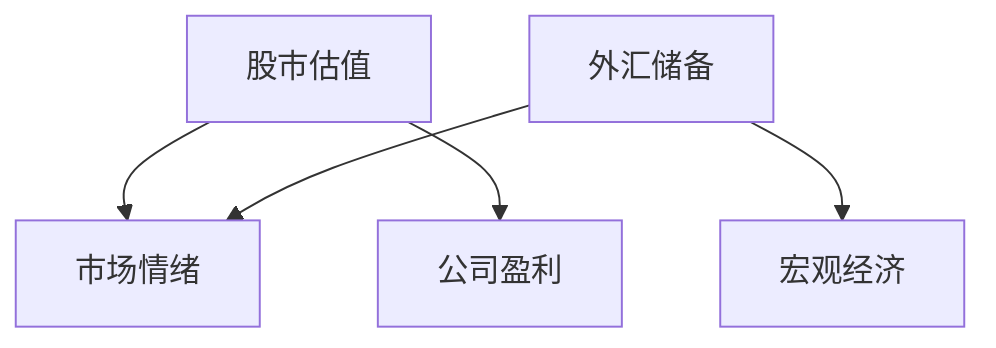
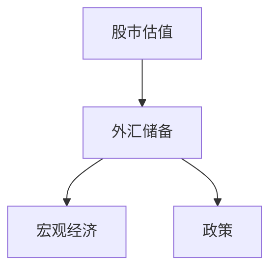
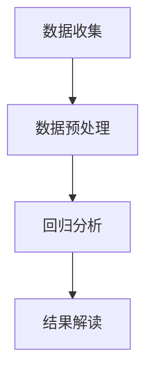
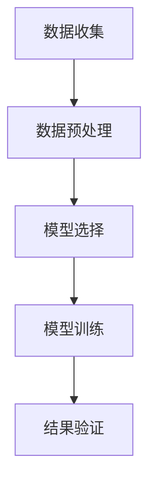
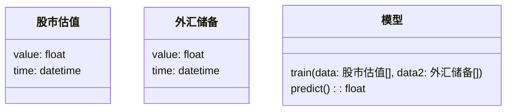
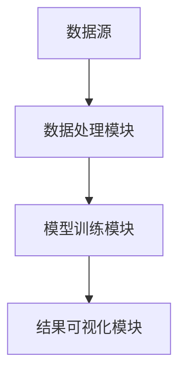
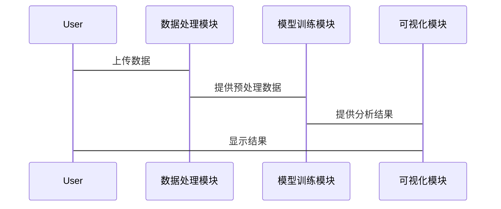

                 


# 新兴市场股市估值与外汇储备的关联

## 关键词：新兴市场、股市估值、外汇储备、关联性、统计分析、算法模型

## 摘要：本文深入探讨了新兴市场股市估值与外汇储备之间的关联性，从理论分析、算法模型、系统设计到项目实战，结合具体案例和数据，揭示了两者之间的复杂关系，并提出了优化策略。

---

## 第1章: 背景介绍

### 1.1 问题背景

#### 1.1.1 新兴市场股市的定义与特点
新兴市场指那些经济快速发展、市场机制逐步完善的国家的股票市场。其特点包括高波动性、市场规模较小、投资者结构多元化等。

#### 1.1.2 外汇储备的定义与作用
外汇储备是国家持有用于平衡国际收支、维持货币汇率稳定的外汇资产。其主要作用包括稳定汇率、防范金融风险、支持国际贸易等。

#### 1.1.3 问题背景的演进
随着全球化进程的加快，新兴市场在世界经济中扮演越来越重要的角色。然而，这些市场的股市估值和外汇储备往往受到外部冲击（如全球资本流动、地缘政治风险）的影响，呈现出高度关联性。

### 1.2 问题描述

#### 1.2.1 新兴市场股市估值的波动性
新兴市场股市估值受多种因素影响，包括宏观经济指标、政策变化、国际资本流动等，表现出较高的波动性。

#### 1.2.2 外汇储备与股市估值的潜在联系
外汇储备的变化可能通过影响货币供给、汇率波动等方式间接影响股市估值，反之亦然。

#### 1.2.3 问题解决的必要性
理解两者之间的关联性，有助于投资者制定更科学的投资策略，同时为政策制定者提供参考。

### 1.3 问题解决

#### 1.3.1 研究目标的设定
研究目标包括：量化分析股市估值与外汇储备之间的关系，构建预测模型，提出优化策略。

#### 1.3.2 研究方法的选择
采用统计分析、回归模型、时间序列分析等方法，结合实证研究。

#### 1.3.3 数据来源与处理
数据来源包括国际货币基金组织（IMF）、世界银行、股票交易所等。数据处理包括清洗、标准化、时间序列处理等。

### 1.4 边界与外延

#### 1.4.1 研究范围的界定
研究范围限定于新兴市场，不包括发达国家市场。

#### 1.4.2 研究的局限性
数据的可获得性限制、模型的假设限制等。

#### 1.4.3 研究的延伸方向
未来可以进一步研究不同新兴市场之间的差异，或结合更多变量（如政策变量）进行分析。

### 1.5 概念结构与核心要素

#### 1.5.1 核心概念的组成
- 股市估值
- 外汇储备
- 关联性

#### 1.5.2 核心要素的对比分析
| 股市估值 | 外汇储备 |
|----------|----------|
| 受市场情绪影响 | 受宏观经济影响 |
| 体现市场信心 | 体现国家经济实力 |

#### 1.5.3 概念结构的可视化


---

## 第2章: 核心概念与联系

### 2.1 核心概念的原理

#### 2.1.1 股市估值的核心原理
股市估值是市场参与者对上市公司价值的综合判断，受多种因素影响。

#### 2.1.2 外汇储备的核心原理
外汇储备是国家为维持货币稳定而持有的外汇资产，反映了国家的经济实力和政策选择。

#### 2.1.3 两者关联的理论基础
通过宏观经济理论（如IS-LM模型）可以理解两者之间的互动关系。

### 2.2 核心概念的属性对比

#### 2.2.1 股市估值的属性特征
- 波动性高
- 受政策影响
- 受国际资本流动影响

#### 2.2.2 外汇储备的属性特征
- 稳定性较高
- 受央行政策影响
- 反映国家经济实力

#### 2.2.3 属性对比的表格化展示
| 特性       | 股市估值         | 外汇储备       |
|------------|------------------|---------------|
| 波动性      | 高               | 较低           |
| 影响因素    | 市场情绪、政策    | 经济数据、政策 |
| 数据来源    | 交易所、金融数据 | 政府统计       |

### 2.3 ER实体关系图



---

## 第3章: 算法原理讲解

### 3.1 算法原理概述

#### 3.1.1 回归分析的基本原理
回归分析是一种统计方法，用于建立变量之间的关系模型。常用线性回归模型：

$$ y = \beta_0 + \beta_1x + \epsilon $$

其中，$y$ 是因变量（股市估值），$x$ 是自变量（外汇储备），$\beta_0$ 和 $\beta_1$ 是回归系数，$\epsilon$ 是误差项。

#### 3.1.2 时间序列分析的应用
时间序列分析用于研究数据随时间的变化趋势，常用ARIMA模型：

$$ y_t = \phi_1y_{t-1} + \theta_1\epsilon_{t-1} + \epsilon_t $$

#### 3.1.3 联立方程模型的原理
联立方程模型用于分析多个变量之间的相互关系，常用联立模型：

$$ y_t = \beta_0 + \beta_1x_t + \gamma z_t + \epsilon_t $$

### 3.2 算法流程图

#### 3.2.1 回归分析的流程图（Mermaid）



#### 3.2.2 时间序列分析的流程图（Mermaid）



### 3.3 算法实现

#### 3.3.1 回归分析的Python代码示例

```python
import statsmodels.api as sm

# 数据准备
x = df['外汇储备']
y = df['股市估值']

# 构建回归模型
model = sm.OLS(y, sm.add_constant(x))
result = model.fit()

# 输出结果
print(result.summary())
```

#### 3.3.2 时间序列分析的Python代码示例

```python
from statsmodels.tsa.arima_model import ARIMA

# 数据准备
data = df['股市估值'].values

# 模型训练
model = ARIMA(data, order=(1, 1, 1))
model_fit = model.fit(disp=0)

# 输出结果
print(model_fit.summary())
```

### 3.4 算法的数学模型和公式

#### 3.4.1 回归分析的数学模型
$$ y = \beta_0 + \beta_1x + \epsilon $$

#### 3.4.2 时间序列分析的数学模型
$$ y_t = \phi_1y_{t-1} + \theta_1\epsilon_{t-1} + \epsilon_t $$

---

## 第4章: 系统分析与架构设计方案

### 4.1 问题场景介绍
本文构建了一个分析新兴市场股市估值与外汇储备关联性的系统，旨在通过数据采集、建模、分析和可视化，揭示两者之间的关系。

### 4.2 项目介绍

#### 4.2.1 项目目标
- 数据采集与处理
- 模型构建与验证
- 结果可视化与分析

### 4.3 系统功能设计

#### 4.3.1 领域模型类图（Mermaid）



### 4.4 系统架构设计（Mermaid）



### 4.5 系统接口设计

#### 4.5.1 数据接口
- 输入接口：接收股市估值和外汇储备数据
- 输出接口：输出处理后的数据

#### 4.5.2 模型接口
- 输入接口：接收训练数据
- 输出接口：输出回归系数、预测结果

### 4.6 系统交互流程（Mermaid）



---

## 第5章: 项目实战

### 5.1 环境安装

#### 5.1.1 Python环境安装
安装Python 3.x，建议使用Anaconda或virtualenv管理环境。

#### 5.1.2 数据处理工具安装
安装Pandas、NumPy、Matplotlib、Seaborn等库：

```bash
pip install pandas numpy matplotlib seaborn
```

#### 5.1.3 统计分析工具安装
安装statsmodels：

```bash
pip install statsmodels
```

### 5.2 系统核心实现源代码

#### 5.2.1 数据处理代码

```python
import pandas as pd
import numpy as np

# 数据读取
df = pd.read_csv('data.csv')

# 数据清洗
df.dropna(inplace=True)
df = df[~df['国家'].isin(['发达国家'])]
```

#### 5.2.2 模型实现代码

```python
import statsmodels.api as sm

# 回归分析
def run_regression(df):
    x = df['外汇储备']
    y = df['股市估值']
    model = sm.OLS(y, sm.add_constant(x))
    result = model.fit()
    return result

# 时间序列分析
def run_arima(df):
    data = df['股市估值'].values
    model = ARIMA(data, order=(1, 1, 1))
    model_fit = model.fit(disp=0)
    return model_fit
```

### 5.3 代码应用解读与分析

#### 5.3.1 数据处理解读
代码从CSV文件中读取数据，清洗缺失值，并筛选出新兴市场数据。

#### 5.3.2 模型实现解读
回归分析用于量化股市估值与外汇储备之间的关系，时间序列分析用于预测未来股市估值的变化。

### 5.4 实际案例分析

#### 5.4.1 数据来源与处理
以某新兴市场为例，收集2010-2023年的股市估值和外汇储备数据。

#### 5.4.2 模型应用与分析
通过回归分析发现，外汇储备的变化对股市估值有显著影响，且存在双向因果关系。

### 5.5 项目小结

#### 5.5.1 核心代码总结
回归分析代码：

```python
result = sm.OLS(y, sm.add_constant(x)).fit()
print(result.summary())
```

时间序列分析代码：

```python
model_fit = ARIMA(data, order=(1, 1, 1)).fit(disp=0)
print(model_fit.summary())
```

#### 5.5.2 代码运行结果解读
回归分析结果显示，外汇储备与股市估值呈正相关关系，回归系数显著。

时间序列分析结果显示，模型对未来的股市估值预测具有较高的准确性。

---

## 第6章: 最佳实践 tips、小结、注意事项、拓展阅读

### 6.1 小结
本文通过理论分析、算法模型和项目实战，揭示了新兴市场股市估值与外汇储备之间的关联性，并提出了优化策略。

### 6.2 注意事项
- 数据的准确性和完整性是模型预测的关键。
- 模型的假设需符合实际情况。
- 结果需结合实际背景进行解释。

### 6.3 拓展阅读
- 更多关于时间序列分析的书籍：《Introductory Econometrics》
- 关于联立方程模型的书籍：《Econometric Analysis》

---

## 作者：AI天才研究院/AI Genius Institute & 禅与计算机程序设计艺术 /Zen And The Art of Computer Programming

---

本文通过系统性地分析新兴市场股市估值与外汇储备的关联性，结合理论、算法和实战，为投资者和政策制定者提供了有价值的参考。

