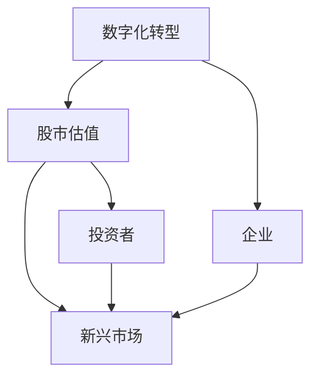
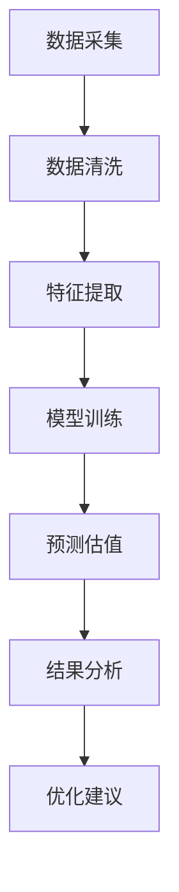
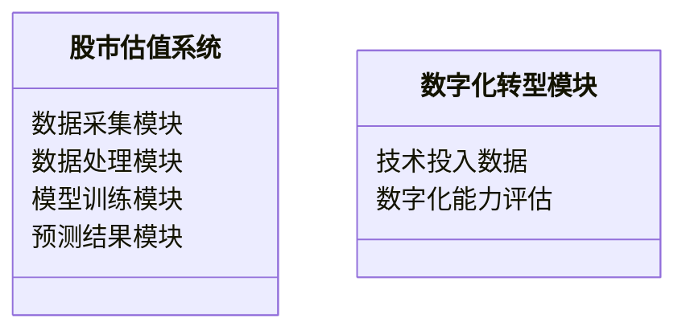
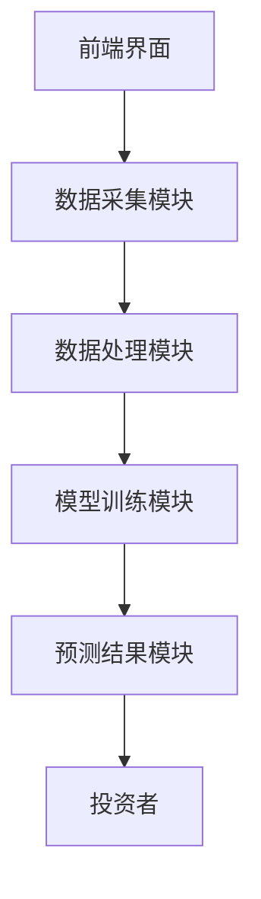
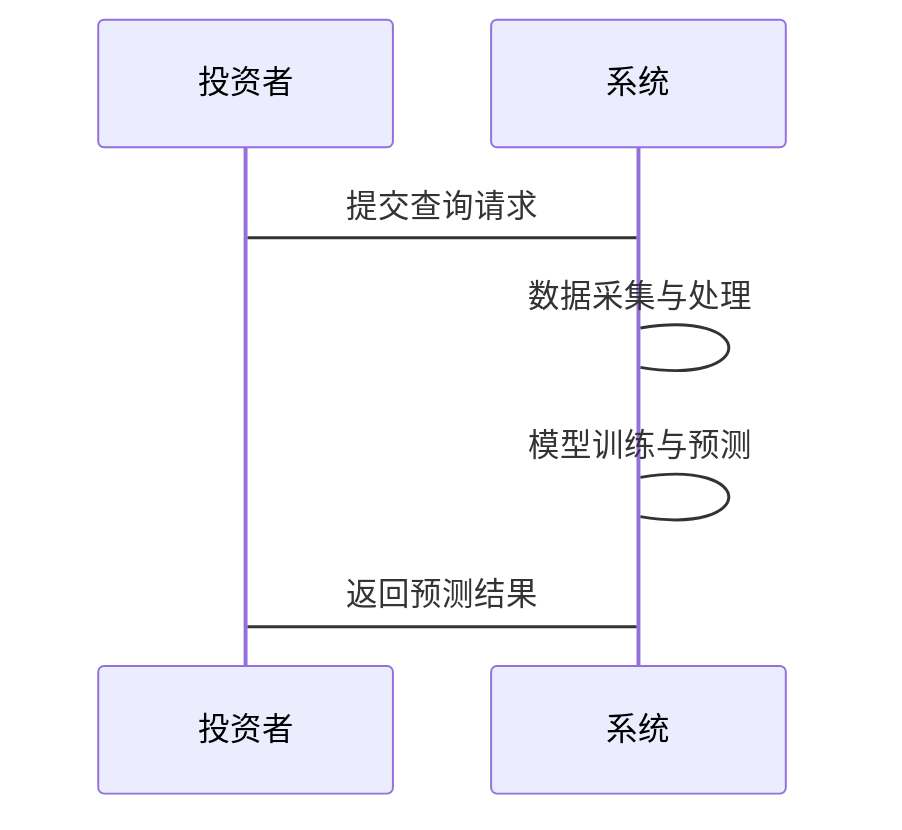

                 


# 新兴市场股市估值与数字化转型的互动

> 关键词：新兴市场、股市估值、数字化转型、互动关系、大数据分析、机器学习、系统架构

> 摘要：本文探讨新兴市场股市估值与数字化转型之间的互动关系，分析数字化转型如何影响股市估值的准确性、效率和方法。通过大数据分析和机器学习算法，提出基于数字化转型的新兴市场股市估值优化方案，结合系统架构设计和实际案例分析，为投资者和企业提供新的视角和策略。

---

# 第一部分: 新兴市场股市估值与数字化转型的背景与概念

## 第1章: 新兴市场股市估值的背景与现状

### 1.1 新兴市场的定义与特点

#### 1.1.1 新兴市场的定义
新兴市场是指经济快速发展、产业结构转型中的国家或地区，通常包括中国、印度、东南亚国家等。这些市场具有增长潜力大、投资机会多的特点。

#### 1.1.2 新兴市场的经济特点
- 经济结构多元化，制造业和服务业并重；
- 人口年轻化，消费潜力大；
- 政府政策支持经济发展和技术创新。

#### 1.1.3 新兴市场的股市发展现状
- 股市规模快速扩大，上市公司数量增加；
- 投资者结构逐渐多元化，外资流入增加；
- 市场波动性较大，受政策和国际环境影响显著。

### 1.2 股市估值的基本概念

#### 1.2.1 股市估值的定义
股市估值是指通过对企业的财务数据、市场环境和行业趋势进行分析，估算其股票的合理价格区间。

#### 1.2.2 股市估值的主要方法
- 市盈率（P/E）：市价与每股收益的比率；
- 市净率（P/B）：市价与每股净资产的比率；
- 股息率：股息与股价的比率；
- 内在价值法：基于现金流折现模型（DCF）计算。

#### 1.2.3 股市估值的经济意义
- 为投资者提供决策依据；
- 反映市场对企业的信心和预期；
- 促进资源优化配置，引导资本流向高效领域。

## 第2章: 数字化转型的背景与趋势

### 2.1 数字化转型的定义与内涵

#### 2.1.1 数字化转型的定义
数字化转型是指企业利用数字技术（如大数据、人工智能、云计算等）改造业务流程、商业模式和决策方式，以实现创新和增长的过程。

#### 2.1.2 数字化转型的核心特征
- 数据驱动：基于数据的分析和决策；
- 技术赋能：利用新兴技术提升效率和竞争力；
- 用户-centric：以客户为中心，优化体验。

#### 2.1.3 数字化转型的驱动因素
- 技术进步：大数据、人工智能、区块链等技术的成熟；
- 市场需求：消费者对个性化和高效服务的需求增加；
- 竞争压力：传统企业面临数字化竞争对手的压力。

### 2.2 数字化转型在企业中的应用

#### 2.2.1 数字化转型的技术应用
- 数据分析：利用大数据技术进行市场预测和客户画像；
- 人工智能：应用于客户服务、风险控制等领域；
- 云计算：支持企业的弹性计算和资源优化；
- 区块链：用于供应链管理和数据安全。

#### 2.2.2 数字化转型对企业的影响
- 提升运营效率，降低成本；
- 增强客户体验，提高客户忠诚度；
- 开拓新的商业模式，如订阅制、共享经济等。

#### 2.2.3 数字化转型的挑战与机遇
- 挑战：技术投入大、数据隐私问题、组织变革困难；
- 机遇：技术创新带来的竞争优势、市场扩展的可能性。

---

# 第二部分: 新兴市场股市估值与数字化转型的互动关系

## 第3章: 数字化转型对股市估值的影响

### 3.1 数字化转型如何改变股市估值方式

#### 3.1.1 数据驱动的估值方法
- 基于实时数据分析的动态估值；
- 利用机器学习模型预测股票价格。

#### 3.1.2 数字化转型对估值效率的提升
- 自动化数据收集和处理，减少人工干预；
- 高频交易算法提高估值的实时性。

#### 3.1.3 数字化转型对估值准确性的增强
- 大数据技术提供更全面的市场信息；
- AI算法优化估值模型，减少人为误差。

### 3.2 数字化转型对股市估值的反馈作用

#### 3.2.1 股市估值如何影响企业数字化转型决策
- 估值结果为企业提供市场反馈，指导数字化投资；
- 通过估值分析发现企业数字化转型中的问题。

#### 3.2.2 股市估值对数字化转型风险的预警作用
- 通过异常波动识别潜在风险；
- 估值变化为企业调整数字化策略提供依据。

#### 3.2.3 股市估值对数字化转型的资本支持作用
- 吸引投资者关注，获得资本支持；
- 通过高估值提升企业融资能力。

## 第4章: 新兴市场股市估值与数字化转型的核心概念与联系

### 4.1 核心概念原理

#### 4.1.1 数字化转型的核心原理
- 数据是核心资源，技术是手段，目标是提升业务能力。

#### 4.1.2 股市估值的核心原理
- 通过分析企业基本面、市场环境和心理预期，确定股票的合理价格。

#### 4.1.3 两者互动的机制
- 数字化转型提供数据和技术支持，提升估值的准确性和效率；
- 股市估值的结果反作用于企业数字化转型决策。

### 4.2 核心概念属性特征对比

#### 4.2.1 数字化转型与股市估值的特征对比表格

| 特征维度 | 数字化转型 | 股市估值 |
|----------|------------|----------|
| 核心要素 | 数据、技术 | 财务数据、市场环境 |
| 目标     | 提升效率、创新 | 确定股票价格 |
| 主要驱动 | 技术进步、市场需求 | 市场波动、企业业绩 |

### 4.3 ER实体关系图架构



---

# 第三部分: 新兴市场股市估值与数字化转型的算法原理

## 第5章: 新兴市场股市估值与数字化转型的算法原理

### 5.1 算法原理概述

#### 5.1.1 基于大数据的股市估值预测算法

- 数据采集：收集企业财务数据、市场数据和新闻数据；
- 数据清洗：去除异常值和缺失值；
- 特征提取：提取关键指标（如营收增长率、净利润率）；
- 模型训练：使用机器学习算法（如随机森林、神经网络）进行预测；
- 预测结果：输出股票的预测价格区间。

#### 5.1.2 数字化转型驱动的估值模型优化算法

- 输入：企业数字化转型的投入和效果数据；
- 处理：通过回归分析优化估值模型的权重；
- 输出：调整后的估值模型，提高预测准确性。

#### 5.1.3 互动机制的数学建模方法

- 建立互动模型，将数字化转型指标（如技术投入、数字化能力）与股市估值指标（如市盈率、市净率）相关联；
- 使用多元回归分析或贝叶斯网络进行建模。

### 5.2 算法流程图



---

# 第四部分: 新兴市场股市估值与数字化转型的系统架构设计

## 第6章: 系统分析与架构设计方案

### 6.1 问题场景介绍

- 背景：新兴市场股市波动大，数字化转型需求迫切；
- 问题：传统估值方法效率低、准确性差；
- 目标：构建基于数字化转型的股市估值系统。

### 6.2 项目介绍

- 项目名称：基于数字化转型的新兴市场股市估值系统；
- 项目目标：提高估值效率和准确性，支持投资者决策；
- 项目范围：新兴市场股市数据采集与分析。

### 6.3 系统功能设计

#### 6.3.1 领域模型设计



#### 6.3.2 系统架构设计



### 6.4 系统接口设计

- API接口：数据采集模块提供API接口，接收外部数据；
- 接口协议：使用RESTful API，支持JSON格式数据传输。

### 6.5 系统交互设计



---

# 第五部分: 新兴市场股市估值与数字化转型的项目实战

## 第7章: 项目实战

### 7.1 环境安装

- 安装Python、Jupyter Notebook、Pandas、Scikit-learn、TensorFlow；
- 数据源：新兴市场股市数据（如K线数据、财务数据）。

### 7.2 核心实现源代码

```python
import pandas as pd
from sklearn.model_selection import train_test_split
from sklearn.ensemble import RandomForestRegressor
from sklearn.metrics import mean_absolute_error

# 数据加载
data = pd.read_csv('em_stock_data.csv')

# 数据清洗
data.dropna(inplace=True)

# 特征工程
X = data[['revenue_growth', 'net_profit_margin', 'market_cap']]
y = data['price']

# 数据划分
X_train, X_test, y_train, y_test = train_test_split(X, y, test_size=0.2)

# 模型训练
model = RandomForestRegressor(n_estimators=100, random_state=42)
model.fit(X_train, y_train)

# 预测与评估
y_pred = model.predict(X_test)
print('MAE:', mean_absolute_error(y_test, y_pred))
```

### 7.3 代码应用解读与分析

- 数据加载与清洗：处理缺失值和异常值；
- 特征工程：提取关键特征变量；
- 模型训练：使用随机森林算法进行预测；
- 模型评估：计算预测误差，验证模型准确性。

### 7.4 实际案例分析

- 案例背景：某新兴市场科技企业的数字化转型；
- 数据分析：企业数字化投入与股市估值的互动；
- 结果解读：数字化转型如何提升企业估值。

### 7.5 项目小结

- 项目目标实现情况：成功构建了基于数字化转型的股市估值系统；
- 系统优势：提高了估值效率和准确性；
- 实践意义：为企业和投资者提供新的决策工具。

---

# 第六部分: 新兴市场股市估值与数字化转型的最佳实践

## 第8章: 最佳实践

### 8.1 小结

- 数字化转型与股市估值的互动关系是新兴市场经济发展的重要驱动力；
- 数据驱动的估值方法和AI技术的应用显著提升了估值的效率和准确性。

### 8.2 注意事项

- 数据质量和完整性是模型准确性的重要保障；
- 模型的实时性和可解释性是实际应用的关键；
- 需要结合市场环境和政策变化进行动态调整。

### 8.3 拓展阅读

- 推荐阅读《大数据与人工智能在金融领域的应用》；
- 推荐学习相关技术课程（如机器学习、时间序列分析）。

---

# 作者

作者：AI天才研究院/AI Genius Institute & 禅与计算机程序设计艺术/Zen And The Art of Computer Programming

---

# 版权声明

本文版权归作者所有，未经授权不得转载。

