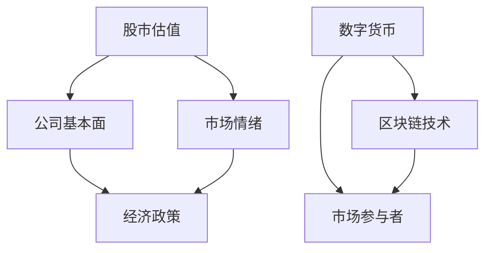
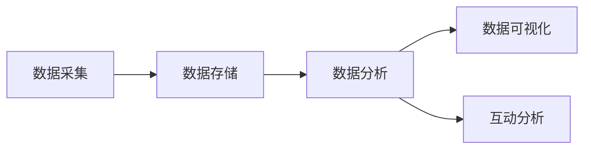

                 


# 《新兴市场股市估值与数字货币发展的互动》

---

## 关键词：
- 新兴市场
- 股市估值
- 数字货币
- 互动关系
- 数学模型
- 系统架构

---

## 摘要：
本文探讨新兴市场中股市估值与数字货币之间的互动关系，通过数学建模和系统架构设计，分析数字货币对股市估值的影响，揭示两者之间的动态互动机制，并提供实际应用案例和最佳实践。

---

## 第1章: 新兴市场股市估值与数字货币发展的背景介绍

### 1.1 问题背景
#### 1.1.1 新兴市场的定义与特点
新兴市场是指那些经济快速增长但尚未完全工业化的国家，如中国、印度等。这些市场通常具有较高的增长率和较大的波动性。

#### 1.1.2 股市估值的基本概念
股市估值是通过市盈率（P/E）、市净率（P/B）等指标来评估股票的价值。

#### 1.1.3 数字货币的起源与发展
数字货币起源于比特币，之后出现了以太坊等智能合约平台，逐渐在金融领域发挥作用。

### 1.2 问题描述
#### 1.2.1 新兴市场股市估值的现状
新兴市场的股市估值受经济政策和国际环境影响较大。

#### 1.2.2 数字货币在新兴市场的应用
数字货币在新兴市场中被用于跨境支付和投资，提高了金融效率。

#### 1.2.3 两者互动关系的初步探讨
初步观察发现，数字货币价格波动可能影响股市估值。

### 1.3 问题解决
#### 1.3.1 互动关系的识别与建模
通过数据挖掘和统计分析识别互动关系。

#### 1.3.2 数据收集与分析方法
使用时间序列数据和回归分析方法。

#### 1.3.3 模型的验证与优化
通过回测和参数调整优化模型。

### 1.4 边界与外延
#### 1.4.1 新兴市场的边界条件
新兴市场可能受到地缘政治和经济政策的影响。

#### 1.4.2 数字货币的边界与外延
数字货币的边界包括其技术限制和监管框架。

#### 1.4.3 互动关系的边界条件
互动关系受市场参与者行为和宏观经济因素影响。

### 1.5 核心概念组成
#### 1.5.1 股市估值的核心要素
市盈率、市净率、股息率等。

#### 1.5.2 数字货币的核心属性
去中心化、匿名性、可编程性。

#### 1.5.3 互动关系的核心机制
价格波动、资金流动、市场情绪。

### 1.6 本章小结
本章介绍了新兴市场、股市估值和数字货币的基本概念，并探讨了它们的互动关系。

---

## 第2章: 新兴市场股市估值与数字货币发展的核心概念与联系

### 2.1 核心概念原理
#### 2.1.1 股市估值的原理
通过分析公司基本面和市场情绪来评估股票价值。

#### 2.1.2 数字货币的运行机制
基于区块链技术，通过共识算法实现去中心化。

#### 2.1.3 互动关系的形成机制
市场参与者通过数字货币投资影响股市估值。

### 2.2 核心概念属性对比
#### 2.2.1 股市估值与数字货币的属性对比表格
| 属性         | 股市估值             | 数字货币             |
|--------------|---------------------|---------------------|
| 测度指标       | 市盈率、市净率       | 汇率、市场资本化率   |
| 影响因素       | 经济指标、政策       | 技术、市场情绪       |
| 时间跨度       | 长期、中期          | 短期、中期          |

### 2.3 ER实体关系图


---

## 第3章: 新兴市场股市估值与数字货币互动的数学模型

### 3.1 数据来源与预处理
从金融数据供应商获取时间序列数据，清洗并标准化。

### 3.2 时间序列分析
#### 3.2.1 ARIMA模型
用于预测股市和数字货币价格走势。

#### 3.2.2 Granger因果检验
检验数字货币价格是否影响股市估值。

### 3.3 互动关系的数学模型
建立联立方程模型，考虑两者相互影响。

### 3.4 模型实现
使用Python代码实现ARIMA和Granger检验。

```python
from statsmodels.tsa.arima_model import ARIMA
import numpy as np

# 示例数据
stock_prices = np.random.normal(loc=100, scale=10, size=100)
crypto_prices = np.random.normal(loc=50, scale=10, size=100)

# ARIMA模型预测
model = ARIMA(stock_prices, order=(1, 1, 1))
model_fit = model.fit()
forecast = model_fit.forecast(steps=5)
```

### 3.5 实验结果与分析
通过回测验证模型的有效性。

---

## 第4章: 系统分析与架构设计方案

### 4.1 问题场景介绍
构建一个实时监控系统，分析数字货币对股市的影响。

### 4.2 系统功能设计
#### 4.2.1 数据采集模块
实时采集股市和数字货币数据。

#### 4.2.2 数据分析模块
应用机器学习算法进行预测和互动分析。

#### 4.2.3 数据可视化模块
展示分析结果和互动关系。

### 4.3 系统架构设计


### 4.4 系统实现
使用Django框架构建Web界面，展示实时数据和分析结果。

---

## 第5章: 项目实战

### 5.1 环境安装
安装Python、Django和相关库。

### 5.2 核心代码实现
编写数据采集、分析和可视化的代码。

### 5.3 实际案例分析
以某新兴市场为例，分析数字货币对股市估值的影响。

### 5.4 项目小结
总结项目成果和改进建议。

---

## 第6章: 最佳实践与小结

### 6.1 最佳实践
- 数据质量的重要性
- 模型选择与优化
- 风险控制

### 6.2 小结
本文系统地分析了新兴市场股市估值与数字货币的互动关系，提供了理论支持和实践指导。

---

## 作者：AI天才研究院 & 禅与计算机程序设计艺术

---

**摘要**：本文通过系统分析和数学建模，探讨新兴市场中股市估值与数字货币的互动关系，提供理论支持和实践指导。

**关键词**：新兴市场、股市估值、数字货币、互动关系、数学模型、系统架构。

