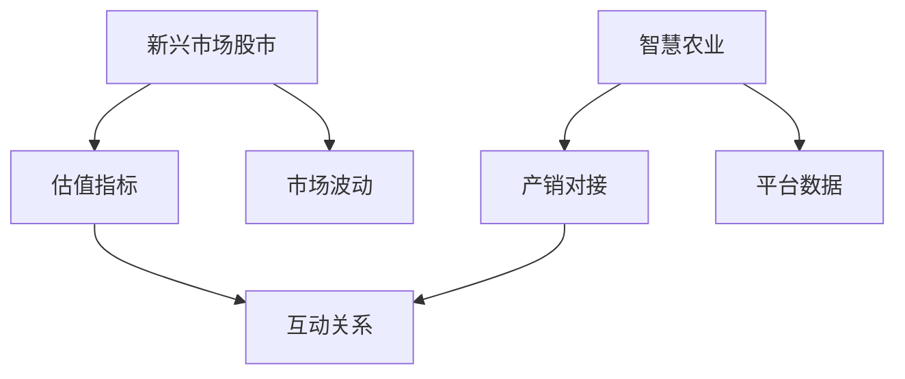
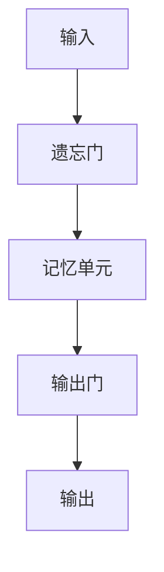
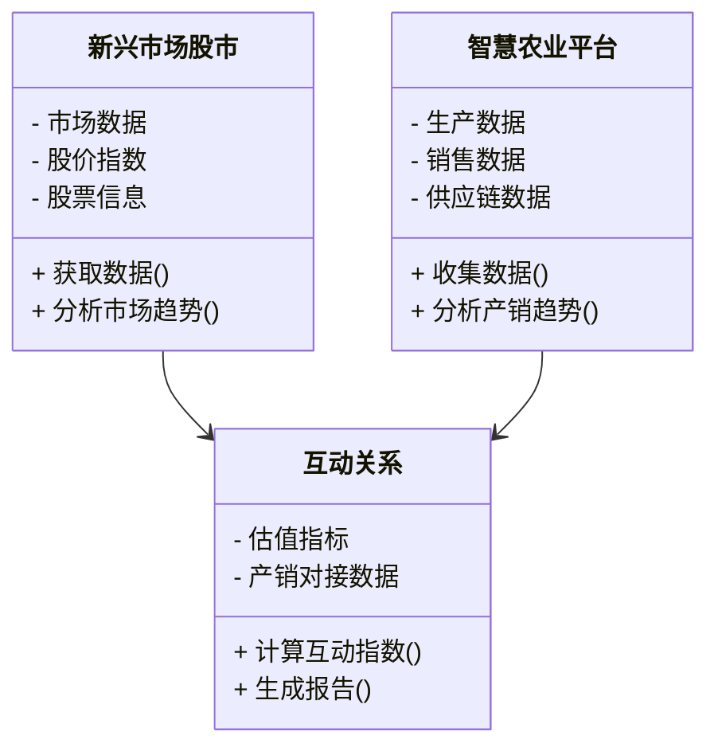
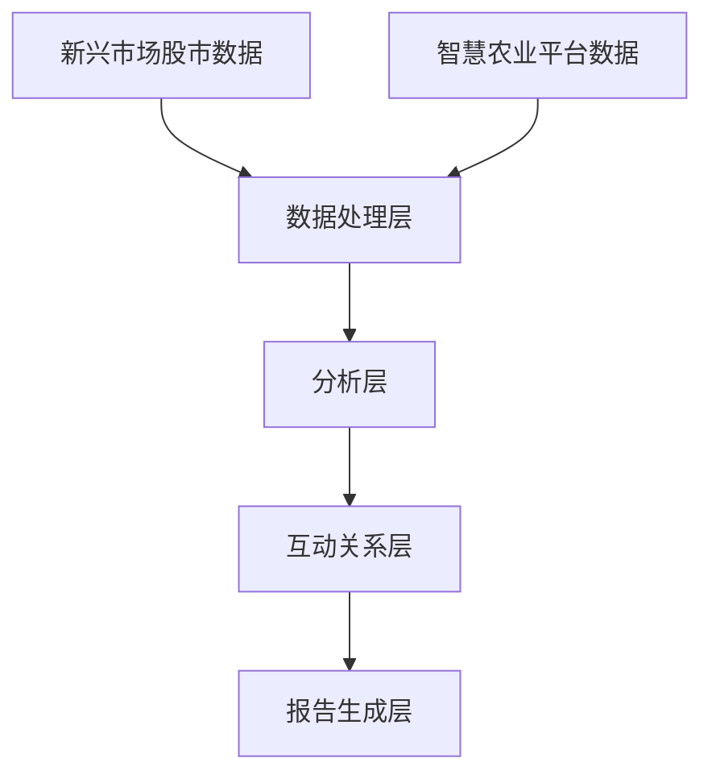
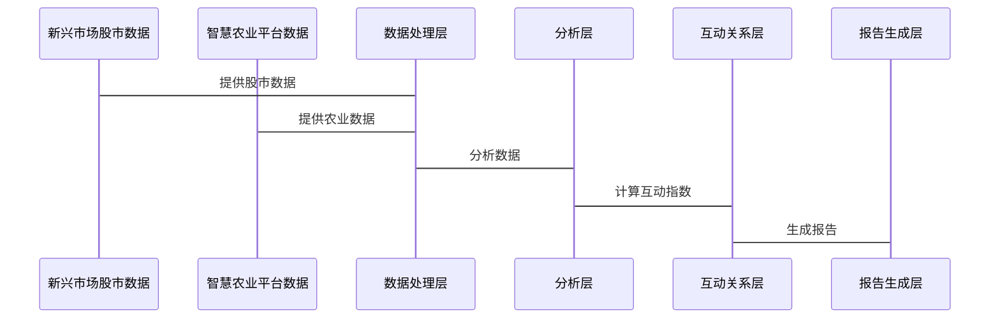

                 


# 新兴市场股市估值与智慧农业产销对接平台的互动

> 关键词：新兴市场、股市估值、智慧农业、产销对接、互动关系、技术分析、系统设计

> 摘要：本文探讨新兴市场股市估值与智慧农业产销对接平台之间的互动关系，分析其影响因素和相互作用机制，提出构建互动模型和优化策略的方法，以期为相关领域的研究和实践提供参考。

---

## 第一部分：新兴市场股市估值与智慧农业产销对接平台的互动概述

### 第1章：背景介绍

#### 1.1 问题背景

##### 1.1.1 新兴市场的定义与特点
新兴市场通常指处于发展阶段的国家，经济快速增长，但尚未达到发达国家水平。这些市场具有高增长潜力，但也伴随着高波动性和不确定性。

##### 1.1.2 股市估值的重要性
股市估值是评估企业价值的关键指标，影响投资者决策和市场信心。新兴市场股市估值受多种因素影响，包括经济政策、国际环境和企业业绩等。

##### 1.1.3 智慧农业的定义与发展趋势
智慧农业利用信息技术优化农业生产，提高效率和可持续性。随着技术进步，智慧农业在新兴市场中逐渐普及，成为推动农业现代化的重要力量。

#### 1.2 问题描述

##### 1.2.1 新兴市场股市波动的特点
新兴市场股市波动较大，受外部环境和内部政策影响显著，投资者面临高风险和高回报的双重挑战。

##### 1.2.2 智慧农业产销对接的现状与挑战
智慧农业产销对接平台帮助优化供应链，但面临技术瓶颈、数据不足和信任缺失等问题，影响其推广和应用。

##### 1.2.3 两者互动关系的初步分析
新兴市场股市的波动可能影响智慧农业企业的融资能力，而智慧农业的发展则可能提升企业的业绩，从而影响股市估值。两者之间的互动关系复杂且动态变化。

#### 1.3 问题解决

##### 1.3.1 新兴市场股市估值的方法
采用多种估值指标（如市盈率、市净率）和模型（如ARIMA模型）进行预测和分析，结合市场数据和宏观经济指标。

##### 1.3.2 智慧农业产销对接平台的构建
利用物联网、大数据和人工智能技术，构建数据采集、分析和决策支持系统，优化产销对接流程。

##### 1.3.3 两者互动关系的解决方案
通过建立数据共享机制、优化金融支持和加强技术创新，促进新兴市场股市与智慧农业产销对接的良性互动。

#### 1.4 边界与外延

##### 1.4.1 新兴市场股市估值的边界条件
包括数据范围、时间跨度和模型假设等，确保分析的准确性和可操作性。

##### 1.4.2 智慧农业产销对接的边界条件
涉及技术可行性、成本效益和用户接受度等问题，明确平台的应用范围和限制。

##### 1.4.3 互动关系的外延与扩展
探讨互动关系在不同市场和行业中的应用，扩展研究范围和应用场景。

#### 1.5 概念结构与核心要素组成

##### 1.5.1 新兴市场股市估值的核心要素
包括市场数据、宏观经济指标、估值模型和投资者行为等。

##### 1.5.2 智慧农业产销对接的核心要素
涉及技术应用、数据处理、平台架构和用户需求等。

##### 1.5.3 互动关系的核心要素
包括信息流、资金流和技术流，体现两者之间的相互作用和依赖关系。

---

## 第2章：核心概念与联系

### 2.1 核心概念原理

#### 2.1.1 新兴市场股市估值的原理
通过分析历史数据和市场趋势，利用统计模型和算法预测未来股市走势，为投资者提供决策依据。

#### 2.1.2 智慧农业产销对接的原理
通过技术手段优化农业生产、销售和供应链管理，提升效率和降低成本，实现精准对接和资源优化配置。

#### 2.1.3 互动关系的原理
新兴市场股市的波动可能影响智慧农业企业的融资能力和投资决策，而智慧农业的发展则可能提升企业的业绩和市场竞争力，从而影响股市估值。

### 2.2 概念属性特征对比表格

表2.1 新兴市场股市估值与智慧农业产销对接的核心属性对比

| 属性           | 新兴市场股市估值                     | 智慧农业产销对接                     |
|----------------|------------------------------------|-------------------------------------|
| 核心目标       | 评估企业价值，指导投资决策         | 优化产销流程，提高效率               |
| 主要工具和技术 | 估值模型、时间序列分析、机器学习   | 物联网、大数据、人工智能、区块链      |
| 数据来源       | 市场数据、宏观经济指标、企业财报     | 农业生产数据、供应链数据、销售数据    |
| 影响因素       | 经济政策、国际环境、投资者情绪       | 技术创新、市场需求、政策支持、自然灾害 |
| 应用场景       | 投资决策、风险管理、市场预测         | 农业生产规划、供应链优化、产销协同    |

### 2.3 ER实体关系图

使用Mermaid绘制的实体关系图展示了新兴市场股市、估值指标、市场波动、智慧农业、产销对接和互动关系之间的关联。



---

## 第3章：算法原理讲解

### 3.1 时间序列分析

#### 3.1.1 时间序列分析的定义
时间序列分析是一种统计方法，用于分析随时间变化的数据，识别趋势、周期性模式和异常值。

#### 3.1.2 ARIMA模型的数学公式
ARIMA模型由自回归（AR）和移动平均（MA）部分组成，用于预测未来的值。

$$ ARIMA(p, d, q) $$

其中：
- \( p \) 是自回归阶数
- \( d \) 是差分阶数
- \( q \) 是移动平均阶数

#### 3.1.3 LSTM网络的结构
LSTM（长短期记忆网络）是一种特殊的RNN，用于处理长序列数据，具有记忆单元和遗忘门。



### 3.2 机器学习模型

#### 3.2.1 线性回归模型
线性回归模型用于预测因变量与一个或多个自变量之间的线性关系。

$$ y = \beta_0 + \beta_1x + \epsilon $$

其中：
- \( y \) 是预测目标
- \( \beta_0 \) 是截距
- \( \beta_1 \) 是回归系数
- \( x \) 是自变量
- \( \epsilon \) 是误差项

#### 3.2.2 支持向量机模型
支持向量机（SVM）用于分类和回归问题，通过寻找最优超平面分割数据。

$$ SVM: y = sign(w \cdot x + b) $$

其中：
- \( w \) 是权重向量
- \( b \) 是偏置项
- \( x \) 是输入向量
- \( y \) 是输出标签

---

## 第4章：系统分析与架构设计方案

### 4.1 问题场景介绍

#### 4.1.1 问题场景
新兴市场股市和智慧农业产销对接平台之间存在复杂的互动关系，需要通过系统化的分析和设计来优化两者的关系。

### 4.2 系统功能设计

#### 4.2.1 领域模型

使用Mermaid绘制的类图展示了系统的各个实体和它们之间的关系。



### 4.3 系统架构设计

#### 4.3.1 系统架构图

使用Mermaid绘制的架构图展示了系统的各个模块及其关系。



### 4.4 系统接口设计

#### 4.4.1 接口描述
系统需要接口来收集和处理股市和农业数据，分析互动关系，并生成报告。

#### 4.4.2 接口交互序列图

使用Mermaid绘制的交互序列图展示了系统中各组件之间的交互过程。



---

## 第5章：项目实战

### 5.1 环境安装

#### 5.1.1 安装Python
使用Python 3.8及以上版本，安装必要的库，如Pandas、NumPy、Scikit-learn和Keras。

#### 5.1.2 安装其他工具
安装Jupyter Notebook用于数据可视化和分析，安装数据库和数据处理工具。

### 5.2 系统核心实现源代码

#### 5.2.1 时间序列分析代码

```python
from statsmodels.tsa.arima_model import ARIMA
import pandas as pd
import numpy as np

# 加载数据
data = pd.read_csv('stock_data.csv')

# 拟合ARIMA模型
model = ARIMA(data['price'], order=(5, 1, 0))
model_fit = model.fit()

# 预测未来值
forecast = model_fit.forecast(steps=5)
print(forecast)
```

#### 5.2.2 LSTM网络代码

```python
from keras.models import Sequential
from keras.layers import LSTM, Dense
import numpy as np

# 数据准备
data = np.random.random((1000, 1))
model = Sequential()
model.add(LSTM(50, input_shape=(None, 1)))
model.add(Dense(1))
model.compile(loss='mean_squared_error', optimizer='adam')
model.fit(data, data, epochs=5, batch_size=32)
```

### 5.3 代码应用解读与分析

#### 5.3.1 时间序列分析代码解读
该代码使用ARIMA模型对股市数据进行预测，通过拟合模型并生成未来的价格预测。

#### 5.3.2 LSTM网络代码解读
该代码构建了一个简单的LSTM模型，用于生成随机数据的预测。实际应用中需要替换为实际数据，并调整模型参数。

### 5.4 实际案例分析和详细讲解剖析

#### 5.4.1 案例介绍
以某新兴市场股市和智慧农业平台为例，分析两者之间的互动关系。

#### 5.4.2 数据收集与处理
收集股市数据和农业产销数据，进行清洗和预处理。

#### 5.4.3 模型训练与验证
使用收集的数据训练模型，验证其准确性和预测能力。

### 5.5 项目小结

#### 5.5.1 项目总结
通过项目实战，验证了模型的有效性，并展示了如何将理论应用于实际问题。

#### 5.5.2 经验与教训
总结在项目实施过程中遇到的问题和解决方法，为后续研究提供参考。

---

## 第6章：最佳实践 tips、小结、注意事项、拓展阅读

### 6.1 小结

本文详细探讨了新兴市场股市估值与智慧农业产销对接平台的互动关系，分析了其关键影响因素和相互作用机制，并提出了构建互动模型和优化策略的方法。

### 6.2 注意事项

在实际应用中，需注意数据的质量和完整性，模型的适用性和可解释性，以及系统的安全性和稳定性。

### 6.3 拓展阅读

建议读者进一步阅读相关领域的文献，关注新兴市场和智慧农业的最新研究和技术进展，深入理解互动关系的复杂性和多样性。

---

## 作者：AI天才研究院/AI Genius Institute & 禅与计算机程序设计艺术 /Zen And The Art of Computer Programming

---

这篇文章通过系统化的分析和实践，深入探讨了新兴市场股市估值与智慧农业产销对接平台的互动关系，为相关领域的研究和实践提供了有价值的参考和指导。

