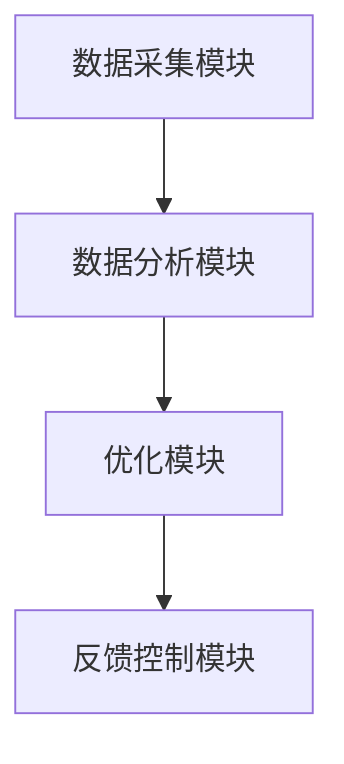
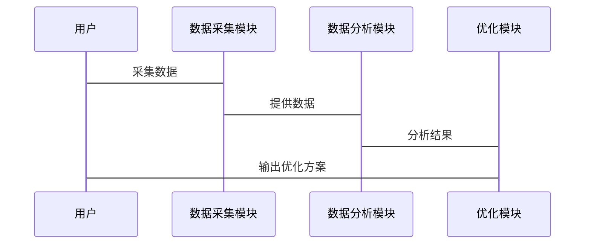

                 


# 新兴市场股市估值与智慧农业水资源管理的互动

## 关键词：新兴市场，股市估值，智慧农业，水资源管理，互动机制，时间序列分析，机器学习模型

## 摘要：本文探讨新兴市场股市估值与智慧农业水资源管理之间的互动关系。通过分析股市估值的方法、智慧农业中的水资源管理技术，以及两者如何相互影响，本文揭示了新兴市场中农业水资源管理对股市估值的重要作用。结合时间序列分析和机器学习模型，本文提出了互动机制的数学模型，并通过实际案例展示了系统的实现与应用。

---

## 第一部分: 背景与概述

### 第1章: 新兴市场股市估值与智慧农业水资源管理的背景

#### 1.1 新兴市场股市估值的背景

##### 1.1.1 新兴市场的定义与特点
新兴市场指的是经济快速发展、处于工业化阶段的国家，如中国、印度等。这些市场具有高增长潜力，但同时也面临较大的波动性和不确定性。

##### 1.1.2 新兴市场股市估值的重要性
股市估值是衡量市场健康状况的重要指标。在新兴市场，股市估值受多种因素影响，包括经济政策、国际贸易和资源管理等。

##### 1.1.3 新兴市场与发达市场的差异
新兴市场通常具有较高的波动性和增长潜力，而发达市场则相对稳定。这种差异使得新兴市场的股市估值具有独特的分析价值。

#### 1.2 智慧农业与水资源管理的背景

##### 1.2.1 智慧农业的概念与发展
智慧农业利用信息技术优化农业生产，提高效率和可持续性。随着技术进步，智慧农业在全球范围内得到广泛应用。

##### 1.2.2 水资源管理的重要性
水资源是农业生产的基石。合理管理水资源对于提高农业产量和可持续发展至关重要。

##### 1.2.3 农业水资源管理的挑战
水资源短缺、污染和管理不善是智慧农业面临的主要挑战。通过技术创新和数据驱动的方法，可以有效应对这些挑战。

#### 1.3 互动关系的背景

##### 1.3.1 股市估值与农业的关联
农业作为经济的重要组成部分，其产量和质量直接影响股市估值。特别是在新兴市场，农业表现对股市有显著影响。

##### 1.3.2 水资源管理对农业的影响
水资源管理优化可以提高农业产量，从而影响农业企业的利润和股市估值。

##### 1.3.3 新兴市场中的互动机制
在新兴市场，股市估值与水资源管理的互动更加紧密。政策变化、技术进步和市场波动等因素共同作用，形成了复杂的互动机制。

---

## 第二部分: 核心概念与联系

### 第2章: 核心概念与联系

#### 2.1 股市估值的核心概念

##### 2.1.1 股市估值的基本原理
股市估值是通过分析公司财务状况和市场趋势，确定股票的合理价格。常用方法包括市盈率、市净率和现金流折现模型。

##### 2.1.2 主要估值方法
- 市盈率（P/E）：市价与每股收益之比。
- 市净率（P/B）：市价与每股净资产之比。
- 现金流折现模型（DCF）：基于未来现金流的现值计算。

##### 2.1.3 新兴市场的特殊性
新兴市场的股市估值受政策、经济波动和外部因素影响较大，需要特别考虑这些因素。

#### 2.2 智慧农业水资源管理的核心概念

##### 2.2.1 智慧农业的技术手段
- 物联网（IoT）：用于监测和管理农业资源。
- 大数据分析：优化农业生产和水资源管理。
- 人工智能（AI）：预测和优化农业生产。

##### 2.2.2 水资源管理的优化策略
- 精准灌溉：根据土壤湿度和天气情况调整灌溉量。
- 循环利用：减少水资源浪费，提高利用率。
- 智能监测：实时监测水资源使用情况，及时调整管理策略。

##### 2.2.3 数据驱动的水资源管理
通过收集和分析数据，优化水资源分配和使用效率。

#### 2.3 核心概念的联系

##### 2.3.1 股市估值与农业产出的关系
农业产出影响企业利润和股市估值，特别是在新兴市场，农业是重要的经济支柱。

##### 2.3.2 水资源管理对农业产出的影响
优化水资源管理可以提高农业产量，从而影响企业的盈利能力和股市估值。

##### 2.3.3 新兴市场中互动机制的复杂性
新兴市场中，政策、技术和经济因素共同作用，使得股市估值与水资源管理的互动更加复杂。

---

## 第三部分: 核心概念的原理与模型

### 第3章: 核心概念的原理与模型

#### 3.1 股市估值模型

##### 3.1.1 市盈率模型
$$ P/E = \frac{Price}{Earnings Per Share} $$
市盈率反映了市场对每股收益的估值，是衡量股市估值的重要指标。

##### 3.1.2 市净率模型
$$ P/B = \frac{Price}{Book Value Per Share} $$
市净率适用于评估资产密集型企业的价值。

##### 3.1.3 现金流折现模型
$$ V = \sum_{t=1}^{n} \frac{CF_t}{(1 + r)^t} $$
DCF模型通过折现未来现金流确定企业价值，适用于长期投资分析。

#### 3.2 水资源管理模型

##### 3.2.1 水资源分配模型
$$ W_i = \alpha \cdot Q_i + \beta \cdot P_i $$
其中，$W_i$ 是水资源分配量，$Q_i$ 是水量，$P_i$ 是价格，$\alpha$ 和 $\beta$ 是系数。

##### 3.2.2 农业用水效率模型
$$ Efficiency = \frac{Actual Water Used}{Potential Water Used} $$
效率衡量实际用水与潜在用水的比率，用于评估水资源管理的效果。

##### 3.2.3 数据驱动的水资源优化模型
通过机器学习算法，基于历史数据和实时数据优化水资源分配。

#### 3.3 互动机制的数学模型

##### 3.3.1 股市估值与农业产出的数学关系
$$ Stock Price = \beta \cdot Agricultural Output + \epsilon $$
其中，$\beta$ 是回归系数，$\epsilon$ 是误差项。

##### 3.3.2 水资源管理对农业产出的影响模型
$$ Agricultural Output = \gamma \cdot Water Management Efficiency + \delta $$
$\gamma$ 是回归系数，$\delta$ 是误差项。

##### 3.3.3 新兴市场中互动机制的综合模型
$$ Stock Price = \alpha \cdot Water Management Efficiency + \beta \cdot Policy Factors + \epsilon $$
该模型综合考虑水资源管理效率和政策因素对股市估值的影响。

---

## 第四部分: 算法原理与实现

### 第4章: 算法原理与实现

#### 4.1 股市估值的算法

##### 4.1.1 时间序列分析
时间序列分析用于预测股市趋势，常用ARIMA模型。

##### 4.1.2 机器学习模型
随机森林算法用于分类和回归，适用于复杂的数据分析。

#### 4.2 水资源管理的算法

##### 4.2.1 数据驱动的优化算法
遗传算法和粒子群优化用于水资源分配和优化。

##### 4.2.2 实时监测与反馈控制
基于实时数据的反馈控制算法，优化水资源使用。

#### 4.3 互动机制的算法

##### 4.3.1 时间序列分析
使用ARIMA模型预测股市估值和农业产出的互动趋势。

##### 4.3.2 机器学习模型
构建回归模型，分析水资源管理对股市估值的影响。

---

## 第五部分: 系统分析与架构设计

### 第5章: 系统分析与架构设计

#### 5.1 问题场景介绍
系统旨在优化水资源管理，提升农业产出，进而影响股市估值。

#### 5.2 系统功能设计

##### 5.2.1 数据采集模块
采集农业传感器数据和股市数据。

##### 5.2.2 数据分析模块
使用时间序列分析和机器学习模型进行数据处理。

##### 5.2.3 优化模块
基于分析结果优化水资源分配。

#### 5.3 系统架构设计

##### 5.3.1 系统架构图


#### 5.4 系统接口设计
接口包括数据输入、分析结果输出和控制指令输出。

#### 5.5 系统交互设计

##### 5.5.1 交互序列图


---

## 第六部分: 项目实战

### 第6章: 项目实战

#### 6.1 环境安装
安装Python、Pandas、Scikit-learn和Mermaid工具。

#### 6.2 系统核心实现源代码

##### 6.2.1 数据采集代码
```python
import pandas as pd
data = pd.read_csv('agriculture_data.csv')
```

##### 6.2.2 数据分析代码
```python
from sklearn.ensemble import RandomForestRegressor
model = RandomForestRegressor()
model.fit(X_train, y_train)
```

##### 6.2.3 优化模块代码
```python
from sklearn.metrics import mean_squared_error
y_pred = model.predict(X_test)
print(mean_squared_error(y_test, y_pred))
```

#### 6.3 案例分析
以某个新兴市场为例，分析水资源管理对股市估值的具体影响。

#### 6.4 项目小结
总结项目实现过程中的经验教训，提出改进建议。

---

## 第七部分: 最佳实践与小结

### 第7章: 最佳实践与小结

#### 7.1 最佳实践

##### 7.1.1 数据质量的重要性
确保数据准确性和完整性。

##### 7.1.2 模型选择
根据数据特点选择合适的算法。

#### 7.2 小结
总结全文，强调股市估值与水资源管理互动的重要性，以及技术手段的应用。

#### 7.3 注意事项
- 数据隐私保护
- 模型的可解释性
- 系统的实时性和稳定性

#### 7.4 拓展阅读
推荐相关领域的书籍和论文，供读者深入学习。

---

## 结论

新兴市场股市估值与智慧农业水资源管理的互动是一个复杂但重要的课题。通过技术手段的创新，可以更好地理解和优化这种互动关系，促进农业可持续发展和经济稳定增长。

---

## 作者：AI天才研究院/AI Genius Institute & 禅与计算机程序设计艺术 /Zen And The Art of Computer Programming

---

本文通过详细分析新兴市场股市估值与智慧农业水资源管理的互动关系，结合数学模型和算法实现，为读者提供了全面的技术视角。希望本文能为相关领域的研究和实践提供有价值的参考。

