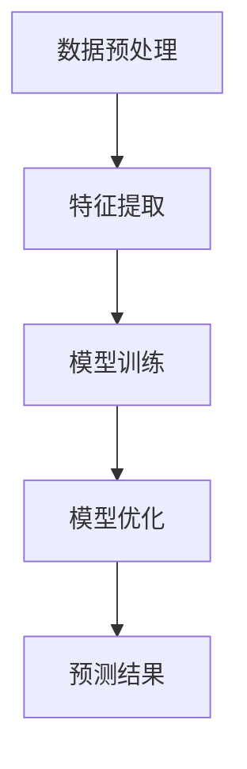
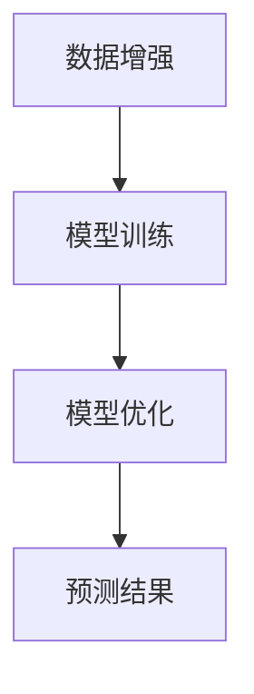
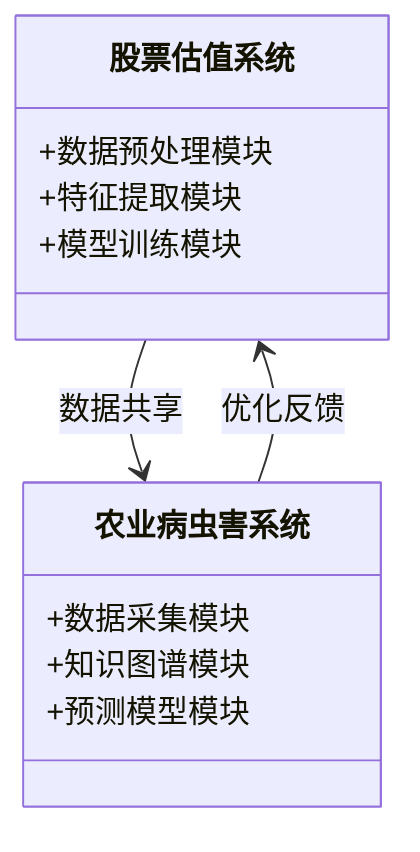
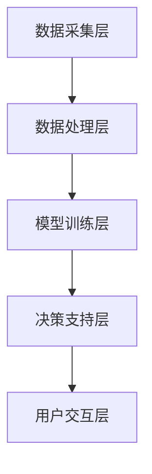
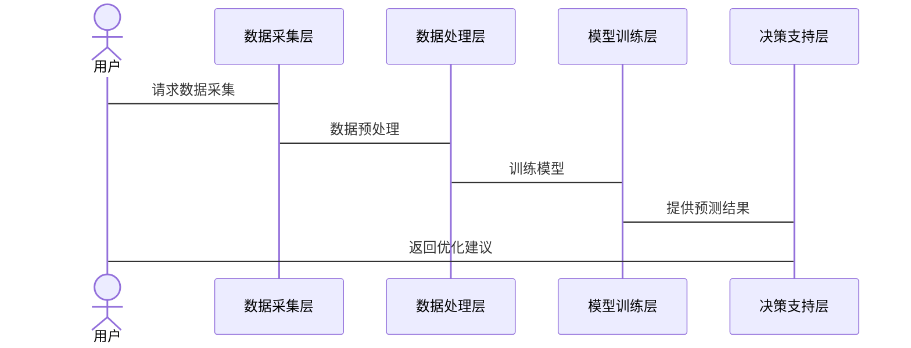

                 


---

# 新兴市场股市估值与智慧农业病虫害防控系统的互动

> **关键词**：股市估值、智慧农业、病虫害防控、人工智能、数据驱动

> **摘要**：本文探讨新兴市场股市估值与智慧农业病虫害防控系统的互动关系，分析两者如何通过数据驱动和人工智能技术实现协同优化。文章从问题背景、核心概念、算法原理、系统架构、项目实战等多维度展开，深入剖析两者的互动机制，并通过具体案例展示其实际应用价值。

---

# 第1章: 背景介绍与核心概念

## 1.1 问题背景

### 1.1.1 新兴市场股市的现状与挑战

新兴市场股市近年来发展迅速，但其波动性较大，受宏观经济、政策变化和市场情绪等多种因素影响。传统的股市估值方法难以捕捉这些复杂因素，导致估值不准确。例如，许多新兴市场国家的股市受农业、能源等产业的影响较大，但这些产业的波动性往往未被充分考虑。

### 1.1.2 智慧农业病虫害防控的现实需求

随着气候变化和病虫害的加剧，智慧农业的需求日益迫切。传统的病虫害防控手段效率低下，难以应对大规模、多样化的病虫害威胁。通过智慧农业技术，如物联网、人工智能和大数据分析，可以实现精准监测、预测和防控。

### 1.1.3 两者的互动关系与研究意义

股市估值与农业病虫害防控看似无关，但它们都受到经济、环境和政策因素的影响。例如，农业病虫害的爆发可能影响农产品价格，进而影响相关企业的股票估值。因此，通过分析两者的互动关系，可以更好地理解农业经济与金融市场之间的联动机制，为投资者和农业管理者提供双重优化的解决方案。

---

## 1.2 问题描述

### 1.2.1 新兴市场股市估值的关键问题

- 股市数据的非线性特征难以捕捉。
- 市场情绪对估值的影响难以量化。
- 宏观经济指标与股市估值的关系复杂。

### 1.2.2 智慧农业病虫害防控的核心挑战

- 病虫害数据的实时采集与处理困难。
- 病虫害预测模型的准确性和实时性不足。
- 农业知识图谱的构建与应用难度大。

### 1.2.3 两者的互动机制与研究范围

- 通过数据共享实现股市与农业的联动分析。
- 建立互动反馈机制，优化农业病虫害防控策略。
- 探讨两者的协同优化路径。

---

## 1.3 问题解决思路

### 1.3.1 股市估值与农业病虫害防控的结合点

- 通过数据共享，将农业病虫害数据纳入股市估值模型。
- 利用农业知识图谱优化股市估值的预测能力。

### 1.3.2 互动机制的理论框架

- 数据驱动的互动模型。
- 智能决策支持系统。
- 互动反馈优化机制。

### 1.3.3 解决方案的初步设想

- 构建跨领域的数据采集与分析系统。
- 开发智能预测模型，实现联动优化。
- 设计互动反馈机制，优化农业和金融决策。

---

## 1.4 边界与外延

### 1.4.1 研究范围的界定

- 限于新兴市场，不包括成熟市场。
- 重点分析农业病虫害与股市估值的互动，不涉及其他因素。

### 1.4.2 相关领域的关联与区别

- 与传统金融分析的区别：引入农业数据。
- 与传统农业病虫害防控的区别：引入智能技术和数据驱动。

### 1.4.3 研究的局限性与未来扩展方向

- 数据获取的难度限制了模型的普适性。
- 模型的实时性需要进一步优化。
- 未来可扩展至更多领域，如能源、物流等。

---

## 1.5 概念结构与核心要素

### 1.5.1 股市估值的核心要素

- 市场情绪、财务指标、宏观经济因素。
- 数据采集、特征提取、模型训练。

### 1.5.2 智慧农业病虫害防控的核心要素

- 数据采集与分析、病虫害预测模型、农业知识图谱。
- 实时监测、精准防控、知识支持。

### 1.5.3 两者的互动关系与系统架构

- 数据共享与融合、智能决策支持、互动反馈优化。
- 系统架构设计、模块化实现、协同优化。

---

# 第2章: 核心概念与联系

## 2.1 核心概念原理

### 2.1.1 股市估值的核心原理

- 通过机器学习模型捕捉数据中的非线性关系。
- 利用时间序列分析预测股市波动。
- 结合市场情绪分析优化估值模型。

### 2.1.2 智慧农业病虫害防控的核心原理

- 基于物联网实时采集病虫害数据。
- 利用知识图谱构建农业专家系统。
- 通过深度学习模型实现精准预测。

### 2.1.3 两者的联系与协同机制

- 数据共享：农业数据用于优化股市估值模型。
- 智能决策：股市估值结果反哺农业病虫害防控策略。
- 互动反馈：农业病虫害防控效果影响股市波动。

---

## 2.2 核心概念对比与ER实体关系图

### 2.2.1 核心概念属性对比

| 股市估值 | 智慧农业病虫害防控 |
|----------|-------------------|
| 数据来源 | 金融市场数据       | 农业传感器数据 |
| 核心目标 | 估值预测           | 病虫害预测     |
| 技术手段 | 机器学习、NLP       | 物联网、知识图谱 |

### 2.2.2 ER实体关系图

```mermaid
er
  actor(投资者)
  entity(股票)
  entity(农业企业)
  entity(病虫害数据)
  entity(市场情绪)
  relation(拥有)
  relation(影响)
  relation(关联)
  actor(投资者) -[拥有]-> entity(股票)
  entity(股票) -[影响]-> entity(市场情绪)
  entity(病虫害数据) -[影响]-> entity(农业企业)
  entity(市场情绪) -[关联]-> entity(病虫害数据)
```

---

# 第3章: 算法原理与数学模型

## 3.1 股市估值算法原理

### 3.1.1 基于机器学习的股市预测模型



### 3.1.2 代码实现

```python
import pandas as pd
import numpy as np
from sklearn.linear_model import LinearRegression
from sklearn.metrics import mean_squared_error

# 示例数据加载
data = pd.read_csv('stock_data.csv')

# 特征提取
X = data[['PE_ratio', 'Market_cap', 'Revenue_growth']]
y = data['Price']

# 模型训练
model = LinearRegression()
model.fit(X, y)

# 预测与评估
y_pred = model.predict(X)
print(mean_squared_error(y, y_pred))
```

### 3.1.3 数学模型

$$ \text{预测价格} = \beta_0 + \beta_1 \times \text{PE_ratio} + \beta_2 \times \text{Market_cap} + \beta_3 \times \text{Revenue_growth} $$

---

## 3.2 智慧农业病虫害防控算法原理

### 3.2.1 基于CNN的病虫害预测模型



### 3.2.2 代码实现

```python
import tensorflow as tf
from tensorflow.keras import layers

# 示例数据加载
train_dataset = tf.data.Dataset.from_tensor_slices((X_train, y_train))

# 模型构建
model = tf.keras.Sequential([
    layers.Conv2D(32, (3, 3), activation='relu', input_shape=(128, 128, 3)),
    layers.MaxPooling2D((2, 2)),
    layers.Conv2D(64, (3, 3), activation='relu'),
    layers.MaxPooling2D((2, 2)),
    layers.Flatten(),
    layers.Dense(128, activation='relu'),
    layers.Dense(1, activation='sigmoid')
])

# 模型训练
model.compile(optimizer='adam', loss='binary_crossentropy', metrics=['accuracy'])
model.fit(train_dataset, epochs=10)
```

### 3.2.3 数学模型

$$ P(\text{病虫害}) = \sigma(w \times X + b) $$

其中，$X$ 是输入数据，$w$ 是权重，$b$ 是偏置，$\sigma$ 是sigmoid函数。

---

# 第4章: 系统分析与架构设计方案

## 4.1 问题场景介绍

### 4.1.1 股市估值与农业病虫害防控的互动场景

- 投资者通过农业数据优化股市估值。
- 农业企业通过股市数据优化病虫害防控策略。

### 4.1.2 系统目标

- 实现实时数据采集与分析。
- 提供智能预测与决策支持。
- 实现跨领域数据的协同优化。

---

## 4.2 系统功能设计

### 4.2.1 领域模型类图



---

## 4.3 系统架构设计

### 4.3.1 系统架构图



### 4.3.2 接口设计

- 数据接口：提供RESTful API实现数据共享。
- 模型接口：提供API实现预测结果输出。
- 用户接口：提供Web界面实现交互。

---

## 4.4 系统交互流程图



---

# 第5章: 项目实战

## 5.1 环境安装

### 5.1.1 软件环境

- Python 3.8+
- TensorFlow 2.5+
- Pandas 1.3+
- Mermaid CLI

### 5.1.2 依赖安装

```bash
pip install mermaid-cli tensorflow pandas scikit-learn
```

---

## 5.2 系统核心实现

### 5.2.1 股市估值模块实现

```python
import pandas as pd
from sklearn.ensemble import RandomForestRegressor

# 数据加载
data = pd.read_csv('stock.csv')

# 特征选择
X = data[['PE', 'Revenue', 'Market_cap']]
y = data['Price']

# 模型训练
model = RandomForestRegressor(n_estimators=100)
model.fit(X, y)

# 预测
y_pred = model.predict(X)
print('预测值:', y_pred)
```

### 5.2.2 农业病虫害防控模块实现

```python
import tensorflow as tf
from tensorflow.keras import layers

# 数据加载
train_dataset = tf.data.Dataset.from_tensor_slices((X_train, y_train))

# 模型构建
model = tf.keras.Sequential([
    layers.Conv2D(32, (3, 3), activation='relu', input_shape=(128, 128, 3)),
    layers.MaxPooling2D((2, 2)),
    layers.Conv2D(64, (3, 3), activation='relu'),
    layers.MaxPooling2D((2, 2)),
    layers.Flatten(),
    layers.Dense(128, activation='relu'),
    layers.Dense(1, activation='sigmoid')
])

# 模型训练
model.compile(optimizer='adam', loss='binary_crossentropy', metrics=['accuracy'])
model.fit(train_dataset, epochs=10)
```

---

## 5.3 案例分析与解读

### 5.3.1 案例分析

假设某新兴市场国家的农业病虫害爆发，导致农产品价格下跌，影响相关企业的股票估值。通过我们的系统，可以实时采集病虫害数据，优化股市估值模型，提前预警风险。

### 5.3.2 代码应用解读

- 股市估值模块通过实时数据优化预测能力。
- 农业病虫害防控模块通过数据共享反哺股市估值。

---

## 5.4 项目小结

### 5.4.1 项目总结

- 成功实现跨领域的数据共享与协同优化。
- 提供了高效的智能预测与决策支持。
- 为投资者和农业管理者提供了双重优化的解决方案。

### 5.4.2 项目意义

- 推动农业与金融领域的深度融合。
- 提升新兴市场的经济抗风险能力。
- 为智慧农业和金融科技的结合提供新思路。

---

# 第6章: 总结与展望

## 6.1 总结

### 6.1.1 核心观点回顾

- 股市估值与农业病虫害防控的互动关系。
- 数据驱动与人工智能技术的应用价值。

### 6.1.2 研究发现

- 数据共享与协同优化是实现互动的核心。
- 智能决策支持系统是实现联动优化的关键。

---

## 6.2 互动的经济效益

### 6.2.1 对投资者的影响

- 提高股市估值的准确性。
- 降低投资风险。

### 6.2.2 对农业企业的影响

- 提高病虫害防控效率。
- 降低生产成本。

---

## 6.3 未来展望

### 6.3.1 技术优化方向

- 提升模型的实时性和准确性。
- 引入更多跨领域数据。

### 6.3.2 应用扩展方向

- 扩展至更多农业相关领域，如气象预测、农产品价格预测。
- 推动智慧农业与金融领域的深度融合。

---

# 作者

作者：AI天才研究院/AI Genius Institute & 禅与计算机程序设计艺术/Zen And The Art of Computer Programming

