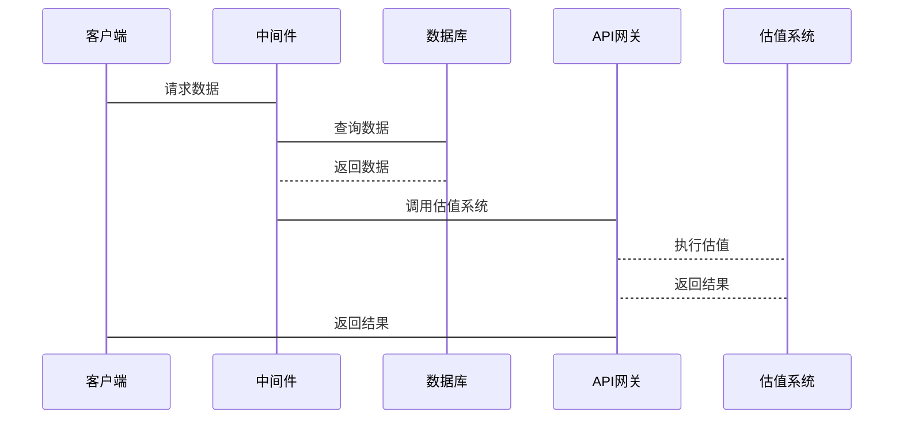

                 


# 新兴市场股市估值与智慧农业病虫害预警系统的互动

## 关键词：股市估值、智慧农业、病虫害预警、大数据分析、人工智能

## 摘要：本文探讨新兴市场股市估值与智慧农业病虫害预警系统之间的互动关系，分析其技术基础和应用场景。通过结合大数据分析和人工智能技术，揭示两者在数据共享、技术融合和系统架构设计方面的互动机制，为智慧农业和金融领域提供新的研究方向。

---

## 第1章: 新兴市场股市估值与智慧农业的互动背景

### 1.1 新兴市场的定义与特点

#### 1.1.1 新兴市场的经济特征
- 新兴市场是指那些经济增长迅速、但尚未完全工业化的国家，如中国、印度等。
- 经济结构多元化，包含制造业、农业和服务业。
- 市场规模大，但波动性较高。

#### 1.1.2 新兴市场的股市特点
- 市场流动性高，交易量大。
- 市场参与者多元化，包括散户和机构投资者。
- 市场波动性强，受外部因素影响较大。

#### 1.1.3 新兴市场与传统市场的区别
- 传统市场（如美国、欧洲）市场成熟，波动性较低。
- 新兴市场增长快，但风险较高。

### 1.2 智慧农业的概念与技术基础

#### 1.2.1 智慧农业的定义
- 利用信息技术、物联网和人工智能优化农业生产和管理。
- 实现农业生产的智能化、数据化和高效化。

#### 1.2.2 智慧农业的核心技术
- 物联网（IoT）：通过传感器采集农业数据。
- 大数据分析：处理海量农业数据，提供决策支持。
- 人工智能（AI）：用于病虫害预测和作物管理。

#### 1.2.3 智慧农业的应用场景
- 病虫害预警：通过AI算法预测病虫害的发生。
- 作物管理：优化种植方案，提高产量。
- 资源管理：合理分配水、肥等资源。

### 1.3 股市估值与智慧农业的互动关系

#### 1.3.1 股市估值的基本概念
- 股市估值是对公司股票价值的评估，帮助投资者做出投资决策。
- 常用指标包括市盈率、市净率和股息率。

#### 1.3.2 智慧农业对股市的影响
- 智慧农业技术的应用提高了农业生产力，可能提升相关企业的股价。
- 农业数据的公开和共享可能影响股市的波动。

#### 1.3.3 互动机制的初步探讨
- 农业数据影响股市估值模型。
- 股市波动可能反馈到农业企业的投资和生产决策。

---

## 第2章: 股市估值的核心方法与技术

### 2.1 传统股市估值方法

#### 2.1.1 市盈率法
- 市盈率 = 股价 / 每股净利润
- 用于评估股票的相对价值。

#### 2.1.2 市净率法
- 市净率 = 股价 / 每股净资产
- 适用于评估资产密集型企业的价值。

#### 2.1.3 股息率法
- 股息率 = 每股股息 / 股价
- 用于评估股票的收益能力。

### 2.2 现代股市估值技术

#### 2.2.1 大数据分析在估值中的应用
- 通过分析社交媒体数据预测市场情绪。
- 利用新闻数据识别潜在风险。

#### 2.2.2 机器学习在估值中的应用
- 使用回归模型预测股票价格。
- 通过聚类分析识别相似股票。

#### 2.2.3 自然语言处理在估值中的应用
- 分析公司财报中的关键词，预测业绩变化。

### 2.3 股市估值模型的数学公式

#### 2.3.1 市盈率模型
$$ P = \frac{E}{E/P} $$

#### 2.3.2 市净率模型
$$ P = \frac{B}{B/P} $$

#### 2.3.3 股息率模型
$$ D = \frac{C}{P} $$

---

## 第3章: 智慧农业病虫害预警系统的技术原理

### 3.1 病虫害预警系统的核心技术

#### 3.1.1 图像识别技术
- 使用卷积神经网络（CNN）识别病虫害特征。

#### 3.1.2 数据采集与处理
- 通过传感器采集土壤湿度、温度等数据。
- 数据清洗和预处理，确保数据质量。

#### 3.1.3 预测模型构建
- 使用时间序列模型预测病虫害发生概率。

### 3.2 病虫害预警系统的算法原理

#### 3.2.1 支持向量机（SVM）算法
- 用于分类问题，如区分健康和患病植物。

#### 3.2.2 神经网络算法
- 用于深度学习，提取图像特征。

#### 3.2.3 随机森林算法
- 用于特征选择和模型评估。

### 3.3 病虫害预警系统的数学模型

#### 3.3.1 SVM模型
$$ y = \text{sign}(w \cdot x + b) $$

#### 3.3.2 神经网络模型
$$ y = f(Wx + b) $$

#### 3.3.3 随机森林模型
$$ y = \text{多数投票} $$

---

## 第4章: 股市估值与智慧农业病虫害预警系统的互动机制

### 4.1 数据共享与融合

#### 4.1.1 股市数据与农业数据的结合
- 将农业数据（如病虫害预警数据）纳入股市估值模型。

#### 4.1.2 数据融合的技术方法
- 数据清洗、特征提取和模型集成。

#### 4.1.3 数据隐私与安全问题
- 数据加密、访问控制和匿名化处理。

### 4.2 技术融合与创新

#### 4.2.1 AI技术在两者中的应用
- 使用同一套AI模型处理农业数据和股市数据。

#### 4.2.2 大数据分析的桥梁作用
- 通过数据挖掘技术发现农业和股市之间的关联。

#### 4.2.3 互动机制的优化与提升
- 不断优化算法，提高预测准确率。

### 4.3 互动机制的数学模型

#### 4.3.1 股市数据与农业数据的关联模型
$$ y_{\text{stock}} = f(x_{\text{agriculture}}) $$

---

## 第5章: 股市估值与智慧农业病虫害预警系统互动机制的影响

### 5.1 对股市估值的影响

#### 5.1.1 提高估值准确性
- 农业数据的引入使估值模型更全面。

#### 5.1.2 增强市场预测能力
- 通过农业数据预测农业企业的股价波动。

#### 5.1.3 优化投资决策
- 基于农业数据的股市估值为投资者提供新视角。

### 5.2 在农业风险管理中的应用

#### 5.2.1 提前预警病虫害
- 通过预警系统减少农业损失。

#### 5.2.2 优化农业保险定价
- 基于病虫害预警数据，动态调整保险价格。

#### 5.2.3 提高农业生产效率
- 通过精准管理减少资源浪费。

### 5.3 推动智慧农业发展

#### 5.3.1 技术创新
- 数据共享和算法优化推动农业技术进步。

#### 5.3.2 市场扩展
- 农业数据的应用拓展了农业市场的可能性。

#### 5.3.3 经验总结
- 互动机制的成功案例和经验教训。

---

## 第6章: 互动机制的系统分析与架构设计方案

### 6.1 系统功能设计

#### 6.1.1 领域模型
```mermaid
classDiagram
    class 股市估值系统 {
        输入：股市数据
        输出：估值结果
    }
    class 农业预警系统 {
        输入：农业数据
        输出：预警结果
    }
    股市估值系统 <--o "数据共享"--> 农业预警系统
```

#### 6.1.2 系统架构设计


#### 6.1.3 系统接口设计
- 接口1：数据获取接口
- 接口2：模型调用接口
- 接口3：结果返回接口

#### 6.1.4 系统交互设计


---

## 第7章: 互动机制的项目实战

### 7.1 环境安装

```bash
pip install numpy pandas scikit-learn
```

### 7.2 核心实现

```python
import pandas as pd
from sklearn.svm import SVC

# 数据预处理
data = pd.read_csv('agriculture_data.csv')
X = data.drop('label', axis=1)
y = data['label']

# 训练模型
model = SVC()
model.fit(X, y)

# 预测结果
print(model.predict(X))
```

### 7.3 代码应用解读与分析

#### 7.3.1 数据预处理
- 读取CSV文件，提取特征和标签。
- 数据清洗，处理缺失值和异常值。

#### 7.3.2 模型训练
- 使用SVM算法训练模型。
- 调整参数，优化模型性能。

#### 7.3.3 模型预测
- 预测结果，评估准确率。
- 分析预测结果，优化算法。

### 7.4 实际案例分析

#### 7.4.1 案例背景
- 某新兴市场农业企业，面临病虫害风险。

#### 7.4.2 数据分析
- 采集农业数据，预测病虫害概率。
- 结合股市数据，评估企业股价影响。

#### 7.4.3 结果分析
- 病虫害预警提前，企业股价波动减少。
- 投资者基于预警数据做出更明智的决策。

### 7.5 项目小结

#### 7.5.1 成功经验
- 数据共享和算法优化提高了预测准确性。
- 互动机制的应用提升了农业和股市的效率。

#### 7.5.2 注意事项
- 数据隐私和安全问题需要重视。
- 模型的实时性和可扩展性需要进一步优化。

#### 7.5.3 最佳实践
- 定期更新模型，适应数据变化。
- 加强数据质量管理，确保模型性能。

---

## 结论

本文通过分析新兴市场股市估值与智慧农业病虫害预警系统的互动关系，揭示了大数据分析和人工智能技术在农业和金融领域的重要作用。通过数据共享和算法优化，互动机制不仅提高了农业生产的效率，还增强了股市估值的准确性。未来，随着技术的不断进步，互动机制将推动智慧农业和金融市场的深度融合，为农业和金融领域带来更大的价值。

---

## 作者

作者：AI天才研究院/AI Genius Institute & 禅与计算机程序设计艺术/Zen And The Art of Computer Programming

