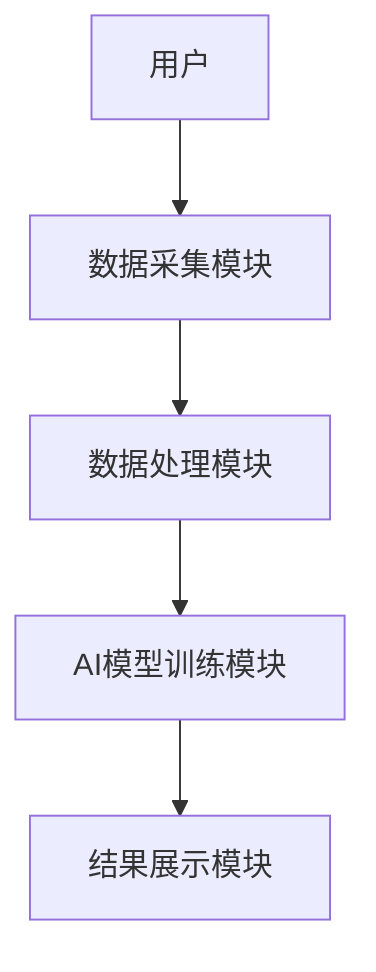

                 


# 《新兴市场股市估值与智慧医疗AI辅助手术的互动》

---

## 关键词

- 新兴市场股市估值
- 智慧医疗
- AI辅助手术
- 股市估值模型
- 医疗AI应用

---

## 摘要

本文探讨了新兴市场股市估值与智慧医疗AI辅助手术之间的互动关系。通过分析股市估值的核心方法和AI在医疗领域的应用，结合具体案例，展示了如何利用AI技术提升股市估值的准确性，并推动医疗手术的智能化。文章详细介绍了AI在股市估值中的算法原理，分析了智慧医疗AI辅助手术的系统架构，并通过项目实战展示了两者的互动应用，最后总结了未来的发展方向。

---

## 正文

### 第一部分：背景与基础

#### 第1章：新兴市场与股市估值概述

##### 1.1 新兴市场的定义与特点

新兴市场是指那些经济快速发展、产业结构逐步升级、金融市场逐步完善的国家或地区的股市。这些市场通常具有以下特点：

- **经济快速增长**：新兴市场国家通常GDP增长率较高，吸引了大量外资流入。
- **市场规模较小**：相较于发达市场，新兴市场的股市规模较小，流动性相对较低。
- **波动性较大**：由于市场机制尚不完善，新兴市场股市容易受到外部因素的影响，波动性较大。
- **政策影响显著**：新兴市场的股市受政府政策影响较大，如货币、财政政策的变化对股市影响显著。

##### 1.2 股市估值的基本概念

股市估值是通过对公司财务数据、市场环境、行业状况等多方面因素的分析，评估股票的内在价值。常用的方法包括：

- **市盈率（PE）**：市盈率=股票价格/每股净利润，反映了投资者对每股收益的支付意愿。
- **市净率（PB）**：市净率=股票价格/每股净资产，适用于评估资产密集型企业的价值。
- **现金流折现法（DCF）**：通过预测公司未来现金流，折现到现值，评估企业整体价值。

在新兴市场中，由于市场环境的特殊性，股市估值需要考虑更多的非财务因素，如政治风险、政策变动等。

#### 第2章：智慧医疗与AI辅助手术

##### 2.1 智慧医疗的定义与现状

智慧医疗是指通过物联网、大数据、人工智能等技术，实现医疗资源的优化配置和医疗服务的智能化。其核心在于通过数据的收集、分析和应用，提升医疗服务的效率和质量。

智慧医疗的现状主要体现在以下几个方面：

- **医疗数据的数字化**：通过电子健康记录（EHR）、可穿戴设备等手段，实现医疗数据的数字化。
- **AI辅助诊断**：利用AI技术，辅助医生进行疾病诊断，提高诊断的准确性和效率。
- **智能医疗设备**：如智能手术机器人、智能影像设备等，提升了手术的精准度和安全性。

##### 2.2 AI在医疗领域的应用

AI在医疗领域的应用主要集中在以下几个方面：

- **医疗影像分析**：通过深度学习算法，AI能够快速、准确地识别医疗影像中的病变，辅助医生进行诊断。
- **自然语言处理（NLP）**：用于分析医疗文献、病历记录等非结构化数据，提取有用信息，辅助临床决策。
- **机器学习模型**：用于预测患者的疾病风险、治疗效果等，帮助医生制定个性化的治疗方案。

### 第二部分：新兴市场股市估值分析

#### 第3章：股市估值方法

##### 3.1 常用估值方法

在新兴市场中，常用的股市估值方法包括：

- **相对估值法**：通过比较同类公司的估值指标（如PE、PB）来评估目标公司的价值。
- **绝对估值法**：通过DCF模型等方法，预测公司未来现金流，计算其内在价值。
- **指数估值法**：通过分析市场指数的估值水平，判断整体市场的估值是否合理。

##### 3.2 新兴市场的估值挑战

新兴市场的估值面临以下挑战：

- **数据不完整**：新兴市场的信息披露机制尚不完善，数据的准确性和完整性可能存在问题。
- **市场波动性大**：新兴市场股市波动较大，影响估值的准确性。
- **宏观因素影响**：如汇率波动、政策变化等，对估值结果产生显著影响。

#### 第4章：AI在股市估值中的应用

##### 4.1 AI驱动的量化分析

AI在股市估值中的应用主要体现在以下几个方面：

- **数据挖掘与分析**：AI能够快速处理大量数据，发现数据中的规律和趋势，辅助投资者做出决策。
- **预测模型构建**：通过机器学习算法，构建股票价格预测模型，提高估值的准确性。
- **风险评估**：利用AI技术，评估投资组合的风险，优化资产配置。

##### 4.2 基于机器学习的股市估值模型

###### 4.2.1 数据准备

首先，收集相关数据，包括公司的财务数据、市场数据、行业数据等。数据需要进行清洗、特征提取等预处理。

###### 4.2.2 模型构建

使用机器学习算法（如随机森林、神经网络）构建估值模型。以市盈率（PE）为例：

$$
\text{PE} = \frac{\text{股票价格}}{\text{每股净利润}}
$$

通过模型预测股票的PE值，评估其估值是否合理。

###### 4.2.3 模型验证

对模型进行回测，验证其预测能力。例如，使用历史数据测试模型的准确率、误差率等指标。

### 第三部分：智慧医疗AI辅助手术

#### 第5章：AI在医疗手术中的应用

##### 5.1 AI辅助手术的系统架构

AI辅助手术系统通常包括以下几个部分：

- **数据采集模块**：通过传感器、摄像头等设备采集手术过程中的数据。
- **数据处理模块**：对采集到的数据进行清洗、分析，提取有用信息。
- **AI决策模块**：利用机器学习模型，辅助医生做出手术决策。
- **人机交互模块**：提供友好的人机交互界面，方便医生操作。

##### 5.2 AI辅助手术的实际案例

以智能手术机器人为例，AI通过分析患者的影像数据，辅助医生制定手术方案，提高手术的精准度和安全性。

### 第四部分：互动分析与项目实战

#### 第6章：股市估值与智慧医疗的互动

##### 6.1 数据共享与技术协同

股市估值与智慧医疗的互动主要体现在数据共享和技术协同上。例如，医疗领域的AI技术可以应用于股市估值，提高估值的准确性；而股市估值的技术也可以借鉴到智慧医疗领域，优化医疗决策。

##### 6.2 投资机会与风险管理

AI技术的应用为投资者提供了新的投资机会，同时也带来了新的风险。投资者需要关注AI技术在智慧医疗中的应用，评估其对股市估值的影响。

### 第五部分：系统架构与实现

#### 第7章：系统架构设计

##### 7.1 系统功能设计

系统功能设计包括：

- **数据采集**：收集股市数据和医疗数据。
- **数据处理**：清洗、分析数据，提取特征。
- **AI模型训练**：构建估值模型和医疗辅助模型。
- **结果展示**：将模型结果以可视化的方式呈现。

##### 7.2 系统架构图



##### 7.3 接口设计与交互流程

系统接口设计包括：

- **API接口**：提供数据接口，供外部系统调用。
- **交互流程**：用户输入需求，系统处理后返回结果。

### 第六部分：项目实战与总结

#### 第8章：项目实战

##### 8.1 环境安装

安装所需的开发环境，包括Python、Jupyter Notebook、机器学习库（如Scikit-learn、TensorFlow）等。

##### 8.2 核心代码实现

以下是股市估值模型的Python代码示例：

```python
import pandas as pd
import numpy as np
from sklearn.ensemble import RandomForestRegressor
from sklearn.metrics import mean_squared_error

# 数据加载
data = pd.read_csv('stock_data.csv')

# 特征选择
features = ['PE', 'PB', 'ROE']
target = 'stock_price'

# 数据分割
X = data[features]
y = data[target]

# 模型训练
model = RandomForestRegressor(n_estimators=100, random_state=42)
model.fit(X, y)

# 预测
y_pred = model.predict(X)

# 评估
mse = mean_squared_error(y, y_pred)
print(f'Mean Squared Error: {mse}')
```

##### 8.3 案例分析

通过实际案例分析，验证模型的预测能力。例如，分析某新兴市场公司的PE值，预测其股票价格的变化趋势。

#### 第9章：结论与展望

##### 9.1 研究总结

本文探讨了新兴市场股市估值与智慧医疗AI辅助手术的互动关系，分析了AI技术在股市估值和医疗手术中的应用，提出了互动的可能性和实现路径。

##### 9.2 未来展望

未来，随着AI技术的不断发展，股市估值与智慧医疗的互动将更加紧密。AI技术的应用将进一步提升股市估值的准确性，推动医疗手术的智能化，为投资者和患者带来更多的价值。

---

## 作者：AI天才研究院 & 禅与计算机程序设计艺术

---

**注**：本文为技术博客文章，内容基于假设场景和通用知识，不构成具体投资建议。

