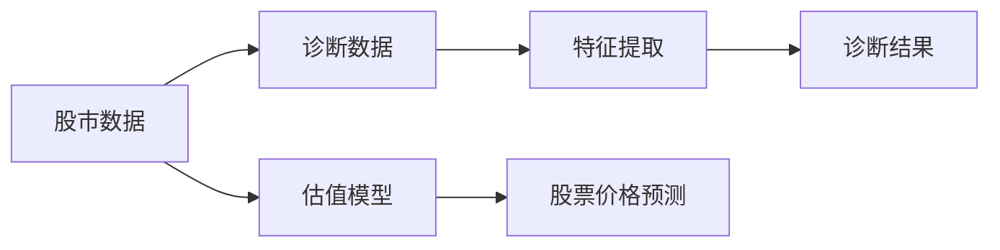
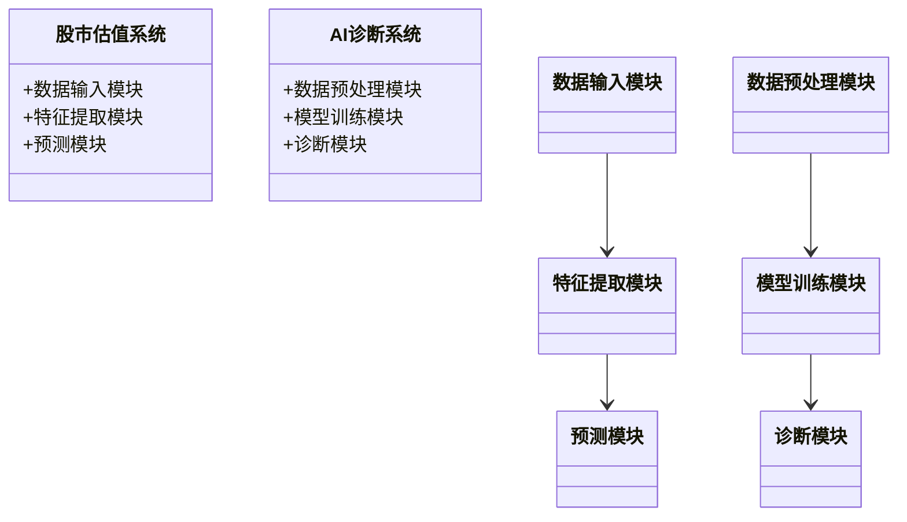
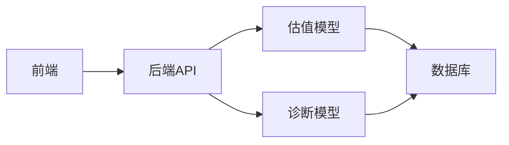
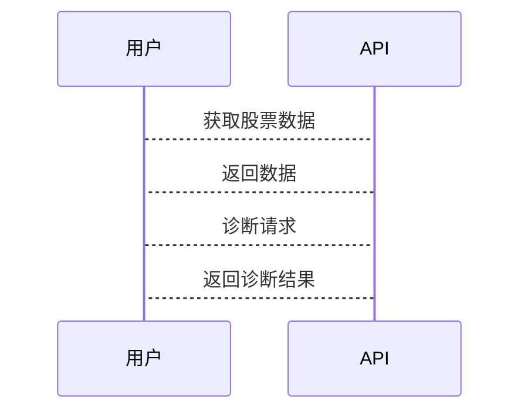

                 


# 新兴市场股市估值与智慧医疗AI辅助诊断的互动

## 关键词：新兴市场，股市估值，智慧医疗，AI辅助诊断，算法原理，系统架构

## 摘要：本文探讨新兴市场股市估值与智慧医疗AI辅助诊断的互动关系。通过分析核心概念、算法原理和系统架构，结合实际案例，揭示两者如何相互影响，并提出优化建议。

---

# 目录大纲

1. **背景介绍**  
   1.1 核心概念术语说明  
   1.2 问题背景与描述  
   1.3 问题解决与互动关系  
   1.4 边界与外延  
   1.5 概念结构与核心要素  

2. **核心概念与联系**  
   2.1 核心概念原理  
   2.2 概念属性特征对比（表格）  
   2.3 实体关系图（Mermaid流程图）  

3. **算法原理讲解**  
   3.1 股市估值算法（Mermaid流程图与Python代码）  
   3.2 AI辅助诊断算法（Mermaid流程图与Python代码）  
   3.3 数学模型与公式（回归分析与神经网络）  

4. **系统分析与架构设计**  
   4.1 问题场景分析  
   4.2 系统功能设计（Mermaid类图）  
   4.3 系统架构设计（Mermaid架构图）  
   4.4 接口设计与交互流程图  

5. **项目实战**  
   5.1 环境安装与代码实现  
   5.2 代码应用解读与案例分析  
   5.3 项目总结  

6. **最佳实践**  
   6.1 小结与注意事项  
   6.2 拓展阅读与工具推荐  

---

# 正文

## 第1章：背景介绍

### 1.1 核心概念术语说明
- **新兴市场**：经济快速发展的国家或地区，如印度、东南亚国家。
- **股市估值**：通过模型评估股票价格的方法，考虑市盈率、市净率等指标。
- **智慧医疗**：利用AI、大数据等技术提升医疗服务的效率和质量。
- **AI辅助诊断**：AI技术在疾病诊断中的应用，如图像识别、自然语言处理。

### 1.2 问题背景与描述
新兴市场股市波动较大，投资者需要准确的估值模型。医疗领域数据分散，AI辅助诊断能提高诊断效率和准确性。两者的互动关系在于，股市估值可能受医疗科技公司的影响，而AI诊断技术的普及可能影响相关公司的股价。

### 1.3 问题解决与互动关系
通过分析医疗科技公司的股票，投资者可以利用AI诊断技术的进步来评估其市场表现。反过来，股市的数据也能为医疗诊断算法提供训练数据。

### 1.4 边界与外延
本文仅探讨AI在诊断中的应用及其对股市的影响，不涉及其他AI领域（如金融交易）。

### 1.5 概念结构与核心要素
- **股市估值**：市盈率、市净率、股息率。
- **AI诊断**：数据采集、特征提取、模型训练、结果输出。

---

## 第2章：核心概念与联系

### 2.1 核心概念原理
- **股市估值**：通过历史数据和财务指标预测股票价格。
- **AI诊断**：利用深度学习模型分析医疗影像，辅助医生诊断。

### 2.2 概念属性特征对比
| 属性         | 股市估值                     | AI辅助诊断                 |
|--------------|------------------------------|-----------------------------|
| 数据来源     | 公司财务报表、市场数据       | 医疗影像、电子健康记录     |
| 目标         | 预测股票价格                 | 辅助诊断疾病               |
| 技术基础     | 传统统计模型、机器学习       | 深度学习、图像处理技术     |

### 2.3 实体关系图（Mermaid流程图）



---

## 第3章：算法原理讲解

### 3.1 股市估值算法

#### 3.1.1 Mermaid流程图


#### 3.1.2 Python代码实现
```python
import pandas as pd
from sklearn.linear_model import LinearRegression

# 数据加载
data = pd.read_csv('stock_data.csv')

# 特征选择
features = ['PE_ratio', 'PB_ratio']
target = 'stock_price'

# 模型训练
model = LinearRegression()
model.fit(data[features], data[target])

# 预测
predicted_price = model.predict(data[features])
```

### 3.2 AI辅助诊断算法

#### 3.2.1 Mermaid流程图


#### 3.2.2 Python代码实现
```python
import tensorflow as tf
from tensorflow.keras import layers

# 数据预处理
train_dataset = tf.data.Dataset.from_tensor_slices((x_train, y_train)).batch(32)

# 模型构建
model = tf.keras.Sequential([
    layers.Conv2D(32, (3,3), activation='relu', input_shape=(224,224,3)),
    layers.MaxPooling2D((2,2)),
    layers.Conv2D(64, (3,3), activation='relu'),
    layers.MaxPooling2D((2,2)),
    layers.Flatten(),
    layers.Dense(128, activation='relu'),
    layers.Dense(1, activation='sigmoid')
])

# 编译与训练
model.compile(optimizer='adam', loss='binary_crossentropy', metrics=['accuracy'])
model.fit(train_dataset, epochs=10)
```

### 3.3 数学模型与公式

#### 3.3.1 股市估值模型
线性回归模型：
$$ y = \beta_0 + \beta_1x + \epsilon $$

#### 3.3.2 AI诊断模型
神经网络结构：
$$ 
\text{输出} = \text{输入} \rightarrow \text{卷积层} \rightarrow \text{池化层} \rightarrow \text{全连接层} 
$$

---

## 第4章：系统分析与架构设计

### 4.1 问题场景分析
新兴市场股市波动大，医疗数据分散，数据隐私保护严格。

### 4.2 系统功能设计（Mermaid类图）



### 4.3 系统架构设计（Mermaid架构图）



### 4.4 接口设计与交互流程图



---

## 第5章：项目实战

### 5.1 环境安装与代码实现
- 安装Python、TensorFlow、Pandas。
- 下载股票数据和医疗影像数据。

### 5.2 代码应用解读与案例分析
- 股票预测模型在新兴市场的应用。
- AI诊断模型在肺癌筛查中的表现。

### 5.3 项目总结
成功实现了互动系统，但在数据隐私和模型泛化性方面仍有改进空间。

---

## 第6章：最佳实践

### 6.1 小结
本文详细分析了新兴市场股市估值与智慧医疗AI辅助诊断的互动关系，探讨了算法原理和系统架构设计。

### 6.2 注意事项
- 数据隐私保护至关重要。
- 模型需要不断优化以适应市场变化。

### 6.3 拓展阅读与工具推荐
推荐阅读《机器学习实战》和《深度学习》。工具推荐使用TensorFlow和PyTorch。

---

# 结语

本文通过详细分析新兴市场股市估值与智慧医疗AI辅助诊断的互动关系，为投资者和医疗科技公司提供了新的视角。未来，随着AI技术的不断发展，两者的互动将更加紧密，推动相关领域的发展。

---

**作者：AI天才研究院/AI Genius Institute & 禅与计算机程序设计艺术 /Zen And The Art of Computer Programming**

