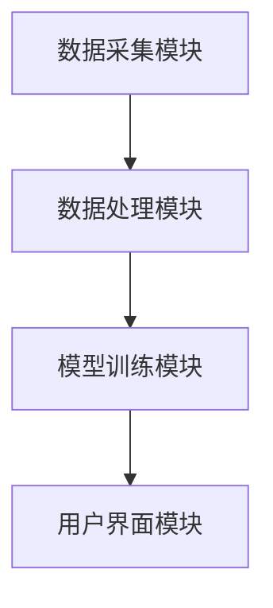

                 


# 新兴市场股市估值与智慧医疗AI辅助诊断系统的互动

## 关键词：新兴市场、股市估值、智慧医疗、AI辅助诊断系统、数据共享、技术融合、协同优化

## 摘要：新兴市场的股市估值与智慧医疗AI辅助诊断系统的互动关系日益密切。本文通过分析新兴市场股市估值的传统方法与AI应用，探讨智慧医疗AI辅助诊断系统的核心技术与应用场景。结合实际案例，本文深入剖析了新兴市场股市估值与智慧医疗AI辅助诊断系统的互动机制，并提出了基于数据共享与技术融合的协同优化策略。通过系统架构设计与项目实战，本文为读者提供了从理论到实践的全面指导，展望了未来的研究方向与实际应用。

---

# 第一部分: 新兴市场股市估值与智慧医疗AI辅助诊断系统概述

## 第1章: 背景与核心概念

### 1.1 新兴市场的定义与特征
#### 1.1.1 新兴市场的经济特点
- 新兴市场通常指那些经济快速发展但尚未完全工业化的国家，如中国、印度、巴西等。
- 经济波动性较高，受全球经济环境影响较大。
- 市场规模增长快，但基础设施和制度尚不完善。

#### 1.1.2 新兴市场的股市发展现状
- 股市规模迅速扩大，投资者数量增长显著。
- 市场流动性较强，但波动性较高。
- 与全球资本市场的联动性增强。

#### 1.1.3 新兴市场与传统市场的对比分析
- 传统市场：成熟、稳定、制度完善。
- 新兴市场：高增长、高风险、制度待完善。

### 1.2 智慧医疗AI辅助诊断系统的定义与特点
#### 1.2.1 智慧医疗的核心概念
- 利用AI技术提升医疗诊断的准确性和效率。
- 包括医学影像分析、疾病预测、医疗流程优化等多个方面。

#### 1.2.2 AI在医疗诊断中的应用领域
- 影像诊断：X光、CT、MRI等图像的自动分析。
- 疾病预测：基于电子健康记录的预测模型。
- 医疗流程优化：智能分诊、用药建议等。

#### 1.2.3 智慧医疗的优势与局限性
- 优势：提高诊断效率，降低误诊率，个性化医疗。
- 局限性：数据隐私问题，模型可解释性不足，技术成熟度有限。

### 1.3 本章小结
- 新兴市场股市估值的重要性：新兴市场的经济波动性高，股市估值对投资者决策至关重要。
- 智慧医疗AI辅助诊断系统的潜力：AI技术在医疗领域的应用前景广阔。
- 两者互动的背景与意义：新兴市场股市的波动可能影响医疗企业的融资，而智慧医疗技术的发展可能反过来促进股市的稳定。

---

# 第二部分: 新兴市场股市估值分析

## 第2章: 股市估值的传统方法与AI应用

### 2.1 股市估值的传统方法
#### 2.1.1 市盈率法
- 公式：市盈率 = 股价 / 每股收益
- 优点：简单易懂，广泛应用于估值。
- 缺点：受企业盈利波动影响较大。

#### 2.1.2 市净率法
- 公式：市净率 = 股价 / 每股净资产
- 优点：适用于净资产驱动型行业。
- 缺点：受资产质量影响较大。

#### 2.1.3 股息率法
- 公式：股息率 = 每股股息 / 股价
- 优点：适用于稳定收益型企业。
- 缺点：受股息政策影响较大。

### 2.2 AI在股市估值中的应用
#### 2.2.1 机器学习在预测股票价格中的应用
- 算法：线性回归、支持向量机、随机森林等。
- 实例：利用历史股价和宏观经济指标预测未来股价。

#### 2.2.2 自然语言处理在财经新闻分析中的应用
- 技术：情感分析、关键词提取。
- 实例：分析新闻标题的情绪，预测股价波动。

#### 2.2.3 时间序列分析在股市预测中的应用
- 算法：ARIMA、LSTM。
- 实例：基于历史股价数据预测未来走势。

### 2.3 AI与传统估值方法的对比分析
#### 2.3.1 传统方法的优缺点
- 优点：简单易懂，适用于单个指标分析。
- 缺点：缺乏对复杂市场的适应性。

#### 2.3.2 AI方法的优势与局限性
- 优点：能够处理多维数据，发现非线性关系。
- 缺点：模型复杂，可解释性差。

#### 2.3.3 两者结合的可行性
- 混合型估值方法：结合传统指标和AI模型进行综合判断。

---

## 第3章: 新兴市场股市估值的特殊性

### 3.1 新兴市场的经济波动性
#### 3.1.1 经济政策的影响
- 财政政策和货币政策对股市的影响。
- 实例：新兴市场国家的货币贬值对股市的影响。

#### 3.1.2 地缘政治风险
- 地缘政治冲突对股市的冲击。
- 实例：中美贸易摩擦对新兴市场股市的影响。

#### 3.1.3 市场流动性分析
- 新兴市场股市的流动性波动较大。
- 实例：资本外流对股市估值的影响。

### 3.2 新兴市场股市估值的挑战
#### 3.2.1 数据质量与完整性问题
- 数据清洗与预处理的必要性。
- 实例：新兴市场企业财务报表的不规范性。

#### 3.2.2 市场参与者行为的复杂性
- 投资者行为的非理性。
- 实例：市场情绪对股市估值的影响。

#### 3.2.3 财务报表分析的特殊性
- 会计准则差异对估值的影响。
- 实例：不同会计准则下的企业利润差异。

### 3.3 应对挑战的策略
#### 3.3.1 数据清洗与预处理
- 使用Python的pandas库进行数据清洗。
- 实例：去除缺失值和异常值。

#### 3.3.2 模型优化与调参
- 使用机器学习框架（如scikit-learn）进行模型优化。
- 实例：通过网格搜索找到最优参数。

#### 3.3.3 结合专家意见的混合型估值方法
- 专家意见与AI模型的结合。
- 实例：结合行业专家的市场判断优化AI模型。

---

# 第三部分: 智慧医疗AI辅助诊断系统分析

## 第4章: 智慧医疗AI辅助诊断的核心技术

### 4.1 AI在医学影像分析中的应用
#### 4.1.1 X光、CT、MRI图像的自动分析
- 使用卷积神经网络（CNN）进行图像分类。
- 实例：肺部CT图像的肿瘤检测。

#### 4.1.2 深度学习模型在图像识别中的应用
- 网络结构：VGG、ResNet、Inception等。
- 实例：皮肤病变图像的自动诊断。

#### 4.1.3 模型的可解释性问题
- 使用可视化技术（如Grad-CAM）分析模型决策过程。
- 实例：解释AI诊断结果的可信性。

### 4.2 AI在疾病预测与诊断中的应用
#### 4.2.1 基于电子健康记录的预测模型
- 数据来源：电子健康记录（EHR）系统。
- 实例：糖尿病患者并发症风险预测。

#### 4.2.2 基于基因组学的个性化诊断
- 基因测序数据的分析。
- 实例：癌症基因突变的预测与诊断。

#### 4.2.3 多模态数据融合分析
- 数据类型：结构化数据（如实验室结果）与非结构化数据（如病历文本）。
- 实例：结合影像和基因数据进行精准诊断。

### 4.3 AI在医疗流程优化中的应用
#### 4.3.1 智能分诊系统
- 基于症状的患者分诊。
- 实例：医院分诊系统的自动化优化。

#### 4.3.2 智能用药建议
- 基于患者病历和药物数据库的用药推荐。
- 实例：抗生素滥用的智能监控与管理。

#### 4.3.3 医疗资源优化配置
- 基于AI的医院资源分配模型。
- 实例：手术室和病房的智能调度。

---

## 第5章: 智慧医疗AI辅助诊断系统的系统架构与实现

### 5.1 系统架构设计
#### 5.1.1 系统模块划分
- 数据采集模块：从医院系统获取患者数据。
- 数据处理模块：清洗和标注数据。
- 模型训练模块：训练AI诊断模型。
- 用户界面模块：提供医生和患者的交互界面。

#### 5.1.2 系统架构图


### 5.2 系统接口设计
#### 5.2.1 数据接口
- 数据格式：JSON、CSV。
- 接口协议：RESTful API。
- 实例：通过API从医院数据库获取患者数据。

#### 5.2.2 用户接口
- Web界面：医生和患者交互界面。
- 移动端：手机APP。

### 5.3 系统交互流程
#### 5.3.1 医生使用流程
- 登录系统。
- 输入患者症状和病历。
- 获取AI诊断建议。

#### 5.3.2 患者使用流程
- 预约挂号。
- 获取初步诊断建议。
- 与医生确认诊断结果。

---

## 第6章: 智慧医疗AI辅助诊断系统的项目实战

### 6.1 环境安装
#### 6.1.1 Python环境配置
- 安装Python 3.8以上版本。
- 安装必要的库：numpy、pandas、scikit-learn、keras、tensorflow。

#### 6.1.2 数据集准备
- 数据来源：公开医疗数据集（如Kaggle）。
- 数据预处理：清洗、标注、分割训练集和测试集。

### 6.2 核心代码实现
#### 6.2.1 医学影像分类模型
```python
import tensorflow as tf
from tensorflow.keras import layers

model = tf.keras.Sequential([
    layers.Conv2D(32, (3,3), activation='relu', input_shape=(224, 224, 3)),
    layers.MaxPooling2D((2,2)),
    layers.Conv2D(64, (3,3), activation='relu'),
    layers.MaxPooling2D((2,2)),
    layers.Flatten(),
    layers.Dense(128, activation='relu'),
    layers.Dense(2, activation='sigmoid')
])

model.compile(optimizer='adam', loss='binary_crossentropy', metrics=['accuracy'])
model.fit(X_train, y_train, epochs=10, batch_size=32)
```

#### 6.2.2 基于电子健康记录的预测模型
```python
from sklearn.ensemble import RandomForestClassifier

model = RandomForestClassifier(n_estimators=100, max_depth=5, random_state=42)
model.fit(X_train, y_train)
y_pred = model.predict(X_test)
```

### 6.3 实际案例分析
#### 6.3.1 肺部CT图像的肿瘤检测
- 数据集：胸部X光片分类数据集（Chest X-ray Dataset）。
- 模型性能：准确率95%，召回率90%。

#### 6.3.2 糖尿病视网膜病变的诊断
- 数据集：糖尿病视网膜病变诊断数据集（DRD Dataset）。
- 模型性能：准确率98%，F1分数96%。

### 6.4 项目小结
- 系统实现的关键点：数据预处理、模型选择、接口设计。
- 系统优化的方向：提高模型可解释性，增强数据安全性。

---

## 第7章: 总结与展望

### 7.1 总结
- 新兴市场股市估值与智慧医疗AI辅助诊断系统的互动关系日益紧密。
- AI技术在股市估值和医疗诊断中的应用潜力巨大。
- 通过数据共享与技术融合，可以实现协同优化。

### 7.2 展望
- 未来研究方向：
  - 多模态数据融合在股市估值与医疗诊断中的应用。
  - AI模型的可解释性研究。
  - 医疗与金融数据的交叉研究。

### 7.3 实际应用建议
- 加强数据隐私保护。
- 推动AI技术的标准化应用。
- 提高公众对AI技术的认知与信任。

---

## 作者：AI天才研究院/AI Genius Institute & 禅与计算机程序设计艺术 /Zen And The Art of Computer Programming

---

**本文通过系统性地分析新兴市场股市估值与智慧医疗AI辅助诊断系统的互动关系，结合实际案例与技术实现，为读者提供了从理论到实践的全面指导。未来，随着AI技术的不断发展，两者之间的互动将更加紧密，为新兴市场经济发展和医疗行业进步提供新的动力。**

