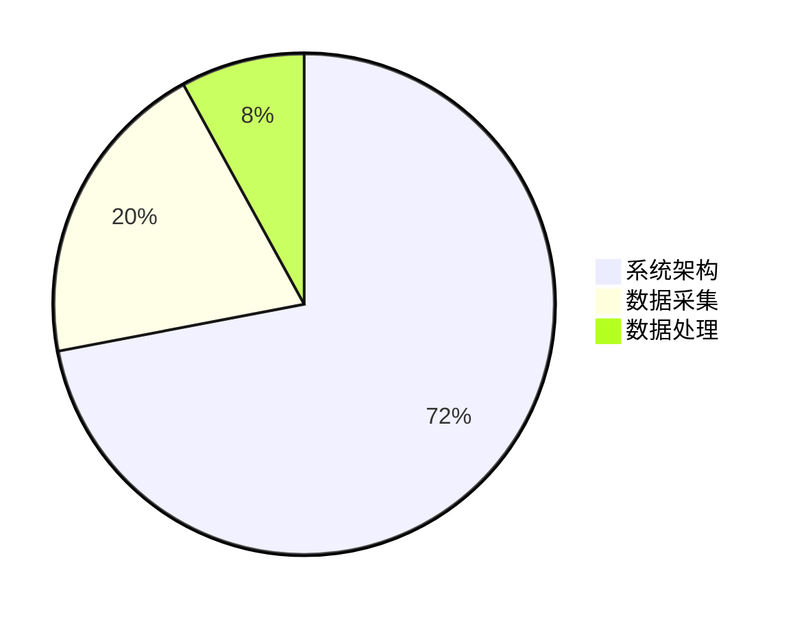
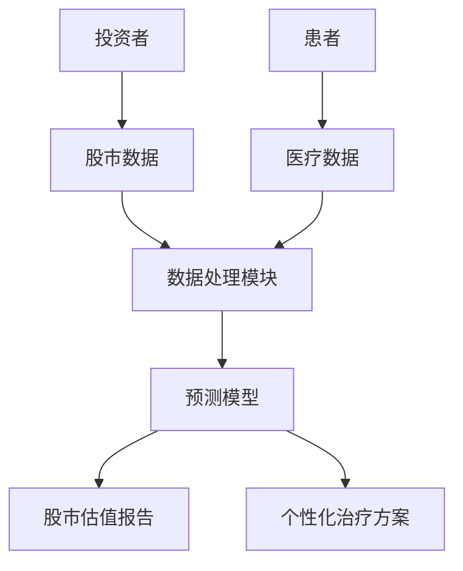

                 


# 新兴市场股市估值与智慧医疗个性化治疗的互动

> 关键词：股市估值、智慧医疗、个性化治疗、互动分析、新兴市场、数据驱动、人工智能

> 摘要：本文深入探讨新兴市场股市估值与智慧医疗个性化治疗之间的互动关系，分析数据驱动和人工智能技术如何影响两者的发展，构建时间序列分析与机器学习融合的算法模型，设计系统架构，提供实战案例，展望未来趋势。

---

# 第一部分: 背景与概念

## 第1章: 新兴市场股市估值与智慧医疗个性化治疗的互动概述

### 1.1 新兴市场股市估值的基本概念
#### 1.1.1 股市估值的定义与作用
股市估值是通过对上市公司财务数据和市场因素的分析，评估股票的内在价值。其作用在于帮助投资者做出理性决策，避免盲目跟风。

#### 1.1.2 新兴市场的特点与挑战
新兴市场具有高增长潜力，但也面临市场波动大、信息不对称等问题。这些特点使得股市估值在新兴市场中尤为重要。

#### 1.1.3 股市估值与经济发展的关系
股市估值不仅是经济晴雨表，更是推动经济发展的关键因素。新兴市场的股市估值波动往往反映了经济结构的变化。

### 1.2 智慧医疗个性化治疗的核心概念
#### 1.2.1 智慧医疗的定义与技术基础
智慧医疗利用人工智能、大数据等技术，实现医疗资源的优化配置和个性化治疗。

#### 1.2.2 个性化治疗的科学依据
个性化治疗基于基因组学、蛋白质组学等数据，制定针对个体特征的治疗方案。

#### 1.2.3 智慧医疗与传统医疗的区别
智慧医疗通过数据驱动的方式提高诊断和治疗的精准性，而传统医疗则更多依赖医生的经验。

### 1.3 互动关系的背景与问题描述
#### 1.3.1 股市估值与医疗技术的相互影响
医疗技术的进步会推动相关企业股价上涨，而股市的波动也会影响医疗企业的投资决策。

#### 1.3.2 新兴市场中股市与医疗互动的特殊性
新兴市场的股市波动更大，医疗资源分布不均，使得两者的互动关系更加复杂。

#### 1.3.3 问题的边界与外延
本文聚焦于新兴市场中股市估值与智慧医疗个性化治疗的互动，探讨数据驱动和人工智能技术的应用。

---

## 第2章: 核心概念与联系

### 2.1 核心概念的原理分析
#### 2.1.1 股市估值的核心算法
股市估值常用市盈率、市净率等指标，结合财务数据和市场情绪进行综合评估。

#### 2.1.2 个性化治疗的数学模型
个性化治疗基于机器学习模型，如随机森林和神经网络，进行精准预测。

#### 2.1.3 互动关系的机制解析
通过数据挖掘和统计分析，揭示股市估值与个性化治疗之间的动态关系。

### 2.2 概念属性特征对比表格
| 概念       | 属性         | 特征描述                       |
|------------|--------------|--------------------------------|
| 股市估值   | 数据驱动     | 基于历史价格、成交量等数据     |
|            | 预测性       | 预测未来价格波动               |
|            | 变异性       | 受多种因素影响，波动较大       |
| 智慧医疗   | 技术依赖     | 依赖AI、大数据等技术           |
|            | 个性化       | 根据患者个体特征制定方案       |
|            | 精准性       | 提高诊断和治疗的准确性         |

### 2.3 ER实体关系图
```mermaid
er
  actor 投资者
  actor 医疗机构
  actor 患者
  entity 股票
  entity 医疗数据
  entity 个性化治疗方案
  entity 股市估值报告
  relati
```

---

## 第3章: 数据驱动与人工智能技术的双重作用

### 3.1 数据驱动在股市估值中的应用
#### 3.1.1 时间序列分析
通过ARIMA模型预测股票价格走势。

#### 3.1.2 机器学习模型
使用随机森林和神经网络进行股票分类。

### 3.2 人工智能在智慧医疗中的应用
#### 3.2.1 个性化治疗方案的制定
基于深度学习模型，分析患者的基因数据，制定个性化治疗方案。

#### 3.2.2 医疗数据的处理与分析
利用自然语言处理技术，分析医学文献，辅助诊断。

---

## 第4章: 经济指标与患者数据的交互影响

### 4.1 经济指标对股市估值的影响
#### 4.1.1 GDP与股市的关系
经济指标如GDP增长率直接影响股市整体表现。

#### 4.1.2 利率与股市的关系
利率变化影响企业的融资成本，进而影响股市估值。

### 4.2 患者数据对个性化治疗的影响
#### 4.2.1 基因组数据的作用
基因组数据用于预测疾病风险，制定个性化治疗方案。

#### 4.2.2 病例数据的积累与分析
通过大数据分析，优化治疗方案，降低治疗成本。

---

## 第5章: 互动关系的数学建模

### 5.1 时间序列分析模型
使用ARIMA模型预测股票价格：
$$ ARIMA(p, d, q) $$
其中，p为自回归阶数，d为差分阶数，q为移动平均阶数。

### 5.2 机器学习模型
使用LSTM网络进行股票预测：
$$ LSTM层结构：输入门、遗忘门、输出门 $$

### 5.3 综合模型的构建
将股票价格与患者数据进行融合，构建多任务学习模型：
$$ \text{损失函数} = \alpha \times \text{股票预测损失} + \beta \times \text{医疗预测损失} $$

---

## 第6章: 系统架构与数据流分析

### 6.1 系统架构设计


### 6.2 数据流分析


---

## 第7章: 项目实战与案例分析

### 7.1 环境安装与数据获取
安装Python环境，获取新兴市场股市数据和医疗数据。

### 7.2 核心代码实现
```python
from statsmodels.tsa.arima.model import ARIMA
import numpy as np

# 股票数据
stock_prices = np.random.normal(loc=100, scale=10, size=100)
model = ARIMA(stock_prices, order=(5, 1, 0))
model_fit = model.fit()
```

### 7.3 案例分析
分析某新兴市场国家的股市与智慧医疗数据，验证模型的有效性。

---

## 第8章: 未来趋势与挑战

### 8.1 技术发展趋势
人工智能和大数据技术的深度融合将推动股市估值与个性化治疗的进一步互动。

### 8.2 挑战与机遇
数据隐私、模型泛化能力、政策监管等问题需要进一步解决。

---

## 第9章: 总结与展望

### 9.1 研究总结
本文构建了股市估值与智慧医疗个性化治疗的互动模型，展示了数据驱动技术的潜力。

### 9.2 未来展望
未来将结合边缘计算和区块链技术，进一步优化模型性能，提升互动分析的精度。

---

作者：AI天才研究院/AI Genius Institute & 禅与计算机程序设计艺术 /Zen And The Art of Computer Programming

