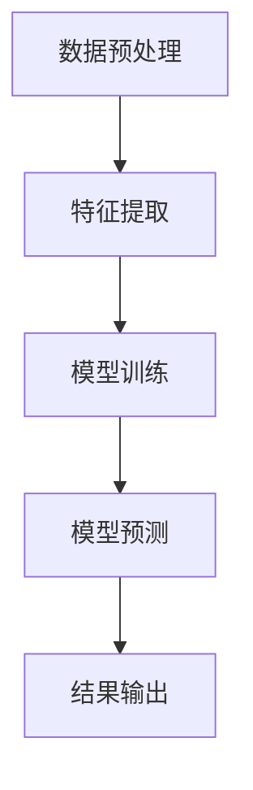
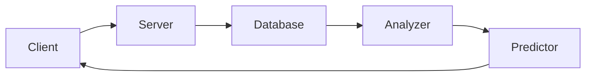

                 


# 新兴市场股市估值与智慧医疗个性化治疗的互动

> 关键词：新兴市场，股市估值，智慧医疗，个性化治疗，互动机制

> 摘要：本文探讨新兴市场股市估值与智慧医疗个性化治疗的互动关系，分析两者的核心概念、数学模型、算法原理、系统架构，并通过实际案例和项目实战，揭示两者如何相互影响，为投资者和医疗从业者提供深度见解。

---

# 第一部分: 背景与概述

## 第1章: 新兴市场股市估值与智慧医疗个性化治疗的互动概述

### 1.1 问题背景与描述

#### 1.1.1 新兴市场股市估值的现状与挑战
新兴市场股市具有高波动性、不透明性和政策敏感性等特点，传统估值方法面临挑战。

#### 1.1.2 智慧医疗个性化治疗的发展趋势
个性化医疗通过基因组学、人工智能和大数据实现精准治疗，正在改变传统医疗模式。

#### 1.1.3 两者的互动关系与研究意义
股市估值波动可能影响医疗投资，而医疗技术进步可能反过来推动股市表现，这种互动关系具有重要的研究价值。

### 1.2 核心概念与边界

#### 1.2.1 新兴市场股市估值的定义与核心要素
股市估值是通过金融指标（如市盈率、市净率）评估企业价值的过程，新兴市场的特殊性使其估值更具挑战性。

#### 1.2.2 智慧医疗个性化治疗的定义与核心要素
个性化治疗基于患者个体特征，结合基因组学和AI技术，提供定制化医疗方案。

#### 1.2.3 互动关系的边界与外延
互动关系主要体现在医疗技术创新对股市的影响，以及股市波动对医疗投资的影响。

### 1.3 本章小结
新兴市场股市估值和智慧医疗个性化治疗的互动关系是双向的，具有重要的经济和医疗意义。

---

# 第二部分: 核心概念与原理

## 第2章: 新兴市场股市估值的核心原理

### 2.1 股市估值的基本原理

#### 2.1.1 市盈率（P/E）模型
$$ P/E = \frac{Market\ Price}{Earnings\ Per\ Share} $$

#### 2.1.2 市净率（P/B）模型
$$ P/B = \frac{Market\ Price}{Book\ Value\ Per\ Share} $$

#### 2.1.3 股息率模型
$$ Dividend\ Yield = \frac{Annual\ Dividends\ Per\ Share}{Market\ Price} $$

### 2.2 新兴市场的特殊性

#### 2.2.1 新兴市场的经济特征
新兴市场通常具有较高的经济增长率，但市场波动性较大。

#### 2.2.2 新兴市场的股市波动性
新兴市场受政策和外部环境影响较大，股市波动显著。

#### 2.2.3 新兴市场的投资者行为
投资者行为更趋短期化，容易受到市场情绪影响。

### 2.3 数学模型与公式

#### 2.3.1 市盈率公式
$$ P/E = \frac{Market\ Price}{Earnings\ Per\ Share} $$

#### 2.3.2 市净率公式
$$ P/B = \frac{Market\ Price}{Book\ Value\ Per\ Share} $$

#### 2.3.3 股息率公式
$$ Dividend\ Yield = \frac{Annual\ Dividends\ Per\ Share}{Market\ Price} $$

---

## 第3章: 智慧医疗个性化治疗的核心原理

### 3.1 个性化治疗的基本原理

#### 3.1.1 基于患者基因组的治疗方案
通过基因组分析制定个性化用药方案。

#### 3.1.2 基于大数据的疾病预测与治疗
利用大数据分析预测疾病风险，制定个性化治疗计划。

#### 3.1.3 人工智能在医疗诊断中的应用
AI技术用于辅助诊断、药物研发和治疗方案优化。

### 3.2 核心概念与原理

#### 3.2.1 基因组学与个性化医疗
基因组学为个性化治疗提供科学依据。

#### 3.2.2 大数据分析与预测模型
通过大数据分析构建疾病预测模型。

#### 3.2.3 AI技术在医疗诊断中的应用
AI技术用于医疗影像识别、疾病诊断和治疗方案优化。

### 3.3 数学模型与公式

#### 3.3.1 基因组数据分析模型
$$ Probability\ of\ disease = \sum_{i=1}^{n} w_i \cdot feature_i $$

#### 3.3.2 基于机器学习的疾病预测模型
$$ y = \sum_{i=1}^{n} \beta_i x_i + \epsilon $$

---

# 第三部分: 算法原理与系统架构

## 第4章: 新兴市场股市估值的算法原理

### 4.1 算法原理

#### 4.1.1 基于时间序列的股市预测
使用ARIMA模型预测股市走势。

#### 4.1.2 基于机器学习的股市估值
使用随机森林模型进行股市估值。

### 4.2 算法流程图



---

## 第5章: 智慧医疗个性化治疗的系统架构

### 5.1 系统功能设计

#### 5.1.1 病历数据采集
采集患者的基因组、病历和治疗数据。

#### 5.1.2 数据分析与处理
对数据进行清洗、转换和特征提取。

#### 5.1.3 模型训练与预测
基于机器学习模型进行个性化治疗方案推荐。

### 5.2 系统架构设计



---

# 第四部分: 项目实战与案例分析

## 第6章: 项目实战

### 6.1 环境安装

#### 6.1.1 安装Python
```bash
pip install python
```

#### 6.1.2 安装机器学习库
```bash
pip install scikit-learn
```

### 6.2 核心代码实现

#### 6.2.1 基于机器学习的股市估值代码
```python
from sklearn.ensemble import RandomForestRegressor
import pandas as pd

# 加载数据
data = pd.read_csv('stock_data.csv')

# 特征选择
X = data[['PE', 'PB', 'Dividend_Yield']]
y = data['Price']

# 模型训练
model = RandomForestRegressor()
model.fit(X, y)

# 预测
predicted_price = model.predict(X)
```

#### 6.2.2 基于AI的个性化医疗代码
```python
from sklearn.neighbors import KNeighborsClassifier
import pandas as pd

# 加载数据
data = pd.read_csv('patient_data.csv')

# 特征选择
X = data[['gene1', 'gene2', 'symptom1', 'symptom2']]
y = data['disease']

# 模型训练
model = KNeighborsClassifier()
model.fit(X, y)

# 预测
predicted_disease = model.predict(X)
```

### 6.3 案例分析

#### 6.3.1 股市估值案例
分析某新兴市场股票的市盈率和市净率，预测其合理估值范围。

#### 6.3.2 个性化医疗案例
基于患者的基因组数据，预测其患病风险，并制定个性化治疗方案。

---

# 第五部分: 总结与展望

## 第7章: 总结与展望

### 7.1 核心发现
新兴市场股市估值和智慧医疗个性化治疗的互动关系具有重要研究价值。

### 7.2 未来展望
未来可以进一步研究两者互动的量化模型，探索更高效的算法和系统架构。

---

# 作者信息

作者：AI天才研究院/AI Genius Institute & 禅与计算机程序设计艺术/Zen And The Art of Computer Programming

