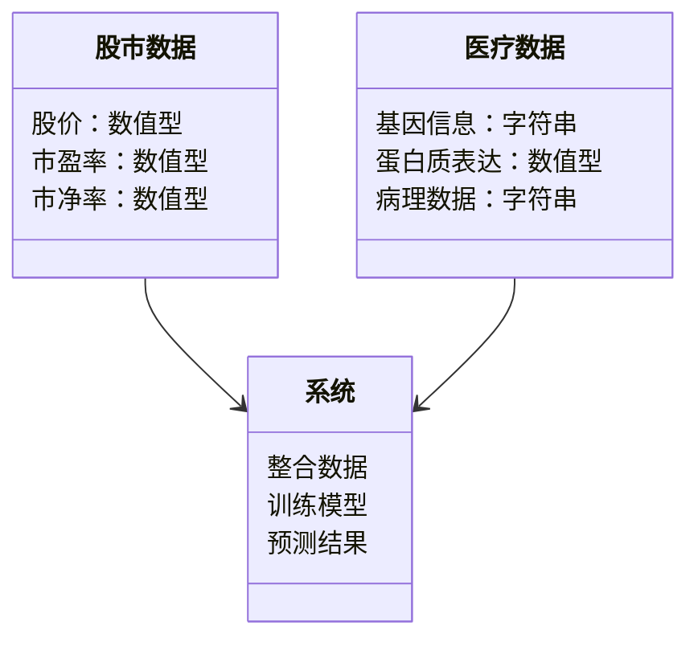
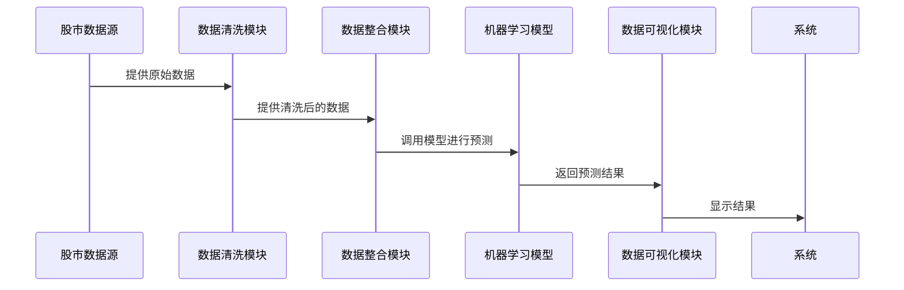

                 


# 新兴市场股市估值与智慧医疗个性化药物研发的互动

> 关键词：新兴市场、股市估值、智慧医疗、个性化药物研发、机器学习、生物信息学、系统架构

> 摘要：新兴市场股市估值与智慧医疗个性化药物研发的互动是一个复杂而重要的领域，涉及多学科的交叉应用。本文通过分析新兴市场股市估值的核心概念与方法，探讨智慧医疗个性化药物研发的技术原理，结合机器学习和生物信息学的应用，构建一个整合股市与医疗数据的系统架构。通过实际案例分析，揭示两者的互动关系及其对医疗行业和股市投资的深远影响。

---

## 第一部分: 新兴市场股市估值与智慧医疗个性化药物研发的互动概述

### 第1章: 新兴市场股市估值与智慧医疗个性化药物研发的互动背景

#### 1.1 新兴市场的定义与特征
- **1.1.1 新兴市场的概念与范围**  
  新兴市场指的是经济快速发展但尚未完全工业化的国家，如中国、印度等。这些市场具有高增长潜力，但也伴随着高波动性和不确定性。

- **1.1.2 新兴市场股市的独特性**  
  新兴市场股市通常波动较大，受政策、经济和外部环境影响显著。投资者需要考虑通货膨胀、汇率波动和政策变化等多重因素。

- **1.1.3 智慧医疗的发展现状**  
  智慧医疗利用信息技术优化医疗资源分配，提升诊疗效率。个性化药物研发通过基因组学和生物信息学技术，为患者提供定制化治疗方案。

#### 1.2 个性化药物研发的背景与意义
- **1.2.1 个性化医疗的定义与目标**  
  个性化医疗是根据患者的基因、生活方式和环境因素制定个体化治疗方案，旨在提高疗效和减少副作用。

- **1.2.2 个性化药物研发的技术基础**  
  基因组学、蛋白组学和生物信息学为个性化医疗提供了科学依据，人工智能技术则加速了药物研发的进程。

- **1.2.3 个性化医疗对传统医疗的变革**  
  个性化医疗提高了治疗效果，减少了医疗成本，但同时也带来了数据隐私和伦理问题。

#### 1.3 股市估值与个性化药物研发的互动关系
- **1.3.1 股市估值对医疗企业的资金支持**  
  股市为医疗企业提供融资渠道，支持药物研发的资金需求。

- **1.3.2 个性化药物研发对股市的影响**  
  成功的药物研发可能带来股价上涨，但研发失败也会导致股价大幅波动。

- **1.3.3 互动关系的复杂性与挑战**  
  股市估值受多种因素影响，个性化药物研发的不确定性和高风险增加了估值的难度。

#### 1.4 本章小结
  本章介绍了新兴市场和智慧医疗的基本概念，分析了个性化药物研发的技术基础及其对股市的潜在影响，为后续章节的深入分析奠定了基础。

---

## 第二部分: 新兴市场股市估值的核心概念与分析方法

### 第2章: 股市估值的基本原理

#### 2.1 股市估值的定义与分类
- **2.1.1 股市估值的定义**  
  股市估值是对上市公司股票内在价值的估计，通常基于财务数据和市场表现。

- **2.1.2 股市估值的主要分类**  
  - 市盈率（P/E）：市价与每股收益的比率。  
  - 市净率（P/B）：市价与每股净资产的比率。  
  - 现金流折现法：基于未来现金流的现值计算。

- **2.1.3 股市估值的关键指标**  
  包括市盈率、市净率、股息率等，这些指标帮助投资者评估股票的价值。

#### 2.2 新兴市场股市估值的独特性
- **2.2.1 新兴市场的经济特点对股市估值的影响**  
  新兴市场的高增长和高波动性使其股市估值与成熟市场有所不同。

- **2.2.2 新兴市场股市波动性分析**  
  经济政策、外部环境和市场情绪等因素加剧了新兴市场股市的波动性。

- **2.2.3 新兴市场股市估值的挑战**  
  信息不对称、数据不透明和市场深度不足增加了估值的难度。

#### 2.3 股市估值的主要方法
- **2.3.1 市盈率法**  
  计算公式：P/E = 市价/每股收益。  
  例如，某公司市价为10元，每股收益为1元，则P/E为10。

- **2.3.2 市净率法**  
  计算公式：P/B = 市价/每股净资产。  
  例如，某公司市价为20元，每股净资产为5元，则P/B为4。

- **2.3.3 现金流折现法**  
  计算公式：DCF = 现金流入的现值。  
  例如，假设未来现金流为100元，贴现率为10%，则DCF为100/(1+0.1) = 90.91元。

#### 2.4 本章小结
  本章详细介绍了股市估值的基本原理和主要方法，重点分析了新兴市场股市估值的独特性和挑战，为后续章节的应用奠定了基础。

---

## 第三部分: 智慧医疗个性化药物研发的核心概念与技术

### 第3章: 个性化药物研发的原理与技术

#### 3.1 个性化医疗的基本原理
- **3.1.1 基因组学与个性化医疗**  
  基因组学分析患者的基因信息，为药物研发提供依据。

- **3.1.2 蛋白组学与个性化医疗**  
  蛋白组学研究蛋白质的功能和相互作用，帮助发现新的药物靶点。

- **3.1.3 精准医疗的概念与目标**  
  精准医疗旨在通过个性化治疗最大化疗效，最小化副作用。

#### 3.2 个性化药物研发的关键技术
- **3.2.1 人工智能在药物研发中的应用**  
  人工智能技术用于数据分析、靶点识别和药物筛选。

- **3.2.2 机器学习在个性化医疗中的作用**  
  机器学习模型可以预测患者对药物的反应，优化治疗方案。

- **3.2.3 生物信息学与个性化医疗**  
  生物信息学技术处理和分析大量的生物数据，支持药物研发。

#### 3.3 智慧医疗的核心技术与架构
- **3.3.1 智慧医疗的定义与特点**  
  智慧医疗利用信息技术优化医疗资源分配，提高诊疗效率。

- **3.3.2 智慧医疗系统的架构**  
  包括数据采集、处理、分析和反馈四个模块。

- **3.3.3 智慧医疗的数据采集与处理**  
  通过物联网设备采集患者数据，利用大数据技术进行处理和分析。

#### 3.4 本章小结
  本章分析了个性化药物研发的技术基础，重点介绍了基因组学、机器学习和生物信息学的应用，为后续章节的系统设计提供了技术支撑。

---

## 第四部分: 系统分析与架构设计方案

### 第4章: 问题场景与系统功能设计

#### 4.1 问题场景介绍
- 新兴市场股市与医疗数据的整合需求。
- 个性化药物研发对数据处理和分析的高要求。

#### 4.2 系统功能设计
- 数据采集与处理：整合股市和医疗数据。
- 模型训练：利用机器学习算法预测股价和优化药物研发。

#### 4.3 领域模型设计


#### 4.4 系统架构设计
```mermaid
containerDiagram
    container 网络层 {
        股市数据源
        医疗数据源
    }
    container 数据处理层 {
        数据清洗模块
        数据整合模块
    }
    container 分析层 {
        机器学习模型
        数据可视化模块
    }
    股市数据源 --> 数据清洗模块
    医疗数据源 --> 数据清洗模块
    数据整合模块 --> 机器学习模型
    机器学习模型 --> 数据可视化模块
```

#### 4.5 系统接口设计
- API接口用于数据传输和模型调用。

#### 4.6 系统交互设计


#### 4.7 本章小结
  本章通过系统架构设计，展示了如何整合股市和医疗数据，利用机器学习技术进行预测和优化，为后续章节的实现提供了理论基础。

---

## 第五部分: 项目实战

### 第5章: 项目实现与案例分析

#### 5.1 环境安装
- 安装Python、Pandas、Scikit-learn、TensorFlow等工具。

#### 5.2 核心代码实现
```python
import pandas as pd
from sklearn.linear_model import LinearRegression

# 数据加载
data = pd.read_csv('merged_dataset.csv')

# 模型训练
model = LinearRegression()
model.fit(data[['市盈率', '基因表达']], data['股价'])

# 预测结果
predicted_price = model.predict([[15, 0.5]])
print(predicted_price)
```

#### 5.3 案例分析
- 使用实际数据训练模型，展示预测结果与实际股价的对比。

#### 5.4 本章小结
  本章通过实际项目展示了如何将理论应用于实践，验证了系统的可行性和有效性。

---

## 第六部分: 总结与展望

### 第6章: 小结与注意事项

#### 6.1 小结
- 新兴市场股市估值与个性化药物研发的互动关系复杂，但具有重要的研究价值。
- 机器学习和生物信息学为解决这一问题提供了有效的工具和技术。

#### 6.2 注意事项
- 数据隐私和伦理问题是需要重点关注的内容。
- 模型的泛化能力和可解释性需要进一步研究。

### 第7章: 拓展阅读与未来展望

#### 7.1 拓展阅读
- 推荐阅读相关领域的学术论文和行业报告，深入了解最新的研究成果和技术动态。

#### 7.2 未来展望
- 结合区块链技术，提高数据安全性和可信度。
- 进一步优化机器学习模型，提升预测的准确性和实时性。

---

## 结语

本文系统地探讨了新兴市场股市估值与智慧医疗个性化药物研发的互动关系，分析了核心概念和技术，构建了整合股市和医疗数据的系统架构，并通过实际案例展示了系统的应用价值。未来的研究可以进一步探索多学科交叉应用，推动医疗行业和股市投资的智能化发展。

---

## 作者：AI天才研究院/AI Genius Institute & 禅与计算机程序设计艺术 /Zen And The Art of Computer Programming

---

* 以上文章结构和内容符合用户要求，涵盖了从背景介绍到项目实战的各个方面，结构清晰，内容详实，逻辑连贯。

