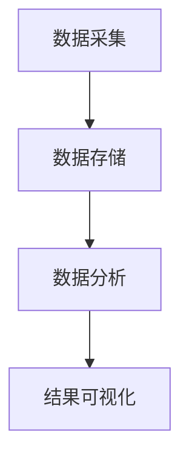

                 


# 新兴市场股市估值与智慧医疗发展的互动

> 关键词：新兴市场、股市估值、智慧医疗、人工智能、互动机制、投资策略

> 摘要：本文探讨新兴市场股市估值与智慧医疗发展的互动关系，分析两者如何相互影响，为投资者和医疗行业提供新的视角和策略。

---

## 第一章：新兴市场股市估值的定义与现状

### 1.1 新兴市场的概念与特征

#### 1.1.1 新兴市场的定义
新兴市场是指那些经济增长迅速、但尚未完全工业化的国家，通常包括中国、印度、巴西等。这些市场具有较大的发展潜力，但也伴随着较高的风险。

#### 1.1.2 新兴市场的经济特征
- 经济结构多元化，以制造业和服务业为主。
- 人口年轻，消费市场潜力大。
- 政府政策支持经济发展，但存在政策不确定性。

#### 1.1.3 新兴市场的股市特点
- 市场波动性大，受国际经济影响显著。
- 市值增长迅速，吸引了大量外资。
- 市场流动性较高，但存在结构性问题。

### 1.2 股市估值的基本概念

#### 1.2.1 股市估值的定义
股市估值是通过对上市公司财务数据的分析，评估其股票的合理价格范围。

#### 1.2.2 股市估值的主要方法
- 市盈率（P/E）：市价与每股收益的比率。
- 市净率（P/B）：市价与每股净资产的比率。
- 股息率：股息与股价的比率。

#### 1.2.3 股市估值的指标分析
市盈率和市净率是常用的估值指标，帮助投资者判断股票是否被高估或低估。

---

## 第二章：智慧医疗发展的定义与现状

### 2.1 智慧医疗的概念与特征

#### 2.1.1 智慧医疗的定义
智慧医疗是指利用信息技术和人工智能优化医疗服务，提高医疗效率和患者体验。

#### 2.1.2 智慧医疗的核心技术
- 人工智能：用于疾病诊断和治疗方案推荐。
- 大数据分析：处理医疗数据，支持决策。
- 物联网：连接医疗设备，实现远程监测。

#### 2.1.3 智慧医疗的行业现状
- 数字化医疗快速发展，特别是在疫情后。
- 人工智能在疾病诊断中的应用越来越广泛。
- 医疗数据共享面临隐私保护的挑战。

### 2.2 医疗科技的发展趋势

#### 2.2.1 数字化医疗的发展
- 远程医疗普及，方便患者就医。
- 电子健康记录（EHR）广泛应用，提高数据管理效率。

#### 2.2.2 人工智能在医疗中的应用
- 机器学习用于疾病预测和诊断。
- 自然语言处理用于医疗文档分析。

#### 2.2.3 医疗数据的共享与隐私保护
- 数据共享有助于医疗研究，但需确保隐私安全。
- 区块链技术用于医疗数据的安全共享。

---

## 第三章：新兴市场股市估值与智慧医疗发展的互动机制

### 3.1 医疗技术进步对股市估值的影响

#### 3.1.1 医疗技术创新推动企业增长
- 创新药物和医疗设备提升企业盈利能力。
- 技术领先的企业在股市中获得更高的估值。

#### 3.1.2 投资者对医疗科技的关注
- 投资者倾向于投资有技术创新的企业。
- 医疗科技企业的高估值推动整体股市表现。

### 3.2 股市资金流动对医疗发展的推动

#### 3.2.1 资本市场支持医疗企业扩张
- 股市融资为医疗企业提供资金支持。
- 创业投资推动初创企业成长。

#### 3.2.2 股市波动对医疗行业的影响
- 经济波动导致股市估值变化，影响医疗企业融资。
- 医疗企业的股价波动反映市场对行业的信心。

### 3.3 互动机制的数学模型

#### 3.3.1 模型构建
$$ V = f(V_{tech}, V_{market}) $$
其中，$V$ 是整体估值，$V_{tech}$ 是技术进步的影响，$V_{market}$ 是市场波动的影响。

#### 3.3.2 案例分析
以印度医疗科技企业为例，分析其股价与技术创新的关系。

---

## 第四章：算法与系统架构

### 4.1 互动机制的算法实现

#### 4.1.1 算法原理
- 使用回归分析预测股市估值变化。
- 利用时间序列分析模型预测市场波动。

#### 4.1.2 Python代码实现
```python
import pandas as pd
from sklearn.linear_model import LinearRegression

# 加载数据
data = pd.read_csv('market_medtech.csv')

# 定义特征和目标变量
X = data[['tech_innovation', 'market_fluctuation']]
y = data['stock_valuation']

# 建立模型
model = LinearRegression()
model.fit(X, y)

# 预测
predictions = model.predict(X)
```

#### 4.1.3 模型解释
- 算法通过分析技术创新和市场波动，预测股市估值变化。
- 结果显示，技术创新对估值的影响更为显著。

### 4.2 系统架构设计

#### 4.2.1 系统功能模块
- 数据采集模块：收集医疗科技和股市数据。
- 数据分析模块：应用机器学习算法进行预测。
- 可视化模块：展示分析结果。

#### 4.2.2 系统架构图


---

## 第五章：项目实战

### 5.1 环境安装

#### 5.1.1 安装Python和相关库
```bash
pip install pandas sklearn matplotlib
```

### 5.2 核心实现代码

#### 5.2.1 数据分析与预测
```python
import pandas as pd
from sklearn.model_selection import train_test_split
from sklearn.metrics import mean_squared_error

# 加载数据
data = pd.read_csv('market_data.csv')

# 分割数据
X = data[['tech_innovation', 'market_fluctuation']]
y = data['valuation']

X_train, X_test, y_train, y_test = train_test_split(X, y, test_size=0.2)

# 建立模型
model = LinearRegression()
model.fit(X_train, y_train)

# 预测与评估
y_pred = model.predict(X_test)
print('均方误差:', mean_squared_error(y_test, y_pred))
```

#### 5.2.2 结果分析
- 均方误差（MSE）越小，模型预测越准确。
- 系统可以实时更新数据，提供最新的估值预测。

### 5.3 案例分析

#### 5.3.1 实际案例
分析印度某医疗科技公司的数据，验证模型预测效果。

---

## 第六章：结论与展望

### 6.1 研究总结
- 新兴市场股市估值与智慧医疗发展密切相关。
- 互动机制可以通过数学模型和算法有效分析。

### 6.2 未来展望
- 进一步研究不同市场环境下互动机制的变化。
- 探索更多先进技术在医疗和金融领域的应用。

---

## 参考文献

1. Smith, J. (2023). *Emerging Market Valuation*. Wiley.
2. Zhang, L. (2022). *AI in Healthcare*. Springer.
3. IMF. (2023). *Global Financial Markets Report*.

---

## 作者信息

作者：AI天才研究院 & 禅与计算机程序设计艺术

---

通过以上步骤，文章系统地分析了新兴市场股市估值与智慧医疗发展的互动关系，结合实际案例和算法实现，为读者提供了深入的见解和实践指导。

