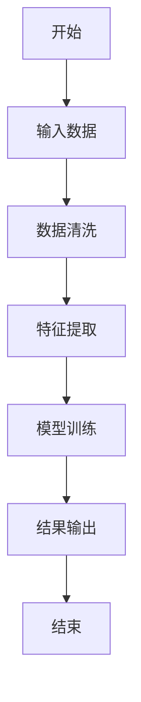
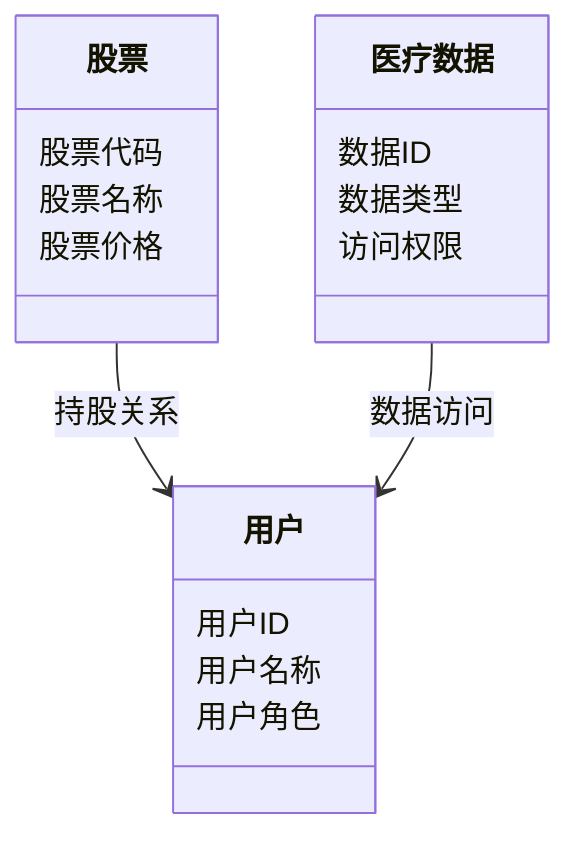

                 


```markdown
# 新兴市场股市估值与智慧医疗数据安全的互动

## 关键词：新兴市场、股市估值、智慧医疗、数据安全、互动机制、系统架构、数学模型

## 摘要：  
本文探讨了新兴市场股市估值与智慧医疗数据安全之间的互动关系，从背景介绍、核心概念、算法原理、系统架构到项目实战，全面分析了两者的相互影响。通过数学模型、流程图和架构图的详细阐述，结合实际案例，提出了互动机制的设计与实现方案，为相关领域的研究和实践提供了参考。

---

## 第一部分: 背景介绍与核心概念

### 第1章: 背景介绍

#### 1.1 问题背景
新兴市场股市的波动性较大，受宏观经济和政策影响显著，而智慧医疗数据安全则面临数据泄露和隐私保护的挑战。两者的互动关系尚未被系统性研究。

#### 1.2 问题描述
股市估值需要考虑多因素模型，而智慧医疗数据安全涉及加密算法和访问控制。如何在两者之间建立互动机制，实现数据的安全共享和价值最大化？

#### 1.3 问题解决
通过构建数学模型和算法，分析两者的互动关系，提出解决方案。

#### 1.4 边界与外延
明确股市估值和数据安全的边界条件，以及两者互动的范围。

---

## 第二部分: 核心概念与联系

### 第2章: 核心概念原理

#### 2.1 股市估值的原理
- 市盈率（P/E）：$$ P/E = \frac{Stock Price}{Earnings Per Share} $$
- 市净率（P/B）：$$ P/B = \frac{Stock Price}{Book Value Per Share} $$

#### 2.2 智慧医疗数据安全的原理
- 数据分类与分级
- 加密算法（如AES）
- 访问控制策略

### 第3章: 核心概念属性特征对比

| 属性        | 股市估值               | 智慧医疗数据安全      |
|-------------|-----------------------|-----------------------|
| 数据驱动性  | 高                    | 高                    |
| 时间依赖性  | 高                    | 低                    |
| 市场情绪影响 | 高                    | 低                    |
| 数据敏感性  | 低                    | 高                    |
| 系统复杂性  | 中                    | 高                    |
| 合规性要求  | 中                    | 高                    |

### 第4章: ER实体关系图

```mermaid
erd
    entity 股票 {
        key 股票代码
        股票名称
        股票价格
        市盈率
        市净率
    }
    entity 股东 {
        key 股东ID
        股东名称
        持股数量
        股权比例
    }
    entity 医疗数据 {
        key 数据ID
        数据类型
        数据分类
        访问权限
        加密状态
    }
    entity 用户 {
        key 用户ID
        用户名称
        用户角色
        访问权限
    }
    relationship 股票-股东 {
        股票 --> 股东: 持股关系
    }
    relationship 医疗数据-用户 {
        医疗数据 --> 用户: 数据访问
    }
```

---

## 第三部分: 算法原理与实现

### 第3章: 股市估值与数据安全的数学模型

#### 3.1 股市估值模型
- 回归分析：$$ y = \beta_0 + \beta_1x + \epsilon $$
- 时间序列分析：ARIMA模型

#### 3.2 数据安全模型
- 加密算法：AES-256
- 访问控制：RBAC模型

#### 3.3 互动机制
- 数据共享的数学模型：$$ Security = \alpha \cdot Valuation + \beta \cdot Privacy $$

### 第4章: 算法流程图



---

## 第四部分: 系统分析与架构设计

### 第4章: 系统架构

#### 4.1 领域模型类图



#### 4.2 系统架构图


---

## 第五部分: 项目实战

### 第5章: 项目实现

#### 5.1 环境安装
- Python 3.8+
- Pandas、NumPy、Scikit-learn

#### 5.2 核心代码实现

```python
import pandas as pd
from sklearn.linear_model import LinearRegression

# 示例数据
data = pd.DataFrame({
    'Price': [100, 110, 120, 130],
    'Earnings': [20, 25, 30, 35]
})

# 回归分析
model = LinearRegression()
model.fit(data[['Earnings']], data['Price'])
print(model.coef_)  # 输出斜率
```

#### 5.3 实际案例分析
- 以某新兴市场为例，分析股市估值与数据安全的互动关系。

---

## 第六部分: 最佳实践与总结

### 第6章: 最佳实践

#### 6.1 小结
- 互动机制的设计需要兼顾股市估值和数据安全。
- 数学模型和算法是实现互动的关键。

#### 6.2 注意事项
- 数据隐私保护需符合相关法律法规。
- 系统设计需考虑可扩展性和可维护性。

#### 6.3 拓展阅读
- 《金融时间序列分析》
- 《数据加密与网络安全》

---

## 作者：AI天才研究院/AI Genius Institute & 禅与计算机程序设计艺术/Zen And The Art of Computer Programming
```

