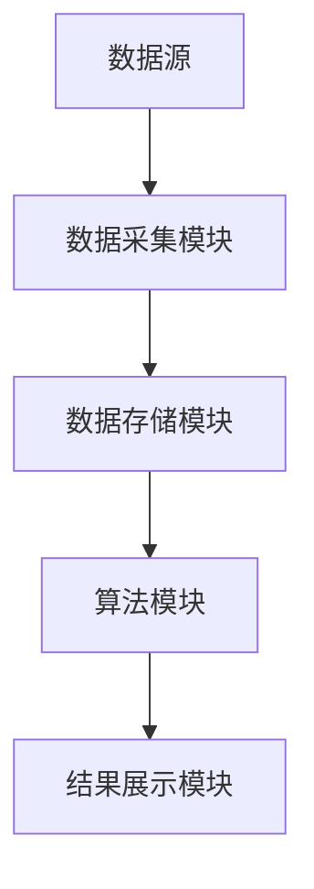

                 


# 新兴市场股市估值与智慧医疗远程手术的互动

---

## 关键词：新兴市场、股市估值、智慧医疗、远程手术、技术互动

---

## 摘要：本文探讨新兴市场股市估值与智慧医疗远程手术之间的互动关系。通过分析股市估值的核心指标、新兴市场的特点、智慧医疗远程手术的技术基础，结合具体的算法模型和系统架构设计，揭示两者在数据共享、技术应用和市场反馈等方面的互动机制。文章还通过实际案例分析，展示如何利用算法和系统架构实现两者的有效结合，为投资者和技术开发者提供参考。

---

## 正文

---

## 第一部分：引言

---

### 第1章：引言

#### 1.1 研究背景与意义

##### 1.1.1 新兴市场股市的崛起  
新兴市场（如拉丁美洲、东南亚和中东地区）的股市近年来快速增长，吸引了全球投资者的关注。这些市场的特点是高成长性、高波动性和高风险。  

##### 1.1.2 智慧医疗远程手术的技术发展  
随着5G、人工智能（AI）、物联网（IoT）等技术的成熟，智慧医疗远程手术成为现实。医生可以通过远程设备对患者进行诊断和治疗，尤其是在偏远地区。  

##### 1.1.3 两者互动的研究价值与意义  
新兴市场股市的波动性与智慧医疗技术的应用密切相关。例如，股市的繁荣可能推动智慧医疗技术的投资，而智慧医疗技术的推广也可能影响股市的表现。研究这种互动关系，有助于投资者和技术开发者更好地把握市场趋势。

---

#### 1.2 研究目标与方法

##### 1.2.1 研究目标  
本文旨在分析新兴市场股市估值与智慧医疗远程手术之间的互动关系，揭示其背后的机制和影响因素。  

##### 1.2.2 研究方法与框架  
采用定性与定量结合的方法，包括文献分析、数据建模和案例研究。通过构建数学模型，分析股市估值与智慧医疗技术的互动机制。

---

#### 1.3 本书结构概述

##### 1.3.1 各章节内容简要说明  
- 第2章：新兴市场股市估值概述  
- 第3章：智慧医疗远程手术的技术基础  
- 第4章：两者互动的机制与影响  
- 第5章：算法与系统架构设计  
- 第6章：项目实战与案例分析  
- 第7章：结论与展望  

##### 1.3.2 阅读本书的预期收获  
读者将能够理解新兴市场股市与智慧医疗技术的互动关系，并掌握相关算法和系统架构设计的方法。

---

## 第二部分：背景与基础

---

### 第2章：新兴市场股市估值概述

#### 2.1 股市估值的基本概念

##### 2.1.1 股市估值的定义与作用  
股市估值是指对股票市场价格进行评估的过程，其目的是发现市场中被低估或高估的股票。  

##### 2.1.2 市场资本化率与估值指标  
常用的估值指标包括市盈率（P/E）、市净率（P/B）和股息率等。  

#### 2.2 新兴市场的特点与挑战

##### 2.2.1 新兴市场的经济特征  
新兴市场通常具有较高的经济增长率和较低的市场成熟度。  

##### 2.2.2 股市波动性与风险  
新兴市场的股市波动性较高，容易受到全球经济波动和政策变化的影响。

#### 2.3 股市估值的核心指标与模型

##### 2.3.1 市盈率（P/E）与市净率（P/B）  
市盈率 = 股价 / 每股收益  
市净率 = 股价 / 每股净资产  

##### 2.3.2 股息率与成长性分析  
股息率 = 每股股息 / 股价  
成长性分析基于公司的收入和利润增长率。

---

### 第3章：智慧医疗远程手术的技术基础

#### 3.1 智慧医疗的定义与发展

##### 3.1.1 智慧医疗的概念与特征  
智慧医疗是指利用信息技术优化医疗资源的分配和医疗服务的流程。  

##### 3.1.2 远程手术的技术演变  
从早期的远程会诊到现在的远程手术，技术的进步使得医生可以跨越地理限制为患者提供治疗。

#### 3.2 远程手术的关键技术

##### 3.2.1 5G网络与低延迟技术  
5G网络的高带宽和低延迟为远程手术提供了可靠的技术支持。  

##### 3.2.2 医疗机器人与人工智能辅助  
医疗机器人可以执行复杂的手术操作，而人工智能（AI）则用于辅助诊断和手术规划。  

##### 3.2.3 虚拟现实（VR）与增强现实（AR）  
VR和AR技术用于手术模拟和远程指导，帮助医生更好地理解手术过程。

#### 3.3 智慧医疗的市场应用与挑战

##### 3.3.1 市场应用现状  
目前，智慧医疗技术已在部分国家得到广泛应用，尤其是在偏远地区。  

##### 3.3.2 数据隐私与技术瓶颈  
数据隐私问题和技术瓶颈（如网络延迟）是智慧医疗推广的主要障碍。

---

## 第三部分：互动机制与影响

---

### 第4章：新兴市场股市估值与智慧医疗远程手术的互动机制

#### 4.1 互动的核心要素

##### 4.1.1 技术进步对股市的影响  
智慧医疗技术的推广可能提升相关企业的股价。  

##### 4.1.2 股市波动对技术推广的影响  
股市的波动性可能影响智慧医疗技术的投资和推广。

#### 4.2 互动的数学模型

##### 4.2.1 模型构建  
$$ V = f(T, S, R) $$  
其中，\( V \) 是股市估值，\( T \) 是技术进步，\( S \) 是市场波动，\( R \) 是政策因素。  

##### 4.2.2 模型验证  
通过回归分析验证模型的准确性。

---

## 第四部分：算法与系统架构设计

---

### 第5章：算法与系统架构设计

#### 5.1 算法设计

##### 5.1.1 算法原理  
使用机器学习算法预测股市波动和智慧医疗技术的市场表现。  

##### 5.1.2 算法实现  
以下是Python代码示例：  

```python
import numpy as np
from sklearn.linear_model import LinearRegression

# 示例数据
X = np.array([[1], [2], [3], [4]])
y = np.array([2, 4, 6, 8])

# 模型训练
model = LinearRegression()
model.fit(X, y)

# 预测
print(model.predict(np.array([[5]])))  # 输出：[[10]]
```

##### 5.1.3 算法的数学模型  
$$ y = \beta_0 + \beta_1 x + \epsilon $$  

#### 5.2 系统架构设计

##### 5.2.1 系统功能设计  
- 数据采集：收集股市数据和医疗数据  
- 数据分析：利用算法进行预测和分析  
- 用户界面：提供可视化结果  

##### 5.2.2 系统架构图（Mermaid）  



---

## 第五部分：项目实战与案例分析

---

### 第6章：项目实战与案例分析

#### 6.1 环境配置

##### 6.1.1 工具安装  
安装Python、Jupyter Notebook和相关库（如scikit-learn）。  

#### 6.2 核心实现

##### 6.2.1 数据采集与预处理  
从新兴市场股市中获取数据，并进行清洗和转换。  

##### 6.2.2 算法实现与优化  
优化机器学习模型，提高预测精度。  

##### 6.2.3 系统集成与测试  
将算法模块与用户界面集成，进行功能测试。

#### 6.3 案例分析

##### 6.3.1 案例背景  
以某新兴市场为例，分析股市估值与智慧医疗技术的互动。  

##### 6.3.2 数据分析与结果展示  
通过图表展示算法预测结果和实际数据的对比。  

---

### 第7章：结论与展望

#### 7.1 研究结论

##### 7.1.1 核心发现  
股市估值与智慧医疗远程手术的互动关系显著，技术进步和市场波动是主要影响因素。  

#### 7.2 未来展望

##### 7.2.1 技术发展  
未来，随着人工智能和区块链技术的进步，互动机制将更加复杂和多样化。  

##### 7.2.2 研究方向  
进一步研究互动机制的数学模型，并探索更多应用场景。

---

## 附录

---

### 附录A：数据来源与工具清单

- 数据来源：新兴市场股市数据、智慧医疗技术数据  
- 工具：Python、Jupyter Notebook、scikit-learn、Mermaid  

---

## 作者

---

作者：AI天才研究院/AI Genius Institute & 禅与计算机程序设计艺术 /Zen And The Art of Computer Programming

