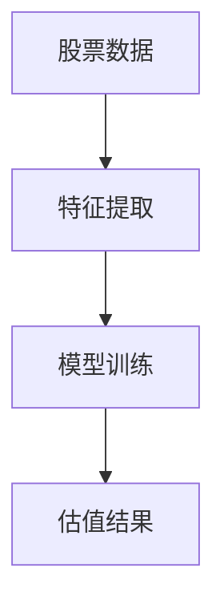
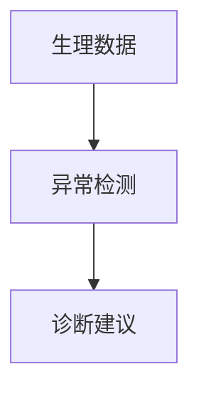

                 


# 新兴市场股市估值与智慧医疗远程监护系统的互动

> 关键词：新兴市场、股市估值、智慧医疗、远程监护系统、数据共享、技术融合、协同创新

> 摘要：本文探讨新兴市场股市估值与智慧医疗远程监护系统的互动关系，分析其对社会经济和医疗健康的影响。通过理论分析、技术实现和案例研究，提出数据共享、技术融合和协同创新的优化策略，构建高效的系统架构，推动股市估值与智慧医疗的协同发展。

---

## 第1章: 引言

### 1.1 问题背景

#### 1.1.1 新兴市场股市估值的现状与挑战
新兴市场股市波动性大，受政策、经济和全球市场影响显著。投资者需准确评估企业价值，但传统估值模型在新兴市场适用性受限，数据获取难，市场信息不对称。

#### 1.1.2 智慧医疗远程监护系统的应用背景
远程监护系统借助物联网和AI，实现患者数据实时监测和医生远程诊断，提高医疗效率，减少医疗资源浪费，改善患者体验。

#### 1.1.3 两者的互动关系与研究意义
股市估值为智慧医疗企业融资提供参考，而智慧医疗技术进步推动企业成长，影响股市估值。两者的互动对社会经济和医疗健康有深远影响。

### 1.2 问题描述

#### 1.2.1 新兴市场股市估值的核心问题
新兴市场数据不透明，传统估值模型失效，需结合新技术建立动态模型。

#### 1.2.2 智慧医疗远程监护系统的关键挑战
设备兼容性差，数据隐私问题突出，远程诊断法律风险，技术普及受限。

#### 1.2.3 两者的互动对社会经济的影响
股市资金推动医疗技术发展，医疗数据优化股市预测，提升整体效率。

### 1.3 问题解决

#### 1.3.1 新兴市场股市估值的解决方案
引入大数据和AI技术，构建动态估值模型，提高预测准确性。

#### 1.3.2 智慧医疗远程监护系统的优化策略
加强设备兼容性，确保数据隐私安全，制定远程诊断法律规范，推动技术普及。

#### 1.3.3 两者的互动对问题解决的推动作用
通过数据共享和技术融合，共同提升股市估值和远程监护系统的效率。

### 1.4 边界与外延

#### 1.4.1 新兴市场股市估值的边界条件
数据来源和模型假设的限制。

#### 1.4.2 智慧医疗远程监护系统的适用范围
适用于慢性病管理和术后康复。

#### 1.4.3 两者的互动关系的外延分析
扩展至金融与医疗的其他互动领域，如保险与健康管理。

### 1.5 概念结构与核心要素组成

#### 1.5.1 新兴市场股市估值的核心要素
市场数据、模型算法、行业动态。

#### 1.5.2 智慧医疗远程监护系统的核心要素
硬件设备、数据传输、分析系统、用户界面。

#### 1.5.3 两者的互动关系的构成要素
数据共享机制、技术融合模式、协同创新路径。

---

## 第2章: 核心概念与联系

### 2.1 股市估值原理

#### 2.1.1 股市估值的基本原理
通过分析企业财务数据和市场趋势，评估其股票价值。

#### 2.1.2 新兴市场的特殊性
高波动性、数据不透明、政策影响大。

#### 2.1.3 估值模型的构建与应用
动态调整模型参数，结合实时数据优化预测。

### 2.2 智慧医疗远程监护系统原理

#### 2.2.1 远程监护的基本原理
采集、传输、分析患者数据，医生远程诊断。

#### 2.2.2 智慧医疗的核心技术
物联网、AI算法、大数据分析。

#### 2.2.3 系统架构与功能模块
数据采集、传输、存储、分析、显示。

### 2.3 两者的互动关系原理

#### 2.3.1 数据共享的机制
股市估值数据与医疗数据双向共享，优化模型。

#### 2.3.2 技术融合的模式
AI和大数据技术在两者中共同应用，提升效率。

#### 2.3.3 协同创新的路径
跨领域合作，推动技术进步和模式创新。

---

## 第3章: 核心概念属性特征对比

### 3.1 股市估值与智慧医疗远程监护系统的对比

#### 3.1.1 核心目标对比
股市估值：准确评估企业价值；远程监护：保障患者健康。

#### 3.1.2 技术手段对比
股市估值：大数据、AI；远程监护：物联网、云技术。

#### 3.1.3 应用场景对比
股市估值：金融领域；远程监护：医疗领域。

### 3.2 互动关系的特征分析

#### 3.2.1 数据共享的双向性
数据相互支持，提升模型准确性。

#### 3.2.2 技术融合的互补性
AI技术在两者中发挥关键作用，实现协同效应。

#### 3.2.3 协同创新的可持续性
长期合作推动技术和应用持续进步。

---

## 第4章: ER实体关系图

### 4.1 股市估值系统的ER图

```mermaid
erd
  图表标题：股市估值系统ER图
  entity 股票 (Stock) {
    key: 股票代码 (StockCode)
    属性: 股票名称 (StockName)
    属性: 最新价格 (LatestPrice)
    属性: 市盈率 (P/E)
  }
  entity 交易数据 (TradeData) {
    key: 交易时间 (TradeTime)
    属性: 交易量 (TradeVolume)
  }
  entity 市场指数 (MarketIndex) {
    key: 指数名称 (IndexName)
    属性: 指数值 (IndexValue)
  }
  关系：Stock 和 TradeData 是一对多关系，每个股票有多个交易数据。
  关系：Stock 和 MarketIndex 是多对一关系，多个股票影响市场指数。
```

### 4.2 智慧医疗远程监护系统的ER图

```mermaid
erd
  图表标题：智慧医疗远程监护系统ER图
  entity 患者 (Patient) {
    key: 患者ID (PatientID)
    属性: 患者姓名 (PatientName)
    属性: 联系方式 (Contact)
  }
  entity 设备 (Device) {
    key: 设备ID (DeviceID)
    属性: 设备类型 (DeviceType)
    属性: 连接状态 (ConnectionStatus)
  }
  entity 数据记录 (DataRecord) {
    key: 记录时间 (RecordTime)
    属性: 传感器数据 (SensorData)
  }
  关系：Patient 和 Device 是一对多关系，每个患者可连接多个设备。
  关系：Device 和 DataRecord 是一对多关系，每个设备产生多个数据记录。
```

### 4.3 互动关系的ER图

```mermaid
erd
  图表标题：互动关系ER图
  entity 股票 (Stock) {
    key: 股票代码 (StockCode)
    属性: 股票名称 (StockName)
    属性: 最新价格 (LatestPrice)
  }
  entity 医疗数据 (HealthData) {
    key: 数据ID (DataID)
    属性: 患者ID (PatientID)
    属性: 数据类型 (DataType)
    属性: 数据值 (DataValue)
  }
  关系：Stock 和 HealthData 是多对多关系，股票估值与医疗数据相互影响。
```

---

## 第5章: 技术实现

### 5.1 股市估值与远程监护的算法原理

#### 5.1.1 股市估值算法



```python
import numpy as np
from sklearn.linear_model import LinearRegression

def stock_valuation(stock_data):
    # 特征提取
    features = stock_data[['PE', 'PB', 'Revenue_Growth']]
    target = stock_data['Market_Cap']
    
    # 模型训练
    model = LinearRegression()
    model.fit(features, target)
    
    # 预测估值
    predicted_valuation = model.predict(features)
    return predicted_valuation
```

#### 5.1.2 远程监护算法



```python
import numpy as np
from sklearn.ensemble import IsolationForest

def anomaly_detection(data):
    model = IsolationForest(n_estimators=100, random_state=42)
    model.fit(data)
    anomalies = model.predict(data)
    return anomalies
```

### 5.2 系统分析与架构设计

#### 5.2.1 系统架构


---

## 第6章: 项目实战

### 6.1 环境安装

#### 6.1.1 股市估值系统

- Python 3.8+
- Jupyter Notebook
- pandas, numpy, scikit-learn

#### 6.1.2 智慧医疗远程监护系统

- Python 3.8+
- IoT设备（如心率监测仪）
- MQTT协议

### 6.2 核心代码实现

#### 6.2.1 股市估值核心代码

```python
import pandas as pd
from sklearn.metrics import mean_squared_error

def evaluate_model(model, features, target):
    predicted = model.predict(features)
    mse = mean_squared_error(target, predicted)
    return mse
```

#### 6.2.2 远程监护核心代码

```python
import paho.mqtt.client as mqtt

def on_connect(client, userdata, flags, rc):
    print("Connected with result code " + str(rc))
    client.subscribe("health_data")

def on_message(client, userdata, msg):
    data = msg.payload.decode()
    print(f"Received `{data}` from `{msg.topic}` topic")
```

---

## 第7章: 案例分析

### 7.1 案例分析与解读

#### 7.1.1 股市估值案例

分析新兴市场某科技公司股票，利用动态模型预测其估值变化。

#### 7.1.2 远程监护案例

监测慢性病患者数据，优化诊断流程，降低医疗成本。

#### 7.1.3 互动关系案例

股市资金流入医疗企业，推动技术进步，提升企业估值。

### 7.2 实际应用中的问题与挑战

#### 7.2.1 数据隐私问题

加强数据加密和访问控制，确保患者隐私和企业数据安全。

#### 7.2.2 技术兼容性问题

制定统一标准，促进设备和系统的兼容性。

---

## 第8章: 总结与展望

### 8.1 小结

通过数据共享和技术融合，新兴市场股市估值与智慧医疗远程监护系统实现互动，推动社会经济和医疗健康进步。

### 8.2 未来展望

继续研究数据隐私保护，提升技术融合深度，探索更多互动场景，推动跨领域协同发展。

---

## 作者

作者：AI天才研究院/AI Genius Institute & 禅与计算机程序设计艺术 /Zen And The Art of Computer Programming

