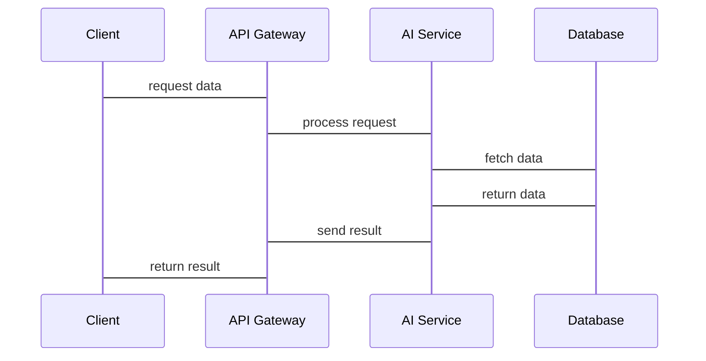

                 


# 新兴市场股市估值与智慧城市5G+AI应用的互动

## 关键词：新兴市场、股市估值、智慧城市、5G、AI、互动关系

## 摘要：本文探讨新兴市场中股市估值与智慧城市5G+AI应用之间的互动关系，分析技术原理和实际应用，提出解决方案。

---

## 第一部分: 背景介绍与核心概念

### 第1章: 新兴市场股市估值与智慧城市5G+AI应用的背景

#### 1.1 问题背景
##### 1.1.1 新兴市场的定义与特点
新兴市场指经济快速发展的中低收入国家，具有高增长潜力，但市场波动大，政策环境复杂。

##### 1.1.2 智慧城市的核心概念
智慧城市利用5G、AI、大数据等技术优化城市运营，提升居民生活质量，涵盖交通、能源、医疗等领域。

##### 1.1.3 5G与AI技术的快速发展
5G提供高速网络支持，AI推动数据分析和自动化，两者结合为新兴市场带来创新机遇。

#### 1.2 问题描述
##### 1.2.1 股市估值的基本原理
股市估值基于企业基本面、市场情绪和宏观经济指标，传统方法包括市盈率、现金流折现等。

##### 1.2.2 智慧城市中的5G+AI应用现状
AI用于交通管理、环境监测和公共安全，5G提供数据传输支持，提升智慧城市效率。

##### 1.2.3 新兴市场中的特殊性与挑战
新兴市场股市波动大，信息不对称严重，智慧城市基础设施不足，技术应用面临挑战。

#### 1.3 问题解决
##### 1.3.1 股市估值与智慧城市互动的必要性
股市资金支持智慧城市项目，智慧城市数据反哺股市估值，形成良性循环。

##### 1.3.2 5G+AI技术在股市估值中的应用
AI分析大数据，5G支持实时数据传输，提升估值模型的准确性和实时性。

##### 1.3.3 智慧城市中的股市数据驱动
股市资金推动智慧城市发展，智慧城市数据为股市估值提供新维度。

#### 1.4 边界与外延
##### 1.4.1 股市估值的边界条件
考虑市场波动、政策变化和宏观经济因素，避免过度依赖单一指标。

##### 1.4.2 智慧城市5G+AI应用的边界
聚焦具体应用场景，如交通和医疗，避免资源过度分散。

##### 1.4.3 互动关系的外延
扩展至经济、社会和环境领域，形成更广泛的技术应用生态。

#### 1.5 概念结构与核心要素
##### 1.5.1 股市估值的核心要素
包括企业盈利、市盈率、现金流、宏观经济指标。

##### 1.5.2 智慧城市5G+AI应用的核心要素
包括5G网络、AI算法、数据采集、智能终端。

##### 1.5.3 互动关系的结构化分析
通过数据共享和资源协同，形成相互促进的机制。

---

## 第二部分: 核心概念与联系

### 第2章: 股市估值与智慧城市5G+AI应用的互动关系

#### 2.1 核心概念原理
##### 2.1.1 股市估值的基本原理
企业价值由未来现金流折现决定，市场情绪影响短期波动。

##### 2.1.2 智慧城市5G+AI应用的基本原理
AI处理数据，5G传输实时信息，优化城市运营。

##### 2.1.3 互动关系的理论基础
数据共享与技术融合推动两者互动，提升整体效率。

#### 2.2 概念属性特征对比
| 属性 | 股市估值 | 智慧城市5G+AI应用 |
|------|----------|------------------|
| 输入 | 财务数据、市场情绪 | 基础设施数据、用户行为 |
| 输出 | 估值结果 | 优化方案、决策支持 |
| 依赖 | 市场环境、政策 | 技术基础设施、数据质量 |
| 目标 | 评估价值 | 提升城市效率 |

#### 2.3 ER实体关系图

```mermaid
erDiagram
    investor {
        id : int
        name : string
        portfolio : string
    }
    stock_market {
        id : int
        name : string
        index : string
    }
    smart_city_app {
        id : int
        name : string
        service : string
    }
    investor "投资于" stock_market
    stock_market "驱动" smart_city_app
```

---

## 第三部分: 算法原理讲解

### 第3章: 股市估值算法

#### 3.1 CAPM模型
$$ E(r_i) = r_f + \beta_i (E(r_m) - r_f) $$

##### 3.1.1 模型实现

```python
import numpy as np

def capm(risk_free_rate, market_return, beta, alpha=0):
    return risk_free_rate + beta * (market_return - risk_free_rate) + alpha
```

#### 3.2 AI算法

##### 3.2.1 神经网络模型
网络结构：输入层、隐藏层、输出层。

训练过程：使用历史数据训练模型，预测未来股价。

##### 3.2.2 预测模型实现

```python
import keras
from keras.models import Sequential
from keras.layers import Dense

model = Sequential()
model.add(Dense(64, activation='relu', input_dim=10))
model.add(Dense(1, activation='linear'))
model.compile(optimizer='adam', loss='mean_squared_error')
model.fit(X_train, y_train, epochs=100, batch_size=32)
```

---

## 第四部分: 系统分析与架构设计

### 第4章: 智慧城市5G+AI系统

#### 4.1 问题场景
智慧城市交通管理，利用AI优化信号灯控制。

#### 4.2 系统功能设计

##### 4.2.1 领域模型

```mermaid
classDiagram
    class Investor {
        id : int
        name : string
        portfolio : string
    }
    class StockMarket {
        id : int
        name : string
        index : string
    }
    class SmartCityApp {
        id : int
        name : string
        service : string
    }
    Investor "投资于" StockMarket
    StockMarket "驱动" SmartCityApp
```

#### 4.3 系统架构设计


#### 4.4 接口设计与交互流程

##### 4.4.1 序列图



---

## 第五部分: 项目实战

### 第5章: 股市估值实战

#### 5.1 环境安装
安装Python、NumPy、Pandas、Keras。

#### 5.2 核心实现

##### 5.2.1 代码实现

```python
import pandas as pd
import numpy as np
from sklearn.metrics import mean_squared_error

def evaluate_model(y_true, y_pred):
    return np.sqrt(mean_squared_error(y_true, y_pred))
```

#### 5.3 案例分析
分析新兴市场某公司股价，对比模型预测与实际结果。

---

## 第六部分: 最佳实践

### 第6章: 总结与建议

#### 6.1 小结
新兴市场股市估值与智慧城市5G+AI应用互动潜力大，技术融合推动效率提升。

#### 6.2 注意事项
数据质量、模型泛化能力、技术兼容性需重点关注。

#### 6.3 拓展阅读
推荐相关书籍和论文，深入学习技术细节。

---

作者：AI天才研究院/AI Genius Institute & 禅与计算机程序设计艺术 /Zen And The Art of Computer Programming

