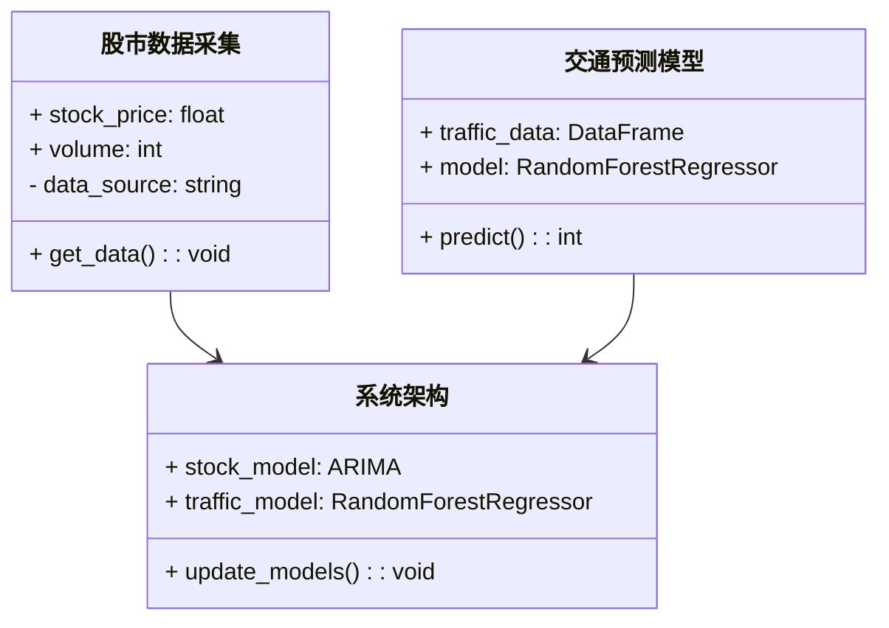

                 


# 新兴市场股市估值与智慧城市交通拥堵预测系统的互动

> 关键词：新兴市场、股市估值、智慧城市、交通拥堵、预测系统、数据驱动、互动关系

> 摘要：本文探讨新兴市场股市估值与智慧城市交通拥堵预测系统的互动关系，分析股市数据如何影响交通预测模型，反之亦然。通过时间序列分析与机器学习模型，揭示两者之间的潜在关联，并提供实际案例分析。

---

# 第一部分: 背景介绍与核心概念

## 第1章: 背景介绍

### 1.1 问题背景

#### 1.1.1 新兴市场股市估值的现状与挑战
新兴市场股市估值受经济波动、政策变化及全球市场影响显著。股市估值的准确性对投资者决策至关重要，但传统估值方法在新兴市场中面临数据不完整、市场波动大等挑战。

#### 1.1.2 智慧城市交通拥堵问题的严重性
随着城市化进程加快，交通拥堵已成为智慧城市建设中的关键问题。交通拥堵不仅影响居民生活质量，还增加能源消耗和环境污染。

#### 1.1.3 问题解决的必要性与目标
通过技术创新解决股市估值与交通拥堵问题，提升城市运行效率和经济稳定性。

### 1.2 核心概念

#### 1.2.1 新兴市场股市估值的核心要素
- 市场流动性
- 宏观经济指标
- 公司基本面数据

#### 1.2.2 智慧城市交通拥堵预测系统的组成
- 数据采集
- 模型训练
- 预测输出

#### 1.2.3 两者的互动关系与边界
股市波动可能影响交通需求，交通拥堵也可能反馈影响经济活动，两者在数据和模型层面存在互动。

---

## 第2章: 核心概念与联系

### 2.1 核心概念原理

#### 2.1.1 股市估值的数学模型
- 时间序列分析（ARIMA模型）
- 机器学习模型（随机森林）

#### 2.1.2 交通拥堵预测的算法原理
- 机器学习模型（随机森林、XGBoost）
- 时间序列分析（ARIMA模型）

#### 2.1.3 互动机制的理论基础
股市数据作为外部变量输入交通预测模型，反之，交通数据也可用于股市波动分析。

### 2.2 概念属性对比

| **属性**       | **股市估值**                | **交通拥堵预测**            |
|-----------------|-----------------------------|-----------------------------|
| 数据类型       | 财务数据、市场指标          | 交通流量、地理位置          |
| 模型复杂度     | 中高                         | 中高                         |
| 输入变量       | 股价、成交量、宏观经济指标    | 车流量、GPS数据、天气条件     |

### 2.3 ER实体关系图


---

# 第二部分: 算法原理与数学模型

## 第3章: 算法原理讲解

### 3.1 股市估值算法

#### 3.1.1 时间序列分析


代码实现：

```python
import pandas as pd
from statsmodels.tsa.arima.model import ARIMA

data = pd.read_csv('stock_data.csv')
model = ARIMA(data, order=(5,1,0))
model_fit = model.fit()
```

### 3.2 交通拥堵预测算法

#### 3.2.1 机器学习模型


代码实现：

```python
from sklearn.ensemble import RandomForestRegressor
import pandas as pd

data = pd.read_csv('traffic_data.csv')
features = data[['time', 'latitude', 'longitude', 'weather']]
target = data[' congestion_level']

model = RandomForestRegressor(n_estimators=100)
model.fit(features, target)
```

### 3.3 数学模型

#### 3.3.1 ARIMA模型公式

$$ARIMA(p, d, q) = \phi(B)^p (1 - B)^d Y_t = \theta(B)^q \epsilon_t$$

#### 3.3.2 交通拥堵预测回归模型

$$y = \beta_0 + \beta_1x_1 + \beta_2x_2 + \ldots + \beta_nx_n + \epsilon$$

---

## 第4章: 系统分析与架构设计

### 4.1 问题场景介绍

- 城市交通拥堵问题与股市波动的相互影响。

### 4.2 系统功能设计



---

## 第5章: 项目实战

### 5.1 环境安装

```bash
pip install pandas scikit-learn statsmodels
```

### 5.2 核心代码实现

```python
import pandas as pd
from sklearn.ensemble import RandomForestRegressor
from statsmodels.tsa.arima.model import ARIMA

# 股市估值代码
data_stock = pd.read_csv('stock_data.csv')
model_stock = ARIMA(data_stock, order=(5,1,0))
model_stock_fit = model_stock.fit()

# 交通拥堵预测代码
data_traffic = pd.read_csv('traffic_data.csv')
features = data_traffic[['time', 'latitude', 'longitude', 'weather']]
target = data_traffic['congestion_level']

model_traffic = RandomForestRegressor(n_estimators=100)
model_traffic.fit(features, target)
```

### 5.3 案例分析

- 使用ARIMA模型预测股市趋势，调整交通预测模型参数。

---

## 第6章: 最佳实践

### 6.1 小结
本文探讨了股市估值与交通拥堵预测的互动关系，展示了如何利用时间序列分析与机器学习模型解决实际问题。

### 6.2 注意事项
- 数据质量至关重要。
- 模型选择需结合实际场景。

### 6.3 拓展阅读
推荐阅读《时间序列分析》与《机器学习实战》。

---

作者：AI天才研究院 & 禅与计算机程序设计艺术

