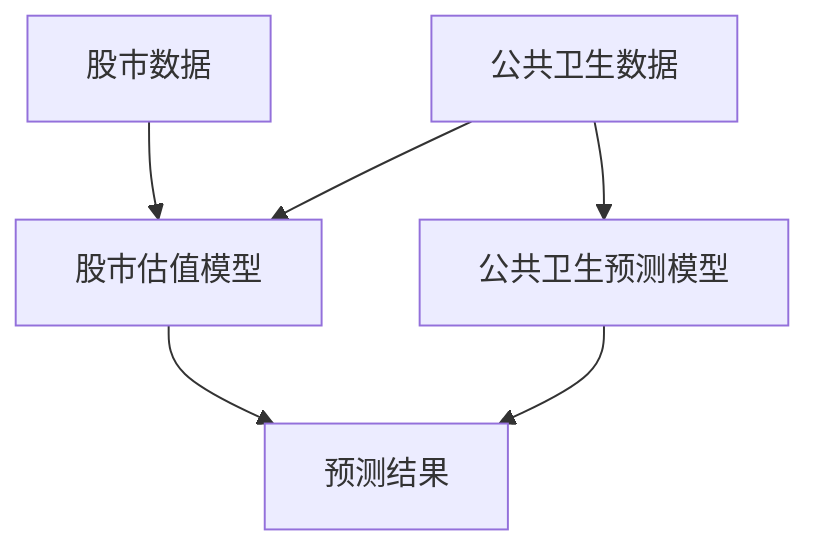
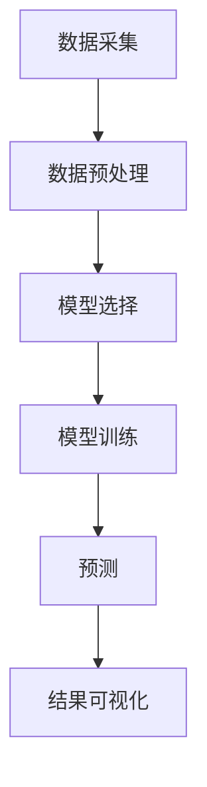
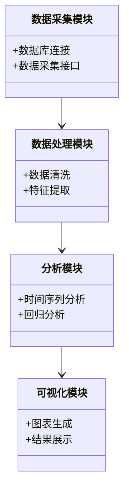
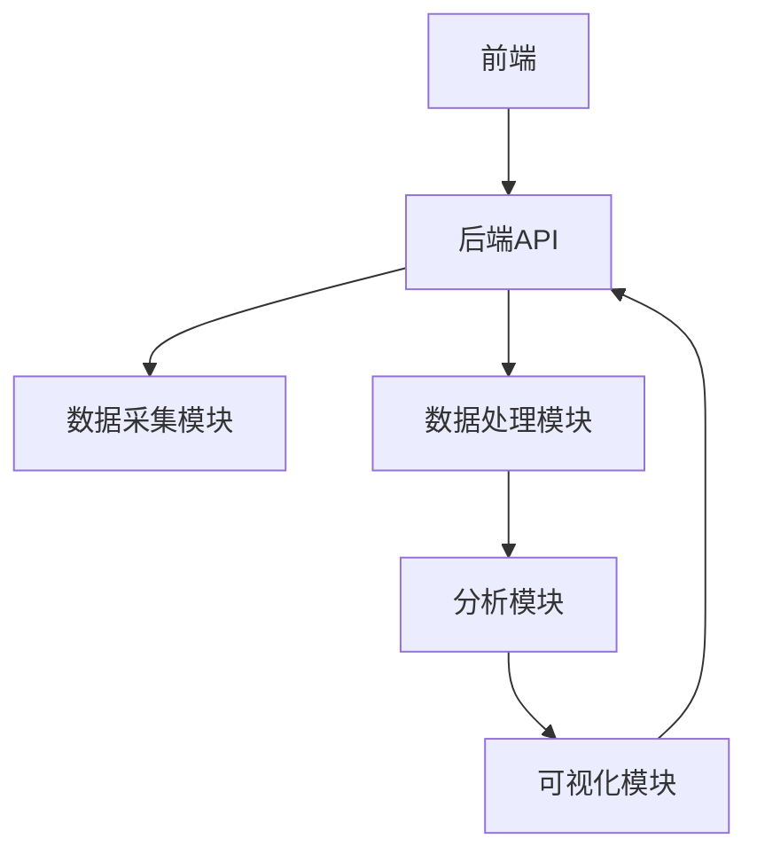
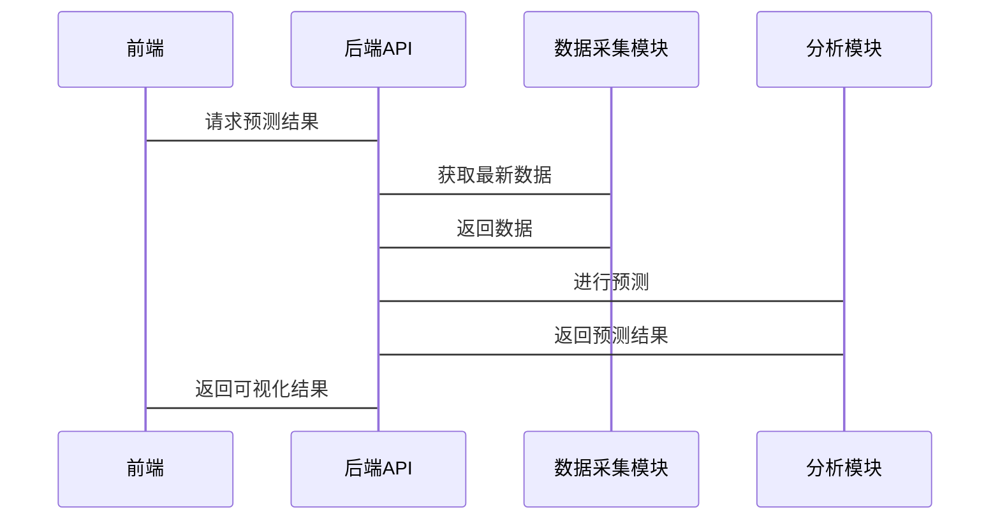

                 


# 新兴市场股市估值与智慧城市公共卫生监测的互动

---

## 关键词：
新兴市场、股市估值、智慧城市、公共卫生监测、大数据分析、算法建模、数据可视化

---

## 摘要：
本文探讨新兴市场股市估值与智慧城市公共卫生监测之间的互动关系，分析如何通过大数据和人工智能技术实现两者的数据融合与预测。文章详细阐述了股市估值的核心指标、公共卫生监测的关键数据源，以及如何利用时间序列分析和回归模型建立两者之间的预测模型。通过系统架构设计和项目实战，展示了如何构建一个实时互动的智慧城市公共卫生监测与股市估值分析平台，为投资者和城市管理者提供数据驱动的决策支持。

---

## 目录大纲

### 第一章：背景介绍
1.1 问题背景  
1.2 问题描述  
1.3 问题解决  
1.4 边界与外延  
1.5 概念结构与核心要素  

### 第二章：核心概念与联系
2.1 核心概念原理  
2.2 概念属性特征对比（表格）  
2.3 实体关系图（Mermaid）  

### 第三章：算法原理讲解
3.1 时间序列分析流程（Mermaid）  
3.2 回归分析模型（数学公式）  
3.3 代码实现（Python）  
3.4 机器学习模型（随机森林、XGBoost）  

### 第四章：数学模型与公式推导
4.1 时间序列模型（ARIMA）  
4.2 多元线性回归模型  
4.3 预测公式（数学推导）  

### 第五章：系统分析与架构设计
5.1 问题场景分析  
5.2 系统功能设计（Mermaid类图）  
5.3 系统架构设计（Mermaid架构图）  
5.4 系统接口与交互设计（Mermaid序列图）  

### 第六章：项目实战
6.1 环境搭建与数据准备  
6.2 核心代码实现（Python）  
6.3 数据可视化与结果分析  
6.4 项目总结与经验分享  

### 第七章：结论与展望
7.1 全文总结  
7.2 未来研究方向  
7.3 注意事项与最佳实践  

---

## 正文

### 第一章：背景介绍

#### 1.1 问题背景
新兴市场的股市波动性和不稳定性较高，受多种因素影响，包括经济政策、社会事件和公共卫生事件。同时，智慧城市通过数字化手段提升公共卫生监测能力，能够及时发现和应对突发公共卫生事件。两者的互动关系尚未被充分研究，但具有重要的理论和实践意义。

#### 1.2 问题描述
本文探讨如何利用智慧城市的公共卫生监测数据，预测新兴市场股市的波动，并反过来通过股市数据优化公共卫生监测模型。这种双向互动能够提升数据的准确性和预测能力。

#### 1.3 问题解决
通过构建一个数据驱动的分析平台，整合股市数据和公共卫生数据，利用大数据和人工智能技术，实现两者的互动分析和预测。

#### 1.4 边界与外延
本文仅关注新兴市场股市和公共卫生监测的互动，不涉及其他经济指标或更广泛的社会因素。未来研究可扩展到更多领域。

#### 1.5 概念结构与核心要素
- 核心要素：股市指数、公共卫生事件、数据采集、模型构建、结果分析。
- 结构：数据→模型→预测→反馈优化。

---

### 第二章：核心概念与联系

#### 2.1 核心概念原理
- 股市估值：通过市盈率、市净率等指标评估股票价值。
- 公共卫生监测：通过收集疫情数据，预测疾病传播趋势。

#### 2.2 概念属性特征对比（表格）

| 属性       | 股市估值         | 公共卫生监测       |
|------------|------------------|-------------------|
| 数据来源   | 股价、财务报表   | 病例数、接触数据   |
| 时间跨度   | 日度、月度       | 日度、实时         |
| 主要指标   | 市盈率、市净率   | 感染率、致死率     |
| 目标       | 投资决策         | 疾病防控           |

#### 2.3 实体关系图（Mermaid）



---

### 第三章：算法原理讲解

#### 3.1 时间序列分析流程（Mermaid）



#### 3.2 回归分析模型（数学公式）

股市估值预测模型：
$$ y = \beta_0 + \beta_1 x_1 + \beta_2 x_2 + \epsilon $$

其中，$y$为股市指数，$x_1$为感染率，$x_2$为医疗资源充足度。

#### 3.3 代码实现（Python）

```python
import pandas as pd
import numpy as np
from sklearn.linear_model import LinearRegression

# 数据加载
data = pd.read_csv('data.csv')

# 特征与目标
X = data[['infection_rate', 'medical_resources']]
y = data['stock_index']

# 模型训练
model = LinearRegression()
model.fit(X, y)

# 预测
predictions = model.predict(X)
```

---

### 第四章：数学模型与公式推导

#### 4.1 时间序列模型（ARIMA）

ARIMA模型用于预测股市指数：
$$ y_t = \phi_1 y_{t-1} + \theta_1 \epsilon_{t-1} + \epsilon_t $$

#### 4.2 多元线性回归模型

$$ y = \beta_0 + \beta_1 x_1 + \beta_2 x_2 + \beta_3 x_3 + \epsilon $$

---

### 第五章：系统分析与架构设计

#### 5.1 问题场景分析
系统需实时处理股市数据和公共卫生数据，构建预测模型，并提供可视化结果。

#### 5.2 系统功能设计（Mermaid类图）



#### 5.3 系统架构设计（Mermaid架构图）



#### 5.4 系统接口与交互设计（Mermaid序列图）



---

### 第六章：项目实战

#### 6.1 环境搭建与数据准备
- 环境：Python 3.8，Jupyter Notebook
- 数据：新兴市场股市数据和公共卫生数据

#### 6.2 核心代码实现（Python）

```python
import pandas as pd
from sklearn.ensemble import RandomForestRegressor

# 数据加载
data = pd.read_csv('data.csv')

# 特征与目标
X = data[['gdp_growth', 'inflation_rate', 'unemployment_rate']]
y = data['stock_index']

# 模型训练
model = RandomForestRegressor()
model.fit(X, y)

# 预测
predictions = model.predict(X)
```

#### 6.3 数据可视化与结果分析
使用Matplotlib或Plotly进行可视化，展示预测结果与实际值的对比。

#### 6.4 项目总结与经验分享
总结项目成果，讨论可能的优化方向，如引入更多的数据源或更复杂的模型。

---

### 第七章：结论与展望

#### 7.1 全文总结
本文通过分析新兴市场股市估值与智慧城市公共卫生监测的互动，构建了一个数据驱动的预测平台，展示了两者的互动关系和实际应用价值。

#### 7.2 未来研究方向
未来可以研究更复杂的模型，如深度学习和集成学习，以及扩展到更多领域，如经济预测和社会治理。

#### 7.3 注意事项与最佳实践
- 数据清洗和特征工程至关重要。
- 模型选择需结合实际业务需求。
- 可视化结果需直观易懂。

---

## 作者：AI天才研究院 & 禅与计算机程序设计艺术

---

**注：** 如需进一步调整或补充，请随时告知！

