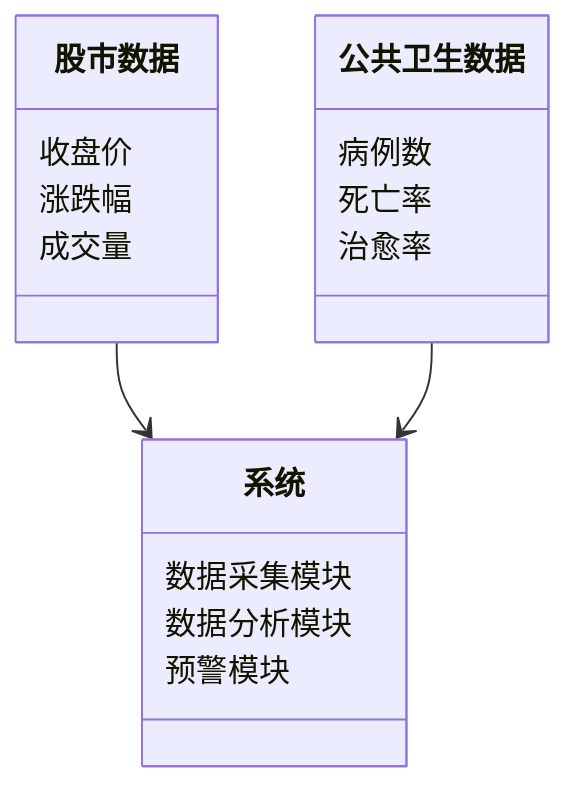
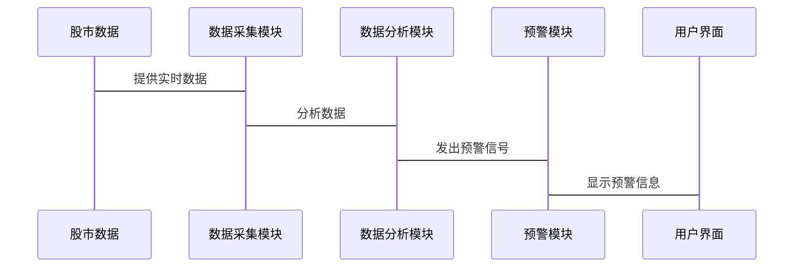

                 


# 新兴市场股市估值与智慧城市公共卫生监测系统的互动

## 关键词：新兴市场，股市估值，智慧城市，公共卫生监测，大数据，人工智能

## 摘要：本文探讨新兴市场股市估值与智慧城市公共卫生监测系统之间的互动关系，分析两者的技术基础、算法原理和系统架构，并通过实际案例展示其应用，最后提出对未来研究的展望。

---

# 第一部分: 背景与概述

## 第1章: 新兴市场股市估值与智慧城市公共卫生监测系统概述

### 1.1 股市估值的定义与意义

股市估值是通过对股票市场价格进行评估，以确定其内在价值的过程。在新兴市场中，由于市场波动较大，股市估值尤为重要。投资者通过分析宏观经济指标、行业趋势和公司基本面，来判断股票的合理价格区间。

### 1.2 智慧城市公共卫生监测系统

智慧城市公共卫生监测系统利用大数据、人工智能和物联网技术，实时收集和分析公共卫生数据，及时发现和预警疾病传播，帮助城市管理部门采取有效措施。

### 1.3 互动关系与研究意义

新兴市场股市估值与智慧城市公共卫生监测系统之间存在互动关系。例如，公共卫生事件可能影响市场情绪，从而影响股市估值；同时，股市的资金流动也可能影响公共卫生系统的投资和资源配置。

---

# 第二部分: 核心概念与联系

## 第2章: 新兴市场股市估值的核心原理

### 2.1 股市估值的主要方法

#### 2.1.1 市盈率（P/E）法

市盈率是股票价格除以每股收益的比率，用于衡量股票的投资价值。

$$ P/E = \frac{Price}{Earnings Per Share} $$

#### 2.1.2 市净率（P/B）法

市净率是股票价格与每股净资产的比率，适用于评估资产密集型行业的股票。

$$ P/B = \frac{Price}{Book Value Per Share} $$

#### 2.1.3 现金流折现法（DCF）

DCF模型通过将未来现金流折现，计算出股票的内在价值。

$$ V = \sum_{t=1}^{n} \frac{CF_t}{(1 + r)^t} $$

### 2.2 新兴市场股市估值的独特性

新兴市场的股市波动较大，受宏观经济和政策影响显著。投资者需考虑通货膨胀、汇率波动和政治风险等因素。

### 2.3 股市估值与市场参与者的互动

投资者行为、机构投资者和市场情绪共同影响股市估值。例如，机构投资者的大量卖出可能导致股价下跌，进而影响市场整体估值。

## 第3章: 智慧城市公共卫生监测系统的核心原理

### 3.1 系统功能模块

#### 3.1.1 数据采集

通过传感器和API接口收集环境数据、医疗记录和社交媒体信息。

#### 3.1.2 数据分析

使用机器学习算法（如随机森林和XGBoost）预测疾病传播趋势。

#### 3.1.3 预警与决策支持

系统根据分析结果生成预警信息，辅助政府制定应对措施。

### 3.2 系统技术基础

#### 3.2.1 大数据技术

利用Hadoop和Spark处理海量数据，提取有用信息。

#### 3.2.2 人工智能算法

应用自然语言处理和计算机视觉技术，分析非结构化数据。

#### 3.2.3 物联网技术

通过传感器实时采集环境数据，实现远程监控和预警。

---

# 第三部分: 算法原理

## 第4章: 股市估值算法

### 4.1 时间序列分析

使用ARIMA模型预测股票价格走势。

$$ ARIMA(p, d, q) $$

### 4.2 机器学习模型

通过LSTM神经网络捕捉时间序列中的长期依赖关系。

$$ LSTM(input\_gate, forget\_gate, output\_gate) $$

## 第5章: 公共卫生监测算法

### 5.1 疾病传播预测

基于SIR模型模拟疾病传播趋势。

$$ \frac{dS}{dt} = -\beta SI $$  
$$ \frac{dI}{dt} = \beta SI - \gamma I $$  
$$ \frac{dR}{dt} = \gamma I $$

### 5.2 异常检测

使用Isolation Forest算法识别异常数据点。

---

# 第四部分: 系统分析与架构设计

## 第6章: 问题场景介绍

### 6.1 股市波动与公共卫生事件的相互影响

例如，新冠疫情对股市和公共卫生系统的双重冲击。

## 第7章: 系统功能设计

### 7.1 领域模型



### 7.2 系统架构


### 7.3 接口与交互设计



---

# 第五部分: 项目实战

## 第8章: 环境安装与核心代码实现

### 8.1 环境安装

安装Python、Pandas、NumPy和Scikit-learn等工具。

### 8.2 核心代码实现

#### 股市数据分析代码

```python
import pandas as pd
import numpy as np

# 加载数据
data = pd.read_csv('stock.csv')

# 计算市盈率
data['PE'] = data['Price'] / data['Earnings']
```

#### 公共卫生数据分析代码

```python
import pandas as pd
from sklearn.ensemble import IsolationForest

# 加载数据
data = pd.read_csv('health.csv')

# 训练异常检测模型
model = IsolationForest(contamination=0.05)
model.fit(data[['temperature', 'humidity']])
```

## 第9章: 案例分析与优化

### 9.1 实际案例分析

分析某新兴市场股市在公共卫生事件前后的波动情况。

### 9.2 代码优化

优化数据采集和分析模块，提高系统响应速度。

---

# 第六部分: 总结与展望

## 第10章: 总结

### 10.1 最佳实践

建议在系统设计中注重数据隐私和系统的可扩展性。

### 10.2 小结

本文探讨了新兴市场股市估值与智慧城市公共卫生监测系统的互动关系，分析了其技术基础和系统架构，并通过案例展示了其应用。

## 第11章: 注意事项与拓展阅读

### 11.1 注意事项

数据隐私和系统集成是系统设计中的重要考虑因素。

### 11.2 拓展阅读

推荐学习大数据技术、人工智能算法和系统架构设计的相关书籍。

---

# 作者：AI天才研究院 & 禅与计算机程序设计艺术

