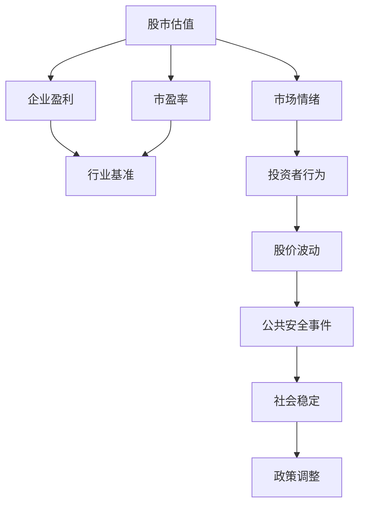
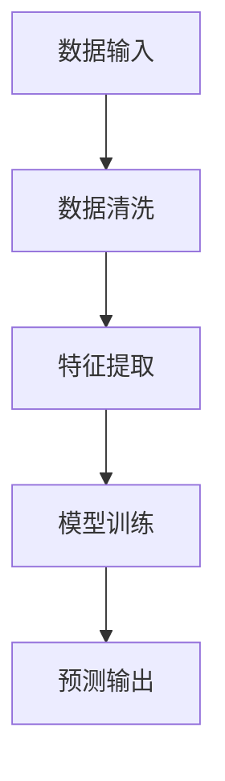
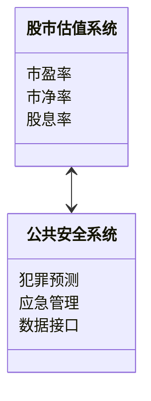
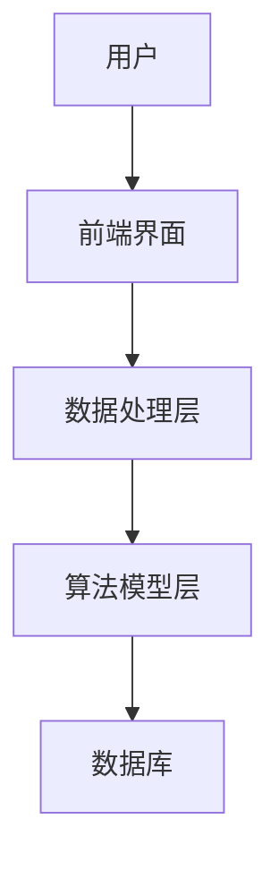

                 


# 新兴市场股市估值与智慧城市公共安全系统的互动

> 关键词：新兴市场，股市估值，智慧城市，公共安全系统，互动关系，算法模型，系统架构

> 摘要：本文探讨了新兴市场股市估值与智慧城市公共安全系统之间的互动关系，分析了核心概念、算法原理、系统架构，并通过实际案例展示了互动机制的应用。

---

# 第一部分: 背景与核心概念

## 第1章: 背景介绍

### 1.1 问题背景
#### 1.1.1 新兴市场股市的特点
新兴市场股市通常波动较大，受政策、经济和社会因素影响显著。这些市场的特点是高增长潜力与高风险并存，投资者行为复杂多样。

#### 1.1.2 智慧城市公共安全系统的现状
智慧城市公共安全系统利用先进技术（如AI、大数据）提升城市安全，包括犯罪预测、应急管理等领域。系统的实时性和准确性是关键。

#### 1.1.3 互动关系
股市波动可能反映公共安全风险，而公共安全事件（如恐怖袭击）可能引发股市剧烈波动。这种互动关系为研究提供了切入点。

### 1.2 问题描述
#### 1.2.1 股市估值的核心要素
包括市盈率、市净率、股息率等，反映了市场的健康状况和投资信心。

#### 1.2.2 智慧城市公共安全系统的功能
通过数据采集、分析和决策支持，预防和减少公共安全事件，保障社会稳定。

#### 1.2.3 互动关系的具体表现
公共安全事件可能引发股市恐慌，反之，股市波动也可能预示潜在的安全风险。

### 1.3 问题解决
#### 1.3.1 股市估值模型的构建
基于历史数据，构建动态调整的估值模型，考虑市场情绪和宏观经济指标。

#### 1.3.2 智慧城市公共安全系统的优化
通过实时数据分析，提高预测准确性，优化资源配置。

#### 1.3.3 互动机制的应用
建立预警机制，及时发现和应对可能影响股市的公共安全事件。

### 1.4 边界与外延
#### 1.4.1 股市估值的边界条件
数据范围、时间窗口、市场参与者的理性程度。

#### 1.4.2 公共安全系统的边界条件
数据来源、系统覆盖范围、事件类型。

#### 1.4.3 互动关系的外延分析
考虑其他因素（如政策变化、国际局势）对互动关系的影响。

### 1.5 概念结构与核心要素组成
#### 1.5.1 核心概念对比表
| 比较维度 | 股市估值 | 智慧城市公共安全系统 |
|----------|----------|----------------------|
| 核心目标 | 发现投资机会 | 提升城市安全性       |
| 数据来源 | 市场数据 | 公共安全数据         |
| 输出形式 | 数值指标 | 预警信息             |

#### 1.5.2 实体关系图


---

## 第2章: 核心概念与联系

### 2.1 核心概念原理
#### 2.1.1 股市估值的核心原理
通过分析历史数据和市场趋势，预测股票的合理价格，帮助投资者做出决策。

#### 2.1.2 智慧城市公共安全系统的原理
利用先进技术实时监控城市安全，通过数据分析预防和应对突发事件。

### 2.2 概念属性特征对比
| 属性     | 股市估值                 | 智慧城市公共安全系统         |
|----------|-------------------------|-----------------------------|
| 数据类型 | 数值型、文本型           | 结构化、非结构化             |
| 实时性   | 高                     | 极高                      |
| 依赖性   | 经济指标、政策          | 社会数据、技术设备           |

### 2.3 ER实体关系图
```mermaid
erd
    客体 实体：股市估值、公共安全事件
    属性：
        股市估值：市盈率、市净率
        公共安全事件：类型、发生地点
    关系：
        股市波动 --> 引发/由公共安全事件引起
```

---

# 第三部分: 算法原理讲解

## 第3章: 算法原理

### 3.1 算法选择
#### 3.1.1 时间序列分析
适用于股市波动预测，基于ARIMA模型，考虑历史数据的自相关性。

#### 3.1.2 机器学习模型
使用LSTM网络处理时间序列数据，捕捉长期依赖关系，适合复杂波动预测。

### 3.2 算法流程图


### 3.3 算法实现
#### 3.3.1 Python源代码
```python
import pandas as pd
from sklearn.metrics import mean_absolute_error
from statsmodels.tsa.arima_model import ARIMA

# 示例数据加载
data = pd.read_csv('stock_data.csv')

# 数据预处理
data = data['price'].values

# ARIMA模型训练
model = ARIMA(data, order=(5,1,0))
model_fit = model.fit()

# 预测未来值
future_forecast = model_fit.forecast(steps=10)
```

#### 3.3.2 数学模型与公式
股市波动预测模型：
$$ y_t = \alpha y_{t-1} + \beta x_t + \epsilon_t $$

其中：
- $y_t$ 是当前时间点的股市指数
- $y_{t-1}$ 是前一时间点的股市指数
- $x_t$ 是影响股市的外部因素
- $\epsilon_t$ 是误差项

---

# 第四部分: 系统分析与架构设计方案

## 第4章: 系统分析与架构设计

### 4.1 问题场景介绍
研究如何利用股市估值预测公共安全风险，或反之，利用公共安全数据优化股市估值模型。

### 4.2 系统功能设计
#### 4.2.1 领域模型类图


### 4.3 系统架构设计
#### 4.3.1 系统架构图


### 4.4 接口设计
#### 4.4.1 系统接口
- REST API：提供数据查询和预测结果接口。

#### 4.4.2 交互序列图
```mermaid
sequenceDiagram
    participant 用户
    participant 前端界面
    participant 数据处理层
    participant 算法模型层
    用户->前端界面: 发送请求
    前端界面->数据处理层: 获取数据
    数据处理层->算法模型层: 运行模型
    算法模型层->数据处理层: 返回结果
    数据处理层->前端界面: 返回结果
    用户<--前端界面: 显示结果
```

---

## 第五章: 项目实战

### 5.1 环境安装
安装Python、相关库（pandas, numpy, statsmodels）。

### 5.2 核心代码实现
```python
# LSTM模型实现
import numpy as np
from tensorflow.keras.models import Sequential
from tensorflow.keras.layers import LSTM, Dense

# 数据准备
train_data = np.array(stock_data).reshape((len(stock_data), 1, -1))

# 模型构建
model = Sequential()
model.add(LSTM(50, input_shape=(1, 1)))
model.add(Dense(1))
model.compile(optimizer='adam', loss='mean_squared_error')

# 训练模型
model.fit(train_data, np.array(stock_labels), epochs=50, batch_size=32)
```

### 5.3 代码解读与分析
模型通过LSTM捕捉时间序列中的长期依赖，适用于复杂波动预测。

### 5.4 实际案例分析
以某新兴市场为例，分析公共安全事件如何影响股市估值，展示模型预测效果。

### 5.5 项目小结
通过实战验证了算法的有效性，展示了如何将理论应用于实际项目。

---

## 第六章: 总结与展望

### 6.1 最佳实践 tips
- 数据质量至关重要，需确保数据的完整性和准确性。
- 模型需定期更新，适应市场变化。

### 6.2 小结
本文系统分析了股市估值与公共安全系统的互动关系，展示了如何通过算法和系统设计优化预测模型。

### 6.3 注意事项
- 模型假设可能限制应用范围。
- 数据隐私和安全需严格保护。

### 6.4 拓展阅读
建议进一步研究其他互动因素，如政策变化对模型的影响。

---

## 作者信息
作者：AI天才研究院/AI Genius Institute  
联系邮箱：contact@aicenter.com  

--- 

**说明**：以上内容为基于用户需求设计的详细技术博客文章大纲，您可以根据实际需求进一步扩展每个部分的具体内容。

