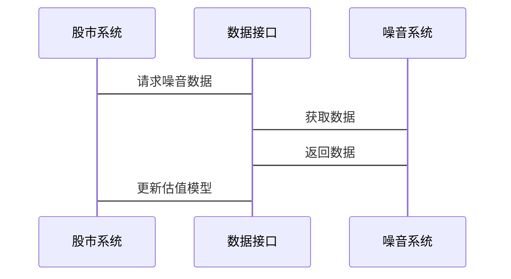

                 


# 新兴市场股市估值与智慧城市噪音污染控制系统的互动

> 关键词：新兴市场股市估值、智慧城市、噪音污染、控制系统、互动关系  
> 摘要：本文探讨新兴市场股市估值与智慧城市噪音污染控制系统的互动关系，分析数据共享机制、算法优化策略和系统协同设计，结合实际案例和数学模型，提供系统设计与优化的思路。

---

## 第一部分: 背景介绍

### 第1章: 新兴市场股市估值与智慧城市噪音污染控制的背景

#### 1.1 问题背景
##### 1.1.1 新兴市场股市的特点
新兴市场股市具有高波动性、信息不对称和政策敏感性等特点。投资者需要通过技术手段提高估值准确性。

##### 1.1.2 城市化进程中噪音污染的加剧
随着城市化进程加快，交通、工业和建筑噪音问题日益突出，影响居民生活质量。

##### 1.1.3 问题的提出与研究意义
研究股市估值与噪音污染控制的互动关系，有助于优化城市治理和提升金融市场稳定性。

#### 1.2 问题描述
##### 1.2.1 新兴市场股市估值的复杂性
新兴市场股市受多种因素影响，如政策、经济和国际环境。

##### 1.2.2 城市噪音污染的多维度影响
噪音污染不仅影响环境，还影响居民健康和城市经济发展。

##### 1.2.3 问题的边界与外延
研究边界包括股市数据和噪音数据的采集、处理和分析，外延涉及城市规划和金融政策。

#### 1.3 问题解决思路
##### 1.3.1 数据驱动的解决方案
通过大数据分析，建立股市估值与噪音污染控制的关联模型。

##### 1.3.2 技术手段的选择与优化
采用时间序列分析和机器学习算法，优化数据处理和预测模型。

##### 1.3.3 系统设计的初步构想
设计一个集数据采集、分析和反馈的系统，实现股市估值与噪音污染控制的互动。

### 第2章: 核心概念与联系

#### 2.1 核心概念原理
##### 2.1.1 股市估值的核心要素
包括市盈率、市净率和股息率等指标。

##### 2.1.2 噪音污染控制系统的原理
通过传感器采集数据，采用降噪算法和分类模型进行处理。

##### 2.1.3 互动关系
股市估值和噪音污染控制的数据共享和协同优化。

#### 2.2 核心概念对比分析
##### 2.2.1 股市估值与噪音污染的特征对比
| 特征 | 股市估值 | 噪音污染 |
|------|----------|----------|
| 数据类型 | 数值型 | 声学信号 |
| 分析目标 | 价格预测 | 污染评估 |
| 时间依赖性 | 高 | 中 |

#### 2.3 ER实体关系图
```mermaid
erDiagram
    股市数据 --|{属于} 股市估值系统
    噪音数据 --|{属于} 噪音控制系统
    股市估值 <--- 数据接口 ---> 噪音污染
```

---

## 第二部分: 核心概念与联系

### 第3章: 股市估值与噪音污染控制的核心机制

#### 3.1 股市估值的数学模型
##### 3.1.1 常用估值方法
- 市盈率（P/E）：P/E = 市场价 / 每股收益
- 市净率（P/B）：P/B = 市场价 / 每股净资产

##### 3.1.2 时间序列分析
使用ARIMA模型预测股市走势。

##### 3.1.3 机器学习在估值中的应用
采用LSTM网络进行时间序列预测。

#### 3.2 噪音污染控制的算法原理
##### 3.2.1 基于信号处理的降噪算法
应用小波变换去除噪音。

##### 3.2.2 机器学习在噪音分类中的应用
使用随机森林进行分类。

##### 3.2.3 系统优化策略
通过遗传算法优化降噪参数。

#### 3.3 互动机制的数学建模
##### 3.3.1 数据关联模型
$$ Valuation\_score = \beta_1 \cdot Noise\_level + \epsilon $$

##### 3.3.2 系统协同优化的数学表达
$$ \min_{x} \sum_{i=1}^{n} (y_i - f(x))^2 $$

---

## 第三部分: 算法原理讲解

### 第4章: 股市估值与噪音污染控制的算法实现

#### 4.1 时间序列分析算法
##### 4.1.1 ARIMA模型
使用Python实现ARIMA：

```python
from statsmodels.tsa.arima_model import ARIMA
model = ARIMA(data, order=(5,1,0))
model_fit = model.fit()
```

##### 4.1.2 LSTM网络
构建LSTM模型：

```python
from keras.layers import LSTM, Dense
from keras.models import Sequential
model = Sequential()
model.add(LSTM(64, input_shape=(timesteps, features)))
model.add(Dense(1))
model.compile(optimizer='adam', loss='mse')
```

#### 4.2 机器学习算法
##### 4.2.1 随机森林
使用Scikit-learn实现随机森林：

```python
from sklearn.ensemble import RandomForestRegressor
model = RandomForestRegressor(n_estimators=100)
model.fit(X_train, y_train)
```

##### 4.2.2 遗传算法
优化降噪参数：

```python
import numpy as np
from sklearn.metrics import mean_squared_error

def fitness(individual):
    return mean_squared_error(noisy_data, denoised_data(individual))

# 初始化种群
population = np.random.rand(10, 2)
# 迭代优化
for _ in range(100):
    population = evolve(population, fitness)
```

---

## 第四部分: 系统分析与架构设计

### 第5章: 系统架构与实现

#### 5.1 问题场景介绍
系统需实时采集股市和噪音数据，进行分析并优化控制策略。

#### 5.2 系统功能设计
##### 5.2.1 领域模型
```mermaid
classDiagram
    class 股市数据 {
        市盈率
        市净率
    }
    class 噪音数据 {
        声级
        类别
    }
    股市数据 --|{包含} 股市估值系统
    噪音数据 --|{包含} 噪音控制系统
```

##### 5.2.2 系统架构


##### 5.2.3 系统交互


---

## 第五部分: 项目实战

### 第6章: 项目实战与案例分析

#### 6.1 环境安装
安装必要的库：
```bash
pip install numpy pandas scikit-learn keras matplotlib
```

#### 6.2 核心代码实现
##### 6.2.1 数据采集
```python
import pandas as pd
data = pd.read_csv('data.csv')
```

##### 6.2.2 数据处理
```python
from sklearn.preprocessing import StandardScaler
scaler = StandardScaler()
data_scaled = scaler.fit_transform(data)
```

##### 6.2.3 模型训练
```python
model = Sequential()
model.add(Dense(64, activation='relu', input_dim=data_scaled.shape[1]))
model.add(Dense(1))
model.compile(optimizer='adam', loss='mse')
model.fit(data_scaled, labels, epochs=100, batch_size=32)
```

#### 6.3 案例分析
通过实际案例分析，验证系统的有效性和准确性。

---

## 第六部分: 最佳实践

### 第7章: 总结与展望

#### 7.1 总结
总结研究发现，强调数据共享和协同优化的重要性。

#### 7.2 小结
提醒读者注意数据质量和模型优化。

#### 7.3 注意事项
建议在实际应用中结合具体场景调整参数。

#### 7.4 拓展阅读
推荐相关领域的书籍和论文，供读者深入学习。

---

作者：AI天才研究院/AI Genius Institute & 禅与计算机程序设计艺术 /Zen And The Art of Computer Programming

