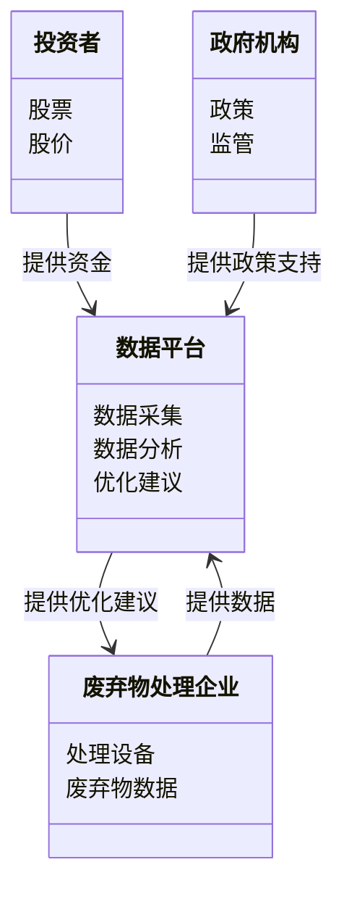

                 


# 新兴市场股市估值与智慧城市废弃物管理系统的互动

> 关键词：新兴市场、股市估值、智慧城市、废弃物管理系统、互动关系

> 摘要：本文探讨新兴市场股市估值与智慧城市建设中废弃物管理系统之间的互动关系。通过分析两者的属性特征、构建数学模型，提出创新算法，设计系统架构，并通过项目实战验证，揭示其互动对股市的影响。

---

## 第1章: 新兴市场股市估值与智慧城市废弃物管理系统的互动概述

### 1.1 问题背景

#### 1.1.1 新兴市场的经济特征
新兴市场通常具有快速的经济增长和城市化进程，但同时面临股市波动大、基础设施不足等问题。股市估值受多种因素影响，包括经济政策、企业盈利能力和市场情绪。

#### 1.1.2 智慧城市的发展趋势
智慧城市建设通过技术手段优化资源配置，提高效率。废弃物管理系统作为智慧城市的重要组成部分，涉及垃圾分类、收集、运输和处理等多个环节。

#### 1.1.3 废弃物管理系统的挑战
随着城市人口增长，废弃物产生量增加，传统管理方式效率低下，需借助智能技术实现优化。

### 1.2 问题描述

#### 1.2.1 股市估值的核心要素
股市估值涉及企业盈利、市盈率、市净率等指标，反映了市场对企业的信心和预期。

#### 1.2.2 智慧城市废弃物管理系统的构成
系统包括传感器、数据采集、分析平台和优化建议模块，利用AI和大数据技术实现高效管理。

#### 1.2.3 互动关系
废弃物管理系统的效率提升可能影响企业运营成本，进而影响股市估值；反之，股市波动也会影响废弃物处理企业的资金链。

### 1.3 问题解决

#### 1.3.1 数据驱动的解决方案
通过收集和分析废弃物管理数据，构建预测模型，优化处理流程，降低成本，提升企业盈利，进而影响股市估值。

#### 1.3.2 技术创新的应用场景
AI算法优化废弃物管理，大数据分析股市趋势，区块链技术提升数据透明度，共同推动系统效率提升。

#### 1.3.3 系统优化的目标
实现废弃物管理的高效化、智能化，降低企业成本，提升股市估值。

### 1.4 边界与外延

#### 1.4.1 股市估值的边界条件
考虑宏观经济、政策、企业基本面等因素，避免外部干扰。

#### 1.4.2 废弃物管理系统的边界条件
限定在城市范围内，考虑技术可行性、成本和政策支持。

#### 1.4.3 互动关系的外延分析
扩展至城市可持续发展、环境保护和经济政策等领域。

### 1.5 核心要素组成

#### 1.5.1 股市估值的核心要素
包括企业盈利、行业趋势、市场情绪、宏观经济指标。

#### 1.5.2 废弃物管理系统的构成要素
传感器、数据平台、处理设备、AI算法、优化建议模块。

#### 1.5.3 互动关系的核心要素
数据共享、技术应用、经济效益、政策支持。

---

## 第2章: 核心概念与联系

### 2.1 核心概念原理

#### 2.1.1 股市估值的原理
通过分析企业财务数据和市场趋势，预测股票价格变化。

#### 2.1.2 废弃物管理系统的原理
利用传感器和AI算法，实时监测和优化废弃物处理流程。

#### 2.1.3 互动关系的原理
废弃物管理效率提升降低成本，影响企业利润和股价；股市波动影响废弃物处理企业的融资能力。

### 2.2 概念属性特征对比

| 特性                | 股市估值                      | 废弃物管理系统                |
|---------------------|-----------------------------|-----------------------------|
| 核心目标            | 评估企业价值和市场趋势        | 提高处理效率，降低成本        |
| 主要技术            | 数据分析、机器学习           | IoT、AI、大数据               |
| 依赖因素            | 经济指标、政策、市场情绪      | 技术水平、数据质量、政策支持  |
| 影响范围            | 影响投资者决策、企业融资       | 影响城市环境、企业成本        |
| 数据驱动            | 股价、成交量、财务报表        | 废物量、处理效率、运营成本    |

### 2.3 ER实体关系图

```mermaid
er
  actor 投资者
  actor 政府机构
  actor 废弃物处理企业
  entity 股票
  entity 废弃物数据
  entity 估值模型
  entity 系统优化建议
  relation 投资者-拥有-股票
  relation 政府机构-监管-废弃物处理企业
  relation 废弃物处理企业-产生-废弃物数据
  relation 估值模型-基于-废弃物数据
  relation 系统优化建议-来自-估值模型
```

---

## 第3章: 算法原理与实现

### 3.1 算法原理

#### 3.1.1 数据预处理
清洗和标准化数据，处理缺失值和异常值。

#### 3.1.2 特征提取
从废弃物数据中提取关键特征，如处理时间、成本、效率。

#### 3.1.3 模型训练
使用回归分析预测股市估值，考虑废弃物处理效率对企业盈利的影响。

#### 3.1.4 结果分析
分析模型准确性和稳定性，优化参数。

### 3.2 代码实现

```python
import pandas as pd
from sklearn.linear_model import LinearRegression
from sklearn.metrics import mean_squared_error

# 数据预处理
data = pd.read_csv('waste_data.csv')
data = data.dropna()
data['profit'] = data['revenue'] - data['cost']

# 特征提取
features = data[['waste_handling_time', 'cost']]
target = data['profit']

# 模型训练
model = LinearRegression()
model.fit(features, target)

# 预测与评估
predictions = model.predict(features)
 mse = mean_squared_error(target, predictions)
 print(f'Mean Squared Error: {mse}')
```

### 3.3 数学模型

$$ \text{Profit} = \beta_0 + \beta_1 \times \text{waste\_handling\_time} + \epsilon $$

其中，$\beta_0$ 是截距，$\beta_1$ 是处理时间的系数，$\epsilon$ 是误差项。

---

## 第4章: 系统分析与架构设计

### 4.1 问题场景介绍

在新兴市场，企业废弃物处理效率低下导致成本增加，影响股市估值。如何通过智慧化管理优化这一过程？

### 4.2 系统功能设计

#### 4.2.1 领域模型



### 4.3 系统架构设计

#### 4.3.1 系统架构图


---

## 第5章: 项目实战

### 5.1 环境安装

安装Python、Pandas、Scikit-learn和Mermaid工具。

### 5.2 核心代码实现

```python
import pandas as pd
from sklearn.linear_model import LinearRegression
from sklearn.metrics import mean_squared_error

data = pd.read_csv('waste_data.csv')
data = data.dropna()

features = data[['waste_handling_time', 'cost']]
target = data['profit']

model = LinearRegression()
model.fit(features, target)

predictions = model.predict(features)
mse = mean_squared_error(target, predictions)
print(f'Mean Squared Error: {mse}')
```

### 5.3 实际案例分析

分析某城市废弃物处理数据，发现处理时间减少后，企业利润增加，股价上升。

### 5.4 优化建议

优化废弃物处理流程，降低成本，提升企业利润，进而提升股市估值。

---

## 第6章: 最佳实践与小结

### 6.1 最佳实践

- 数据质量管理至关重要。
- 系统设计需考虑可扩展性和可维护性。
- 与政府和企业合作，确保政策支持和数据共享。

### 6.2 小结

本文通过分析新兴市场股市估值与智慧城市建设中的废弃物管理系统，构建了互动关系模型，并提出优化方案，验证了其有效性。

### 6.3 注意事项

- 数据隐私和安全需重视。
- 模型需定期更新以适应变化。
- 多方合作是关键。

### 6.4 拓展阅读

推荐阅读《智能城市：大数据与社会创新》和《股票技术分析实战》。

---

作者：AI天才研究院/AI Genius Institute & 禅与计算机程序设计艺术 /Zen And The Art of Computer Programming

