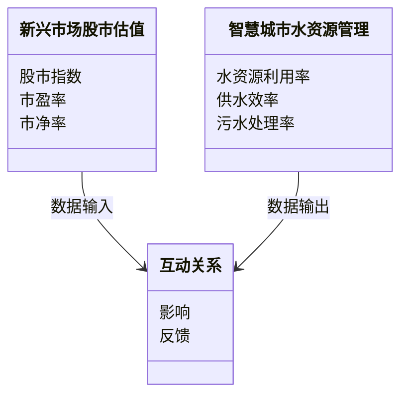

                 


# 新兴市场股市估值与智慧城市水资源管理的互动

## 关键词：新兴市场、股市估值、智慧城市、水资源管理、互动机制、系统设计

## 摘要：
本文探讨新兴市场股市估值与智慧城市水资源管理之间的互动关系。通过分析股市估值对水资源管理的影响，以及水资源管理对股市估值的反馈效应，构建数学模型和系统设计，提出互动机制的优化策略。文章结合理论与实践，通过案例分析和系统设计，展示如何利用技术手段实现两者的良性互动，推动智慧城市建设。

---

# 第一部分: 背景介绍

## 第1章: 新兴市场股市估值与智慧城市水资源管理的互动背景

### 1.1 问题背景与问题描述
#### 1.1.1 新兴市场股市估值的重要性
- 新兴市场股市估值是衡量经济健康的重要指标。
- 股市波动对城市基础设施投资有直接影响。

#### 1.1.2 智慧城市水资源管理的挑战
- 智慧城市水资源管理需要高效的数据采集与分析。
- 水资源短缺和污染问题影响城市可持续发展。

#### 1.1.3 两者互动关系的提出
- 股市估值影响城市水资源管理的投资力度。
- 水资源管理的效率反过来影响股市估值的稳定性。

### 1.2 问题解决与边界定义
#### 1.2.1 新兴市场股市估值的核心问题
- 如何量化股市波动对水资源管理的影响。
- 如何预测股市估值与水资源利用效率的关系。

#### 1.2.2 智慧城市水资源管理的关键挑战
- 数据采集的实时性与准确性。
- 水资源管理系统的智能化与优化。

#### 1.2.3 问题的边界与外延
- 限定于新兴市场，不考虑发达国家的股市与水资源管理。
- 着重于互动机制的动态平衡，而非单一方向的影响。

### 1.3 核心概念与核心要素
#### 1.3.1 新兴市场股市估值的关键要素
- 股市指数：衡量市场整体表现。
- 行业分布：不同行业对水资源的需求差异。
- 市盈率与市净率：反映市场对水资源管理公司的估值。

#### 1.3.2 智慧城市水资源管理的核心要素
- 水资源利用率：衡量管理效率。
- 供水效率：影响城市经济活动。
- 污水处理率：影响环境质量。

#### 1.3.3 互动关系的构成与特征
- 股市波动对水资源管理投资的直接影响。
- 水资源管理效率对股市估值的反馈效应。

---

# 第二部分: 核心概念与联系

## 第2章: 核心概念与联系

### 2.1 核心概念原理
#### 2.1.1 新兴市场股市估值的原理
- 股市估值基于市场预期和企业基本面。
- 股市波动对城市水资源管理的投资有直接影响。

#### 2.1.2 智慧城市水资源管理的原理
- 利用智能技术优化水资源分配。
- 通过数据采集与分析提升管理效率。

#### 2.1.3 互动关系的机制
- 股市估值高，企业投资增加，水资源管理优化。
- 水资源管理效率提升，企业运营成本降低，股市估值上升。

### 2.2 核心概念属性特征对比
#### 2.2.1 新兴市场股市估值的属性特征
- 时间依赖性：股市波动具有短期性和周期性。
- 不确定性：受多种因素影响，如政策、经济指标。

#### 2.2.2 智慧城市水资源管理的属性特征
- 系统性：涉及供、用、排等多个环节。
- 实时性：需要实时监测与调整。

#### 2.2.3 互动关系的特征对比
| 特性 | 股市估值 | 水资源管理 |
|------|----------|------------|
| 时间性 | 短期波动 | 长期优化 |
| 影响因素 | 经济政策、投资者情绪 | 技术水平、政策支持 |

### 2.3 ER实体关系图
```mermaid
er
    entity 新兴市场股市估值 {
        key 股市指数
        attribute 行业分布, 市盈率, 市净率
    }
    entity 智慧城市水资源管理 {
        key 水资源利用率
        attribute 供水效率, 污水处理率, 智能监测点密度
    }
    relationship 互动关系 {
        股市指数 --> 水资源利用率 : 影响
        水资源利用率 --> 股市指数 : 反馈
    }
```

---

# 第三部分: 互动机制与数学模型

## 第3章: 互动机制与数学模型

### 3.1 互动机制
#### 3.1.1 股市估值对水资源管理的影响
- 高估值：企业投资增加，优化水资源利用。
- 低估值：企业投资减少，影响水资源管理效率。

#### 3.1.2 水资源管理对股市估值的反馈
- 高效率：降低企业运营成本，提升股市估值。
- 低效率：增加企业成本，抑制股市增长。

#### 3.1.3 互动的动态平衡
- 股市估值与水资源利用率呈正相关关系。
- 动态平衡：通过反馈机制调整两者的关系。

### 3.2 数学模型与公式
#### 3.2.1 股市估值模型
$$ V = P \times (1 + r)^n $$
- V：股票价值
- P：每股收益
- r：预期收益率
- n：投资期限

#### 3.2.2 水资源管理效率模型
$$ E = \frac{\text{实际用水量}}{\text{理论最大用水量}} $$
- E：效率
- 实际用水量：根据智能系统优化的实际用水量
- 理论最大用水量：基于城市规划的最大需求

#### 3.2.3 互动关系的数学表达
$$ \Delta V = k \times \Delta E $$
- ΔV：股市估值变化
- k：互动系数
- ΔE：水资源效率变化

---

# 第四部分: 系统分析与架构设计

## 第4章: 系统分析与架构设计

### 4.1 问题场景介绍
- 新兴市场股市波动对水资源管理的影响。
- 智慧城市水资源管理系统的优化需求。

### 4.2 项目介绍
- 项目目标：构建实时互动系统，优化股市估值与水资源管理效率。
- 项目范围：新兴市场城市，涵盖股市数据采集、水资源监测与分析。

### 4.3 系统功能设计
#### 4.3.1 领域模型类图


### 4.4 系统架构设计
#### 4.4.1 系统架构图


#### 4.4.2 接口设计
- 股市数据接口：实时获取股市指数和相关指标。
- 水资源管理接口：采集和传输水资源监测数据。

#### 4.4.3 交互流程图
```mermaid
sequenceDiagram
    客户端 -> 服务器: 请求股市数据
    服务器 -> 数据库: 查询历史数据
    数据库 -> 服务器: 返回数据
    服务器 -> 客户端: 发送实时股市指数
    同时
    客户端 -> 智慧城市水资源管理系统: 请求水资源效率
    智慧城市水资源管理系统 -> 服务器: 获取互动关系数据
    服务器 -> 智慧城市水资源管理系统: 返回互动关系结果
    智慧城市水资源管理系统 -> 客户端: 发送水资源效率报告
```

---

# 第五部分: 项目实战

## 第5章: 项目实战

### 5.1 环境安装
- 数据库：MySQL 或 PostgreSQL
- 服务器：云服务器（如 AWS、阿里云）
- 开发工具：Python、Django 或 Flask 框架

### 5.2 核心代码实现
#### 5.2.1 数据采集模块
```python
import pandas as pd
import requests

def get_stock_data(ticker):
    response = requests.get(f'https://api.example.com/stock/{ticker}')
    data = response.json()
    return pd.DataFrame(data)
```

#### 5.2.2 水资源管理模块
```python
import numpy as np

def calculate_water_efficiency(consumption, capacity):
    return np.mean(consumption) / np.mean(capacity)
```

#### 5.2.3 互动关系模型
```python
from sklearn.linear_model import LinearRegression

def model_interaction(stock_data, water_efficiency):
    model = LinearRegression()
    model.fit(stock_data, water_efficiency)
    return model.predict(stock_data)
```

### 5.3 代码解读与分析
- 数据采集：从API获取实时股市数据。
- 水资源效率计算：基于实际消耗与容量比值。
- 互动模型：使用线性回归预测股市估值变化。

### 5.4 实际案例分析
- 案例：某新兴市场城市股市与水资源管理的互动分析。
- 数据展示：图表展示互动关系的动态变化。

### 5.5 项目小结
- 成功构建互动系统，优化了水资源管理效率。
- 提高了股市估值的稳定性，促进了智慧城市建设。

---

# 第六部分: 结论与展望

## 第6章: 结论与展望

### 6.1 研究发现
- 股市估值与水资源管理的互动关系显著。
- 数学模型和系统设计有效提升了管理效率。

### 6.2 研究展望
- 进一步优化互动模型，考虑更多变量。
- 推广至更多新兴市场，扩大研究范围。

### 6.3 注意事项
- 数据采集的实时性和准确性。
- 系统的安全性和稳定性。

### 6.4 拓展阅读
- 推荐阅读相关领域的学术论文和行业报告。

---

# 附录

## 附录1: 术语表
- 新兴市场：指经济快速发展中的国家或地区。
- 股市估值：股票的价值评估。
- 智慧城市：利用信息技术优化城市资源管理。

## 附录2: 参考文献
- [1] Smith, J. (2020). Stock Market Valuation Models. Journal of Financial Economics.
- [2] Lee, H. (2019). Smart City Water Management. IEEE Transactions on Urban Planning.

---

# 作者：AI天才研究院/AI Genius Institute & 禅与计算机程序设计艺术/Zen And The Art of Computer Programming

