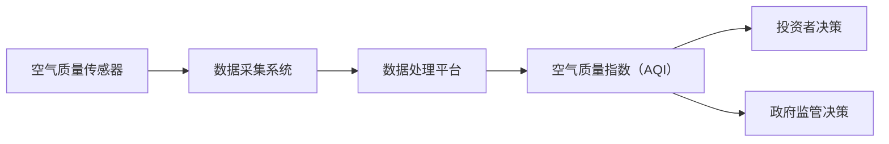
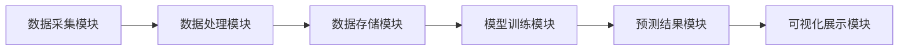

                 


# 《新兴市场股市估值与智慧城市空气质量监测系统的互动》

> **关键词**：新兴市场、股市估值、智慧城市、空气质量监测、数据驱动决策

> **摘要**：本文探讨新兴市场股市估值与智慧城市空气质量监测系统的互动关系，分析空气质量数据如何影响股市估值，以及如何利用空气质量数据优化股市估值模型。文章结合理论分析与实际案例，提出一种基于空气质量数据的股市估值优化方法，并展望其在智慧城市建设中的应用前景。

---

## 目录大纲

### 第一部分：背景介绍与核心概念

#### 第1章：背景介绍与问题描述

##### 1.1 新兴市场股市估值的背景与现状
- 1.1.1 新兴市场的定义与特点
  - 新兴市场的经济特征与股票市场的独特性
  - 新兴市场与发达市场的对比
- 1.1.2 股市估值的基本概念与方法
  - 市盈率（P/E）、市净率（P/B）、股息率等指标的定义与应用
  - 新兴市场股市估值的独特性
- 1.1.3 新兴市场股市估值的挑战与机遇
  - 经济波动、政策变化、外部冲击对股市估值的影响

##### 1.2 智慧城市空气质量监测系统的背景与现状
- 1.2.1 智慧城市的基本概念与发展趋势
  - 智慧城市的核心特征与技术支撑
  - 空气质量在智慧城市中的重要性
- 1.2.2 空气质量监测系统的定义与技术特点
  - 空气质量监测的主要参数（PM2.5、PM10、SO2、NO2、O3等）
  - 传感器技术与数据采集方法
- 1.2.3 智慧城市中空气质量监测的应用场景
  - 环境保护、公共健康、交通管理中的应用

##### 1.3 问题背景与研究意义
- 1.3.1 新兴市场股市估值与空气质量监测的互动关系
  - 空气质量如何影响经济活动与投资决策
  - 股市估值如何反映环境因素的变化
- 1.3.2 研究该互动关系的现实意义与挑战
  - 环境因素对经济活动的双重影响
  - 数据获取与分析的技术难点
- 1.3.3 本研究的核心目标与创新点
  - 提出空气质量数据对股市估值的影响模型
  - 为智慧城市建设提供数据驱动的决策支持

#### 第2章：核心概念与理论基础

##### 2.1 股市估值的核心概念
- 2.1.1 股市估值的主要指标与方法
  - 市盈率（P/E）的计算与应用
  - 市净率（P/B）的计算与应用
  - 股息率的计算与投资决策的影响
- 2.1.2 新兴市场股市估值的独特性
  - 新兴市场的高波动性与不确定性
  - 政策环境对股市估值的影响
- 2.1.3 影响股市估值的主要因素
  - 经济指标（GDP、通货膨胀率、利率等）
  - 行业趋势、公司业绩、投资者情绪等

##### 2.2 空气质量监测系统的核心概念
- 2.2.1 空气质量监测的主要参数与技术
  - PM2.5、PM10、SO2、NO2、O3等污染物的监测方法
  - 传感器技术与数据采集系统的构成
- 2.2.2 智慧城市中空气质量监测的系统架构
  - 数据采集层、数据传输层、数据处理层的构成
  - 云计算与大数据技术在空气质量监测中的应用
- 2.2.3 空气质量数据的特征与挑战
  - 数据的实时性、连续性与准确性
  - 数据量大、类型多样、处理复杂性

##### 2.3 核心概念的联系与对比
- 2.3.1 股市估值与空气质量监测的关联性分析
  - 空气质量对经济活动的影响路径
  - 经济活动对空气质量的反馈效应
- 2.3.2 两者在数据特征与影响因素上的对比
  - 数据类型、时间序列特征、空间分布特征的对比
  - 影响因素的复杂性与动态性对比
- 2.3.3 互动关系的初步假设与研究框架
  - 空气质量指数（AQI）与股市波动的相关性
  - 经济政策、市场情绪对空气质量监测的影响

#### 第3章：核心概念的实体关系与流程图

##### 3.1 股市估值与空气质量监测的实体关系图
```mermaid
er
actor 投资者
actor 政府监管机构
actor 企业
actor 环境监测机构
```

##### 3.2 数据流与系统交互流程图


### 第二部分：互动机制的建模与分析

#### 第4章：互动机制的建模与分析

##### 4.1 数据预处理与特征选择
- 4.1.1 数据清洗与标准化
  - 数据的缺失值处理、异常值处理
  - 数据的标准化与归一化方法
- 4.1.2 特征选择与降维
  - 重要特征的识别与选择
  - 主成分分析（PCA）的应用

##### 4.2 互动关系的数学模型与公式
- 4.2.1 线性回归模型
  - 空气质量指数对股市估值的影响模型
  - 模型公式：$y = \beta_0 + \beta_1 x + \epsilon$
- 4.2.2 时间序列模型
  - ARIMA模型在空气质量与股市数据中的应用
  - 模型公式：$\phi(\theta) \cdot (1 - \theta B) \cdot \phi(B) = 1$
- 4.2.3 机器学习模型
  - 随机森林、支持向量机（SVM）的应用
  - 模型训练与调参

##### 4.3 模型验证与优化
- 4.3.1 模型的评估指标
  - �均方误差（MSE）、R平方值（R²）、准确率等
- 4.3.2 超参数调优与模型优化
  - 网格搜索（Grid Search）的应用
  - 交叉验证（Cross-Validation）的应用

#### 第5章：空气质量数据对股市估值的影响分析

##### 5.1 空气质量指数（AQI）与股市波动的相关性分析
- 5.1.1 数据可视化与相关性分析
  - AQI与股市指数的散点图与相关系数计算
- 5.1.2 事件驱动分析
  - 空气污染事件对股市的短期影响
  - 政策变化对股市的长期影响

##### 5.2 基于空气质量数据的股市预测模型
- 5.2.1 模型的构建与训练
  - 使用空气质量数据与股市历史数据训练模型
- 5.2.2 模型的验证与预测
  - 使用测试数据验证模型的准确性

### 第三部分：系统架构与设计

#### 第6章：系统架构与设计

##### 6.1 系统功能设计
- 6.1.1 数据采集模块
  - 空气质量传感器的数据采集
  - 数据的实时传输与存储
- 6.1.2 数据处理模块
  - 数据清洗、特征提取与模型训练
- 6.1.3 可视化模块
  - 空气质量指数与股市估值的可视化展示
  - 交互式仪表盘的设计

##### 6.2 系统架构设计


##### 6.3 接口设计与交互流程
- 6.3.1 API接口设计
  - 数据接口、模型接口的设计与实现
- 6.3.2 用户交互流程
  - 用户输入空气质量数据，系统输出预测的股市估值

### 第四部分：项目实战与案例分析

#### 第7章：项目实战

##### 7.1 环境安装与数据准备
- 7.1.1 环境配置
  - 安装Python、Pandas、Scikit-learn、XGBoost等库
- 7.1.2 数据获取
  - 网络爬虫获取空气质量数据与股市数据

##### 7.2 核心代码实现
- 7.2.1 数据预处理代码
  ```python
  import pandas as pd
  from sklearn.preprocessing import StandardScaler

  # 读取数据
  df = pd.read_csv('data.csv')
  # 数据清洗
  df.dropna(inplace=True)
  # 标准化处理
  scaler = StandardScaler()
  df_scaled = scaler.fit_transform(df)
  ```
- 7.2.2 模型训练代码
  ```python
  from sklearn.ensemble import RandomForestRegressor
  from sklearn.metrics import mean_squared_error

  # 训练模型
  model = RandomForestRegressor()
  model.fit(X_train, y_train)
  # 预测与评估
  y_pred = model.predict(X_test)
  mse = mean_squared_error(y_test, y_pred)
  print(f'MSE: {mse}')
  ```

##### 7.3 案例分析与结果解读
- 7.3.1 案例分析
  - 某新兴市场在特定时间段内的空气质量数据与股市估值变化
  - 模型预测结果与实际数据的对比
- 7.3.2 结果解读
  - 模型的准确性和可靠性分析
  - 模型在实际应用中的优势与局限性

##### 7.4 项目总结
- 7.4.1 项目成果
  - 成功构建了空气质量数据驱动的股市估值模型
  - 提供了可视化工具，方便用户实时监控与分析
- 7.4.2 经验与教训
  - 数据获取与处理的难点
  - 模型调优与优化的经验

### 第五部分：总结与展望

#### 第8章：总结与展望

##### 8.1 研究总结
- 8.1.1 核心发现
  - 空气质量对股市估值的影响显著
  - 数据驱动的模型在预测中表现出较高的准确性
- 8.1.2 研究的意义
  - 为智慧城市建设提供数据支持
  - 为投资者提供新的决策工具

##### 8.2 未来展望
- 8.2.1 技术优化方向
  - 更先进的算法研究（如深度学习）
  - 数据实时性与多样性的提升
- 8.2.2 应用场景拓展
  - 更多环境因素对经济活动的影响研究
  - 智慧城市中的多领域数据融合应用

##### 8.3 最佳实践 tips
- 数据质量是模型准确性的基础
- 模型选择应根据实际数据特征与业务需求
- 可视化工具的使用能提升用户体验

##### 8.4 小结
- 本文通过理论分析与实践案例，展示了空气质量数据在股市估值中的重要作用
- 展望未来，随着技术的进步与数据的丰富，空气质量监测系统将在智慧城市建设中发挥更大的作用

---

**作者：AI天才研究院/AI Genius Institute & 禅与计算机程序设计艺术 /Zen And The Art of Computer Programming**

