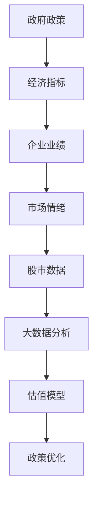
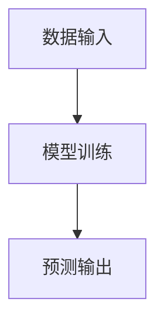
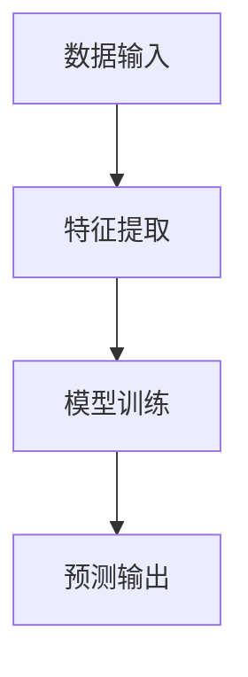
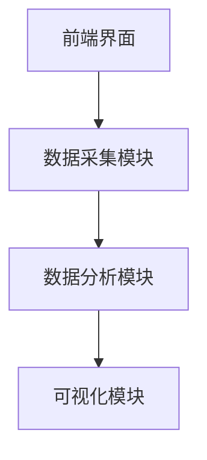
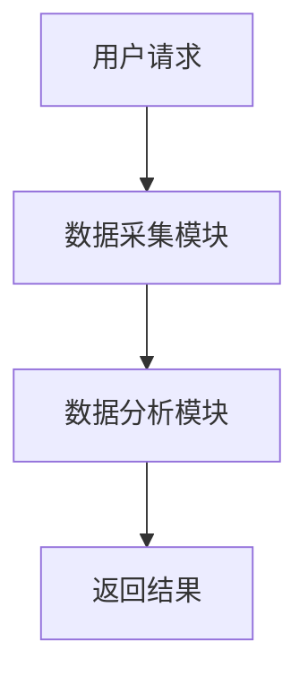

                 


# 新兴市场股市估值与智慧政务大数据应用的互动

**关键词**：新兴市场、股市估值、智慧政务、大数据应用、互动关系

**摘要**：本文探讨新兴市场股市估值与智慧政务大数据应用之间的互动关系。通过分析股市估值的方法、智慧政务大数据的应用场景，以及两者如何相互影响，揭示大数据技术在提升股市估值准确性、优化政府决策中的重要作用。文章结合算法原理、系统架构设计和实际案例，深入剖析两者的互动机制，并提出实践建议。

---

# 第一部分：背景介绍

## 第1章：核心概念与问题背景

### 1.1 新兴市场股市估值的定义与特点
- **定义**：股市估值是指对上市公司股票的内在价值进行评估，以便确定其合理的价格区间。在新兴市场，由于市场波动较大、信息不透明，估值更具挑战性。
- **特点**：数据不完整、市场波动剧烈、政策影响显著。

### 1.2 智慧政务大数据的定义与特点
- **定义**：智慧政务通过大数据技术优化政府决策和服务流程，提升治理效率。
- **特点**：数据来源多样、处理复杂、实时性强。

### 1.3 问题背景与描述
- **问题背景**：新兴市场股市估值受政策、经济和市场情绪影响，传统方法难以准确评估。智慧政务大数据的应用可以提供更精准的数据支持。
- **问题描述**：如何利用大数据技术提升股市估值的准确性，优化政府决策。

### 1.4 问题解决与边界外延
- **问题解决**：通过大数据分析和机器学习模型，提升股市估值的准确性和实时性。
- **边界与外延**：限定于政府政策对股市的影响，不涉及企业的微观运营。

### 1.5 核心概念结构与组成要素
- **结构**：股市数据 → 政策分析 → 经济指标 → 企业业绩 → 市场情绪 → 大数据分析 → 估值模型 → 政策优化。
- **组成要素**：数据采集、分析模型、政策优化。

---

## 第2章：核心概念与联系

### 2.1 股市估值与智慧政务大数据的核心原理
- **股市估值**：基于历史数据和市场趋势，使用时间序列分析和机器学习模型预测未来走势。
- **智慧政务大数据**：通过整合政府数据、社会数据和经济指标，优化政策制定和服务。

### 2.2 核心概念属性特征对比表

| 属性       | 股市估值                   | 智慧政务大数据             |
|------------|----------------------------|---------------------------|
| 数据来源   | 股票价格、交易量、财务报表 | 政府数据、社会数据、经济指标 |
| 分析目标   | 股票内在价值               | 政府决策优化               |
| 分析方法   | 时间序列分析、机器学习     | 数据挖掘、关联规则分析     |
| 应用场景   | 投资决策、风险管理         | 政策制定、社会治理           |

### 2.3 ER实体关系图架构



---

# 第二部分：算法原理讲解

## 第3章：股市估值算法

### 3.1 时间序列分析算法
- **原理**：基于历史数据预测未来趋势。
- **流程图**：



- **数学模型**：
  - 简单移动平均模型：$ \hat{y}_t = \frac{1}{n}\sum_{i=1}^{n} y_{t-i} $
  - 加权移动平均模型：$ \hat{y}_t = \sum_{i=1}^{n} w_i y_{t-i} $

### 3.2 机器学习模型（LSTM）
- **原理**：长短期记忆网络擅长处理时间序列数据。
- **代码示例**：

```python
import numpy as np
from keras.layers import LSTM, Dense
from keras.models import Sequential

# 数据准备
X = np.random.randn(100, 1, 5)
y = np.random.randn(100, 1)

# 模型训练
model = Sequential()
model.add(LSTM(5, input_shape=(1, 5)))
model.add(Dense(1))
model.compile(optimizer='adam', loss='mse')
model.fit(X, y, epochs=10, batch_size=32)
```

- **数学模型**：
  - LSTM单元：$ f_t = \sigma(W_f \cdot [h_{t-1}, x_t] + b_f) $

---

## 第4章：智慧政务大数据算法

### 4.1 机器学习模型（随机森林）
- **原理**：通过特征重要性分析优化政府决策。
- **流程图**：



- **代码示例**：

```python
from sklearn.ensemble import RandomForestClassifier

# 数据准备
X = np.random.randn(100, 5)
y = np.random.randint(2, size=100)

# 模型训练
model = RandomForestClassifier(n_estimators=100)
model.fit(X, y)

# 特征重要性
importances = model.feature_importances_
```

---

## 第5章：数据挖掘与关联规则算法

### 5.1 关联规则算法（Apriori）
- **原理**：发现数据中的频繁项集。
- **代码示例**：

```python
from mlxtend.frequent_patterns import apriori

# 数据准备
data = pd.DataFrame({
    '交易记录': ['A,B,C', 'B,C,D', 'A,B,D', 'B,C,A']
})

# 提取项集
frequent_itemsets = apriori(data['交易记录'], min_support=0.5)
print(frequent_itemsets)
```

---

# 第三部分：系统分析与架构设计

## 第6章：系统分析

### 6.1 项目背景与目标
- **目标**：构建一个基于大数据的股市估值系统，辅助政府优化政策。

### 6.2 系统功能设计
- **功能模块**：
  1. 数据采集模块：收集股市数据和政府数据。
  2. 数据分析模块：应用机器学习算法进行预测。
  3. 可视化模块：展示分析结果。

### 6.3 系统架构设计



---

## 第7章：系统接口设计

### 7.1 数据接口
- **接口描述**：提供REST API，接收数据请求。

### 7.2 交互序列图



---

# 第四部分：项目实战

## 第8章：环境安装与代码实现

### 8.1 环境安装
- **工具**：Python、TensorFlow、Scikit-learn、Mermaid。

### 8.2 核心代码实现

```python
import numpy as np
from keras.models import Sequential
from keras.layers import LSTM, Dense

# 数据准备
X = np.random.randn(100, 1, 5)
y = np.random.randn(100, 1)

# 模型训练
model = Sequential()
model.add(LSTM(5, input_shape=(1, 5)))
model.add(Dense(1))
model.compile(optimizer='adam', loss='mse')
model.fit(X, y, epochs=10, batch_size=32)
```

---

## 第9章：案例分析与项目小结

### 9.1 案例分析
- **案例**：某新兴市场股市数据预测。

### 9.2 项目小结
- **总结**：通过大数据技术，提升股市估值的准确性和实时性，优化政府决策。

---

# 第五部分：最佳实践与小结

## 第10章：最佳实践

### 10.1 实践建议
- **数据质量**：确保数据的准确性和完整性。
- **模型选择**：根据实际需求选择合适的算法。

### 10.2 注意事项
- **数据隐私**：保护用户数据隐私，遵守相关法律法规。

### 10.3 拓展阅读
- **推荐书籍**：《大数据分析与应用》。

---

**作者**：AI天才研究院/AI Genius Institute & 禅与计算机程序设计艺术/Zen And The Art of Computer Programming

---

本文系统地探讨了新兴市场股市估值与智慧政务大数据应用的互动关系，结合理论与实践，为读者提供了深入的分析和实用的建议。

