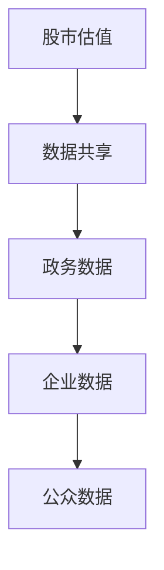
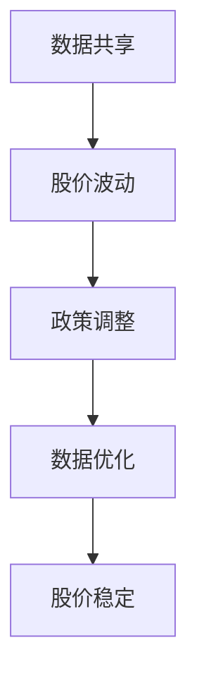
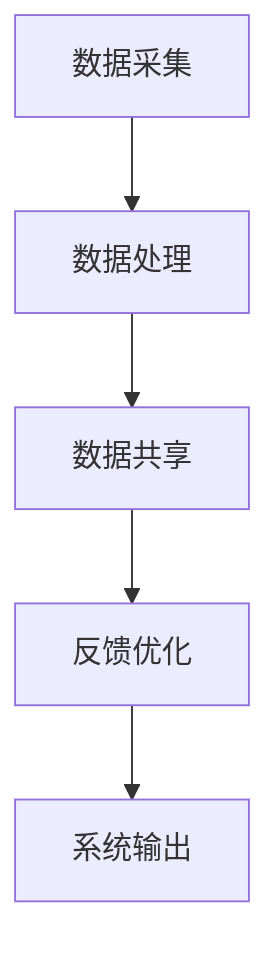
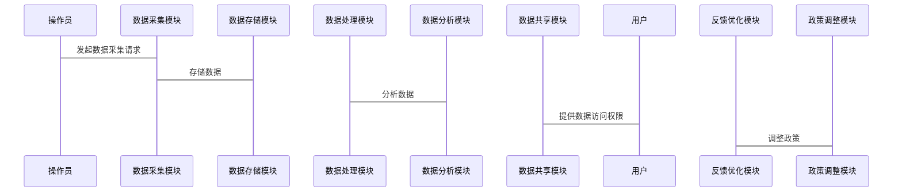

                 


# 《新兴市场股市估值与智慧政务数据共享的互动》

> 关键词：新兴市场，股市估值，智慧政务，数据共享，互动机制，系统架构，算法原理

> 摘要：本文探讨新兴市场股市估值与智慧政务数据共享之间的互动关系，分析其核心概念、互动机制及算法原理，结合系统架构设计和实际案例，提出解决方案和未来研究方向。

---

## # 引言

新兴市场的快速发展带来了股市估值的波动和智慧政务数据共享的挑战。本文将分析股市估值与数据共享的互动关系，探讨其对市场稳定和政策优化的影响。

---

## # 第一部分: 背景与核心概念

### 第1章: 背景介绍

#### 1.1 新兴市场股市估值与智慧政务数据共享的背景

- **新兴市场股市估值**：新兴市场的经济波动和政策变化影响股市估值。
- **智慧政务数据共享**：大数据技术推动政务数据共享，提升政府决策效率。
- **互动关系**：数据共享促进信息公开，影响股市估值；股市波动反馈至政策调整，优化数据共享机制。

#### 1.2 问题背景与问题描述

- 股市估值的不稳定性对投资者信心的影响。
- 数据共享的安全性与隐私保护问题。
- 互动关系中的数据流动与信息反馈机制不清晰。

#### 1.3 问题解决与边界

- 通过数据共享提升股市信息透明度，稳定估值。
- 建立数据安全机制，确保共享过程中的隐私保护。
- 互动关系的边界包括数据范围、共享层级和反馈周期。

#### 1.4 核心概念与结构

- 股市估值：市盈率、市净率等指标。
- 数据共享：数据分类、访问权限和共享流程。
- 互动结构：数据流动、信息反馈和协同优化。

---

## # 第二部分: 核心概念与联系

### 第2章: 核心概念的原理与特征

#### 2.1 股市估值的核心原理

- 股价计算公式：$$\text{股价} = \frac{\text{净利润}}{\text{市盈率}}$$
- 估值指标：市盈率、市净率、股息率等。

#### 2.2 智慧政务数据共享的原理

- 数据共享流程：数据收集、清洗、分析、共享。
- 数据隐私与安全：加密技术、访问控制。

#### 2.3 核心概念对比分析

- **对比表格**：

| 概念    | 股市估值           | 数据共享         |
|---------|-------------------|-----------------|
| 定义    | 股票价格的评估     | 数据的开放共享   |
| 目标    | 投资决策           | 提升政府效率     |
| 指标    | 市盈率、市净率     | 数据可用性、共享度 |

- **ER实体关系图**：



---

## # 第三部分: 互动机制与算法原理

### 第3章: 互动机制的数学模型

#### 3.1 数据共享对股市估值的影响

- 数学模型：$$\text{股价波动} = \alpha \times \text{数据共享度} + \beta \times \text{政策影响}$$

#### 3.2 股市估值对数据共享的反馈机制

- 优化算法：$$\text{数据共享度} = \gamma \times \text{股价稳定性} + \delta \times \text{数据可用性}$$

#### 3.3 互动模型的算法流程

- 使用 Mermaid 绘制协同优化流程图：



---

## # 第四部分: 系统分析与架构设计

### 第4章: 系统架构设计

#### 4.1 问题场景介绍

- 政府部门数据共享需求与股市估值波动之间的矛盾。

#### 4.2 系统功能设计

- 数据采集模块：收集政务数据和股市数据。
- 数据处理模块：清洗和分析数据。
- 数据共享模块：设定访问权限，共享数据。
- 反馈优化模块：根据股价波动调整数据共享策略。

#### 4.3 系统架构图



#### 4.4 接口设计与交互流程

- **接口设计**：
  - 数据采集接口：REST API。
  - 数据处理接口：数据清洗和分析。
- **交互流程**：



---

## # 第五部分: 项目实战

### 第5章: 项目实战

#### 5.1 环境安装

- 安装Python、Jupyter Notebook、数据处理库（Pandas、NumPy）。

#### 5.2 核心代码实现

- 数据采集与处理代码：

```python
import pandas as pd
import numpy as np

# 数据采集
data = pd.read_csv('government_data.csv')

# 数据处理
data['净利润'] = data['收入'] - data['支出']
data['市盈率'] = data['股价'] / data['净利润']
```

- 数据共享模块：

```python
def share_data(user, data):
    if user == '政府':
        return data
    else:
        return data[['公开字段']]

# 示例调用
user = '投资者'
shared_data = share_data(user, data)
```

#### 5.3 案例分析与代码解读

- 案例分析：政府数据共享如何影响股市估值。
- 代码解读：数据处理和共享的实现逻辑。

#### 5.4 项目总结

- 通过数据共享提升股市信息透明度，优化估值模型。
- 确保数据安全与隐私保护，平衡共享与风险。

---

## # 第六部分: 结论与展望

### 第6章: 结论与展望

#### 6.1 结论

- 数据共享对股市估值有显著影响。
- 股市反馈优化数据共享机制，提升政府决策效率。

#### 6.2 未来展望

- 更复杂的数据共享模型。
- 更多领域中的互动关系研究。

---

## # 最佳实践 tips

- 数据共享需确保安全与隐私。
- 股市估值需结合多因素分析。
- 系统设计需考虑可扩展性和灵活性。

---

## # 作者

作者：AI天才研究院/AI Genius Institute & 禅与计算机程序设计艺术/Zen And The Art of Computer Programming

